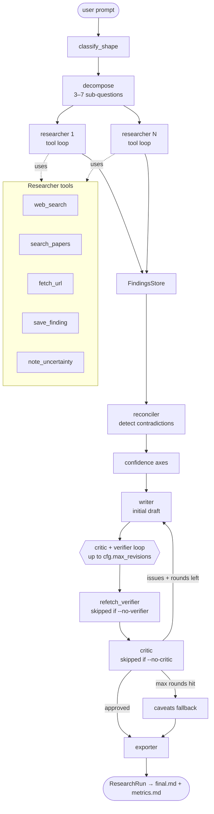

# Deep Research Agent

A CLI deep research agent: decomposes the prompt, fans out parallel researchers, verifies every cited claim against its live source, and writes a paired metrics report next to every run.

> **`v1/` is the MVP** — the active, supported version. Earlier iterations
> live in [`old_versions/`](old_versions/) for reference.

## Architecture

```
                           ┌────────────────┐
        user prompt  ───►  │ classify_shape │      (detect prompt format)
                           └────────┬───────┘
                                    ▼
                           ┌────────────────┐
                           │   decompose    │      (3–7 sub-questions)
                           └────────┬───────┘
                                    ▼
                  ┌─────────────────┴─────────────────┐
                  ▼                                   ▼
         ┌────────────────┐                  ┌────────────────┐
         │  researcher 1  │       ...        │  researcher N  │   parallel,
         │   (tool loop)  │                  │   (tool loop)  │   bounded by
         └───────┬────────┘                  └────────┬───────┘   Semaphore
                 │     tools: web_search, search_papers,         (cfg.parallel_
                 │            fetch_url, save_finding,            researchers)
                 │            note_uncertainty
                 └─────────────────┬─────────────────┘
                                   ▼
                         ┌──────────────────┐
                         │  FindingsStore   │   (aggregate per-subq findings)
                         └────────┬─────────┘
                                  ▼
                      ┌──────────────────────┐
                      │  reconciler          │   (detect contradictions)
                      └──────────┬───────────┘
                                 ▼
                      ┌──────────────────────┐
                      │  confidence axes     │   (self-reported × source-quality
                      └──────────┬───────────┘    × cross-source agreement)
                                 ▼
                         ┌────────────────┐
                         │     writer     │   (initial draft)
                         └───────┬────────┘
                                 ▼
              ┌──────────────────┴──────────────────┐
              │    critic + verifier loop           │
              │    (up to cfg.max_revisions rounds) │
              │                                     │
              │   ┌─────────────────────────────┐   │
              │   │  refetch_verifier           │   │  (re-fetch cited URLs;
              │   │  (skipped if --no-verifier) │   │   flag fabricated /
              │   └──────────────┬──────────────┘   │   unreachable claims)
              │                  ▼                  │
              │   ┌─────────────────────────────┐   │
              │   │  critic                     │   │  approved? → exit loop
              │   │  (skipped if --no-critic)   │   │  else → writer revises
              │   └─────────────────────────────┘   │
              └──────────────────┬──────────────────┘
                                 ▼
                    (caveats fallback if max rounds hit
                     with unresolved critic issues)
                                 ▼
                         ┌────────────────┐
                         │    exporter    │   (render final.md in the
                         └───────┬────────┘    detected output format)
                                 ▼
                         ┌────────────────┐
                         │  ResearchRun   │   → final.md + metrics.md
                         └────────────────┘
```

Same pipeline as a Mermaid diagram (renders on GitHub):



## What v1 adds over v0.1

v1's contributions group into three themes. Each closes a specific failure mode v0.1 acknowledged but couldn't address.

### 1. Layered defenses against failure modes v0.1 couldn't catch

v0.1's text-vs-text grounding can't see a researcher fabricating a quote on a real URL. v0.1's writer trusts self-reported confidence even when peers disagree. v0.1 ships silently when persistent issues remain after one revision. v1 closes each of these gaps with a different mechanism:

| | Contribution | Where it lands |
|---|---|---|
| C1 | **Re-fetch verifier** — re-fetches each cited URL; verdict per finding (`verified / drifted / fabricated / unreachable`). Anchored in FactScore (Min 2023) + RARR (Gao 2022). | New stage inside the critic loop |
| C3 | **Bounded revision + caveats fallback** — `max_revisions=2`; surface unresolved issues in the report's `caveats` rather than silent emit | Reorder + new fallback path in critic loop |
| C4 | **Three-axis confidence combine** — researcher × source-quality × cross-source agreement; combined into a single calibrated signal with disagreement flag for the writer to TEMPER | New stage between reconciler and writer |
| C5 | **Multi-signal stop conditions** — soft-stop now requires findings count AND distinct-source diversity AND avg-confidence floor — closes v0.1's single-source-3-findings exit | Researcher loop |
| C6 | **Typed `Contradiction` schema** — replaces v0.1's `list[str]`; writer can link contradictions to specific finding indices | Reconciler |

### 2. Adapting compute to prompt shape and decision variance

Not every prompt is the same shape — a contested-literature question and a structured comparison question deserve different planning. Not every researcher tool-use decision is equally clear-cut. v1 routes the pipeline by classified prompt shape and optionally adapts compute at each researcher decision step.

| | Contribution | Where it lands |
|---|---|---|
| C2 | **Shape classifier** — `PRE_STRUCTURED / CONTESTED / SPARSE_EMERGING / DISCOVERY / GENERAL`; routes planner + writer behavior per shape. Anchored in Snell 2024 test-time-compute scaling. | New stage before decompose |
| C7 | **TrACE-K adaptive compute** — wraps each researcher tool-use turn with k-sample voting; commits at agreement threshold (off by default, opt-in via `--trace`) | Researcher loop (optional) |

### 3. An evaluation surface that grades the system honestly

v0.1's grounding metric saturated at 99% across a 6-run batch. v1 ships paired-ablation infrastructure plus richer per-run metrics. The v1 batch exercised the paired ablation runner (verifier and TrACE) and the ACE rubric across 6 prompts; KAE and the taxonomy writer ship as **runnable but un-exercised** in this batch.

| | Contribution | Where it lands | Exercised on v1 batch? |
|---|---|---|---|
| C8 | **Taxonomy writer** — hierarchical view over the flat `Report.claims`, exposing structure that single-axis grounding hides | Eval-side; not in the runtime pipeline | Code only — runnable but no batch run |
| C9a | **KAE — Keypoint-Aligned Evaluation** (KSR / KCR / KOR triplet) — replaces single-number grounding with three failure-mode axes | Metrics (opt-in via `--with-kae`) | Code only — `--with-kae` not used in batch |
| C9b | **ACE — Adaptive Checklist Evaluation** (Wan et al. 2026, arXiv:[2509.01396](https://arxiv.org/abs/2509.01396)) — two-stage protocol that addresses same-model rubric bias | Metrics (opt-in via `--with-ace`) | ✅ Run on all 12 verifier-ablation cells |
| C10 | **Paired ablation runner** (`--ablation {critic \| verifier \| trace}`) — runs each prompt twice (off / on) per contribution and emits `ablation_<name>_summary.md` with paired tables and aggregate deltas. Built around `eval/ablation.py` and the per-contribution toggle flags. Substantiates each togglable contribution with empirical OFF/ON deltas. | Eval-side (CLI flag) | ✅ `verifier_ablation/` (6 prompts × 2 arms = 12 cells) + `trace_ablation/` (2 prompts × 2 arms = 4 cells) |

## Eval suite

Every full-pipeline run emits a `metrics.md` next to its `final.md` (skip with
`--no-metrics-md`). Metrics fall into three groups:

### Always-on quality metrics

| Metric | What it measures | Cost |
|--------|------------------|------|
| **grounding** | For each claim, does the cited evidence actually support it? Uses `cfg.judge_model`. | ~N LLM calls (N = #claims) |
| **fabrication rate** | Fraction of critic-approved claims that cite a finding the re-fetch verifier marked fabricated/unreachable. | Reuses `verify_history`; re-runs verifier if absent. |
| **coverage** | % of decomposed sub-questions that produced at least one finding. | $0 (pure Python) |
| **judge** | LLM-as-judge over 5 rubric dimensions + overall. Different model from the producer to mitigate same-bias inflation. | 1 LLM call |
| **calibration** | Does stated confidence track actual grounding rate? Bucketed reliability. | $0 (reuses grounding) |

### Always-on diagnostics ($0, pure Python)

| Metric | What it surfaces |
|--------|------------------|
| **citation density** | Wasted research budget (uncited harvested findings), single-source dependence, pseudo-multi-citation. |
| **source quality** | Average source-quality tier of *cited* vs. *harvested* findings — spots "researcher found good sources, writer didn't use them." |
| **category signals** | Did the run surface contradictions on contradictory prompts? Did it flag uncertainty on sparse-evidence prompts? |
| **researcher signals** | Per-researcher counts + concentration; how many sub-questions returned empty. |
| **contradictions / honesty** | Derivative signals over the report itself. |

### Opt-in evals (extra LLM cost)

| Flag | Metric | Description | Approx. cost |
|------|--------|-------------|--------------|
| `--with-plan-judge` | **plan judge** | LLM-as-judge over the planner's decomposition (surface coverage + intent alignment). Blind to the final report by design. | ~1 call |
| `--with-kae` | **KAE** (Keypoint-Aligned Eval) | Triplet of KSR (supported), KCR (conflicted), KOR (omitted) keypoints extracted from cited URLs. Uses `cfg.kae_judge_model`. | ~30 calls |
| `--with-ace` | **ACE** (Adaptive Checklist Eval) | Two-stage rubric — checklist generated *blind* to the report, scored separately. From Wan et al. 2026 ("DeepResearch Arena", arXiv:2509.01396). | ~6–11 calls |

### Where outputs land

- **Per run:** `<EXPORTER_MD_DIR>/metrics_<timestamp>_<id>.md` next to its `final_<timestamp>_<id>.md`.
- **Ablation runs:** plus an `ablation_<name>_summary.md` with paired OFF/ON tables and aggregate deltas.
- **Full run record:** the `ResearchRun` JSON (with `--out`) carries every metric in machine-readable form.

## Preliminary results

The repo ships with the outputs of two preliminary runs over the six prompts
in [`prompts.txt`](prompts.txt) at the repo root (synthetic-data risks, CoT
prompting, inference-time scaling, multi-agent landscape, long-context
consensus, cost/latency comparison). Each individual run produces a paired
`final_<timestamp>_<id>*.md` (the report) and `metrics_<timestamp>_<id>*.md`
(grounding, fabrication, coverage, judge, calibration, …).

### v1 — verifier ablation

[`v1/examples/outputs/verifier_ablation/`](v1/examples/outputs/verifier_ablation/)

Each prompt produces **four** files (OFF arm + ON arm × report + metrics),
plus a single end-of-batch summary across all prompts:

- Per-prompt OFF / ON outputs — e.g.
  [`final_..._off.md`](v1/examples/outputs/verifier_ablation/final_20260505T071011_9a67a44c_what_are_the_real_world_risks_and_benefi__off.md)
  /
  [`final_..._on.md`](v1/examples/outputs/verifier_ablation/final_20260505T071728_eec15ef0_what_are_the_real_world_risks_and_benefi__on.md)
  + matching `metrics_..._off.md` / `metrics_..._on.md`.
- Aggregate summary —
  [`ablation_verifier_summary.md`](v1/examples/outputs/verifier_ablation/ablation_verifier_summary.md)
  (paired OFF/ON tables and aggregate deltas across all six prompts).

Generated from the `v1/` directory with:

```bash
python -m src.main -v \
  -f ../prompts.txt \
  --with-plan-judge --with-ace \
  --ablation verifier
```

### v0.1 — single-run reference

[`old_versions/v0.1/examples/outputs/`](old_versions/v0.1/examples/outputs/)

One full-pipeline run per prompt — each yields a `final_*.md` + `metrics_*.md`
pair. Useful as a baseline reference when comparing v1 behavior against the
earlier iteration.

Generated from the `old_versions/v0.1/` directory with:

```bash
python -m src.main -v \
  -f ../../prompts.txt
```

## References

The agent and its eval suite draw on these published methodologies:

- **TrACE-K** (researcher adaptive compute) —
  arXiv:[2604.08369](https://arxiv.org/abs/2604.08369).
- **KAE — Keypoint-Aligned Evaluation** and **ACE — Adaptively-generated
  Checklist Evaluation** — Wan et al. 2026 (Shanghai AI Lab + Tsinghua +
  Oxford + HKUST), *"DeepResearch Arena: The First Exam of LLMs' Research
  Abilities via Seminar-Grounded Tasks"*, AAAI 2026,
  arXiv:[2509.01396](https://arxiv.org/abs/2509.01396).
  KAE (KSR / KCR / KOR) is introduced in §3.3. ACE is the two-stage
  checklist protocol from §3.4 that addresses rubric drift in LLM-as-judge.

## Quickstart

**Prerequisites:** Python 3.10+

```bash
# 1. Install dependencies
pip install -r v1/requirements.txt

# 2. Set API keys (loaded from .env automatically)
cat > .env <<'EOF'
ANTHROPIC_API_KEY=sk-ant-...
TAVILY_API_KEY=tvly-...
EOF

# 3. Run a research prompt
cd v1
python -m src.main -v "What are the tradeoffs of vector vs. graph RAG?"
```

The final report prints to the terminal and a paired `final.md` + `metrics.md`
land in `examples/outputs/` by default (relative to the current working
directory). Override with the `EXPORTER_MD_DIR` env var.

## CLI usage

```bash
python -m src.main [OPTIONS] [PROMPTS]...
```

| Flag | Description |
|------|-------------|
| `PROMPTS...` | One or more research prompts (positional, space-separated). |
| `--prompts-file`, `-f` | Read additional prompts from a file (one per line; `#` and blank lines skipped). |
| `--out`, `-o` | Save the full run JSON. With multiple prompts, this becomes a directory. |
| `--verbose`, `-v` | Stream a live event log of every step (decompose, search, fetch, save, write, critique). |

**Run modes:**

| Flag | Description |
|------|-------------|
| `--baseline` | Run the GPT-Researcher-style baseline instead of the full pipeline. |
| `--no-critic` | Skip the critic revision loop. |
| `--no-verifier` | Critic still runs, but skip the re-fetch verifier. |
| `--trace` | Enable TrACE adaptive compute on the researcher tool loop. |
| `--trace-k-max N` | Max rollouts per researcher decision step (default 4; only meaningful with `--trace`). |

> **Mutually exclusive:** `--ablation` cannot be combined with `--baseline`,
> `--no-critic`, `--no-verifier`, or `--trace`. Passing both raises an error.

**Ablation** (paired OFF / ON runs with a summary table):

| Flag | Description |
|------|-------------|
| `--ablation {critic\|verifier\|trace}` | Run each prompt twice and write `ablation_<name>_summary.md`. |

**Eval add-ons:**

> ⚠️ Each add-on triggers extra LLM calls per run and noticeably raises
> per-run cost and latency. Use sparingly on large batches.

| Flag | Description |
|------|-------------|
| `--no-metrics-md` | Skip the per-run `metrics.md` (also skips judge-model calls). |
| `--with-plan-judge` | Add plan-judge to `metrics.md` (~1 extra call). |
| `--with-kae` | Add keypoint-aligned eval (~30 extra calls). |
| `--with-ace` | Add adaptive-checklist eval (~6–11 extra calls). |

### Examples

```bash
# Single prompt, verbose, save full run JSON
python -m src.main -v -o out.json "How does speculative decoding work?"

# Batch from a file, save each run's JSON to a directory
python -m src.main -f prompts.txt -o runs/

# A/B the critic on a single prompt
python -m src.main --ablation critic "What's new in retrieval-augmented generation?"

# TrACE-K with a higher rollout budget
python -m src.main --trace --trace-k-max 6 "Compare LoRA vs. full fine-tuning."

# Full eval suite — heavy, ~40+ extra LLM calls per run
python -m src.main --with-plan-judge --with-kae --with-ace "Survey post-training alignment techniques."
```

## Configuration

All configuration lives in `v1/src/config.py` as the immutable `Config`
dataclass. Two API keys are required; everything else has a sensible default.

### `.env` template

```bash
# ── Required ──────────────────────────────────────────────────────────
ANTHROPIC_API_KEY=sk-ant-...
TAVILY_API_KEY=tvly-...

# ── Model overrides (optional) ────────────────────────────────────────
# RESEARCHER_MODEL=claude-sonnet-4-6
# WRITER_MODEL=claude-sonnet-4-6
# CRITIC_MODEL=claude-sonnet-4-6
# JUDGE_MODEL=claude-opus-4-7
# KAE_JUDGE_MODEL=claude-haiku-4-5

# ── Output (optional) ─────────────────────────────────────────────────
# EXPORTER_MD_DIR=examples/outputs

# ── TrACE adaptive compute (optional) ─────────────────────────────────
# TRACE_ENABLED=false        # truthy: 1, true, yes, on
# TRACE_K_INIT=2
# TRACE_K_MAX=4
# TRACE_TAU_HIGH=0.75
# TRACE_TEMPERATURE=0.7
```

### Required

| Env var | Purpose |
|---------|---------|
| `ANTHROPIC_API_KEY` | All LLM calls (researcher, writer, critic, judges). |
| `TAVILY_API_KEY` | Web search backend. |

### Env-var overrides

| Env var | Default | Notes |
|---------|---------|-------|
| `RESEARCHER_MODEL` | `claude-sonnet-4-6` | Tool-using researcher loop. |
| `WRITER_MODEL` | `claude-sonnet-4-6` | Initial draft + revisions. |
| `CRITIC_MODEL` | `claude-sonnet-4-6` | Fact-checking loop. |
| `JUDGE_MODEL` | `claude-opus-4-7` | LLM-as-judge metrics (grounding, judge, ACE, plan). |
| `KAE_JUDGE_MODEL` | `claude-haiku-4-5` | KAE keypoint extraction (cheaper model on purpose). |
| `EXPORTER_MD_DIR` | `examples/outputs` | Where `final.md` / `metrics.md` land (relative to cwd). |
| `TRACE_ENABLED` | `false` | TrACE-K adaptive compute. Truthy: `1`, `true`, `yes`, `on`. |
| `TRACE_K_INIT` | `2` | Initial rollouts per researcher decision. |
| `TRACE_K_MAX` | `4` | Max rollouts per researcher decision. |
| `TRACE_TAU_HIGH` | `0.75` | Agreement threshold for early-stop. |
| `TRACE_TEMPERATURE` | `0.7` | Rollout sampling temperature. |

### Code-only knobs

The rest of `Config` isn't wired to env vars — change the dataclass defaults
in `config.py` if you need to tune them. The most commonly-touched ones:

| Field | Default | What it controls |
|-------|---------|------------------|
| `parallel_researchers` | `2` | Concurrency cap on the per-sub-question fan-out. |
| `max_revisions` | `2` | How many critic→writer rounds the loop runs before falling back to caveats. |
| `verifier_enabled` | `True` | Whether the re-fetch verifier runs each critic round. |
| `min_subquestions` / `max_subquestions` | `3` / `7` | Decomposition size clamp. |
| `researcher_max_tool_calls` | `30` | Hard cap on per-researcher tool calls. |
| `researcher_max_findings` | `6` | Per-researcher finding cap (early-stop trigger). |
| `researcher_min_findings_to_stop` | `3` | Lower bound before any other early-stop heuristic fires. |
| `researcher_min_unique_sources` | `2` | Diversity requirement for early-stop. |
| `researcher_min_avg_confidence` | `0.55` | Quality requirement for early-stop. |
| `search_results_per_query` | `8` | Tavily results per query. |
| `fetch_max_chars` | `12_000` | URL fetch truncation cap. |

> Most one-off overrides are easier via the CLI flags — `--no-critic`,
> `--no-verifier`, `--trace`, `--trace-k-max` already wrap `dataclasses.replace`
> on the loaded `Config`.

## Repo layout

```
.
├── v1/
│   ├── src/
│   │   ├── main.py            # CLI entrypoint (Typer)
│   │   ├── config.py          # All knobs, loaded from env
│   │   ├── state.py           # ResearchRun / BaselineRun records
│   │   ├── events.py          # Verbose event log
│   │   ├── llm.py             # Anthropic client wrapper
│   │   ├── metrics_md.py      # Per-run metrics.md writer
│   │   ├── inspect.py         # Run-record inspection helpers
│   │   ├── agent/             # Pipeline components
│   │   │   ├── orchestrator.py     #   top-level driver
│   │   │   ├── researcher.py       #   tool-using research loop
│   │   │   ├── writer.py           #   report writer
│   │   │   ├── critic.py           #   revision loop
│   │   │   ├── refetch_verifier.py #   re-fetch verifier
│   │   │   ├── trace.py            #   TrACE-K adaptive compute
│   │   │   ├── baseline.py         #   GPT-Researcher-style baseline
│   │   │   ├── exporter.py         #   final.md exporter
│   │   │   └── ...                 #   reconciler, taxonomy, shape, confidence
│   │   └── tools/             # Researcher tools
│   │       ├── search.py          #   Tavily web search
│   │       ├── fetch.py           #   URL fetch + extract
│   │       ├── scholar.py         #   Semantic Scholar
│   │       └── findings.py        #   save_finding / note_uncertainty
│   ├── eval/
│   │   ├── metrics/           # Per-metric implementations (grounding,
│   │   │                      # fabrication, coverage, judge, KAE, ACE,
│   │   │                      # calibration, citation density, …)
│   │   ├── ablation.py        # Bench-suite ablation runner
│   │   ├── baseline_compare.py # Full vs. baseline comparison
│   │   ├── v0_v1_compare.py   # Cross-version comparison
│   │   ├── run_eval.py        # Standalone eval entrypoint
│   │   └── prompts.py         # Eval prompt sets
│   ├── tests/                 # Smoke + TrACE tests
│   ├── examples/outputs/      # Example outputs for v1 (final.md, metrics.md,
│   │                          # run JSONs, ablation summaries)
│   └── requirements.txt
├── old_versions/
│   └── v0.1/                  # Earlier iteration of the agent. The directory
│       │                      # structure mirrors v1/ (src, eval, tests,
│       │                      # examples, requirements.txt).
│       └── examples/outputs/  # Example outputs for v0.1
├── prompts.txt                # Prompt set used to generate the preliminary
│                              # results below (6 prompts)
└── README.md
```
