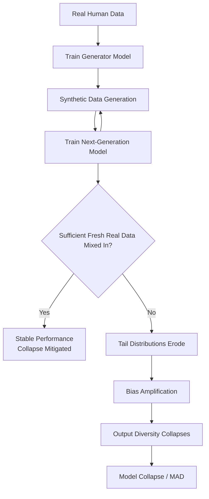

<!--
Original prompt: What are the real-world risks and benefits of using synthetic data to train or fine-tune large language models? Focus on data quality, bias, and evaluation.
Detected format: Narrative summary in markdown with clear section headers, covering data quality, bias, and evaluation as explicitly requested by the user prompt.
-->

> **Original prompt:** What are the real-world risks and benefits of using synthetic data to train or fine-tune large language models? Focus on data quality, bias, and evaluation.
> **Detected format:** Narrative summary in markdown with clear section headers, covering data quality, bias, and evaluation as explicitly requested by the user prompt.

---

# Real-World Risks and Benefits of Using Synthetic Data to Train or Fine-Tune LLMs

> **Focus areas:** Data quality · Bias · Evaluation

---

## 1. Performance and Data Quality: What the Evidence Shows

### Benchmark vs. Real-World Gaps

One of the most striking empirical findings is the large gap between how LLMs perform on synthetic benchmarks versus real-world tasks. On synthetic code benchmarks, LLMs achieve **84–89% correctness**, but this drops to only **25–34%** on real-world class-level code generation tasks—a performance gap that should give pause to practitioners who rely solely on synthetic evaluations to gauge model readiness ([arxiv.org/abs/2510.26130](https://arxiv.org/abs/2510.26130)).

### Reasoning and Instruction-Following

For math reasoning, training on synthetic correct solutions alone produces only **modest gains**. However, a self-generated correct-solution scheme—where the fine-tuned model samples its own correct outputs for subsequent fine-tuning—can achieve performance comparable to amplifying the synthetic dataset by **8×**, suggesting that iterative self-improvement loops can be a force multiplier, though they also carry risks discussed below ([NeurIPS 2024](https://neurips.cc/virtual/2024/poster/96295)).

On the positive side, rule-generated synthetic data with **zero real-world factual overlap** has been shown to transfer reasoning skills to real-world benchmarks when combined with reinforcement learning fine-tuning. A Qwen3-0.6B model fine-tuned via RL on PhantomWiki (a fully synthetic dataset) achieved significant relative F1 score improvements on real-world multi-hop reasoning benchmarks despite the training data containing no factually useful information ([arxiv.org/html/2603.02091v1](https://arxiv.org/html/2603.02091v1)). This is a meaningful finding: reasoning *skills* can transfer even when factual content does not.

### Known Failure Modes of Synthetic Data Quality

Three failure modes are consistently identified when synthetic data is deployed without validation ([humansintheloop.org](https://humansintheloop.org/3-ways-synthetic-data-breaks-models-and-how-human-validators-fix-them/)):

1. **Model drift:** Real-world production data often differs from synthetic training distributions, which tend to omit noise, non-linear relationships, and chaos inherent in reality—causing model performance to degrade over time.
2. **Bias amplification:** If the generator's training data contains bias, the synthetic data will not merely inherit it; it can *amplify* it (see Section 2).
3. **Overconfidence on edge cases:** Models trained on idealized synthetic versions of rare scenarios may develop falsely high confidence in classifying those scenarios, since they only see the generated "perfect" version.

> ⚠️ **Caveat:** These failure modes are described by a practitioner source without quantified frequency data. They should be treated as qualitative risk categories rather than empirically calibrated probabilities.

---

## 2. Bias: Amplification, Reduction, and the Evidence in Tension

### The Default Risk: Bias Amplification

The dominant finding in the literature is that **synthetic data tends to amplify and replicate biases** from the original human-generated data. The analogy used in one review is apt: synthetic data, like Dolly the cloned sheep, mirrors the vulnerabilities of its donor ([PMC12778113](https://pmc.ncbi.nlm.nih.gov/articles/PMC12778113/)).

Generative models exacerbate bias through specific technical mechanisms:
- **Distributional distortions** in diffusion models
- **Bias amplification** in GANs via techniques such as the truncation trick

A particularly dangerous scenario arises when synthetic data is generated from **small or imbalanced real samples**. For example, generating 1,000 synthetic patient records from only ten Native American individuals dangerously assumes homogeneity within a diverse population—amplifying under-representation and creating a false sense of statistical reliability ([PMC12778113](https://pmc.ncbi.nlm.nih.gov/articles/PMC12778113/)).

### A Counterpoint: Purpose-Built Architectures Can Reduce Bias

The picture is not uniformly negative. Purpose-built architectures—such as a Class-Aware GAN (CA-GAN)—have demonstrated the ability to **reduce representation bias** by augmenting minority classes while faithfully maintaining the original data distribution. In a health imaging domain, CA-GAN improved model fairness for Black and female patients ([PMC12112403](https://pmc.ncbi.nlm.nih.gov/articles/PMC12112403/)).

> ⚠️ **Caveat:** This CA-GAN finding comes from health imaging and may not generalize to LLM text training contexts. The evidence on bias is genuinely contested: the default behavior of most generative pipelines amplifies bias, but targeted interventions can reverse this under specific conditions.

### Summary of the Bias Evidence Dispute

| Position | Supported by | Confidence |
|---|---|---|
| Synthetic data amplifies bias by default | Findings on distributional distortions, GAN truncation, small-sample effects | High |
| Purpose-built architectures can reduce bias | CA-GAN in health imaging | Moderate (domain-limited) |

---

## 3. Model Collapse and Long-Term Iterative Risk

### What Model Collapse Is

Model collapse is a **degenerative process** in which models trained on synthetic data generated by prior model generations progressively lose information about the true data distribution. The pattern is consistent across sources ([Nature, 2024](https://www.nature.com/articles/s41586-024-07566-y); [OpenReview](https://openreview.net/forum?id=t3z6UlV09o)):

- **Tail distributions disappear first:** rare and minority patterns are erased before common ones
- **Learned behaviors converge toward point estimates** with very small variance
- **Modes blur together:** eventually, outputs no longer resemble the original human-generated distribution

Detectable symptoms include: measurable drops in output diversity, declining performance on niche or minority data, semantic drift, and fairness feedback loops that amplify initial biases through self-reinforcing cycles ([igoroseledko.com](https://www.igoroseledko.com/llm-model-collapse-explained/)).

### Model Autophagy Disorder (MAD)

A related framework, **Model Autophagy Disorder (MAD)**, formalizes the tradeoff: when generative models are iteratively trained on their own or other models' outputs, subsequent generations inevitably lose either **quality (precision) or diversity (recall)**—unless each training round includes sufficient fresh real data ([ManageEngine Insights](https://insights.manageengine.com/artificial-intelligence/ai-model-collapse-synthetic-data-trap/)). Minor errors compound: each generation reproduces the prior generation's mistakes and adds its own, causing quality to erode rather than improve ([lgt.com](https://www.lgt.com/global-en/market-assessments/insights/entrepreneurship/poisoning-the-ai-well-336294)).

### High-Stakes Domain Risks

Hypothetical scenarios in healthcare and finance illustrate cascading consequences: in healthcare, iterative retraining on low-quality or tainted synthetic data could cause an LLM to give confident but incorrect medical advice; in finance, tainted synthetic inputs could cause narrowing and skewing of risk models, leading to mispriced loans and faulty risk flags ([lgt.com](https://www.lgt.com/global-en/market-assessments/insights/entrepreneurship/poisoning-the-ai-well-336294)).

> ⚠️ **Caveat:** Model collapse is well-documented in theoretical and controlled experimental settings. How severely it manifests in large-scale production LLM training—where real and synthetic data are typically mixed—remains underexplored. Several of the collapse/MAD findings come from industry blogs rather than peer-reviewed empirical studies, reducing their evidential weight.

---

## 4. Evaluation: How Good Are Our Tools for Assessing Synthetic Data?

### The Train-Synthetic-Test-Real (TSTR) Framework

The most widely used evaluation paradigm is **TSTR** ([mostly.ai](https://mostly.ai/blog/synthetic-data-quality-evaluation)):
1. Split real data into training and holdout sets
2. Generate synthetic data from the training split
3. Train separate models on synthetic vs. real training data
4. Evaluate both models on the real holdout set
5. Compare performance

TSTR simulates the production scenario directly, making it intuitive and interpretable. Its limitation is that it measures downstream task performance, not the internal diversity or quality of the synthetic dataset itself.

### Diversity Metrics: DCScore

To address diversity measurement, **DCScore** treats diversity evaluation as a **classification task**, capturing mutual relationships among samples. It satisfies four formal axioms: effective number, identical samples, symmetry, and monotonicity—addressing limitations of n-gram-based, reference-based, and transformation-based diversity metrics ([arxiv.org/html/2502.08512v1](https://arxiv.org/html/2502.08512v1)).

### Quality-Performance Correlation: SDQM

The **Synthetic Data Quality Metric (SDQM)** demonstrates a strong correlation (**r = 0.87**) between its scores and downstream model performance (mAP50 for object detection), substantially outperforming prior metrics that showed only moderate or weak correlations ([arxiv.org/html/2510.06596v1](https://arxiv.org/html/2510.06596v1)).

> ⚠️ **Caveat:** SDQM's r = 0.87 correlation was validated specifically for object detection. Its reliability for predicting downstream **LLM text generation performance** is not established by the available evidence. Evaluation methods are improving but their reliability in predicting downstream LLM behavior remains contested.

---

## 5. Benefits: Privacy, Safety, Cost, and Data Scarcity

### Privacy Preservation

**Differentially private synthetic data** preserves formal privacy guarantees and can be freely analyzed, shared, and combined with other datasets without additional privacy modifications to existing tools or workflows—a substantial practical advantage over alternative privacy-preserving techniques that require modifying analytical pipelines ([NIST](https://www.nist.gov/blogs/cybersecurity-insights/differentially-private-synthetic-data)).

### Safety and Red-Teaming

Synthetic data can be generated **entirely without human-authored safety datasets** to support red-teaming and alignment training, enabling LLM safety improvement across a diverse range of topics ([arxiv.org/html/2408.11851v1](https://arxiv.org/html/2408.11851v1)). This makes it especially valuable in domains where collecting real adversarial examples is costly, dangerous, or ethically fraught.

### Cost Reduction

Manually labeling a single image can cost several dollars; generating an equivalent labeled synthetic sample costs a fraction of that. Across millions of data points, the cost differences are significant. Practitioners consistently report lower labeling costs, faster development cycles, and fewer privacy bottlenecks as concrete benefits ([cogentinfo.com](https://cogentinfo.com/resources/synthetic-data-explosion-how-2026-reduces-data-costs-by-70)).

> ⚠️ **Caveat:** A frequently cited "70% cost reduction" figure appears in a source title but is not supported by the quoted evidence, which only describes qualitative cost differences. This specific magnitude should be treated with caution.

### Data Scarcity Mitigation

Synthetic data is especially valuable where real data is scarce, sensitive, or difficult to collect—such as in medical imaging, rare-event detection, and low-resource languages. The reasoning transfer result (Section 1) demonstrates that synthetic data can teach *skills* even when it cannot supply domain *facts*.

---

## 6. Where the Evidence Is Weakest

The literature has several notable gaps:

- **No systematic head-to-head comparisons** of synthetic vs. real training data across tasks and domains in a standardized benchmark setting for LLMs specifically
- **Evaluation metrics developed for one modality** (e.g., SDQM for computer vision) are not validated for LLM text tasks
- **Model collapse research** remains largely theoretical or conducted in controlled settings; production-scale mixed-training evidence is sparse
- **Bias research** is concentrated in health and imaging domains; direct evidence for LLM text training pipelines is limited
- **Cost figures** from industry sources lack empirical rigor

---

## Summary: Risks and Benefits at a Glance

| Dimension | Key Benefit | Key Risk |
|---|---|---|
| **Data Quality** | Reasoning skills transfer even without factual content | 25–34% real-world accuracy vs. 84–89% on synthetic benchmarks |
| **Bias** | Purpose-built architectures can reduce bias | Default behavior amplifies and replicates generator biases |
| **Model Collapse** | Mitigated by mixing fresh real data each round | Iterative synthetic retraining causes tail erosion and diversity collapse |
| **Evaluation** | TSTR and DCScore provide principled quality measures | Metrics validated in one domain often don't predict LLM behavior |
| **Privacy** | Differential privacy enables safe data sharing | Small-sample synthesis creates false statistical reliability |
| **Safety** | Fully synthetic red-teaming data is feasible | Overconfidence on idealized edge cases |
| **Cost** | Lower labeling costs at scale | Quantified savings figures are not robustly evidenced |

---

*All claims above are grounded in the cited sources. Confidence levels and caveats reflect the strength of the underlying evidence as assessed during research.*
