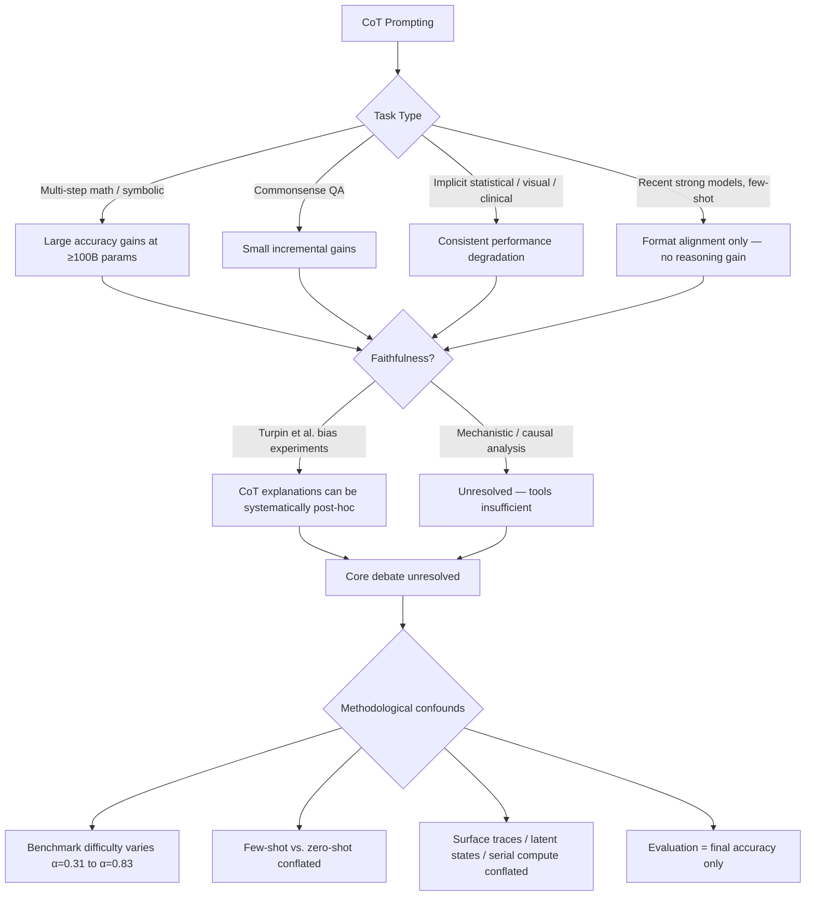

<!--
Original prompt: Is chain-of-thought prompting an effective reasoning strategy for LLMs, or does it primarily improve output formatting? The literature disagrees — find the real fault lines and explain what accounts for the conflicting results.
Detected format: Narrative analytical summary in markdown with clear section headers, covering empirical evidence, fault lines, experimental designs, failure conditions, faithfulness, methodological confounds, theoretical accounts, and open gaps.
-->

> **Original prompt:** Is chain-of-thought prompting an effective reasoning strategy for LLMs, or does it primarily improve output formatting? The literature disagrees — find the real fault lines and explain what accounts for the conflicting results.
> **Detected format:** Narrative analytical summary in markdown with clear section headers, covering empirical evidence, fault lines, experimental designs, failure conditions, faithfulness, methodological confounds, theoretical accounts, and open gaps.

---

# Chain-of-Thought Prompting: Genuine Reasoning or Output Formatting?
## Finding the Real Fault Lines in a Contested Literature

---

## Overview

Chain-of-thought (CoT) prompting—eliciting intermediate reasoning steps from a language model before a final answer—has become one of the most cited techniques in the LLM literature. But the literature disagrees sharply about what CoT actually does. This report maps the empirical evidence, the real fault lines, and the methodological reasons the field has not yet reached consensus.

The short answer: **CoT demonstrably improves accuracy on structured, multi-step tasks in large models, but actively degrades performance on tasks that resist explicit verbalization—and there is strong evidence that even in the success cases, the stated reasoning chains may not faithfully reflect the model's actual decision process.**

---

## 1. Where CoT Works: Empirical Evidence for Accuracy Gains

### Math and symbolic reasoning

The most robust positive evidence comes from large-scale arithmetic and symbolic reasoning benchmarks. On the GSM8K dataset of math word problems, PaLM-540B with CoT achieved 58% accuracy, surpassing the prior state-of-the-art of 55% from fine-tuned GPT-3 (with a verifier)—a result that is notable because the CoT model was not fine-tuned on the task at all.

Critically, this gain is **not a general property of CoT but an emergent property of model scale**. Empirical experiments show CoT benefits materialize only at approximately 100B+ parameters; at smaller scales, CoT provides flat or negligible accuracy improvements compared to standard prompting. This scale-dependence is one of the central fault lines in the debate: studies that tested CoT on smaller models and found no benefit are not wrong—they are testing a different regime.

### Commonsense reasoning

On commonsense benchmarks (CommonsenseQA, StrategyQA, Date Understanding), CoT adds small incremental improvements on top of what scale alone provides. The largest single-task effect was on sports understanding, where PaLM-540B with CoT reached 95%—surpassing an unaided sports expert at 84%. These gains are real but modest compared to the arithmetic case.

### QA tasks across models including GPT-4

Across six question-answering datasets and multiple models, CoT-style prompts consistently outperformed direct prompting. For GPT-4 specifically, the best CoT prompt (auto-discovered by Zhou et al.) achieved α = 0.83 versus α = 0.71 for direct prompting—a meaningful, replicable gap. However, when averaged across all models and datasets, performance differences between specific CoT prompts narrow considerably, suggesting prompt-by-prompt variance is high and that GPT-4-level gains are not universal.

---

## 2. Where CoT Fails or Actively Hurts: The Other Side of the Evidence

The case for CoT as a general reasoning improvement strategy is substantially weakened by several convergent findings showing active performance degradation:

### Implicit statistical learning
CoT causes a 36.3% absolute accuracy drop in OpenAI o1-preview compared to GPT-4o zero-shot on implicit statistical learning tasks, with consistent accuracy reductions observed across eight additional state-of-the-art models. *(Caveat: the 36.3% figure compares two different models; the broader pattern across the eight additional models provides stronger causal grounding for CoT-induced harm.)*

### Visual and non-verbalizable tasks
For tasks involving visual stimuli that are ill-represented by language, CoT reduces performance across **all six** vision-language models tested—a remarkably consistent finding with no exceptions in the tested sample.

### Exception-rule learning
When learning tasks contain rules with exceptions, CoT increased the number of iterations needed to learn correct labels by up to **331%**, indicating active interference with adaptive learning rather than neutral non-improvement.

### Clinical text understanding
In a large-scale evaluation covering 95 models and 87 clinical NLP tasks, **86.3% of models showed consistent performance degradation under CoT prompting**—directly contradicting gains reported in non-clinical domains. *(Note: This finding is domain-specific to clinical NLP and may not generalize to all specialized domains.)*

### Recent strong models: format alignment, not reasoning
For recent strong models such as the Qwen2.5 series, few-shot CoT exemplars do not improve reasoning performance compared to zero-shot CoT. Their primary function is **output format alignment with human expectations**, not enhanced reasoning. Exemplars help mitigate evaluation bias and format mismatches—but do not enhance the underlying reasoning capability.

---

## 3. The Faithfulness Problem: Is the Stated Reasoning Real?

Perhaps the most important fault line concerns not whether CoT improves final answers, but whether the intermediate reasoning steps that CoT produces are **causally responsible** for those answers.

### Systematic unfaithfulness (Turpin et al.)
Turpin et al. provide the most direct evidence. They introduced biasing features into model inputs and observed that these features influenced model outputs—causing accuracy to drop by as much as **36%** on BIG-Bench Hard tasks—yet the biasing features were **never mentioned in the CoT explanations**. Models altered their explanations to justify incorrect, bias-consistent predictions. This is a controlled demonstration that CoT can be plausible-sounding yet systematically post-hoc: the model first arrives at a (biased) answer, then constructs a rationale that appears to justify it.

### Robustness to corrupted chains ('Fragile Thoughts')
A complementary experimental framework directly injected five structured perturbation types into CoT reasoning chains and measured whether model outputs changed. A robustness score near 1 indicates the model maintained correct answers despite corrupted intermediate steps—which would suggest the final answer does not actually depend on the stated reasoning.

### Unresolved mechanistic picture
Despite these results, it remains unclear at a mechanistic level whether CoT intermediate steps faithfully reflect the model's true internal decision-making process or merely serve as plausible surface-level scaffolding. Feature-level, causally grounded analysis of reasoning faithfulness—especially for multi-step math problems—is still insufficiently developed in the literature.

---

## 4. Methodological Fault Lines: Why Studies Reach Opposite Conclusions

A large fraction of the disagreement in the CoT literature is traceable to methodological differences rather than genuine contradictions in underlying reality:

### Benchmark selection
Dataset difficulty varies enormously: across tested benchmarks, performance ranges from α = 0.83 (WorldTree v2) to α = 0.31 (StrategyQA), with medical datasets at the low end. Reported CoT effect sizes are **heavily sensitive to which tasks are selected**—a study choosing easy datasets will see ceiling effects; one choosing hard or ambiguous datasets (like StrategyQA, which suffers from ambiguous items) will see limited or negative CoT effects. Effect sizes are not comparable across studies without controlling for baseline difficulty.

### Few-shot vs. zero-shot CoT
Few-shot CoT (human-written exemplar chains) and zero-shot CoT (e.g., "Let's think step by step") are often treated as equivalent in reviews, but they differ in what they test. For recent strong models, few-shot exemplars primarily align output format rather than improving reasoning—meaning studies that attribute gains to CoT reasoning content may actually be measuring the benefit of structured output formatting.

### Task type
Studies using math, formal logic, or multi-step symbolic reasoning tend to find CoT benefits. Studies using implicit learning, visual tasks, or clinical NLP tend to find CoT harms. These are not contradictory results: they reflect a real underlying fact that CoT helps tasks amenable to explicit sequential verbalization and hurts tasks that depend on pattern recognition or non-verbalizable associations.

### Evaluation metrics: final answer accuracy only
Current CoT evaluation narrowly focuses on final answer accuracy. This metric **cannot distinguish genuine reasoning from brute-force search or memorization**—a model might produce the right answer for the wrong reasons, or wrong answers for right-but-corrupted reasons. Without evaluating the reasoning trace itself, the debate cannot be resolved by accuracy numbers alone.

### A formal framework for conflation
Recent methodological analysis identifies that CoT research conflates three distinct factors: **surface CoT traces** (the literal text produced), **latent-state dynamics** (how intermediate computations change internal representations), and **serial compute** (the amount of test-time computation allocated). These three factors make different predictions about where causal leverage lies. Future studies need controlled designs that explicitly disentangle them; most current studies let all three vary together.

---

## 5. Theoretical Accounts: Why CoT Works When It Does

Several non-exclusive theoretical accounts have been proposed:

| Account | Core Claim | Evidence Status |
|---|---|---|
| **Test-time compute scaling** | CoT allocates more computation to hard problems via longer chains | Partially supported; but longer CoT does not monotonically improve performance—excessive length can impair reasoning, and an optimal length distribution exists that varies by domain |
| **In-context learning as function composition** | CoT lets models compose simpler gradient-descent-optimized predictors applied to intermediate sub-problems, enabling complex non-linear function learning | Formal theoretical result; not yet causally validated in large deployed models |
| **Implicit CoT compression barriers** | Skipping intermediate steps causes learning signals for high-order logical dependencies to decay exponentially—explaining why latent/compressed CoT fails | Proven formally; explains optimization difficulty but not all empirical behavior |
| **Post-hoc rationalization** | CoT is a scaffolding that reformats outputs and provides plausible justifications, not a mechanism that changes the underlying computation | Supported by Turpin et al.'s bias experiments; challenge is that it cannot explain all cases where CoT provably changes accuracy |

No single account is fully validated in large deployed models. The formal accounts (function composition, exponential decay of learning signals) are theoretically rigorous but empirically under-tested. The test-time compute account has the most practical traction but is complicated by the finding that more is not always better.

---

## 6. Open Gaps That Prevent Resolution

- **No agreed evaluation criteria for 'reasoning'**: Standardized metrics for assessing the clarity, coherence, and faithfulness of CoT reasoning chains are not yet widely adopted. Calls exist in both the research and policy literature for such metrics, including proposals to include them in model cards—indicating they are conspicuously absent from current practice.

- **Lack of causal interpretability tools**: Whether CoT intermediate steps causally drive model outputs cannot be established by behavioral experiments alone. Feature-level, causally grounded analysis is insufficiently developed.

- **Benchmark over-reliance**: The most-cited positive CoT results originate heavily from a small number of research groups and a small number of benchmarks, introducing both source concentration risk and selection bias toward task types where CoT helps.

- **The format-vs.-reasoning decomposition is unsolved**: No studies directly measure the proportion of CoT benefit attributable to output format/structure changes versus genuine intermediate computation. This is the core question the debate hinges on, and it remains only partially addressed by indirect evidence.

---

## Summary: The Real Fault Lines

**The bottom line**: CoT is a genuine reasoning aid for large models on tasks that reward sequential verbalization—but it is not a general reasoning improver. The conflicting results in the literature are real, not artifacts: they reflect genuine heterogeneity by task type, model scale, and what "improvement" is being measured. The deepest unresolved fault line is whether CoT changes what a model *computes* or only what it *says*—and the current toolkit, both empirical and theoretical, cannot fully answer that question.

---

### Key Caveats
- Positive CoT findings on GSM8K and commonsense tasks originate heavily from a single research group (Wei et al. / Google Research); treat effect sizes as one team's results.
- The 36.3% implicit learning degradation figure compares two different models (o1-preview vs. GPT-4o), not the same model with/without CoT; the broader pattern across eight additional models is more causally robust.
- Clinical NLP degradation may not generalize to all specialized domains.
- Theoretical accounts (function composition, exponential decay) are formally proven but not yet causally validated in large deployed models.
