<!--
Original prompt: What is the current state of inference-time compute scaling for LLM reasoning? Separate what has been empirically validated from what is still speculative, and identify where the evidence is too thin to draw conclusions.
Detected format: Narrative summary in markdown with clear sections separating empirically validated findings, speculative/contested claims, and areas with insufficient evidence — matching the user's explicit analytical structure request.
-->

> **Original prompt:** What is the current state of inference-time compute scaling for LLM reasoning? Separate what has been empirically validated from what is still speculative, and identify where the evidence is too thin to draw conclusions.
> **Detected format:** Narrative summary in markdown with clear sections separating empirically validated findings, speculative/contested claims, and areas with insufficient evidence — matching the user's explicit analytical structure request.

---

# Inference-Time Compute Scaling for LLM Reasoning: State of the Evidence

> **Scope note:** This report synthesizes what the research pipeline could and could not ground in concrete evidence. Several sub-questions — including empirical benchmark gains from specific techniques (chain-of-thought, best-of-N, self-consistency), quantitative scaling laws, generalization beyond math/coding, and cost-efficiency vs. training compute — returned no groundable findings after extensive search. Those gaps are flagged explicitly below. The findings that *were* retrieved are skewed toward failure modes and methodological concerns; the pipeline was unable to locate validated positive benchmark results for this synthesis.

---

## 1. What Has Been Empirically Validated

### 1.1 Verifier-Guided Search Has a Well-Documented Failure Mode

Verifier-guided search (e.g., process reward model–guided beam search) does not monotonically improve with more samples. As sample size increases, verifier-guided search exhibits diminishing advantages and **eventually underperforms simple repeated sampling**. The mechanism is well-characterized: imperfect verifiers misrank candidates and erroneously prune all valid reasoning paths. These failures are exacerbated on challenging or out-of-distribution problems. (confidence: 0.92)

### 1.2 State-of-the-Art PRMs Are Miscalibrated

Even leading process reward models (PRMs) assign overly optimistic scores — particularly on hard, out-of-distribution problems. This miscalibration limits their utility beyond simple step ranking and constrains their use for adaptive inference-time scaling. (confidence: 0.93)

### 1.3 Progress-Based PRMs Outperform Outcome Reward Models (Single-Study Result)

One study reports that process rewards defined as *progress* (measuring change in the likelihood of a correct response) outperform outcome reward models (ORMs) for test-time search and online RL, with claimed gains of **>8% higher accuracy** and **1.5–5× better compute efficiency**. This result derives from a single paper (OpenReview) and has not been independently replicated; confidence is accordingly limited. (confidence: 0.88)

### 1.4 No Single Strategy Universally Dominates; Longer Reasoning Can Hurt

Multiple empirical studies confirm that no inference-time scaling strategy is universally best. Critically, some studies report **inverse-scaling effects**: longer reasoning traces can reinforce incorrect behaviors, amplify errors, and misalign reasoning paths, thereby *degrading* accuracy. Optimal strategy selection is highly contextual, depending on model training type, task type, and task difficulty. (confidence: 0.88)

### 1.5 Reward Misspecification Produces a Finite Optimal Sample Count

A theoretically grounded empirical finding shows that when there is substantial mismatch between the reward signal used to select among samples and the true task objective, generalization error *increases* beyond a finite optimal number of samples — meaning more inference compute actively hurts. (confidence: 0.88)

### 1.6 Benchmark Contamination Can Inflate Reported Gains

Inference-time scaling evaluations are vulnerable to test-set contamination at exact, semantic, and domain levels. Even a single replica of a test set in training data can allow models to achieve lower loss than the irreducible error of an uncontaminated model. Membership-inference-attack detectors used to filter contamination have non-zero false-negative rates, leaving residual leaked items that continue to inflate reported performance. (confidence: 0.92)

### 1.7 Questionable Evaluation Practices Are Documented

Multiple evaluation malpractices — **runtime nerfing** of baselines (optimizing the proposed method's inference parameters but not the baseline's), **post-hoc prompt/decoding-parameter selection**, **benchmark subsetting** (subsetting until the new method wins), and **evaluation harness selection** — have been catalogued as non-accidental risks in the ML evaluation literature and apply directly to inference-time scaling studies. (confidence: 0.92)

### 1.8 Token Usage Is Highly Variable and Does Not Track Accuracy

Across models with similar accuracy on inference-time scaling tasks, token consumption varies enormously. Higher token usage does not reliably indicate higher accuracy. Repeated queries to the same model yield highly variable token usage even when the model consistently provides correct answers. This makes token-efficiency and cost metrics reported in studies unreliable. (confidence: 0.88)

---

## 2. What Is Contested or Speculative

### 2.1 The Theoretical Mechanism Is Not Understood

The principles behind inference-time scaling in real LLMs are not well understood. Analytically tractable models that explain observed empirical scaling behavior are lacking. The field currently operates largely empirically, without a theoretical foundation that would allow confident extrapolation. (confidence: 0.92)

### 2.2 Optimal Strategy Depends on Difficulty and Capability in Ways Not Fully Characterized

The effectiveness of different inference-time scaling strategies critically varies with problem difficulty and model capability. Which strategies work best at which difficulty levels and for which model classes is not yet systematically characterized. This is an active open research question rather than a settled empirical fact. (confidence: 0.87)

---

## 3. Where the Evidence Is Too Thin to Draw Conclusions

The following sub-questions were extensively researched (10–12 search attempts each) but **no groundable findings were retrieved**. Claims in these areas should be treated as unvalidated.

| Area | What Cannot Be Concluded |
|---|---|
| **Benchmark gains from specific techniques** | Quantitative improvements from chain-of-thought, self-consistency, best-of-N sampling, tree/beam search, or repeated sampling could not be grounded in concrete benchmark results. |
| **Empirical scaling laws** | No functional relationship between inference compute budget and reasoning accuracy was retrievable. Whether inference-time scaling laws parallel or differ from training-time scaling laws is unresolved by this evidence base. |
| **Generalization beyond math/coding** | Whether inference-time scaling benefits transfer to open-ended, non-mathematical tasks is entirely unresolved. No evidence for or against this claim was grounded. |
| **Cost-efficiency vs. training compute** | No quantified latency, memory, or cost tradeoffs were grounded. The hypothesis that inference compute is a cost-efficient substitute for additional training is neither supported nor refuted by the available evidence. |

---

## 4. What Experiments Would Resolve Key Gaps

Based on the contested and thin-evidence areas above, the following experiments are most needed:

- **Controlled scaling-law studies** measuring reasoning accuracy as a continuous function of inference compute (tokens, samples, search steps) across standardized benchmarks, with contamination-audited held-out test sets.
- **Cross-domain generalization studies** applying inference-time scaling to open-ended tasks (e.g., scientific reasoning, legal analysis, creative writing) with human evaluation metrics, not just automated scorers.
- **Independent replication** of the progress-based PRM vs. ORM comparison across model families and task distributions.
- **Cost-controlled comparisons** directly pitting equivalent compute budgets allocated to inference-time scaling vs. additional fine-tuning, measured on held-out tasks.
- **Calibration audits** of PRMs across difficulty levels, to determine whether miscalibration is a fixable training artifact or a structural limit.

---

## 5. Summary Diagram

```mermaid
flowchart TD
    A[Inference-Time Compute Scaling Claims]
    A --> B[Empirically Validated]
    A --> C[Contested / Speculative]
    A --> D[Insufficient Evidence]

    B --> B1[Verifier-guided search underperforms\nrepeated sampling at large N]
    B --> B2[State-of-the-art PRMs are\nmiscalibrated on hard problems]
    B --> B3[No strategy universally dominates;\nlonger reasoning can hurt accuracy]
    B --> B4[Reward misspecification creates\na finite optimal sample count]
    B --> B5[Benchmark contamination and\nevaluation malpractice inflate gains]
    B --> B6[Token usage does not track accuracy]

    C --> C1[Theoretical mechanism of\ninference-time scaling is unknown]
    C --> C2[Optimal strategy varies with difficulty\nand model capability — not fully mapped]

    D --> D1[Quantitative benchmark gains from\nCoT, best-of-N, self-consistency, search]
    D --> D2[Empirical scaling laws vs.\ntraining-time scaling laws]
    D --> D3[Generalization beyond math/coding]
    D --> D4[Cost-efficiency vs. additional training]
```

---

## Key Caveats

- The retrieved findings are **skewed toward limitations**. Validated positive benchmark results (e.g., absolute accuracy improvements from specific techniques) are absent from this synthesis — not because they don't exist in the literature, but because the research pipeline did not retrieve groundable versions of them.
- Several findings come from **preprints or workshop papers** (arXiv, OpenReview) without confirmed peer review; specific quantitative claims (e.g., the >8% PRM accuracy advantage) carry reduced confidence.
- The contamination and evaluation-methodology concerns documented here are **general to LLM evaluation** and are not specifically quantified for the inference-time scaling literature in particular.
