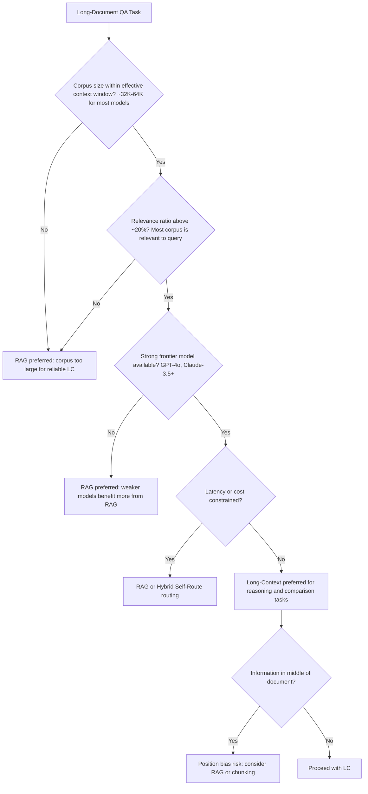

<!--
Original prompt: What's the current consensus on long-context models vs. retrieval for long-document QA—are 1M+ token context windows making RAG obsolete, and under what conditions?
Detected format: Narrative summary in markdown with section headers, covering empirical benchmarks, head-to-head comparisons, RAG conditions, failure modes, hybrid approaches, researcher disagreements, and evidence gaps.
-->

> **Original prompt:** What's the current consensus on long-context models vs. retrieval for long-document QA—are 1M+ token context windows making RAG obsolete, and under what conditions?
> **Detected format:** Narrative summary in markdown with section headers, covering empirical benchmarks, head-to-head comparisons, RAG conditions, failure modes, hybrid approaches, researcher disagreements, and evidence gaps.

---

# Long-Context Models vs. RAG for Long-Document QA: Current Consensus

> **Bottom line:** Current empirical evidence does not support the claim that 1M+ token context windows make RAG obsolete. All frontier long-context models degrade as context length increases, effective reliable retrieval falls well short of advertised maximums, and RAG retains meaningful advantages in cost, latency, low-relevance corpora, and for weaker models. Hybrid routing approaches show promise but remain contested.

---

## 1. What Benchmarks Actually Show

Despite impressive marketing numbers, empirical benchmarks consistently reveal a gap between advertised and effective context capacity:

- **RULER benchmark:** Despite near-perfect performance on simple needle-in-a-haystack (NIAH) tests, almost all models exhibit large performance drops as context length increases. Even among models claiming 32K+ context sizes, only half maintain satisfactory performance at 32K tokens. [F0]
- **HELM Long Context leaderboard (2025):** GPT-4.1 achieved the highest mean score of **0.588** across five long-context tasks (RULER SQuAD, RULER HotPotQA, Bench MC, Bench En.Sum, MRCR) at up to 128K tokens, outperforming Gemini 2.0 Flash and Llama 4 variants. Yet even on a computationally simple multi-reference coreference resolution (MRCR) task, the best model scored only **0.256**. [F1, F2]
- **Chroma's 2025 context rot study (18 models):** Universal degradation was found across all 18 tested models including GPT-4.1, Claude Opus 4, Gemini 2.5 Pro, and Qwen3-235B. The study concluded that context rot is an architectural property of transformer-based attention, not a training gap. [F13]
- **The 1M-token claim vs. reality:** One analyst source asserts a 30-60 point retrieval quality drop between 200K and 1M tokens for all frontier models, arguing that the phrase '1M context' on a model card is a capacity statement, not a quality statement. [F22]

> **Caveat:** Many benchmark evaluations use synthetic or semi-synthetic tasks that may not reflect real-world enterprise QA complexity. The field is also evolving rapidly.

---

## 2. Head-to-Head: Long-Context vs. RAG

The evidence is genuinely mixed and model-dependent:

| Condition | Winner | Evidence |
|---|---|---|
| Strong frontier models (GPT-4o, Claude-3.5-Sonnet) with sufficient resources | Long-context (LC) | LC surpasses RAG by 7.6%-13.1% on average [F20] |
| Weaker models (Llama-3.2-3B, Mistral-Nemo-12B) at 128K context | RAG | RAG outperforms LC by 6.48%-38.12% [F3] |
| All models averaged at 128K context | RAG | RAG outperforms LC by 3.68% [F5] |
| Hallucination identification tasks | RAG | RAG has a significant advantage [F4] |
| Reasoning and comparison tasks | LC | LC excels [F4] |

The **Self-Route paper** (using Gemini-1.5-Pro, GPT-4O, GPT-3.5-Turbo) found LC consistently outperforms RAG when sufficiently resourced. A **2025 comparison study** found the opposite trend at 128K context when averaging across all model strengths. The key variable is model capability: the stronger the model, the more likely LC beats RAG.

> **Caveat:** Studies differ in their task sets, model versions, and evaluation protocols, making direct comparison difficult.

---

## 3. When RAG Retains Practical Advantages

Several documented conditions favor RAG regardless of context window size:

1. **Corpus exceeds effective context:** Llama-3.1-405B degrades measurably after ~32K tokens and GPT-4 after ~64K tokens, well below advertised maximums. [F8]
2. **Low relevance ratio:** When less than ~20% of the corpus is relevant to a given query, irrelevant context actively harms model performance. RAG consistently outperforms full-context stuffing in this regime. (Note: this 20% threshold is a practitioner heuristic from a single blog post, not an empirically validated finding.) [F9]
3. **Latency-sensitive applications:** In one documented test, a RAG pipeline averaged ~1 second end-to-end while a long-context configuration took 30-60 seconds on the same workload. [F6]
4. **Cost at scale:** One production framework reported RAG queries costing ~1,250x less per query than full long-context approaches, making long-context economically nonviable for high-query-volume applications. [F7]
5. **Frequently updated corpora:** RAG with incremental indexing scales better than reloading the full context window on each update. Static corpora favor long context. [F10]
6. **Weaker models:** RAG provides significantly greater improvements for smaller or weaker models. [F3]

> **Caveat:** The latency and cost figures come from practitioner blog posts rather than peer-reviewed studies and may not generalize across deployment configurations.

---

## 4. Known Failure Modes of Long Context Windows

### 4a. Lost-in-the-Middle and Position Bias

- In multi-document QA with 20 documents, accuracy dropped by more than 30% when the relevant document appeared in positions 5-15 compared to position 1 or 20, even for models designed for long contexts. [F12]
- More broadly, accuracy drops 10-20+ percentage points when relevant information sits in the middle of long contexts. GPT-3.5-Turbo showed greater than 20% degradation in worst cases. [F11]
- All three frontier models tested (GPT-4o, Claude 3 Opus, Gemini-1.5 Pro) exhibit position bias, though the direction differs: GPT-4o and Claude 3 Opus prefer end-of-document insights, while Gemini-1.5 Pro prefers the beginning. [F21]

### 4b. Attention Dilution and Attention Sinks

- Transformer softmax attention normalizes weights across all tokens. As context grows, each token receives proportionally less attention: at 10K tokens approximately 0.0001 per token, at 100K tokens approximately 0.00001, and at 1M tokens approximately 0.000001. [F15]
- MIT and Meta AI researchers (ICLR 2024) identified attention sinks: initial tokens receive disproportionately high attention scores regardless of semantic relevance, because softmax normalization forces models to dump attention somewhere. [F16]

### 4c. Quadratic Scaling Cost

Classical transformer attention has quadratic computational complexity. Scaling from a 10-token to a 1,000-token prompt increases attention operations from roughly 414K to 4.6 billion. [F23] Many current long-context models use approximate or modified attention mechanisms that partially mitigate this, though degradation is still empirically observed.

### 4d. Degradation Even with Perfect Retrieval

A 2025 arXiv paper found that even with 100% perfect retrieval of relevant information, performance degrades 13.9% to 85% as input length increases, persisting even when irrelevant tokens are replaced with whitespace or masked entirely. [F17]

### 4e. Hallucination Patterns

GPT models show approximately 2.55% hallucination rates on refusal-prone tasks in long-context settings, while Claude models exhibit the lowest rates, often choosing to abstain rather than hallucinate. [F14]

---

## 5. Hybrid Approaches: RAG + Long-Context

Hybrid methods that combine retrieval with long-context reasoning have shown promise:

- **Self-Route:** Routes queries to either RAG or full LC processing based on model self-reflection. It achieves performance comparable to LC alone while reducing computation cost by 65% for Gemini-1.5-Pro and 39% for GPT-4O. [F19]
- However, the research literature is actively divided: some studies find the RAG+LC combination effective, while others find it not beneficial. [F18]

The current picture is that hybrid routing is the most resource-efficient strategy when the query distribution is mixed.

---

## 6. Where Researchers Disagree

The field has genuine open debates:

- **Does model capability close the gap?** Strong models do show LC outperforming RAG when sufficiently resourced [F20], but universal degradation with length is observed even in the best 2025 models [F13].
- **Is context rot architectural or a training gap?** The Chroma 2025 study argues it is architectural [F13]; others implicitly assume continued scaling will close it.
- **Is the 1M-token context window a meaningful capability?** One analyst argues the effective window is substantially shorter than advertised [F22]; defenders of long-context scaling point to rapid improvement in NIAH-style benchmarks.
- **Is RAG+LC synergistic or redundant?** Several studies support combining them; others find no benefit. [F18]

---

## 7. Evidence Gaps and Methodological Weaknesses

> **Note:** The evidence-gaps sub-question could not be fully answered due to search budget exhaustion. The following gaps are identified from pipeline caveats and implicit evidence.

- **Synthetic benchmarks dominate:** RULER, HELM Long Context, and NIAH use synthetic tasks that may not reflect enterprise QA complexity such as contract analysis, legal review, or scientific synthesis.
- **Missing: rigorous cost-controlled head-to-head comparisons** under matched compute budgets.
- **Missing: multilingual evaluations** of long-context vs. RAG.
- **Missing: evaluations on realistic enterprise document corpora** with heterogeneous document types and real query distributions.
- **Blog-sourced figures:** Several key cost and latency numbers come from practitioner blog posts rather than peer-reviewed studies.
- **Rapidly shifting landscape:** Many results reference 2024-2025 model releases; benchmark results may not reflect current fine-tuned variants.

---

## Decision Flowchart

---

## Key Takeaways

1. **No, 1M+ token windows do not make RAG obsolete.** All current frontier models degrade with length; effective retrieval quality is substantially below advertised capacity.
2. **The answer is model- and task-dependent.** Strong models on reasoning and comparison tasks favor LC; weaker models, hallucination detection, high-volume or latency-sensitive apps favor RAG.
3. **Hybrid Self-Route approaches** offer the best cost-performance tradeoff and are currently the most promising practical direction.
4. **Fundamental architectural challenges** including attention dilution, position bias, and quadratic scaling persist across all 2025 frontier models and are not yet solved by scale alone.
5. **The literature has significant gaps:** synthetic benchmarks, absent enterprise evaluations, and blog-sourced cost figures mean practitioners should treat specific thresholds with caution.
