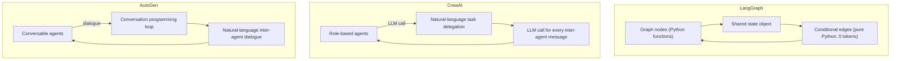

<!--
Original prompt: Compare reported costs and latencies for production agentic-RAG built on LangGraph, CrewAI, and AutoGen. Where do public numbers disagree, and what's driving the gap—different model sizes, prompt lengths, batch settings, or actual framework overhead?
Detected format: Narrative summary with comparison tables and structured sections in GitHub-flavored markdown, inferred from the analytical nature of the prompt asking to 'compare' and identify 'where numbers disagree' and 'what's driving the gap.'
-->

> **Original prompt:** Compare reported costs and latencies for production agentic-RAG built on LangGraph, CrewAI, and AutoGen. Where do public numbers disagree, and what's driving the gap—different model sizes, prompt lengths, batch settings, or actual framework overhead?
> **Detected format:** Narrative summary with comparison tables and structured sections in GitHub-flavored markdown, inferred from the analytical nature of the prompt asking to 'compare' and identify 'where numbers disagree' and 'what's driving the gap.'

---

# Agentic-RAG Cost & Latency: LangGraph vs. CrewAI vs. AutoGen

> **Evidence quality warning:** No peer-reviewed studies or vendor-neutral controlled benchmarks exist for this comparison. Every quantitative figure below comes from blog posts, vendor case studies, or independent developer write-ups with varying methodological rigor. Dollar-cost-per-query figures were not found in any source; all cost evidence is expressed in **token counts**, not money. Framework versions, exact model versions, and infrastructure configurations are inconsistently reported across studies, making cross-benchmark comparisons unreliable.

---

## 1. What the Published Numbers Actually Say

Four studies provide the bulk of the quantitative data. They used different tasks, different models, and different hardware—so their numbers cannot be directly compared, but they are all that exist publicly.

### 1a. Latency Comparison

| Framework | Aerospike/N1n.ai Stress Test¹ | N1n.ai Company Research Agent² | Cordum AgentRace (GAIA)³ | Golchian Local (Qwen3 32B)⁴ |
|-----------|-------------------------------|----------------------------------|---------------------------|------------------------------|
| **LangGraph** | **Fastest** (>2× faster than CrewAI in that run) | 506 s | 12.86 s (LangChain proxy) | 62% task completion |
| **CrewAI** | ~9 s segment (excluded from stress results due to 44% failure rate) | 246 s | 11.87 s | 54% task completion |
| **AutoGen** | Not reported | 572 s (slowest) | 8.41 s (fastest) | 58% task completion |
| MS Agent | — | 93 s (fastest) | — | — |

¹ Source: [Aerospike blog](https://aerospike.com/blog/langgraph-production-latency-replay-scale/) — 5-agent workflow, 100 runs, unspecified model.  
² Source: [N1n.ai blog, 2026-02-16](https://explore.n1n.ai/blog/benchmarking-5-ai-agent-frameworks-performance-cost-consistency-2026-02-16) — Company Research Agent task, unspecified model.  
³ Source: [Cordum blog](https://cordum.io/blog/ai-agent-frameworks-comparison) — GAIA benchmark tasks, unspecified model.  
⁴ Source: [Golchian blog, 2026](https://pooya.blog/blog/crewai-vs-langgraph-autogen-comparison-2026/) — 200 tasks/tier, Qwen3 32B via Ollama on Apple M4 Max 64 GB.

### 1b. Token Consumption Comparison

| Framework | N1n.ai Company Research Agent² | Cordum AgentRace (GAIA)³ |
|-----------|---------------------------------|---------------------------|
| **LangGraph** | 8,823 tokens | Not reported |
| **CrewAI** | 27,684 tokens | 17,058 tokens |
| **AutoGen** | 10,793 tokens | 1,381 tokens |
| MS Agent | 7,006 tokens | — |
| LangChain | — | 7,753 tokens |

### 1c. LangGraph Stress-Test Throughput (N1n.ai, 2026-02-19)

In a separate N1n.ai stress-condition benchmark ([source](https://explore.n1n.ai/blog/benchmarking-ai-agent-frameworks-performance-2026-02-19)), LangGraph (Python) achieved:
- **Avg latency:** 10,155 ms
- **P95 latency:** 16,891 ms
- **Throughput:** 2.70 req/s
- **Peak memory:** 5,570 MB | **CPU:** 39.7%

CrewAI was **excluded** from this test due to a 44% failure rate; all other frameworks hit 100% success.

---

## 2. Where the Numbers Directly Contradict Each Other

### Contradiction A: LangGraph vs. CrewAI speed ranking is reversed across studies

The most striking disagreement is not a small variance—it is a **complete reversal of the winner**:

- The Aerospike/N1n.ai pipeline benchmark found **LangGraph more than 2× faster** than CrewAI.
- The N1n.ai Company Research Agent benchmark found **CrewAI more than 2× faster** than LangGraph (246 s vs. 506 s).

The same publisher produced both results, days apart, using apparently different task definitions and stress conditions.

### Contradiction B: AutoGen's performance range spans two orders of magnitude

- Cordum's AgentRace (GAIA tasks): **8.41 seconds**, **1,381 tokens** — fastest framework tested.
- N1n.ai Company Research Agent: **572 seconds**, **10,793 tokens** — slowest framework tested.

That is a ~68× difference in runtime and ~7.8× difference in token use for nominally the same framework.

### Contradiction C: CrewAI's absolute token count differs 60% across studies

- N1n.ai Company Research Agent: **27,684 tokens**
- Cordum AgentRace: **17,058 tokens**

### Contradiction D: N1n.ai's own two studies are internally inconsistent on CrewAI reliability

One N1n.ai study reports specific CrewAI completion metrics (246 s, 27,684 tokens); a separate N1n.ai study published days later excludes CrewAI entirely due to a 44% failure rate. These cannot both be representative of CrewAI under equivalent conditions.

---

## 3. What's Driving the Gap?

No study controlled for all variables simultaneously, so the attribution below is based on the explanations the authors themselves offered, not controlled experimental isolation.

### 3a. Task complexity and workflow definition (primary driver of cross-study variance)

The single largest source of the contradictions is that the benchmarks measured **fundamentally different tasks**:
- GAIA benchmark questions (Cordum) → short, well-defined, low agent-turn count → AutoGen 8.41 s
- Company Research Agent (N1n.ai) → open-ended, multi-source research → AutoGen 572 s
- Simple 5-agent pipeline repeated 100× (Aerospike) → favors LangGraph's deterministic routing

Neither task complexity, RAG corpus size, concurrency level, nor retrieval chunk strategy was held constant across any pair of studies.

### 3b. Architecture-driven token overhead (CrewAI)

The structural reason CrewAI tends to be token-heavier is well-described in the literature, even if the exact numbers vary:

> *"CrewAI's natural-language delegation means every agent interaction involves LLM calls — even the coordination overhead. In complex pipelines, agents exchange confirmations and clarifications that consume tokens without advancing the task."*  
> — [Redwerk blog](https://redwerk.com/blog/langgraph-vs-crewai/)

By contrast, LangGraph's structured state-passing allows routing decisions to be implemented as **pure Python functions with zero token cost**. CrewAI's role-playing design is described as "extremely verbose" by N1n.ai, and the token data is consistent with that characterization even if the absolute numbers differ across studies.

### 3c. Conversational multi-agent loops (AutoGen)

AutoGen's architecture is built around "conversation programming"—agents communicate through natural language conversations, defined by inter-agent dialogue rather than a structured graph. This design can be extremely efficient on focused tasks (explaining the 8.41 s GAIA result) but balloons in token and time cost as task scope grows (explaining the 572 s research-agent result). The architecture does not impose a fixed overhead; it scales with conversation depth.

### 3d. Graph-based state management (LangGraph)

LangGraph's directed-graph model lets operators define exactly which nodes invoke the LLM and which perform pure-Python routing. The Golchian benchmark attributes LangGraph's higher task-completion rate on complex multi-step tasks (62% vs. CrewAI's 54% and AutoGen's 58%) to the graph state machine handling failed nodes more gracefully—an architectural reliability advantage, not a raw speed one.

### 3e. Framework overhead (uninstrumented)

No study was found that isolates **intrinsic framework overhead**—initialization time, serialization cost, inter-agent messaging latency, or state management—independent of model inference costs. The Aerospike benchmark found ~5 of CrewAI's ~9-second latency segment attributable to tool-interaction time, but did not separate framework serialization from model round-trip time.

### 3f. Model size and batch settings (uncontrolled)

No study explicitly compared the same framework across GPT-4o vs. GPT-3.5 vs. open-source models in a controlled fashion. The Golchian study used Qwen3 32B locally; the N1n.ai and Cordum studies used unspecified (presumably cloud) models. Model pricing, inference speed, and context-window usage all vary, but were not isolated as variables.

---

## 4. Architectural Summary

*Token cost implication: LangGraph's routing is cheapest at coordination layer; CrewAI's and AutoGen's coordination layers both consume LLM tokens, scaling with conversation depth.*

---

## 5. State of the Evidence

| Dimension | Status |
|-----------|--------|
| Peer-reviewed studies | ❌ None found |
| Vendor-neutral controlled benchmarks | ❌ None found |
| Dollar cost-per-query figures | ❌ None found (token counts only) |
| Consistent framework version reporting | ❌ Absent across all studies |
| Isolated framework overhead measurements | ❌ Not found |
| Task-controlled cross-framework comparisons | ❌ Not found |
| Blog posts / developer write-ups | ✅ Multiple, with numeric data |
| Qualitative architectural explanations | ✅ Consistent across sources |

The evidence base is **entirely blog posts and vendor case studies**. The qualitative architectural story (LangGraph = token-efficient routing; CrewAI = verbose delegation; AutoGen = conversation-depth-sensitive) is consistent across sources. The quantitative numbers are not.

**Key measurements missing for a definitive comparison:**
1. Same task, same model, same hardware, same RAG corpus, run on all three frameworks simultaneously
2. Dollar cost-per-query (not just tokens) at production concurrency
3. Isolated framework initialization and serialization overhead
4. Controlled ablation of model size, prompt length, and retrieval chunk strategy
5. P95/P99 latency under concurrent load for CrewAI and AutoGen (only LangGraph has stress-test data)

---

*All sources are blog posts or independent write-ups. No peer-reviewed or vendor-neutral benchmark was identified. Treat all figures as directional, not definitive.*
