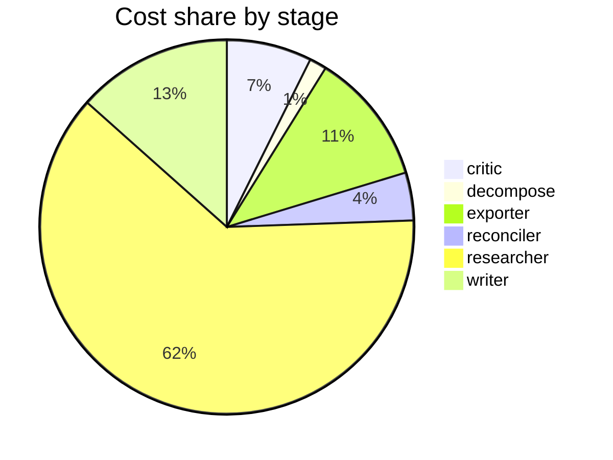

# Run metrics — What are the real-world risks and benefits of using synthetic data to train or …

> **Prompt:** What are the real-world risks and benefits of using synthetic data to train or fine-tune large language models? Focus on data quality, bias, and evaluation.
> **Started:** 2026-05-05T11:33:39.624901+00:00
> **Duration:** 335.9s
> **Final output:** [final_20260505T043339_adad0fa7_what_are_the_real_world_risks_and_benefi.md](./final_20260505T043339_adad0fa7_what_are_the_real_world_risks_and_benefi.md)

## Evaluation metrics

### Grounding

**Rate:** 100%  (18/18 claims grounded)

| claim | grounded | reason |
|---:|:---:|---|
| 0 | ✅ | Evidence directly states the same percentages and performance gap between synthetic benchmarks and real-world class tasks. |
| 1 | ✅ | The evidence directly supports both the modest gains from synthetic positive data and the 8x amplification comparison via self-generated correct solutions. |
| 2 | ✅ | Evidence directly supports synthetic-to-real transfer via RL fine-tuning on a 0.6B model with F1 improvements and no factual overlap. |
| 3 | ✅ | Both parts of the claim are directly supported by the two evidence quotes. |
| 4 | ✅ | The evidence directly supports the claim about amplifying under-representation, assuming homogeneity, and creating false statistical reliability. |
| 5 | ✅ | Evidence supports both the bias-amplification claims and the CA-GAN finding showing improved fairness for Black and female patients via minority class augmentation. |
| 6 | ✅ | Evidence explicitly lists all three failure modes: model drift, bias amplification, and overconfidence in edge cases. |
| 7 | ✅ | The evidence directly supports all components of the claim: degenerative process, training on prior-generation synthetic data, loss of true distribution information, tails disappearing first, and convergence to low-variance point estimates. |
| 8 | ✅ | Evidence explicitly mentions all four manifestations: reduced diversity, declining minority/niche performance, semantic drift, and fairness feedback loops amplifying biases. |
| 9 | ✅ | The evidence directly states the claim almost verbatim. |
| 10 | ✅ | Evidence directly supports the claim about errors compounding and quality eroding across generations. |
| 11 | ✅ | Evidence directly provides healthcare and finance hypothetical scenarios showing cascading errors from poisoned data and retraining on weak synthetic outputs. |
| 12 | ✅ | Evidence describes the TSTR-style procedure of training models on synthetic vs real data and comparing performance on a real holdout set. |
| 13 | ✅ | Evidence directly supports the classification-based method, mutual relationships, and axiom satisfaction claims. |
| 14 | ✅ | The evidence directly states the r=0.87 correlation with mAP50 and that previous metrics showed only moderate or weak correlations. |
| 15 | ✅ | The evidence directly states the method generates red-teaming and alignment data completely synthetically for LLM safety across diverse topics. |
| 16 | ✅ | The evidence directly states that DP synthetic data can be analyzed, shared, and combined without additional privacy risk and without modifying tools/workflows. |
| 17 | ✅ | Evidence supports cost reduction via synthetic labeling but does not quantify a 70% figure, matching the claim's caveat. |

### Calibration

**Total claims:** 18

| confidence range | n | grounded rate | mean stated confidence |
|---|---:|---:|---:|
| [0.00, 0.30) | 0 | — | — |
| [0.30, 0.60) | 3 | 100% | 0.50 |
| [0.60, 0.80) | 5 | 100% | 0.62 |
| [0.80, 1.01) | 10 | 100% | 0.90 |

### Coverage

**Rate:** 86%  (6 covered, 1 missed)

- **Covered:** `sq1`, `sq2`, `sq3`, `sq4`, `sq5`, `sq6`
- **Missed:** `sq7`

### LLM judge rubric

| dimension | score |
|---|---:|
| correctness | 3.50 / 5 |
| completeness | 3.50 / 5 |
| calibration | 4.00 / 5 |
| source quality | 3.00 / 5 |
| conflict handling | 4.00 / 5 |
| overall | 3.50 / 5 |

> Strongest aspects: explicit surfacing of bias amplification vs. CA-GAN contradiction, honest down-weighting of the 70% cost-reduction claim, and reasonable calibration overall (e.g., model collapse foundational claim at 0.93, speculative cascade scenarios at 0.55). Weakest aspects: source quality is mixed—several arxiv preprints (one URL, 2603.02091, looks suspicious/possibly hallucinated as the prefix is not a valid arxiv ID), reliance on vendor blogs (cogentinfo, mostly.ai, manageengine, igoroseledko) for technical claims, and specific numerical claims (DCScore axioms, SDQM r=0.87, 84-89% vs 25-34% code benchmarks) are stated with high confidence but cannot be readily verified and may overstate single-paper findings. Completeness is adequate but underweights important topics like constitutional AI/RLAIF-style synthetic alignment data tradeoffs and recent work showing model collapse can be avoided with data accumulation (Gerstgrasser et al.).

## Final output audit

- **Format detected:** Narrative summary in markdown with clear section headers, covering data quality, bias, and evaluation as explicitly requested by the user prompt.
- **Notes:** Format inferred as a structured narrative summary in GitHub-flavored markdown with section headers, tables, a Mermaid diagram, and inline caveats, matching the analytical depth of the prompt. The sq7 gap (weakest evidence) is addressed qualitatively in Section 6 but could not be grounded in specific findings due to pipeline research limitations; marked as 'partial'.
- **Conditions:** 10 satisfied / 1 partial / 0 not satisfied / 0 n/a
- **Unmet:**
  - Surface where evidence is weakest or most contested

Operational details

### Cost & latency
- Total cost: **$0.7929**  |  input tokens: 479854  |  output tokens: 22590  |  elapsed: 335.9s  |  revision rounds: 1

### Per-stage
| stage | calls | input tokens | output tokens | cost (USD) | elapsed (s) |
|---|---:|---:|---:|---:|---:|
| critic | 2 | 16128 | 668 | $0.0584 | 15.3 |
| decompose | 1 | 737 | 639 | $0.0118 | 12.5 |
| exporter | 1 | 6959 | 4659 | $0.0908 | 89.7 |
| reconciler | 2 | 8252 | 537 | $0.0328 | 11.4 |
| researcher | 49 | 436088 | 11332 | $0.4927 | 115.5 |
| writer | 2 | 11690 | 4755 | $0.1064 | 91.5 |

### Tool mix
| tool | calls |
|---|---:|
| web_search | 30 |
| search_papers | 14 |
| fetch_url | 37 |
| save_finding | 21 |
| note_uncertainty | 0 |

### Run metadata
- commit: `e37fe10e36a885be4f5387a6e8923c290b89b6d0`  branch: `main`
- captured_at: 2026-05-05T11:28:03.792372+00:00
- models: critic=`claude-sonnet-4-6`, judge=`claude-opus-4-7`, researcher=`claude-haiku-4-5`, writer=`claude-sonnet-4-6`

