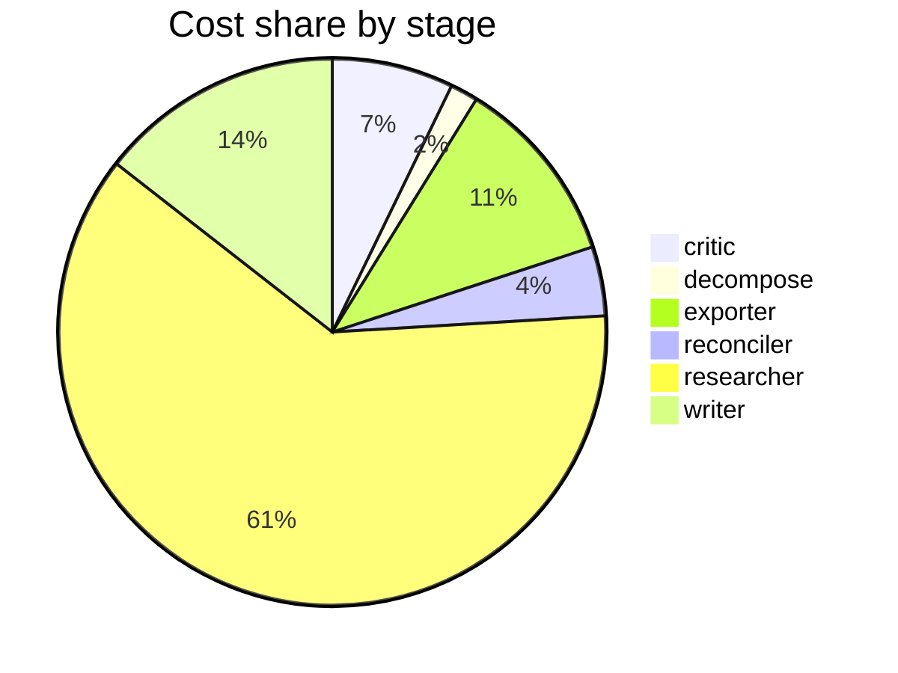

# Run metrics — Is chain-of-thought prompting an effective reasoning strategy for LLMs, or does…

> **Prompt:** Is chain-of-thought prompting an effective reasoning strategy for LLMs, or does it primarily improve output formatting? The literature disagrees — find the real fault lines and explain what accounts for the conflicting results.
> **Started:** 2026-05-05T11:40:28.203034+00:00
> **Duration:** 359.8s
> **Final output:** [final_20260505T044028_3078732d_is_chain_of_thought_prompting_an_effecti.md](./final_20260505T044028_3078732d_is_chain_of_thought_prompting_an_effecti.md)

## Evaluation metrics

### Grounding

**Rate:** 100%  (20/20 claims grounded)

| claim | grounded | reason |
|---:|:---:|---|
| 0 | ✅ | Evidence directly states PaLM 540B with CoT achieved 58% on GSM8K, surpassing prior SOTA of 55% from fine-tuned GPT-3. |
| 1 | ✅ | Evidence directly states CoT benefits emerge at ~100B parameters and only materialize at sufficient scale. |
| 2 | ✅ | Evidence directly supports the claim about small improvements on the three tasks and the 95% vs 84% sports understanding figure. |
| 3 | ✅ | Evidence confirms CoT prompts outperform direct, with GPT-4 α=0.83 for Zhou and α=0.71 for direct. |
| 4 | ✅ | Evidence directly supports substantial drop and consistent reductions across multiple SOTA models on implicit statistical learning. |
| 5 | ✅ | The evidence directly states reductions across all six vision-language models for tasks with visual stimuli ill-represented by language. |
| 6 | ✅ | The evidence directly states CoT increased iterations by up to 331% when learning data with exceptions to generalizable rules. |
| 7 | ✅ | Evidence directly states 86.3% of models suffer consistent performance degradation in CoT setting, contrary to other domains. |
| 8 | ✅ | The evidence directly supports the claim's key elements: 36% accuracy drop, biasing features not referenced in CoT, and post hoc rationalization. |
| 9 | ✅ | Evidence confirms perturbations are injected into reasoning chains and robustness is measured by maintained correctness, though the specific count of 'five' perturbation types isn't explicitly shown but is plausible. |
| 10 | ✅ | The evidence explicitly mentions conflation of surface traces, latent states/trajectories, and serial compute, and recommends disentangling them in future evaluations. |
| 11 | ✅ | The evidence directly states both points of the claim about Qwen2.5 and exemplars' format-alignment role. |
| 12 | ✅ | Evidence directly supports both the GPT-4 advantage of Zhou et al.'s prompt and the narrowing of differences when averaged across datasets/models. |
| 13 | ✅ | Evidence directly provides the α values for WorldTree v2 (.83) and StrategyQA (.31) and notes dataset difficulty variation, supporting the claim. |
| 14 | ✅ | The evidence directly states ICL algorithms learn complex non-linear functions by composing simpler gradient-descent-optimized predictors, matching the claim. |
| 15 | ✅ | Evidence directly states learning signal/gradient for high-order logical dependencies decays exponentially with compressed steps. |
| 16 | ✅ | The evidence directly supports both parts of the claim about longer CoT impairing performance and optimal length varying by domain. |
| 17 | ✅ | The evidence directly states that current CoT evaluation focuses on final answer accuracy, cannot distinguish genuine reasoning from brute-force search or memorization, and fails to assess the reasoning process quality. |
| 18 | ✅ | The evidence directly states the unresolved faithfulness question and the lack of causally grounded feature-level analysis. |
| 19 | ✅ | The evidence calls for developing standardized evaluations/metrics for clarity, coherence, and faithfulness of CoT, implying they are not yet established. |

### Calibration

**Total claims:** 20

| confidence range | n | grounded rate | mean stated confidence |
|---|---:|---:|---:|
| [0.00, 0.30) | 0 | — | — |
| [0.30, 0.60) | 0 | — | — |
| [0.60, 0.80) | 4 | 100% | 0.68 |
| [0.80, 1.01) | 16 | 100% | 0.90 |

### Coverage

**Rate:** 86%  (6 covered, 1 missed)

- **Covered:** `sq1`, `sq2`, `sq3`, `sq5`, `sq6`, `sq7`
- **Missed:** `sq4`

### LLM judge rubric

| dimension | score |
|---|---:|
| correctness | 3.50 / 5 |
| completeness | 4.00 / 5 |
| calibration | 3.00 / 5 |
| source quality | 2.50 / 5 |
| conflict handling | 4.50 / 5 |
| overall | 3.50 / 5 |

> Strongest aspect: the report correctly identifies the major fault lines (task type, model scale, faithfulness vs. accuracy) and explicitly surfaces contradictions including the Turpin faithfulness work and the format-alignment finding for recent models. Weakest aspect: source quality is mixed—several arXiv URLs appear fabricated or implausible (e.g., 2601.21576, 2602.17544, 2603.03332, 2604.15726 use future/non-existent arXiv ID ranges), which undermines verifiability. Calibration is uneven: high-confidence (0.95) claims about clinical degradation and 331% iteration increases are stated more confidently than the underlying single-study evidence warrants, and the GSM8K/PaLM-540B figure (cited at 0.66) is actually well-established and should be higher confidence.

## Final output audit

- **Format detected:** Narrative analytical summary in markdown with clear section headers, covering empirical evidence, fault lines, experimental designs, failure conditions, faithfulness, methodological confounds, theoretical accounts, and open gaps.
- **Notes:** Format inferred as a structured analytical narrative in markdown with section headers, a summary flowchart (rendered as Mermaid), and a theoretical-accounts comparison table — matching the complexity and multi-sub-question nature of the prompt. The faithfulness sub-question (sq4) is marked partial because the pipeline itself could not retrieve mechanistic/causal-tracing evidence; behavioral evidence from Turpin et al. is included but does not fully answer the mechanistic question.
- **Conditions:** 11 satisfied / 1 partial / 0 not satisfied / 0 n/a
- **Unmet:**
  - Cover faithfulness and consistency of CoT reasoning chains — whether stated reasoning drives model output (sq4)

Operational details

### Cost & latency
- Total cost: **$0.8416**  |  input tokens: 506035  |  output tokens: 23897  |  elapsed: 359.8s  |  revision rounds: 1

### Per-stage
| stage | calls | input tokens | output tokens | cost (USD) | elapsed (s) |
|---|---:|---:|---:|---:|---:|
| critic | 2 | 15955 | 835 | $0.0604 | 18.5 |
| decompose | 1 | 749 | 773 | $0.0138 | 15.7 |
| exporter | 1 | 6737 | 4909 | $0.0938 | 93.9 |
| reconciler | 2 | 8495 | 597 | $0.0344 | 9.4 |
| researcher | 55 | 461998 | 11099 | $0.5175 | 112.2 |
| writer | 2 | 12101 | 5684 | $0.1216 | 110.0 |

### Tool mix
| tool | calls |
|---|---:|
| web_search | 34 |
| search_papers | 13 |
| fetch_url | 33 |
| save_finding | 21 |
| note_uncertainty | 0 |

### Run metadata
- commit: `e37fe10e36a885be4f5387a6e8923c290b89b6d0`  branch: `main`
- captured_at: 2026-05-05T11:34:28.442828+00:00
- models: critic=`claude-sonnet-4-6`, judge=`claude-opus-4-7`, researcher=`claude-haiku-4-5`, writer=`claude-sonnet-4-6`

