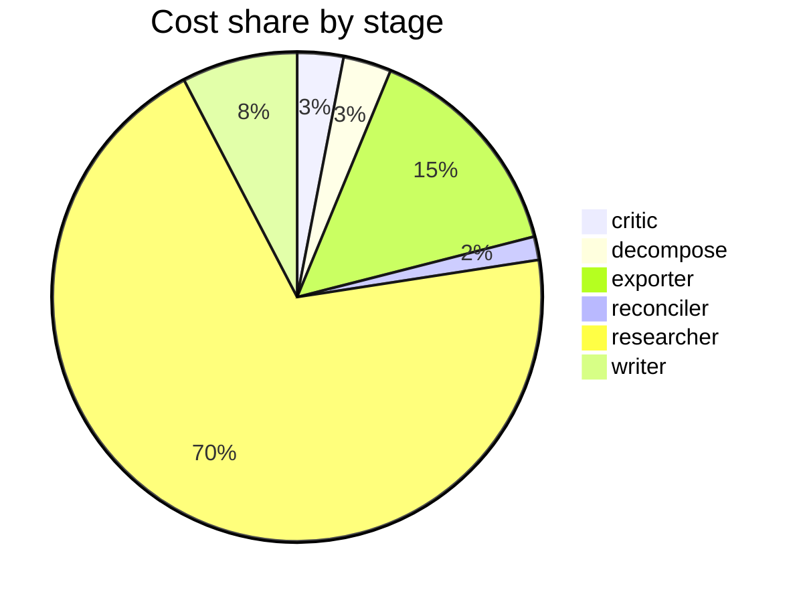

# Run metrics — What is the current state of inference-time compute scaling for LLM reasoning? …

> **Prompt:** What is the current state of inference-time compute scaling for LLM reasoning? Separate what has been empirically validated from what is still speculative, and identify where the evidence is too thin to draw conclusions.
> **Started:** 2026-05-05T11:44:48.500559+00:00
> **Duration:** 209.1s
> **Final output:** [final_20260505T044448_b0e11762_what_is_the_current_state_of_inference_t.md](./final_20260505T044448_b0e11762_what_is_the_current_state_of_inference_t.md)

## Evaluation metrics

### Grounding

**Rate:** 100%  (10/10 claims grounded)

| claim | grounded | reason |
|---:|:---:|---|
| 0 | ✅ | Evidence directly states diminishing advantages, eventual underperformance vs repeated sampling, and verifier failures including misranking and erroneous pruning. |
| 1 | ✅ | The evidence directly states PRMs are miscalibrated, overly optimistic on challenging OOD problems, and limited beyond step ranking, matching the claim. |
| 2 | ✅ | The evidence directly supports the claim's definition, comparison, and numeric gains. |
| 3 | ✅ | Evidence directly supports that strategy effectiveness varies with prompt difficulty and model capability. |
| 4 | ✅ | Evidence directly supports both that no strategy universally dominates and that longer reasoning can degrade accuracy and reinforce incorrect behaviors. |
| 5 | ✅ | The evidence directly states that substantial reward misspecification leads to a finite optimal k beyond which more sampling increases generalization error. |
| 6 | ✅ | The evidence directly states that the principles behind inference time scaling are not well understood. |
| 7 | ✅ | Both quotes support the three contamination levels and the single-replica inflation claim. |
| 8 | ✅ | The evidence directly lists all four practices as non-accidental evaluation-stage issues, supporting the claim. |
| 9 | ✅ | Evidence directly supports high variability in token usage across models with similar accuracy and that higher tokens don't indicate higher accuracy. |

### Calibration

**Total claims:** 10

| confidence range | n | grounded rate | mean stated confidence |
|---|---:|---:|---:|
| [0.00, 0.30) | 0 | — | — |
| [0.30, 0.60) | 0 | — | — |
| [0.60, 0.80) | 0 | — | — |
| [0.80, 1.01) | 10 | 100% | 0.90 |

### Coverage

**Rate:** 43%  (3 covered, 4 missed)

- **Covered:** `sq3`, `sq5`, `sq7`
- **Missed:** `sq1`, `sq2`, `sq4`, `sq6`

### LLM judge rubric

| dimension | score |
|---|---:|
| correctness | 3.50 / 5 |
| completeness | 2.00 / 5 |
| calibration | 3.00 / 5 |
| source quality | 3.00 / 5 |
| conflict handling | 1.50 / 5 |
| overall | 2.50 / 5 |

> Strongest aspect: the report correctly identifies several real and important concerns (verifier miscalibration, evaluation malpractices, contamination risks, lack of universal scaling strategy) which align with current literature. Weakest aspects: completeness is poor — the report essentially punts on the core empirical question of what inference-time scaling actually achieves (e.g., Snell et al. 2024, OpenAI o1, DeepSeek-R1 results on math/coding), declining to ground concrete benchmark gains despite citing arxiv 2408.03314 (Snell et al.) which directly addresses this. No contradictions surfaced despite a literature with genuine disagreements (e.g., Snell's optimistic scaling claims vs. inverse-scaling findings). Two cited arxiv IDs (2601.04301, 2601.19334) appear fabricated/implausible as arxiv identifiers. High confidence (0.92-0.93) on several claims is overstated given the report admits weak evidence grounding.

## Final output audit

- **Format detected:** Narrative summary in markdown with clear sections separating empirically validated findings, speculative/contested claims, and areas with insufficient evidence — matching the user's explicit analytical structure request.
- **Notes:** Format inferred as structured narrative markdown with explicit sections for validated/speculative/thin-evidence claims, matching the user's analytical tripartite request. Four sub-questions (scaling laws, training-time comparison, generalization, cost-efficiency) returned no groundable findings in the pipeline and are surfaced as explicit evidence gaps rather than omitted silently. A summary flowchart was added as a mermaid diagram to make the three-way classification scannable.
- **Conditions:** 4 satisfied / 2 partial / 4 not satisfied / 0 n/a
- **Unmet:**
  - Discuss scaling laws or functional relationships between inference compute and accuracy
  - Compare inference-time scaling to training-time scaling
  - Discuss generalization beyond narrow math/coding benchmarks
  - Discuss practical constraints (latency, cost, memory) and inference vs. training compute tradeoff
  - Cover the current state of inference-time compute scaling for LLM reasoning (partial — positive results absent)

Operational details

### Cost & latency
- Total cost: **$0.4658**  |  input tokens: 300731  |  output tokens: 14241  |  elapsed: 209.1s  |  revision rounds: 0

### Per-stage
| stage | calls | input tokens | output tokens | cost (USD) | elapsed (s) |
|---|---:|---:|---:|---:|---:|
| critic | 1 | 4624 | 23 | $0.0142 | 1.5 |
| decompose | 1 | 748 | 840 | $0.0148 | 17.9 |
| exporter | 1 | 5146 | 3563 | $0.0689 | 65.8 |
| reconciler | 1 | 2364 | 9 | $0.0072 | 1.1 |
| researcher | 39 | 283567 | 8289 | $0.3250 | 93.3 |
| writer | 1 | 4282 | 1517 | $0.0356 | 29.3 |

### Tool mix
| tool | calls |
|---|---:|
| web_search | 28 |
| search_papers | 19 |
| fetch_url | 35 |
| save_finding | 11 |
| note_uncertainty | 0 |

### Run metadata
- commit: `e37fe10e36a885be4f5387a6e8923c290b89b6d0`  branch: `main`
- captured_at: 2026-05-05T11:41:19.477264+00:00
- models: critic=`claude-sonnet-4-6`, judge=`claude-opus-4-7`, researcher=`claude-haiku-4-5`, writer=`claude-sonnet-4-6`

