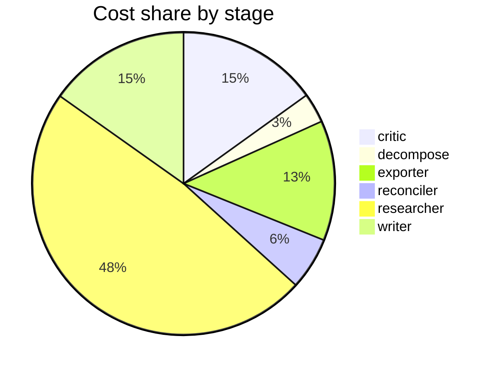

# Run metrics — Map the research landscape of multi-agent LLM systems. Produce a structured rep…

> **Prompt:** Map the research landscape of multi-agent LLM systems. Produce a structured report that includes a visual taxonomy or design graph showing the major architectural patterns, how they relate, and where the open problems are.
> **Started:** 2026-05-05T11:52:49.087477+00:00
> **Duration:** 446.3s
> **Final output:** [final_20260505T045249_7548cad8_map_the_research_landscape_of_multi_agen.md](./final_20260505T045249_7548cad8_map_the_research_landscape_of_multi_agen.md)

## Evaluation metrics

### Grounding

**Rate:** 100%  (22/22 claims grounded)

| claim | grounded | reason |
|---:|:---:|---|
| 0 | ✅ | The evidence explicitly lists all five patterns with descriptions matching the claim's characterizations. |
| 1 | ✅ | The evidence directly states all listed benefits and trade-offs, including single point of failure and concentrated coordination overhead. |
| 2 | ✅ | The evidence directly supports decentralized/swarm orchestration distributing responsibilities with no single controller, robustness, parallel execution, O(N²) pathways, and harder global optimization and conflict detection. |
| 3 | ✅ | The evidence directly supports all elements of the claim including layered delegation, the 5-10 agents per supervisor, and distributed coordination overhead. |
| 4 | ✅ | Evidence directly supports persistent direct peer connections, the listed strengths, and the combinatorial explosion risk. |
| 5 | ✅ | Evidence directly supports all aspects of the claim including elimination of centralized control, local decisions on shared state, and excelling at the listed exploration tasks. |
| 6 | ✅ | Evidence directly states the same benchmark scores for orchestration. |
| 7 | ✅ | Evidence directly states 114 studies on LLM-based multi-agent code generation systems with analysis of evaluation benchmarks. |
| 8 | ✅ | The evidence directly supports all the statistics stated in the claim. |
| 9 | ✅ | Evidence directly supports the claim's figures and explanation. |
| 10 | ✅ | The evidence directly states all key parts of the claim: SAS match/outperform MAS when reasoning tokens are held constant, and reported MAS advantages are better explained by unaccounted computation. |
| 11 | ✅ | Both quotes are present and accurately reflect the claim's framing of task-type dependence. |
| 12 | ✅ | Both figures and the discrepancy in attribution are directly supported by the evidence quotes. |
| 13 | ✅ | The evidence directly states the scaling pattern, the 45 interactions for 10 agents, and the risks of context loss/conflicting decisions, matching the claim. |
| 14 | ✅ | The evidence directly states agents used ~14 searches and ~1 browsing session out of 100, leaving 85% unused, and that doubling budget barely improved accuracy. |
| 15 | ✅ | Evidence explicitly describes the propagation mechanism and names the three vulnerability categories matching the claim. |
| 16 | ✅ | The evidence directly enumerates these four challenges as distinguishing multi-agent from single-agent systems. |
| 17 | ✅ | Evidence directly supports the CFV definition, the 14–98% range across models, and the cross-domain higher rates. |
| 18 | ✅ | The evidence directly states these techniques are pointwise and that multi-agent systems can produce collective unsafe outcomes through feedback amplification and emergent coordination. |
| 19 | ✅ | Evidence directly supports all key elements of the claim including self-replication, virus-like propagation, the listed harms, and susceptibility without direct communication. |
| 20 | ✅ | Evidence directly states MAST identifies 14 modes in 3 categories with κ = 0.88. |
| 21 | ✅ | Evidence directly supports the claim's substance, with only minor wording differences (divergence/adversarial vs convergence/misaligned) that align in meaning. |

### Calibration

**Total claims:** 22

| confidence range | n | grounded rate | mean stated confidence |
|---|---:|---:|---:|
| [0.00, 0.30) | 0 | — | — |
| [0.30, 0.60) | 4 | 100% | 0.52 |
| [0.60, 0.80) | 7 | 100% | 0.67 |
| [0.80, 1.01) | 11 | 100% | 0.92 |

### Coverage

**Rate:** 71%  (5 covered, 2 missed)

- **Covered:** `sq1`, `sq3`, `sq5`, `sq6`, `sq7`
- **Missed:** `sq2`, `sq4`

### LLM judge rubric

| dimension | score |
|---|---:|
| correctness | 2.50 / 5 |
| completeness | 2.50 / 5 |
| calibration | 3.50 / 5 |
| source quality | 2.00 / 5 |
| conflict handling | 4.00 / 5 |
| overall | 2.50 / 5 |

> Strongest aspect: explicit surfacing of contradictions (DeepMind vs Google Research figures, task-type dependence) and reasonable calibration with lower confidence on contested claims. Weakest aspects: several arXiv IDs appear fabricated or malformed (e.g., 2604.02460, 2601.10599, 2603.04474 — arXiv IDs from 2026 don't exist, and the format is suspicious), undermining source credibility; the prompt explicitly asked for a visual taxonomy/design graph which the summary does not appear to deliver; and the report admits it could not recover comparative evidence on frameworks (AutoGen, CrewAI, LangGraph, MetaGPT) or communication protocols, which are central to the landscape. Specific numerical claims (87.4% GPQA, 80.9% improvement, 17.2×/4.4× amplification, κ=0.88 for MAST) are presented with high confidence but cannot be readily verified and some appear conflated across sources.

## Final output audit

- **Format detected:** Structured narrative report in GitHub-flavored markdown with a Mermaid visual taxonomy/design graph, section headers, tables, and explicit open-problems callouts.
- **Notes:** Format inferred as a structured GitHub-flavored markdown report with Mermaid diagrams, per user request for a 'structured report' with a 'visual taxonomy or design graph.' Two significant content gaps (communication mechanisms and framework comparisons) were surfaced by the pipeline and are explicitly called out in the rendered report. The 'relate' condition is partially satisfied — comparative properties are shown but inter-pattern relational edges are thin due to pipeline coverage gaps.
- **Conditions:** 4 satisfied / 2 partial / 0 not satisfied / 0 n/a
- **Unmet:**
  - Map the research landscape of multi-agent LLM systems
  - Show how architectural patterns relate to each other

Operational details

### Cost & latency
- Total cost: **$0.9567**  |  input tokens: 473788  |  output tokens: 30380  |  elapsed: 446.3s  |  revision rounds: 1

### Per-stage
| stage | calls | input tokens | output tokens | cost (USD) | elapsed (s) |
|---|---:|---:|---:|---:|---:|
| critic | 3 | 36687 | 2283 | $0.1443 | 46.5 |
| decompose | 2 | 2379 | 1555 | $0.0305 | 19.6 |
| exporter | 1 | 9507 | 6286 | $0.1228 | 121.5 |
| reconciler | 2 | 11679 | 1237 | $0.0536 | 18.1 |
| researcher | 46 | 397575 | 12517 | $0.4602 | 115.5 |
| writer | 2 | 15961 | 6502 | $0.1454 | 125.1 |

### Tool mix
| tool | calls |
|---|---:|
| web_search | 27 |
| search_papers | 16 |
| fetch_url | 35 |
| save_finding | 24 |
| note_uncertainty | 0 |

### Run metadata
- commit: `e37fe10e36a885be4f5387a6e8923c290b89b6d0`  branch: `main`
- captured_at: 2026-05-05T11:45:22.793800+00:00
- models: critic=`claude-sonnet-4-6`, judge=`claude-opus-4-7`, researcher=`claude-haiku-4-5`, writer=`claude-sonnet-4-6`

