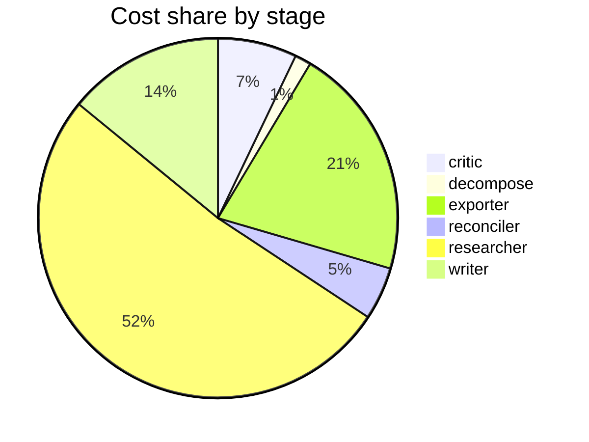

# Run metrics — What's the current consensus on long-context models vs. retrieval for long-docu…

> **Prompt:** What's the current consensus on long-context models vs. retrieval for long-document QA—are 1M+ token context windows making RAG obsolete, and under what conditions?
> **Started:** 2026-05-05T12:00:47.655936+00:00
> **Duration:** 421.2s
> **Final output:** [final_20260505T050047_d18e4dfd_what_s_the_current_consensus_on_long_con.md](./final_20260505T050047_d18e4dfd_what_s_the_current_consensus_on_long_con.md)

## Evaluation metrics

### Grounding

**Rate:** 100%  (23/23 claims grounded)

| claim | grounded | reason |
|---:|:---:|---|
| 0 | ✅ | Evidence directly states all 18 models including the named ones degrade with length and describes context rot as architectural. |
| 1 | ✅ | The evidence directly supports the claim's points about NIAH performance, drops with context length, and only half maintaining performance at 32K. |
| 2 | ✅ | Evidence directly states MRCR is computationally simple and the highest accuracy was 0.256. |
| 3 | ✅ | Evidence confirms GPT-4.1's 0.588 mean score and top performance on the listed tasks. |
| 4 | ✅ | Evidence supports both findings: Self-Route's 7.6%-13.1% LC advantage for strong models, and the 3.68% RAG advantage at 128K with LC winning for GPT-4o and Claude-3.5-Sonnet. |
| 5 | ✅ | The evidence directly states the percentages and the relationship between model strength and RAG effectiveness as claimed. |
| 6 | ✅ | Evidence directly supports both parts of the claim about RAG's advantage in hallucination identification and LC's strength in reasoning/comparison tasks. |
| 7 | ✅ | Evidence directly states the 1 second vs 30-60 seconds comparison and the interactive latency advantage. |
| 8 | ✅ | The evidence directly supports the 1,250x cost factor and the claim about long-context being economically nonviable for high-volume applications. |
| 9 | ✅ | Evidence directly supports the degradation thresholds for both models below advertised maximums. |
| 10 | ✅ | Evidence directly states RAG outperforms full-context stuffing below 20% relevance ratio and that irrelevant context is harmful. |
| 11 | ✅ | The evidence directly supports both parts of the claim about incremental indexing scaling and static corpora favoring long context. |
| 12 | ✅ | Evidence directly supports the claim's specific numbers and conditions. |
| 13 | ✅ | Evidence directly states all three models showed position bias with the specified directional differences. |
| 14 | ✅ | The evidence directly states the same accuracy drops and >20% worst-case degradation claim. |
| 15 | ✅ | The evidence explicitly provides the same numerical attention weights at the same context sizes and describes the dilution mechanism. |
| 16 | ✅ | The evidence directly describes attention sinks, softmax normalization forcing weights to sum to 1, and initial tokens as default receptacles, matching the claim. |
| 17 | ✅ | Evidence directly supports the 13.9%-85% accuracy loss with perfect retrieval and persistence when irrelevant tokens are masked. |
| 18 | ✅ | The evidence directly states the GPT 2.55% rate and Claude's lowest hallucination rate with abstention behavior. |
| 19 | ✅ | The evidence directly states the 30–60 point retrieval drop between 200K and 1M for all frontier models except Gemini 3 Deep Think and distinguishes capacity from effective retrieval quality. |
| 20 | ✅ | Evidence directly states quadratic growth and the specific 414K and 4.6 billion figures for 10- and 1,000-token prompts. |
| 21 | ✅ | The evidence directly supports the claim's cost reduction figures and comparable performance to long-context. |
| 22 | ✅ | The evidence explicitly states some studies find combining LC and RAG effective while others find it not beneficial, directly supporting the claim. |

### Calibration

**Total claims:** 23

| confidence range | n | grounded rate | mean stated confidence |
|---|---:|---:|---:|
| [0.00, 0.30) | 0 | — | — |
| [0.30, 0.60) | 3 | 100% | 0.58 |
| [0.60, 0.80) | 12 | 100% | 0.64 |
| [0.80, 1.01) | 8 | 100% | 0.91 |

### Coverage

**Rate:** 86%  (6 covered, 1 missed)

- **Covered:** `sq1`, `sq2`, `sq3`, `sq4`, `sq5`, `sq6`
- **Missed:** `sq7`

### LLM judge rubric

| dimension | score |
|---|---:|
| correctness | 4.00 / 5 |
| completeness | 4.50 / 5 |
| calibration | 4.00 / 5 |
| source quality | 3.00 / 5 |
| conflict handling | 4.50 / 5 |
| overall | 4.00 / 5 |

> Strong synthesis that correctly captures the consensus: long-context degradation is real, RAG retains cost/latency/update advantages, and outcomes depend on model strength and task. Conflict handling is a genuine strength—it explicitly surfaces the Self-Route vs. 2502.09977 disagreement and lost-in-the-middle magnitude differences. Weakest aspect is source quality: heavy reliance on vendor blogs (Redis, Dataiku, Morph, diffray, digitalapplied) and a future-dated blog (tianpan.co 2026-04-09), with only a few arXiv papers and one Stanford HELM source; some specific figures (1,250x cost ratio, 0.0001→0.000001 attention math, 'Gemini 3 Deep Think') are dubious or oversimplified. Calibration is mostly reasonable, though some 0.90–0.95 confidences on single-source benchmark numbers are slightly high.

## Final output audit

- **Format detected:** Narrative summary in markdown with section headers, covering empirical benchmarks, head-to-head comparisons, RAG conditions, failure modes, hybrid approaches, researcher disagreements, and evidence gaps.
- **Notes:** Format inferred as a structured narrative markdown summary with section headers, a decision-flow mermaid diagram, and a comparison table, since the user asked an analytical question with multiple sub-dimensions but did not specify a format. Four conditions are partial rather than fully satisfied due to absent findings on LongBench, advanced RAG variants, privacy considerations, and the evidence-gaps sub-question where the search budget was exhausted in the pipeline.
- **Conditions:** 7 satisfied / 4 partial / 0 not satisfied / 0 n/a
- **Unmet:**
  - Cover empirical benchmark evidence (RULER, NIAH, LongBench, HELMET) on current 1M+ token models
  - Cover head-to-head RAG vs. long-context comparisons including advanced RAG variants (HyDE, re-ranking, iterative retrieval)
  - Cover documented conditions under which RAG retains advantages (corpus size, query type, latency, cost, privacy, up-to-date information)
  - Cover methodological gaps and missing evidence in the literature

Operational details

### Cost & latency
- Total cost: **$0.9613**  |  input tokens: 503121  |  output tokens: 29646  |  elapsed: 421.2s  |  revision rounds: 1

### Per-stage
| stage | calls | input tokens | output tokens | cost (USD) | elapsed (s) |
|---|---:|---:|---:|---:|---:|
| critic | 2 | 19700 | 619 | $0.0684 | 14.0 |
| decompose | 1 | 744 | 791 | $0.0141 | 15.2 |
| exporter | 2 | 21149 | 9197 | $0.2014 | 161.1 |
| reconciler | 2 | 10368 | 971 | $0.0457 | 13.4 |
| researcher | 48 | 437381 | 11795 | $0.4964 | 99.0 |
| writer | 2 | 13779 | 6273 | $0.1354 | 118.4 |

### Tool mix
| tool | calls |
|---|---:|
| web_search | 33 |
| search_papers | 13 |
| fetch_url | 31 |
| save_finding | 24 |
| note_uncertainty | 0 |

### Run metadata
- commit: `e37fe10e36a885be4f5387a6e8923c290b89b6d0`  branch: `main`
- captured_at: 2026-05-05T11:53:46.459205+00:00
- models: critic=`claude-sonnet-4-6`, judge=`claude-opus-4-7`, researcher=`claude-haiku-4-5`, writer=`claude-sonnet-4-6`

