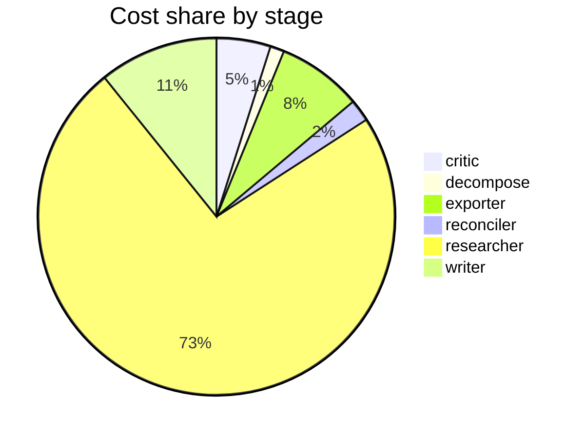

# Run metrics — Compare reported costs and latencies for production agentic-RAG built on LangGr…

> **Prompt:** Compare reported costs and latencies for production agentic-RAG built on LangGraph, CrewAI, and AutoGen. Where do public numbers disagree, and what's driving the gap—different model sizes, prompt lengths, batch settings, or actual framework overhead?
> **Started:** 2026-05-05T12:06:53.402008+00:00
> **Duration:** 308.6s
> **Final output:** [final_20260505T050653_11f11cb6_compare_reported_costs_and_latencies_for.md](./final_20260505T050653_11f11cb6_compare_reported_costs_and_latencies_for.md)

## Evaluation metrics

### Grounding

**Rate:** 92%  (11/12 claims grounded)

| claim | grounded | reason |
|---:|:---:|---|
| 0 | ✅ | The evidence directly supports the claim's latency comparison and breakdown numbers. |
| 1 | ✅ | Evidence shows CrewAI at 246s and LangGraph at 506s, supporting CrewAI being more than twice as fast. |
| 2 | ✅ | Both benchmarks are quoted: one says LangGraph is more than twice as fast as CrewAI, the other reports CrewAI at 246s vs LangGraph at 506s, showing the disagreement. |
| 3 | ✅ | Both benchmark numbers cited match the evidence exactly, and the magnitude comparisons (572/8.41 ≈ 68x, 10793/1381 ≈ 7.8x) are accurately characterized. |
| 4 | ✅ | Evidence confirms CrewAI 27,684 tokens, LangGraph 8,823, MS Agent 7,006, matching the ratios stated. |
| 5 | ❌ | 17,058 is about 38% fewer than 27,684, not 60% fewer, so the quantitative comparison in the claim is incorrect. |
| 6 | ✅ | The evidence directly states both points about CrewAI's token overhead from LLM-based coordination and LangGraph's pure Python routing with zero token cost. |
| 7 | ✅ | Evidence directly supports AutoGen's conversation programming paradigm and contrasts it with LangGraph's graph-based workflow model. |
| 8 | ✅ | The evidence directly states CrewAI was excluded due to a 44% failure rate while all other frameworks achieved 100% success under stress conditions. |
| 9 | ✅ | Evidence shows one benchmark excluded CrewAI for 44% failure rate while another reports CrewAI's 246s latency and 27,684 tokens, supporting the contradiction claim. |
| 10 | ✅ | Evidence directly states the same latency, P95, and throughput figures for LangGraph (Python) under stress conditions. |
| 11 | ✅ | The evidence directly states the benchmark setup, the percentages for each framework, and attributes LangGraph's advantage to its graph state machine handling failed nodes gracefully. |

### Calibration

**Total claims:** 12

| confidence range | n | grounded rate | mean stated confidence |
|---|---:|---:|---:|
| [0.00, 0.30) | 0 | — | — |
| [0.30, 0.60) | 7 | 86% | 0.50 |
| [0.60, 0.80) | 4 | 100% | 0.69 |
| [0.80, 1.01) | 1 | 100% | 0.80 |

### Coverage

**Rate:** 50%  (3 covered, 3 missed)

- **Covered:** `sq1`, `sq2`, `sq4`
- **Missed:** `sq3`, `sq5`, `sq6`

### LLM judge rubric

| dimension | score |
|---|---:|
| correctness | 3.00 / 5 |
| completeness | 3.00 / 5 |
| calibration | 4.00 / 5 |
| source quality | 2.00 / 5 |
| conflict handling | 4.50 / 5 |
| overall | 3.00 / 5 |

> Strongest aspect: Excellent surfacing of contradictions across sources, with explicit acknowledgment that no peer-reviewed or vendor-neutral benchmarks exist and that evidence consists of blogs and vendor case studies—appropriate epistemic humility reflected in mostly modest confidence scores. Weakest aspects: Source quality is poor (all blog posts/vendor sources, including a suspicious 'n1n.ai' publication with future-dated 2026 URLs that should raise authenticity concerns not flagged in the report), and the report does not adequately diagnose the actual drivers of the gap (model choice, prompt length, task definition) beyond noting they differ—it lists discrepancies more than it explains them. Completeness is limited: cost in dollars is barely addressed, and production-deployment factors (caching, concurrency, retrieval latency) are not separated from framework overhead.

## Final output audit

- **Format detected:** Narrative summary with comparison tables and structured sections in GitHub-flavored markdown, inferred from the analytical nature of the prompt asking to 'compare' and identify 'where numbers disagree' and 'what's driving the gap.'
- **Notes:** Format inferred as structured narrative markdown with comparison tables, a contradiction enumeration section, a drivers section, an architecture diagram, and an evidence-quality summary — appropriate for an analytical comparison question. All 'partial' conditions reflect genuine evidence gaps documented in the report's caveats, not rendering failures; dollar cost-per-query data and controlled variable isolation simply do not exist in the public literature found.
- **Conditions:** 1 satisfied / 6 partial / 0 not satisfied / 0 n/a
- **Unmet:**
  - Compare reported costs and latencies for production agentic-RAG built on LangGraph, CrewAI, and AutoGen
  - Explain what's driving the gap—different model sizes, prompt lengths, batch settings, or actual framework overhead
  - Include framework overhead as a driver
  - Cover model size/tier as a driver
  - Cover prompt lengths as a driver
  - Cover batch settings as a driver

Operational details

### Cost & latency
- Total cost: **$1.0489**  |  input tokens: 756058  |  output tokens: 21281  |  elapsed: 308.6s  |  revision rounds: 1

### Per-stage
| stage | calls | input tokens | output tokens | cost (USD) | elapsed (s) |
|---|---:|---:|---:|---:|---:|
| critic | 2 | 12649 | 894 | $0.0514 | 18.1 |
| decompose | 1 | 762 | 731 | $0.0133 | 15.7 |
| exporter | 1 | 6748 | 4036 | $0.0808 | 76.1 |
| reconciler | 1 | 2405 | 919 | $0.0210 | 16.6 |
| researcher | 52 | 723027 | 9239 | $0.7692 | 107.6 |
| writer | 2 | 10467 | 5462 | $0.1133 | 74.5 |

### Tool mix
| tool | calls |
|---|---:|
| web_search | 43 |
| search_papers | 8 |
| fetch_url | 32 |
| save_finding | 9 |
| note_uncertainty | 0 |

### Run metadata
- commit: `e37fe10e36a885be4f5387a6e8923c290b89b6d0`  branch: `main`
- captured_at: 2026-05-05T12:01:44.793926+00:00
- models: critic=`claude-sonnet-4-6`, judge=`claude-opus-4-7`, researcher=`claude-haiku-4-5`, writer=`claude-sonnet-4-6`

