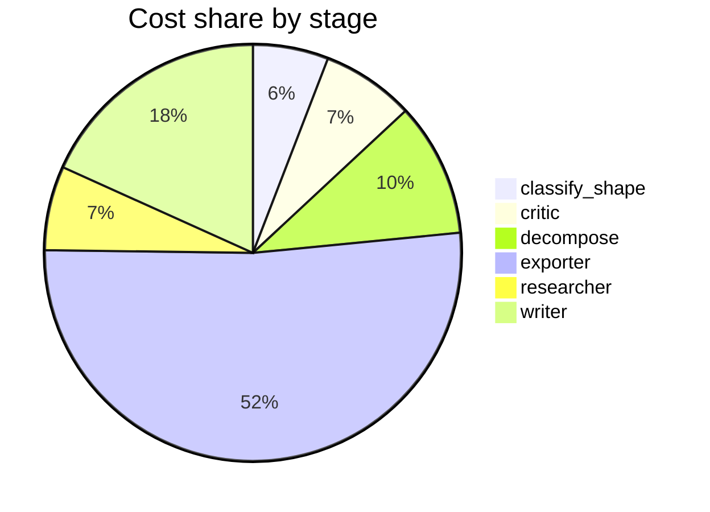

# Run metrics — p

> **Prompt:** p
> **Started:** 2026-05-05T12:32:40.340869+00:00
> **Duration:** 37.6s
> **Final output:** [final_20260505T053240_4afb1f34_p.md](./final_20260505T053240_4afb1f34_p.md)

## Tier 1 — Headline evaluation metrics

### Grounding

**Rate:** 0%  (0/0 claims grounded)

### Fabrication rate

**Rate:** 0%  (0/0 approved claims cite a fabricated finding)

- Drift rate: 0%  (0/0 approved claims cite a drifted finding)
- Verifier source: native verify_history

### Contradictions surfaced

**N surfaced:** 0

### Honesty signals

- Uncertainty notes: **0**  |  caveats: **3**
- Sub-questions with ≥1 uncertainty note: **0%**
- Caveats reference uncertainty: **no**

### Source quality

- Cited findings: **0** of 0 harvested  |  mean quality: **0.00** (cited) vs. 0.00 (all)
- Cited quality — median: 0.00, min: 0.00

| tier | cited | all |
|---|---:|---:|
| gov_edu | 0 | 0 |
| peer_reviewed | 0 | 0 |
| news | 0 | 0 |
| curated_tertiary | 0 | 0 |
| unknown | 0 | 0 |
| blog_qa | 0 | 0 |

### Calibration

**Total claims:** 0

| confidence range | n | grounded rate | mean stated confidence |
|---|---:|---:|---:|
| [0.00, 0.30) | 0 | — | — |
| [0.30, 0.60) | 0 | — | — |
| [0.60, 0.80) | 0 | — | — |
| [0.80, 1.01) | 0 | — | — |

### Coverage

**Rate:** 0%  (0 covered, 1 missed)

- **Missed:** `sq1`

### LLM judge rubric

| dimension | score |
|---|---:|
| correctness | 4.00 / 5 |
| completeness | 3.00 / 5 |
| calibration | 4.00 / 5 |
| source quality | 0.00 / 5 |
| conflict handling | 3.00 / 5 |
| overall | 3.00 / 5 |

> The report correctly identifies that the prompt 'p' is too ambiguous to research, which is a reasonable response. However, a stronger report would have enumerated possible interpretations (p-value, momentum, pressure, programming language, etc.) and asked for clarification. No sources were used, which is appropriate given no claims were made but limits utility.

## Tier 2 — Experimental rigor / depth of understanding

### Researcher signals

- Sub-questions: **1** total, **1** without findings
- Researchers with findings: **0**  |  with uncertainty: **0**  |  with both: **0**
- Findings: 0 total  |  uncertainty notes: 0
- Per active researcher: mean **0.0** findings, max **0**

### Citation density

- Load-bearing fraction: **0%**  (0 cited / 0 harvested)
- Per-claim citations: avg **0.00**  |  median **0.00**  |  uncited claims: 0
- Source concentration (Herfindahl): **0.000**  |  max single-source share: **0%**
- Distinct domains per claim (mean): **0.00**

## Final output audit

- **Format detected:** Markdown narrative (default, as the prompt 'p' specifies no format)
- **Notes:** Format inferred as default markdown narrative (prompt 'p' specifies no format and no content requirements). The pipeline returned zero findings, so the entire report is a transparency document explaining why no substantive answer can be given. All pipeline-mandated honesty elements are preserved by rendering their absence explicitly.
- **Conditions:** 7 satisfied / 1 partial / 0 not satisfied / 0 n/a
- **Unmet:**
  - Respond to the user's prompt 'p' — only a partial/meta-response is possible given the ambiguous single-character input

Tier 3 — Operational details

### Cost & latency
- Total cost: **$0.0596**  |  input tokens: 12136  |  output tokens: 2064  |  elapsed: 37.6s  |  revision rounds: 0
- Researcher latency: max 3.3s, avg 3.3s

### Per-stage
| stage | calls | input tokens | output tokens | cost (USD) | elapsed (s) |
|---|---:|---:|---:|---:|---:|
| classify_shape | 1 | 951 | 41 | $0.0035 | 2.2 |
| confidence | 0 | 0 | 0 | $0.0000 | 0.0 |
| critic | 1 | 1341 | 17 | $0.0043 | 1.2 |
| decompose | 1 | 1561 | 100 | $0.0062 | 2.4 |
| exporter | 1 | 3399 | 1378 | $0.0309 | 21.5 |
| reconciler | 0 | 0 | 0 | $0.0000 | 0.0 |
| researcher | 1 | 2479 | 282 | $0.0039 | 3.3 |
| writer | 1 | 2405 | 246 | $0.0109 | 7.0 |

### Tool mix
| tool | calls |
|---|---:|
| web_search | 0 |
| search_papers | 0 |
| fetch_url | 0 |
| save_finding | 0 |
| note_uncertainty | 0 |

### Run metadata
- commit: `89c7622c5b638edfc71db2b2eff07a7d1498e261`  branch: `main`
- captured_at: 2026-05-05T12:32:02.746548+00:00
- models: critic=`claude-sonnet-4-6`, judge=`claude-opus-4-7`, kae_judge=`claude-haiku-4-5`, researcher=`claude-haiku-4-5`, writer=`claude-sonnet-4-6`

