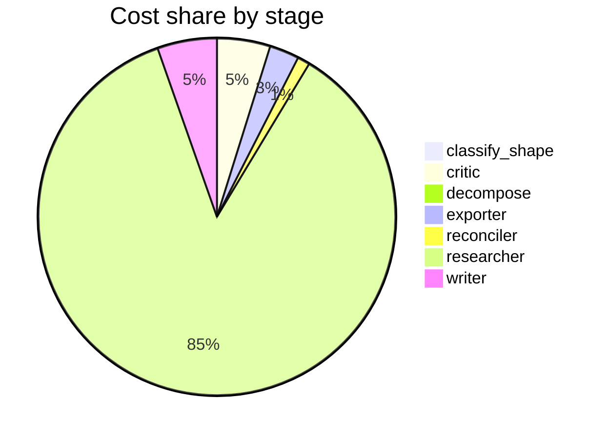

# Run metrics — What are the tradeoffs of vector vs. graph RAG?

> **Prompt:** What are the tradeoffs of vector vs. graph RAG?
> **Started:** 2026-05-05T17:15:27.024219+00:00
> **Duration:** 456.3s
> **Final output:** [final_20260505T101527_a78a9454_what_are_the_tradeoffs_of_vector_vs_grap.md](./final_20260505T101527_a78a9454_what_are_the_tradeoffs_of_vector_vs_grap.md)

## Tier 1 — Headline evaluation metrics

### Grounding

**Rate:** 100%  (18/18 claims grounded)

| claim | grounded | reason |
|---:|:---:|---|
| 0 | ✅ | Evidence explicitly describes Vector RAG using dense embeddings with cosine similarity nearest-neighbor search and Graph RAG using typed entity graph traversal from anchor entities to surface context embeddings would miss. |
| 1 | ✅ | Evidence confirms Graph RAG involves LLM entity/relationship extraction, Leiden community detection, and hierarchical summaries, while vector RAG involves embedding and storage. |
| 2 | ✅ | Evidence describes Graph RAG extracting query entities, building Cypher queries to traverse the knowledge graph, and explicitly contrasts traversal-based retrieval with vector similarity that would not surface such connections. |
| 3 | ✅ | The evidence directly states RAG/GraphRAG complementary behaviors matching the claim's wording about single-hop vs multi-hop performance. |
| 4 | ✅ | The evidence directly states the same trade-off described in the claim. |
| 5 | ✅ | The evidence directly states both improvements and that GraphRAG variants outperform traditional RAG. |
| 6 | ✅ | Both numerical figures and the corrected-gains quote appear directly in the evidence. |
| 7 | ✅ | The evidence directly states knowledge graphs require complex setup, maintenance, data modeling, ontology design, and specialized expertise. |
| 8 | ✅ | Evidence directly supports the 3 TB HNSW cluster scaled down to a single 96 GB machine using DiskANN. |
| 9 | ✅ | The evidence directly states the 10M vector dataset compression from ~38 GB to ~3.5 GB with minimal accuracy loss using IVF and PQ. |
| 10 | ✅ | Evidence directly states vector RAG uses incremental updates while GraphRAG requires batch re-indexing and is less suited to dynamic data. |
| 11 | ✅ | The evidence explicitly describes the metadata governance layer including entity lifecycle management, lineage tracking, and quality monitoring to prevent a stale snapshot. |
| 12 | ✅ | Evidence shows industry sources claiming graph paths are inherently transparent/traceable, while the KG-SMILE source treats RAG as a black box requiring external tooling for explainability. |
| 13 | ✅ | Evidence directly supports that vector RAG has lower explainability due to non-human-readable embeddings, though the 'contested' qualifier is not explicitly evidenced but is a mild hedge. |
| 14 | ✅ | Evidence directly supports the 50% to 80% improvement, the industry sector figures (~91% vs ~47%), and the hybrid approach outperforming alone. |
| 15 | ✅ | Evidence directly states GraphRAG is evaluated under heterogeneous protocols varying in graph construction, retrieval configurations, and evaluation criteria, making cross-study comparisons unclear. |
| 16 | ✅ | The evidence directly states LLM-as-a-Judge for summarization is sensitive to presentation order with position effects confounding comparisons, matching the claim. |
| 17 | ✅ | The evidence directly states the same claim almost verbatim. |

### Fabrication rate

**Rate:** 0%  (0/18 approved claims cite a fabricated finding)

- Drift rate: 100%  (18/18 approved claims cite a drifted finding)
- Verifier source: native verify_history

### Contradictions surfaced

**N surfaced:** 3

- By severity: minor=0, moderate=2, major=1
- By type: factual=1, methodological=1, framing=1, temporal=0, other=0

### Honesty signals

- Uncertainty notes: **2**  |  caveats: **8**
- Sub-questions with ≥1 uncertainty note: **29%**
- Caveats reference uncertainty: **no**

### Source quality

- Cited findings: **24** of 24 harvested  |  mean quality: **0.82** (cited) vs. 0.82 (all)
- Cited quality — median: 0.70, min: 0.70

| tier | cited | all |
|---|---:|---:|
| gov_edu | 0 | 0 |
| peer_reviewed | 10 | 10 |
| news | 0 | 0 |
| curated_tertiary | 0 | 0 |
| unknown | 14 | 14 |
| blog_qa | 0 | 0 |

### Calibration

**Total claims:** 18

| confidence range | n | grounded rate | mean stated confidence |
|---|---:|---:|---:|
| [0.00, 0.30) | 0 | — | — |
| [0.30, 0.60) | 2 | 100% | 0.56 |
| [0.60, 0.80) | 1 | 100% | 0.72 |
| [0.80, 1.01) | 15 | 100% | 0.88 |

### Coverage

**Rate:** 100%  (7 covered, 0 missed)

- **Covered:** `sq1`, `sq2`, `sq3`, `sq4`, `sq5`, `sq6`, `sq7`

### LLM judge rubric

| dimension | score |
|---|---:|
| correctness | 4.50 / 5 |
| completeness | 4.50 / 5 |
| calibration | 4.00 / 5 |
| source quality | 4.00 / 5 |
| conflict handling | 5.00 / 5 |
| overall | 4.30 / 5 |

> Strongest aspect: excellent surfacing of methodological contradictions, especially the evaluation-bias critique of GraphRAG benchmarks and the explainability framing conflict. Sources are reasonably diverse mixing arXiv papers, vendor blogs, and technical references, though several key claims rely on industry/vendor sources (Lettria, Neo4j, AWS) that have commercial interests. Weakest aspect: some confidence scores seem slightly miscalibrated (e.g., 0.91 on multi-hop being impossible for vector RAG is overstated since hybrid/iterative vector approaches can do multi-hop), and specific numeric claims (3 TB RAM, 38GB→3.5GB) are presented with high confidence despite being single-source anecdotes.

## Tier 2 — Experimental rigor / depth of understanding

### Researcher signals

- Sub-questions: **7** total, **0** without findings
- Researchers with findings: **7**  |  with uncertainty: **2**  |  with both: **2**
- Findings: 24 total  |  uncertainty notes: 2
- Per active researcher: mean **3.4** findings, max **5**

### Citation density

- Load-bearing fraction: **100%**  (24 cited / 24 harvested)
- Per-claim citations: avg **1.78**  |  median **2.00**  |  uncited claims: 0
- Source concentration (Herfindahl): **0.184**  |  max single-source share: **38%**
- Distinct domains per claim (mean): **1.67**

## Final output audit

- **Format detected:** Narrative summary in markdown with structured sections, as the prompt does not specify a format and asks an open-ended tradeoff question.
- **Notes:** Inferred format as a structured markdown narrative with tables and section headers, as the user asked an open-ended tradeoff question with no explicit format specified. Synthesized a summary table at the end and per-dimension tables to make tradeoffs scannable. All claims drawn from the structured report; no new claims invented.
- **Conditions:** 8 satisfied / 1 partial / 0 not satisfied / 0 n/a
- **Unmet:**
  - Cover indexing, storage, and computational costs (partial — absolute indexing time/latency at scale for graph vs. vector is uncharacterized)

Tier 3 — Operational details

### Cost & latency
- Total cost: **$2.7362**  |  input tokens: 773848  |  output tokens: 27642  |  elapsed: 456.3s  |  revision rounds: 1
- Researcher latency: max 74.8s, avg 54.7s

### Per-stage
| stage | calls | input tokens | output tokens | cost (USD) | elapsed (s) |
|---|---:|---:|---:|---:|---:|
| classify_shape | 1 | 804 | 61 | $0.0033 | 2.5 |
| confidence | 0 | 0 | 0 | $0.0000 | 0.0 |
| critic | 3 | 39025 | 927 | $0.1310 | 18.9 |
| decompose | 1 | 987 | 813 | $0.0152 | 13.3 |
| exporter | 1 | 7480 | 3372 | $0.0730 | 67.2 |
| reconciler | 1 | 5705 | 905 | $0.0307 | 18.7 |
| researcher | 66 | 702918 | 15189 | $2.3366 | 215.5 |
| verifier | 0 | 0 | 0 | $0.0000 | 5.7 |
| writer | 2 | 16929 | 6375 | $0.1464 | 114.5 |

### Tool mix
| tool | calls |
|---|---:|
| web_search | 24 |
| search_papers | 15 |
| fetch_url | 43 |
| save_finding | 24 |
| note_uncertainty | 1 |

### Run metadata
- commit: `e7b9f8607df8bdbe54010b88413a8166ed9a0228`  branch: `main`
- captured_at: 2026-05-05T17:07:50.798116+00:00
- models: critic=`claude-sonnet-4-6`, judge=`claude-opus-4-7`, kae_judge=`claude-haiku-4-5`, researcher=`claude-sonnet-4-6`, writer=`claude-sonnet-4-6`

