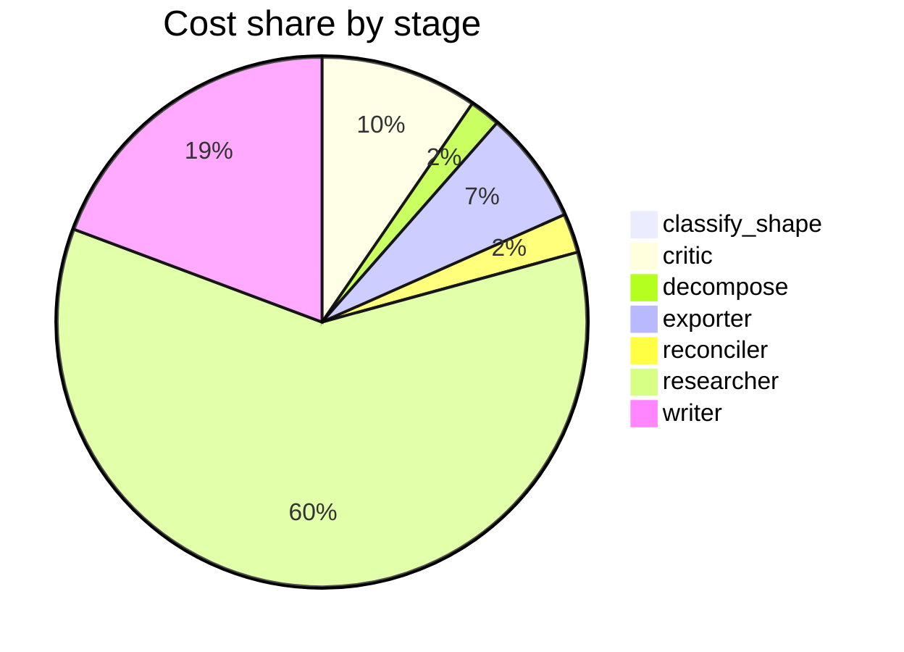

# Run metrics — What are the real-world risks and benefits of using synthetic data to train or …

> **Prompt:** What are the real-world risks and benefits of using synthetic data to train or fine-tune large language models? Focus on data quality, bias, and evaluation.
> **Started:** 2026-05-05T13:16:47.968326+00:00
> **Duration:** 354.2s
> **Final output:** [final_20260505T061647_d3b55d04_what_are_the_real_world_risks_and_benefi__off.md](./final_20260505T061647_d3b55d04_what_are_the_real_world_risks_and_benefi__off.md)

## Tier 1 — Headline evaluation metrics

### Grounding

**Rate:** 100%  (15/15 claims grounded)

| claim | grounded | reason |
|---:|:---:|---|
| 0 | ✅ | The evidence explicitly lists all seven categories named in the claim. |
| 1 | ✅ | The evidence directly states both points about variability in quality/diversity and the challenge of mimicking real-world complexity without propagating biases. |
| 2 | ✅ | Evidence directly states the hybrid model combining real and synthetic data outperformed others in vertical applications, achieving highest scores across all metrics. |
| 3 | ✅ | The evidence directly supports that synthetic data enables privacy-preserving model development in healthcare without exposing real patient records. |
| 4 | ✅ | Evidence confirms LLMs improved efficiency over manual creation, the 8-hour manual benchmark, technical challenges, and lacks precise quantification of time savings. |
| 5 | ✅ | The evidence directly states synthetic data accelerates timelines, enabling dataset/benchmark creation in hours rather than months. |
| 6 | ✅ | Evidence explicitly states LLMs act as data multipliers generating thousands of examples from few-shot or zero-shot prompts in low-resource languages and specialized domains. |
| 7 | ✅ | Evidence explicitly states synthetic data covers rare edge cases and tailored scenarios underrepresented in real datasets, supporting robust domain-specific models. |
| 8 | ✅ | Evidence directly describes model collapse with tails disappearing and convergence to low-variance point estimate, supported by theoretical analyses and some empirical patterns. |
| 9 | ✅ | Both evidence quotes directly support the contrasting claims attributed to each source. |
| 10 | ✅ | The evidence explicitly describes contradictory findings between studies emphasizing quality versus diversity as predictors of model performance. |
| 11 | ✅ | Evidence directly states the same claim about larger generators not yielding superior synthetic data than 8B models. |
| 12 | ✅ | The evidence directly states that good ratios vary with data type, model scale, and budget, and converge to 0% for rephrased synthetic data, matching the claim. |
| 13 | ✅ | The evidence directly states synthetic data decreases adversarial robustness while preserving output quality, whereas human data decreases both, matching the claim. |
| 14 | ✅ | The evidence directly states higher source diversity can mitigate distribution collapse, matching the claim. |

### Fabrication rate

**Rate:** 0%  (0/11 approved claims cite a fabricated finding)

- Drift rate: 9%  (1/11 approved claims cite a drifted finding)
- Verifier source: native verify_history

### Contradictions surfaced

**N surfaced:** 3

- By severity: minor=0, moderate=2, major=1
- By type: factual=2, methodological=0, framing=1, temporal=0, other=0

### Honesty signals

- Uncertainty notes: **4**  |  caveats: **10**
- Sub-questions with ≥1 uncertainty note: **57%**
- Caveats reference uncertainty: **no**

### Source quality

- Cited findings: **15** of 15 harvested  |  mean quality: **0.90** (cited) vs. 0.90 (all)
- Cited quality — median: 1.00, min: 0.70

| tier | cited | all |
|---|---:|---:|
| gov_edu | 1 | 1 |
| peer_reviewed | 9 | 9 |
| news | 0 | 0 |
| curated_tertiary | 0 | 0 |
| unknown | 5 | 5 |
| blog_qa | 0 | 0 |

### Calibration

**Total claims:** 15

| confidence range | n | grounded rate | mean stated confidence |
|---|---:|---:|---:|
| [0.00, 0.30) | 0 | — | — |
| [0.30, 0.60) | 1 | 100% | 0.55 |
| [0.60, 0.80) | 5 | 100% | 0.71 |
| [0.80, 1.01) | 9 | 100% | 0.88 |

### Coverage

**Rate:** 43%  (3 covered, 4 missed)

- **Covered:** `sq1`, `sq6`, `sq7`
- **Missed:** `sq2`, `sq3`, `sq4`, `sq5`

### LLM judge rubric

| dimension | score |
|---|---:|
| correctness | 4.00 / 5 |
| completeness | 3.50 / 5 |
| calibration | 4.50 / 5 |
| source quality | 3.50 / 5 |
| conflict handling | 4.50 / 5 |
| overall | 4.00 / 5 |

> Strongest aspect is calibration and conflict handling: confidence scores are appropriately graduated, unverified sources are flagged, and three substantive contradictions are surfaced explicitly rather than smoothed. Weakest aspects are source diversity (heavily reliant on arXiv preprints plus one blog and one vendor post, with limited peer-reviewed coverage beyond the Nature model collapse paper) and completeness on evaluation methodology and bias mechanisms—the report acknowledges these as gaps but provides little substantive content on them despite the prompt's explicit focus. Factual claims appear largely accurate, though some (e.g., the 8B generator finding, 8-hour manual test case baseline) rest on single sources without triangulation.

## Tier 2 — Experimental rigor / depth of understanding

### Researcher signals

- Sub-questions: **7** total, **4** without findings
- Researchers with findings: **3**  |  with uncertainty: **4**  |  with both: **0**
- Findings: 15 total  |  uncertainty notes: 4
- Per active researcher: mean **5.0** findings, max **7**

### Citation density

- Load-bearing fraction: **100%**  (15 cited / 15 harvested)
- Per-claim citations: avg **1.27**  |  median **1.00**  |  uncited claims: 0
- Source concentration (Herfindahl): **0.330**  |  max single-source share: **53%**
- Distinct domains per claim (mean): **1.27**

### Plan judge

- Surface coverage: **1.00**  |  intent alignment: **1.00**

> The decomposition covers all three areas the prompt explicitly asks about: data quality (sq1, sq2), bias (sq3), and evaluation (sq5), while also addressing risks (sq3, sq4) and benefits (sq6) as the prompt frames. sq7 on gaps/contradictions is a reasonable meta-question that supports the risk-benefit analysis. Every sub-question stays tightly tied to synthetic data for LLM training/fine-tuning, with no drift to adjacent topics.

### ACE — Adaptive Checklist Evaluation

**Overall:** 0.47 / 1.00

| item | met | score | reason |
|---|:---:|---:|---|
| Identifies concrete benefits of synthetic data for LLM training/fine-tuning, such as scalability, cost reduction, privacy preservation, coverage of rare/edge cases, alignment data generation, or domain specialization | ✅ | 0.90 | Report explicitly covers privacy preservation, edge case coverage, low-resource domains, dataset development speed, and domain specialization with concrete examples. |
| Discusses specific data quality risks including model collapse, distribution narrowing, error propagation/amplification, hallucinated facts, and loss of diversity (e.g., references work like Shumailov et al. on model collapse) | ✅ | 0.70 | Covers model collapse with Nature reference and discusses distribution narrowing/tail loss, but doesn't explicitly address hallucinated facts or error amplification in depth. |
| Addresses bias-related risks, including amplification of biases from generator models, demographic underrepresentation, stereotype reinforcement, and how synthetic data can either mitigate or worsen existing biases | ❌ | 0.15 | The report only briefly mentions biases in passing and explicitly notes no empirical findings were obtained on bias mechanisms, failing to substantively address amplification, demographic underrepresentation, or stereotypes. |
| Covers evaluation challenges specific to synthetic data, such as benchmark contamination, train-test leakage, overfitting to evaluator-model preferences, and the difficulty of detecting synthetic-data-induced degradation | ❌ | 0.20 | The report mentions that adversarial robustness degradation may go undetected by standard quality metrics and notes a gap in evaluation methodology, but does not address benchmark contamination, train-test leakage, or evaluator-model preference overfitting. |
| Discusses concrete mitigation strategies | ❌ | 0.20 | Only mentions hybrid mixing of real+synthetic data and briefly diversity; lacks discussion of filtering, deduplication, rejection sampling, verifiers, or constitutional methods. |
| References specific real-world examples, systems, or studies where synthetic data was used (e.g., Phi models, Alpaca/self-instruct, Llama post-training, distillation pipelines, RLAIF) rather than only abstract claims | ❌ | 0.20 | The report mentions vague domain examples (mental health counseling, healthcare testing) and cites a couple of authors (Havrilla et al., Chen et al.) but does not reference well-known synthetic data systems like Phi, Alpaca, self-instruct, Llama post-training, or RLAIF. |
| Distinguishes between different synthetic data use cases (pretraining vs. instruction tuning vs. RLHF/preference data) and how risks/benefits differ across them | ❌ | 0.30 | The report mentions pre-training and fine-tuning contexts separately in a few findings but does not systematically distinguish risks/benefits across pretraining, instruction tuning, and RLHF/preference data. |
| Addresses tradeoffs or tensions explicitly (e.g., quality vs. scale, diversity vs. accuracy) rather than presenting risks and benefits as a simple list | ✅ | 0.80 | The report explicitly discusses tensions like quality vs. diversity, adversarial robustness vs. output quality, and contradictions in the literature, going beyond a simple list. |
| Provides balanced treatment giving meaningful coverage to both risks and benefits rather than heavily skewing to one side | ✅ | 0.80 | The report covers both benefits (privacy, cost, edge cases, hybrid performance) and risks (model collapse, robustness, distributional drift) with roughly comparable depth. |

> 4/9 criteria fully met

## Final output audit

- **Format detected:** Narrative summary in markdown with structured sections, covering data quality, bias, evaluation, benefits, and risks as requested by the prompt.
- **Notes:** Format inferred as structured narrative markdown summary (prompt did not specify a format). The two partially unmet conditions reflect genuine evidence gaps in the research pipeline (sq3 and sq5 returned no confirmed findings), not omissions in rendering; both gaps are explicitly surfaced in the output.
- **Conditions:** 5 satisfied / 2 partial / 0 not satisfied / 0 n/a
- **Unmet:**
  - Focus on bias
  - Focus on evaluation

Tier 3 — Operational details

### Cost & latency
- Total cost: **$0.9445**  |  input tokens: 568883  |  output tokens: 24365  |  elapsed: 354.2s  |  revision rounds: 2
- Researcher latency: max 54.4s, avg 28.3s

### Per-stage
| stage | calls | input tokens | output tokens | cost (USD) | elapsed (s) |
|---|---:|---:|---:|---:|---:|
| classify_shape | 1 | 983 | 71 | $0.0040 | 2.9 |
| confidence | 0 | 0 | 0 | $0.0000 | 0.0 |
| critic | 3 | 21594 | 1695 | $0.0902 | 33.9 |
| decompose | 1 | 1486 | 880 | $0.0177 | 14.8 |
| exporter | 1 | 6638 | 2992 | $0.0648 | 54.1 |
| reconciler | 1 | 3834 | 732 | $0.0225 | 10.7 |
| researcher | 56 | 513414 | 10077 | $0.5638 | 114.5 |
| verifier | 0 | 0 | 0 | $0.0000 | 5.0 |
| writer | 3 | 20934 | 7918 | $0.1816 | 118.3 |

### Tool mix
| tool | calls |
|---|---:|
| web_search | 22 |
| search_papers | 15 |
| fetch_url | 40 |
| save_finding | 15 |
| note_uncertainty | 0 |

### Run metadata
- commit: `b13f2f283bfdd5669aa01500f9fa8a9058d83b84`  branch: `main`
- captured_at: 2026-05-05T13:10:53.771764+00:00
- models: critic=`claude-sonnet-4-6`, judge=`claude-opus-4-7`, kae_judge=`claude-haiku-4-5`, researcher=`claude-haiku-4-5`, writer=`claude-sonnet-4-6`

