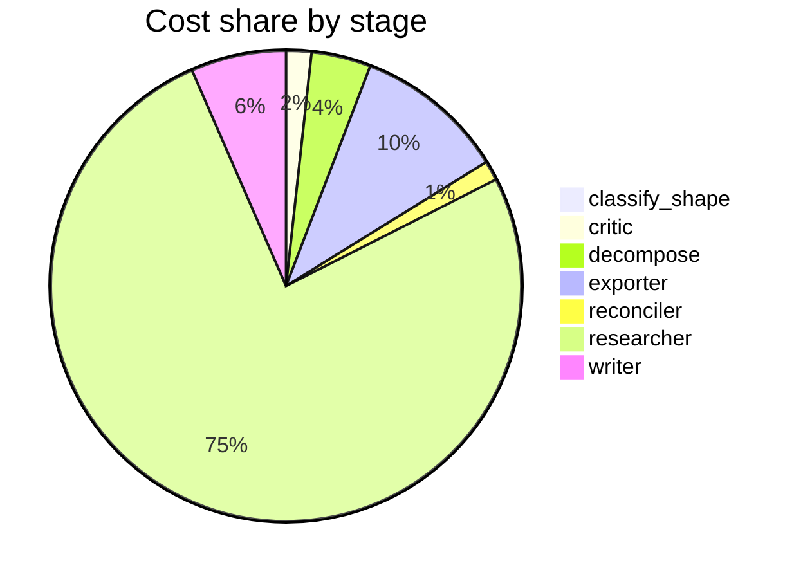

# Run metrics — What are the real-world risks and benefits of using synthetic data to train or …

> **Prompt:** What are the real-world risks and benefits of using synthetic data to train or fine-tune large language models? Focus on data quality, bias, and evaluation.
> **Started:** 2026-05-05T13:20:57.003789+00:00
> **Duration:** 163.3s
> **Final output:** [final_20260505T062056_ad2d016a_what_are_the_real_world_risks_and_benefi__on.md](./final_20260505T062056_ad2d016a_what_are_the_real_world_risks_and_benefi__on.md)

## Tier 1 — Headline evaluation metrics

### Grounding

**Rate:** 100%  (3/3 claims grounded)

| claim | grounded | reason |
|---:|:---:|---|
| 0 | ✅ | Evidence directly supports the 300B token plateau and that larger models reach near-optimal performance with less data than smaller ones. |
| 1 | ✅ | Evidence directly supports the 2.5% failure rate, synthetic failure data for IT prediction, and 20+ business applications deployment. |
| 2 | ✅ | Evidence directly states the distillation pipeline from GPT-4.1 to GPT-4o-mini achieved 70% inference cost reduction at 10k calls/day. |

### Fabrication rate

**Rate:** 0%  (0/3 approved claims cite a fabricated finding)

- Drift rate: 0%  (0/3 approved claims cite a drifted finding)
- Verifier source: native verify_history

### Contradictions surfaced

**N surfaced:** 0

### Honesty signals

- Uncertainty notes: **6**  |  caveats: **10**
- Sub-questions with ≥1 uncertainty note: **86%**
- Caveats reference uncertainty: **no**

### Source quality

- Cited findings: **3** of 3 harvested  |  mean quality: **0.70** (cited) vs. 0.70 (all)
- Cited quality — median: 0.70, min: 0.70

| tier | cited | all |
|---|---:|---:|
| gov_edu | 0 | 0 |
| peer_reviewed | 0 | 0 |
| news | 0 | 0 |
| curated_tertiary | 0 | 0 |
| unknown | 3 | 3 |
| blog_qa | 0 | 0 |

### Calibration

**Total claims:** 3

| confidence range | n | grounded rate | mean stated confidence |
|---|---:|---:|---:|
| [0.00, 0.30) | 0 | — | — |
| [0.30, 0.60) | 0 | — | — |
| [0.60, 0.80) | 0 | — | — |
| [0.80, 1.01) | 3 | 100% | 0.82 |

### Coverage

**Rate:** 14%  (1 covered, 6 missed)

- **Covered:** `sq5`
- **Missed:** `sq1`, `sq2`, `sq3`, `sq4`, `sq6`, `sq7`

### LLM judge rubric

| dimension | score |
|---|---:|
| correctness | 2.50 / 5 |
| completeness | 1.50 / 5 |
| calibration | 3.00 / 5 |
| source quality | 1.50 / 5 |
| conflict handling | 1.00 / 5 |
| overall | 1.80 / 5 |

> The report is remarkably thin: it explicitly admits that 6 of 7 sub-questions returned no findings, leaving the prompt's core topics (bias, model collapse, evaluation methodology, privacy/IP) entirely unaddressed. Sources are weak—two vendor case studies and one Microsoft blog post—with no peer-reviewed literature (e.g., Shumailov et al. on model collapse, Gudibande et al. on imitation models, Alemohammad on self-consuming loops) that is central to this question. Calibration is reasonable in that the report honestly acknowledges its gaps rather than fabricating, but the high (~0.82) confidence on cherry-picked vendor claims is somewhat overstated, and no contradictions are surfaced despite this being a contested area.

## Tier 2 — Experimental rigor / depth of understanding

### Researcher signals

- Sub-questions: **7** total, **6** without findings
- Researchers with findings: **1**  |  with uncertainty: **6**  |  with both: **0**
- Findings: 3 total  |  uncertainty notes: 6
- Per active researcher: mean **3.0** findings, max **3**

### Citation density

- Load-bearing fraction: **100%**  (3 cited / 3 harvested)
- Per-claim citations: avg **1.00**  |  median **1.00**  |  uncited claims: 0
- Source concentration (Herfindahl): **0.333**  |  max single-source share: **33%**
- Distinct domains per claim (mean): **1.00**

### Plan judge

- Surface coverage: **1.00**  |  intent alignment: **0.90**
- Drift examples:
  - sq6: privacy/legal/IP risks are adjacent to the prompt's stated focus on quality, bias, and evaluation

> The decomposition thoroughly covers the three explicit axes of the prompt: data quality (sq1, sq4), bias (sq3), and evaluation (sq4, sq2), plus benefits/risks framing (sq2, sq5) and meta-level evidence gaps (sq7). Surface coverage is complete. Intent alignment is strong overall, with only sq6 (privacy/legal/IP) drifting slightly beyond the prompt's stated focus on quality, bias, and evaluation—though it remains within the broader risk/benefit frame, so the drift is mild.

### ACE — Adaptive Checklist Evaluation

**Overall:** 0.18 / 1.00

| item | met | score | reason |
|---|:---:|---:|---|
| Identifies concrete benefits of synthetic data for LLM training/fine-tuning, such as scalability, cost reduction, privacy preservation, coverage of rare/long-tail cases, and controllability of distributions | ✅ | 0.60 | Mentions cost reduction (distillation), rare-event coverage (ING Bank), and scaling behavior, but omits privacy preservation and controllability of distributions. |
| Discusses specific data-quality risks including factual errors, hallucination propagation, low diversity, distributional narrowing, and model collapse | ❌ | 0.05 | The report explicitly states model collapse and bias risks could not be covered and only mentions them as gaps without substantive discussion. |
| Addresses how synthetic data can amplify, mask, or introduce biases, including inherited biases from generator models and feedback loops when models train on their own outputs | ❌ | 0.00 | The report explicitly states bias amplification and model collapse risks could not be covered. |
| Covers evaluation challenges specific to synthetic data, such as contamination of benchmarks, overfitting to generator-style outputs, and the difficulty of measuring true generalization | ❌ | 0.00 | The report explicitly states evaluation methodologies could not be covered and provides no discussion of contamination, overfitting, or generalization challenges. |
| Discusses concrete mitigation strategies (e.g., filtering, human-in-the-loop curation, mixing with real data, deduplication, provenance tracking, rejection sampling, or verifier models) | ❌ | 0.00 | Report explicitly states mitigation strategies could not be covered and provides none. |
| References real-world examples, case studies, or named systems/papers (e.g., Phi models, Alpaca/self-instruct, Llama post-training, RLAIF, constitutional AI, or distillation work) rather than purely abstract claims | ✅ | 0.50 | Cites specific named cases (Microsoft SynthLLM, ING Bank, Prodinit GPT-4o-mini distillation) but misses canonical references like Phi, Alpaca/self-instruct, RLAIF, or constitutional AI. |
| Distinguishes between different use cases (pretraining vs. fine-tuning vs. RLHF/preference data vs. instruction tuning) and how risks/benefits differ across them | ❌ | 0.10 | The report mentions distillation/fine-tuning and pretraining-like scaling separately but does not systematically distinguish risks/benefits across pretraining, fine-tuning, RLHF, and instruction tuning. |
| Addresses verification and quality-assessment methods for synthetic data, such as diversity metrics, factuality checks, or human evaluation | ❌ | 0.05 | The report explicitly states that evaluation methodologies and metrics for synthetic data quality could not be covered. |
| Presents a balanced view that weighs trade-offs rather than purely advocating for or against synthetic data | ❌ | 0.30 | The report mentions only benefits (scaling, rare events, cost reduction) and acknowledges missing risk coverage, but does not actually weigh trade-offs substantively. |

> 2/9 criteria fully met

## Final output audit

- **Format detected:** Narrative summary in markdown with clearly labeled sections, covering data quality, bias, and evaluation as requested — defaulting to this since no specific format was specified.
- **Notes:** Format inferred as structured narrative markdown (user specified no format). The core conditions — data quality, bias, and evaluation — could not be satisfied because the research pipeline recovered zero citable findings for those sub-questions; the report is transparent about these gaps rather than fabricating coverage.
- **Conditions:** 2 satisfied / 1 partial / 3 not satisfied / 0 n/a
- **Unmet:**
  - Focus on data quality
  - Focus on bias
  - Focus on evaluation
  - Cover real-world risks

Tier 3 — Operational details

### Cost & latency
- Total cost: **$0.4474**  |  input tokens: 294640  |  output tokens: 15779  |  elapsed: 163.3s  |  revision rounds: 0
- Researcher latency: max 45.8s, avg 20.4s

### Per-stage
| stage | calls | input tokens | output tokens | cost (USD) | elapsed (s) |
|---|---:|---:|---:|---:|---:|
| classify_shape | 1 | 983 | 69 | $0.0040 | 3.7 |
| confidence | 0 | 0 | 0 | $0.0000 | 0.0 |
| critic | 1 | 2520 | 12 | $0.0077 | 1.2 |
| decompose | 1 | 1486 | 912 | $0.0181 | 15.1 |
| exporter | 1 | 3858 | 2290 | $0.0459 | 37.2 |
| reconciler | 1 | 1951 | 9 | $0.0060 | 0.9 |
| researcher | 66 | 279954 | 11333 | $0.3366 | 78.7 |
| verifier | 0 | 0 | 0 | $0.0000 | 1.7 |
| writer | 1 | 3888 | 1154 | $0.0290 | 24.7 |

### Tool mix
| tool | calls |
|---|---:|
| web_search | 16 |
| search_papers | 13 |
| fetch_url | 7 |
| save_finding | 3 |
| note_uncertainty | 0 |

### Run metadata
- commit: `b13f2f283bfdd5669aa01500f9fa8a9058d83b84`  branch: `main`
- captured_at: 2026-05-05T13:18:13.745906+00:00
- models: critic=`claude-sonnet-4-6`, judge=`claude-opus-4-7`, kae_judge=`claude-haiku-4-5`, researcher=`claude-haiku-4-5`, writer=`claude-sonnet-4-6`

