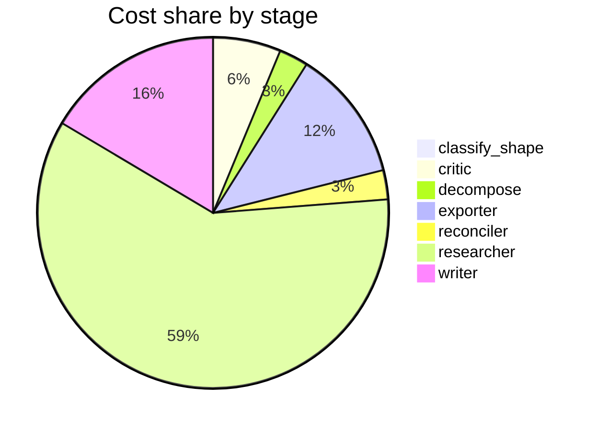

# Run metrics — Is chain-of-thought prompting an effective reasoning strategy for LLMs, or does…

> **Prompt:** Is chain-of-thought prompting an effective reasoning strategy for LLMs, or does it primarily improve output formatting? The literature disagrees — find the real fault lines and explain what accounts for the conflicting results.
> **Started:** 2026-05-05T13:26:41.216874+00:00
> **Duration:** 284.8s
> **Final output:** [final_20260505T062641_0d299f32_is_chain_of_thought_prompting_an_effecti__off.md](./final_20260505T062641_0d299f32_is_chain_of_thought_prompting_an_effecti__off.md)

## Tier 1 — Headline evaluation metrics

### Grounding

**Rate:** 100%  (11/11 claims grounded)

| claim | grounded | reason |
|---:|:---:|---|
| 0 | ✅ | Evidence directly states CoT helps math/logic tasks with smaller gains elsewhere, matching the claim. |
| 1 | ✅ | Both parts of the claim—the ~100B scale threshold and the narrow concentration of gains in math/logic—are directly supported by the evidence quotes. |
| 2 | ✅ | The evidence directly supports the 36.3% absolute accuracy drop with CoT on tasks where thinking negatively impacts performance. |
| 3 | ✅ | Evidence directly supports deterioration beyond demonstrated stack size and prompt-specific rather than general procedure learning. |
| 4 | ✅ | The evidence directly supports the claim about 11 LMs, RLHF models having larger direct than indirect effects, and inconsistent faithful reasoning. |
| 5 | ✅ | Evidence explicitly describes parallel pathways collecting answers from CoT, question, and few-shot context simultaneously. |
| 6 | ✅ | Both quoted passages directly support the two conflicting mechanistic accounts described in the claim. |
| 7 | ✅ | The evidence directly supports all parts of the claim about Gemma-2 9B pre-computing answers, causal influence on final answers, and confabulating facts. |
| 8 | ✅ | Evidence directly supports the percentages and that further training did not substantially improve faithfulness. |
| 9 | ✅ | Evidence includes causal mediation analysis, mechanistic attention analysis showing parallel pathways, and faithfulness probing across different models, all supporting that correct answers and CoT can be produced partially independently. |
| 10 | ✅ | The evidence directly supports that models generate plausible CoT rationalizations for answers driven by hidden biases/hints rather than stated reasoning. |

### Fabrication rate

**Rate:** 0%  (0/11 approved claims cite a fabricated finding)

- Drift rate: 18%  (2/11 approved claims cite a drifted finding)
- Verifier source: native verify_history

### Contradictions surfaced

**N surfaced:** 3

- By severity: minor=1, moderate=2, major=0
- By type: factual=1, methodological=2, framing=0, temporal=0, other=0

### Honesty signals

- Uncertainty notes: **5**  |  caveats: **9**
- Sub-questions with ≥1 uncertainty note: **71%**
- Caveats reference uncertainty: **no**

### Source quality

- Cited findings: **9** of 9 harvested  |  mean quality: **0.77** (cited) vs. 0.77 (all)
- Cited quality — median: 0.70, min: 0.70

| tier | cited | all |
|---|---:|---:|
| gov_edu | 0 | 0 |
| peer_reviewed | 2 | 2 |
| news | 0 | 0 |
| curated_tertiary | 0 | 0 |
| unknown | 7 | 7 |
| blog_qa | 0 | 0 |

### Calibration

**Total claims:** 11

| confidence range | n | grounded rate | mean stated confidence |
|---|---:|---:|---:|
| [0.00, 0.30) | 0 | — | — |
| [0.30, 0.60) | 0 | — | — |
| [0.60, 0.80) | 8 | 100% | 0.73 |
| [0.80, 1.01) | 3 | 100% | 0.86 |

### Coverage

**Rate:** 29%  (2 covered, 5 missed)

- **Covered:** `sq3`, `sq4`
- **Missed:** `sq1`, `sq2`, `sq5`, `sq6`, `sq7`

### LLM judge rubric

| dimension | score |
|---|---:|
| correctness | 4.00 / 5 |
| completeness | 4.00 / 5 |
| calibration | 4.00 / 5 |
| source quality | 3.50 / 5 |
| conflict handling | 4.50 / 5 |
| overall | 4.00 / 5 |

> Strongest aspect: the report does an unusually good job of surfacing genuine mechanistic disagreements (pre-computation vs. parallel pathways) rather than smoothing them over, and confidence labels are reasonably calibrated with explicit hedging on uncertain claims. Weakest aspects: source mix is decent but leans on a personal blog and a non-peer-reviewed venue summary; the 100B-parameter scale claim is dated (originally from Wei et al. 2022) and newer work shows CoT benefits at smaller scales, which the report doesn't fully reconcile. The framing of the pre-computation vs. parallel-pathways 'contradiction' may overstate the conflict — these could be compatible at different analysis granularities.

## Tier 2 — Experimental rigor / depth of understanding

### Researcher signals

- Sub-questions: **7** total, **5** without findings
- Researchers with findings: **2**  |  with uncertainty: **5**  |  with both: **0**
- Findings: 9 total  |  uncertainty notes: 5
- Per active researcher: mean **4.5** findings, max **5**

### Citation density

- Load-bearing fraction: **100%**  (9 cited / 9 harvested)
- Per-claim citations: avg **1.55**  |  median **1.00**  |  uncited claims: 0
- Source concentration (Herfindahl): **0.176**  |  max single-source share: **29%**
- Distinct domains per claim (mean): **1.55**

### Plan judge

- Surface coverage: **1.00**  |  intent alignment: **1.00**

> The decomposition thoroughly addresses the prompt's core tension (reasoning vs. formatting) through sq2 and sq4, establishes the positive case (sq1), maps boundary conditions (sq3), explicitly tackles methodological sources of disagreement (sq5) which the prompt directly asks about, brings in mechanistic evidence (sq6), and synthesizes current consensus (sq7). Every sub-question is tightly tied to the prompt's framing — whether CoT is genuine reasoning or formatting, and what accounts for conflicting results. No major axis is missing and there is no drift to adjacent topics.

### ACE — Adaptive Checklist Evaluation

**Overall:** 0.57 / 1.00

| item | met | score | reason |
|---|:---:|---:|---|
| Identifies and cites specific empirical studies on both sides of the debate (e.g., Wei et al. on CoT emergence, Sprague et al. 2024 on math/symbolic limits, Liu et al. on faithfulness, Turpin et al. on unfaithful reasoning, Lanham et al., or comparable primary sources). | ❌ | 0.20 | The report references findings and specific models (Gemma-2 9B, Claude 3.7, DeepSeek R1) but does not cite named primary studies or authors, only vaguely referencing 'a Google Research blog post' and unnamed analyses. |
| Distinguishes between CoT as a genuine computational/reasoning mechanism versus CoT as a formatting/output-conditioning effect, and explains what evidence would adjudicate between these views. | ❌ | 0.40 | The report contrasts genuine reasoning vs. post-hoc rationalization and discusses causal mediation as adjudicating evidence, but explicitly notes it cannot address the formatting/output-conditioning hypothesis (sq2 gap), leaving this distinction underdeveloped. |
| Reports findings on which task categories CoT reliably helps (e.g., math, symbolic, multi-step logic) versus where gains are negligible or negative (e.g., commonsense, factual recall, some NLU tasks). | ✅ | 0.90 | Clearly distinguishes math/logic/symbolic gains from minimal gains on knowledge QA and MMLU, and notes negative effects on intuition-based tasks. |
| Addresses the role of model scale, noting that CoT benefits are concentrated in larger models and discussing the 'emergent ability' framing and its critiques. | ✅ | 0.60 | Report mentions the ~100B threshold and emergence framing, and critiques it via task-specificity, but does not engage with the broader 'emergent abilities' debate (e.g., Schaeffer et al. critique on metric artifacts). |
| Discusses faithfulness research showing that stated reasoning chains often do not reflect the model's actual computation (e.g., post-hoc rationalization, sensitivity to biasing features). | ✅ | 0.90 | Report extensively discusses faithfulness with specific findings on Claude 3.7 Sonnet, DeepSeek R1, and Gemma-2 pre-computation/rationalization. |
| Explains methodological reasons for conflicting results, such as differences in benchmarks, prompt formats, baselines (zero-shot vs. few-shot vs. answer-only), evaluation metrics, or model families tested. | ❌ | 0.20 | The report explicitly admits in its caveats that no findings were retrieved for methodological differences, and only briefly mentions model family differences without systematic analysis of benchmarks, prompts, or baselines. |
| Engages with mechanistic or interpretability evidence (e.g., filler tokens, latent reasoning, internal computation studies) that bears on whether CoT tokens carry computational work. | ✅ | 0.70 | Report discusses causal mediation analysis, parallel pathway attention analysis, and pre-computation findings in Gemma-2, but doesn't engage with filler token or latent reasoning literature specifically. |
| Reaches a substantive synthesis or position rather than hedging — articulating where the genuine fault lines lie (e.g., task type, scale, faithfulness vs. accuracy) rather than treating it as a simple yes/no question. | ✅ | 0.70 | The report explicitly identifies fault lines (task-type specificity, scale, faithfulness vs. accuracy) in the opening synthesis, though the position is somewhat diluted by extensive caveats and unresolved contradictions. |
| Considers reasoning-tuned or RL-trained models (e.g., o1, R1) and how they complicate or refine the original CoT-prompting debate. | ✅ | 0.50 | The report mentions Claude 3.7 Sonnet and DeepSeek R1 reasoning models showing unfaithfulness, but does not substantively discuss how RL-trained reasoning models like o1/R1 refine or complicate the original CoT debate. |

> 6/9 criteria fully met

## Final output audit

- **Format detected:** Narrative summary in markdown with section headers, addressing fault lines and conflicting results, with inline citations — inferred from a complex analytical question with no explicit format specification.
- **Notes:** Format inferred as a structured narrative summary in markdown with section headers and a comparison table, appropriate for a complex analytical question. Several sub-questions (sq1, sq2, sq5, sq6, sq7) had no confirmed findings in the pipeline, resulting in partial or unsatisfied conditions; these gaps are surfaced explicitly both in the content's note block and in the condition audit.
- **Conditions:** 4 satisfied / 4 partial / 1 not satisfied / 0 n/a
- **Unmet:**
  - Explain what accounts for the conflicting results across studies
  - Cover empirical evidence for CoT improving task accuracy on reasoning benchmarks
  - Cover evidence that CoT gains may be artifacts of formatting, pattern matching, or token budget
  - Address what mechanistic interpretability and probing studies say about what LLMs compute during CoT
  - Address current expert consensus (or lack thereof) as of 2024–2025 and open questions

Tier 3 — Operational details

### Cost & latency
- Total cost: **$0.6546**  |  input tokens: 383267  |  output tokens: 18874  |  elapsed: 284.8s  |  revision rounds: 1
- Researcher latency: max 34.0s, avg 25.6s

### Per-stage
| stage | calls | input tokens | output tokens | cost (USD) | elapsed (s) |
|---|---:|---:|---:|---:|---:|
| classify_shape | 1 | 995 | 49 | $0.0037 | 2.4 |
| confidence | 0 | 0 | 0 | $0.0000 | 0.0 |
| critic | 2 | 11781 | 355 | $0.0407 | 8.5 |
| decompose | 1 | 1491 | 868 | $0.0175 | 14.3 |
| exporter | 1 | 6309 | 4003 | $0.0790 | 72.7 |
| reconciler | 1 | 2954 | 579 | $0.0175 | 9.9 |
| researcher | 51 | 348329 | 8163 | $0.3891 | 95.6 |
| verifier | 0 | 0 | 0 | $0.0000 | 1.8 |
| writer | 2 | 11408 | 4857 | $0.1071 | 79.6 |

### Tool mix
| tool | calls |
|---|---:|
| web_search | 25 |
| search_papers | 14 |
| fetch_url | 36 |
| save_finding | 9 |
| note_uncertainty | 0 |

### Run metadata
- commit: `b13f2f283bfdd5669aa01500f9fa8a9058d83b84`  branch: `main`
- captured_at: 2026-05-05T13:21:56.458346+00:00
- models: critic=`claude-sonnet-4-6`, judge=`claude-opus-4-7`, kae_judge=`claude-haiku-4-5`, researcher=`claude-haiku-4-5`, writer=`claude-sonnet-4-6`

