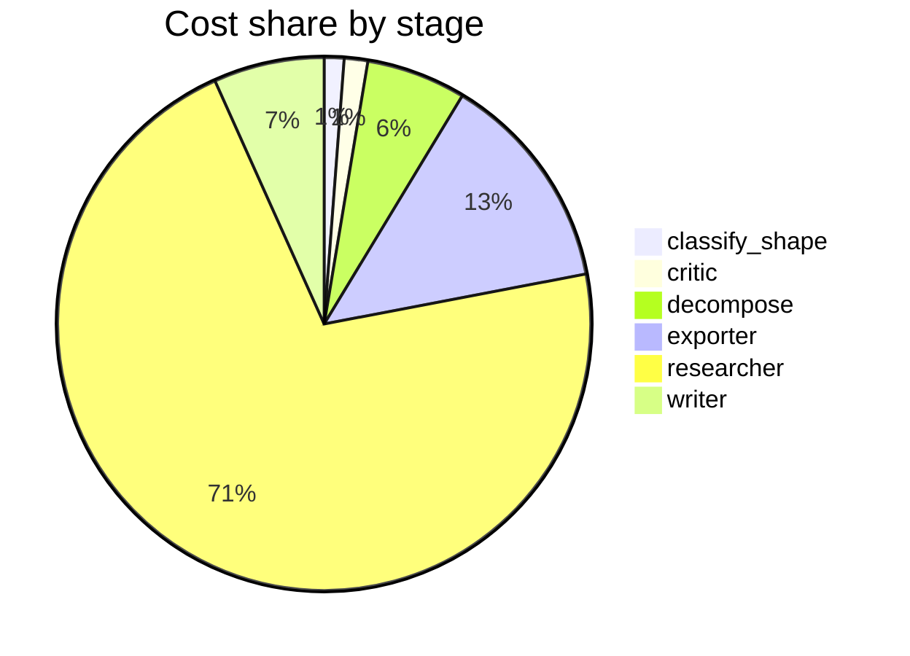

# Run metrics — Is chain-of-thought prompting an effective reasoning strategy for LLMs, or does…

> **Prompt:** Is chain-of-thought prompting an effective reasoning strategy for LLMs, or does it primarily improve output formatting? The literature disagrees — find the real fault lines and explain what accounts for the conflicting results.
> **Started:** 2026-05-05T13:30:02.998516+00:00
> **Duration:** 114.2s
> **Final output:** [final_20260505T063002_40b95c5a_is_chain_of_thought_prompting_an_effecti__on.md](./final_20260505T063002_40b95c5a_is_chain_of_thought_prompting_an_effecti__on.md)

## Tier 1 — Headline evaluation metrics

### Grounding

**Rate:** 0%  (0/0 claims grounded)

### Fabrication rate

**Rate:** 0%  (0/0 approved claims cite a fabricated finding)

- Drift rate: 0%  (0/0 approved claims cite a drifted finding)
- Verifier source: native verify_history

### Contradictions surfaced

**N surfaced:** 0

### Honesty signals

- Uncertainty notes: **7**  |  caveats: **9**
- Sub-questions with ≥1 uncertainty note: **100%**
- Caveats reference uncertainty: **no**

### Source quality

- Cited findings: **0** of 0 harvested  |  mean quality: **0.00** (cited) vs. 0.00 (all)
- Cited quality — median: 0.00, min: 0.00

| tier | cited | all |
|---|---:|---:|
| gov_edu | 0 | 0 |
| peer_reviewed | 0 | 0 |
| news | 0 | 0 |
| curated_tertiary | 0 | 0 |
| unknown | 0 | 0 |
| blog_qa | 0 | 0 |

### Calibration

**Total claims:** 0

| confidence range | n | grounded rate | mean stated confidence |
|---|---:|---:|---:|
| [0.00, 0.30) | 0 | — | — |
| [0.30, 0.60) | 0 | — | — |
| [0.60, 0.80) | 0 | — | — |
| [0.80, 1.01) | 0 | — | — |

### Coverage

**Rate:** 0%  (0 covered, 7 missed)

- **Missed:** `sq1`, `sq2`, `sq3`, `sq4`, `sq5`, `sq6`, `sq7`

### LLM judge rubric

| dimension | score |
|---|---:|
| correctness | 0.00 / 5 |
| completeness | 0.00 / 5 |
| calibration | 4.00 / 5 |
| source quality | 0.00 / 5 |
| conflict handling | 0.00 / 5 |
| overall | 0.50 / 5 |

> The report is a null result — no findings, claims, or sources were retrieved. While it is honest about its failure (hence reasonable calibration), it provides zero substantive content addressing the prompt's nuanced question about CoT effectiveness vs. formatting effects, mechanistic debates, or methodological fault lines. The user receives no value beyond an admission of retrieval failure.

## Tier 2 — Experimental rigor / depth of understanding

### Researcher signals

- Sub-questions: **7** total, **7** without findings
- Researchers with findings: **0**  |  with uncertainty: **7**  |  with both: **0**
- Findings: 0 total  |  uncertainty notes: 7
- Per active researcher: mean **0.0** findings, max **0**

### Citation density

- Load-bearing fraction: **0%**  (0 cited / 0 harvested)
- Per-claim citations: avg **0.00**  |  median **0.00**  |  uncited claims: 0
- Source concentration (Herfindahl): **0.000**  |  max single-source share: **0%**
- Distinct domains per claim (mean): **0.00**

### Plan judge

- Surface coverage: **1.00**  |  intent alignment: **1.00**

> The decomposition thoroughly addresses both sides of the prompt's central question: sq1 covers evidence for genuine reasoning gains, sq2 covers the formatting-artifact critique, and sq3-sq7 systematically explore the fault lines (methodology, mechanistic evidence, faithfulness, failure modes, theoretical frameworks) that explain conflicting results. Every sub-question is directly on-topic and tied to the prompt's framing of the debate. No major axis is missing.

### ACE — Adaptive Checklist Evaluation

**Overall:** 0.00 / 1.00

| item | met | score | reason |
|---|:---:|---:|---|
| Identifies and explains specific empirical findings on both sides of the debate, citing concrete studies | ❌ | 0.00 | The report explicitly states no findings were retrieved and cites no studies. |
| Distinguishes between task types where CoT provides substantial gains versus tasks where gains are minimal | ❌ | 0.00 | The report explicitly states no findings were retrieved and makes no distinctions between task types. |
| Discusses the role of model scale, noting that CoT benefits are largely emergent in larger models and may reflect training data composition rather than a universal reasoning mechanism | ❌ | 0.00 | The report explicitly states no findings were retrieved and makes no claims about model scale or emergent CoT benefits. |
| Addresses the faithfulness question — whether the verbalized chain reflects the model's actual computation — including evidence from perturbation studies, post-hoc rationalization, and biased reasoning experiments | ❌ | 0.00 | The report explicitly states no findings were retrieved and makes no substantive claims about faithfulness. |
| Examines methodological fault lines that produce conflicting results, such as differences in benchmarks used, prompting format, evaluation metrics (final answer vs. reasoning correctness), and baseline comparisons | ❌ | 0.00 | The report explicitly states no findings were retrieved and methodological fault lines cannot be characterized. |
| Engages with the 'formatting/output channel' hypothesis specifically, including arguments that CoT works partly by allocating more compute/tokens or eliciting structured output rather than genuine step-by-step reasoning | ❌ | 0.00 | The report explicitly states no findings were retrieved and makes no substantive engagement with the formatting/output channel hypothesis. |
| Considers alternative or competing explanations for CoT gains | ❌ | 0.00 | The report is a null result with no substantive content addressing alternative explanations. |
| Synthesizes the disagreement into a coherent account of when and why CoT helps, rather than simply listing opposing claims, and offers a defensible interpretation of the evidence | ❌ | 0.00 | The report is a null result with no synthesis or interpretation offered. |
| References mechanistic or interpretability findings | ❌ | 0.00 | Report explicitly states no findings were retrieved and contains no mechanistic or interpretability content. |

> 0/9 criteria fully met

## Final output audit

- **Format detected:** Narrative summary in markdown, with explanatory prose organized around the fault lines and conflicting results in the CoT literature — inferred from the analytical, open-ended nature of the prompt.
- **Notes:** Format inferred as analytical narrative summary in markdown, given the open-ended comparative/explanatory nature of the prompt. However, the structured report is a complete null result — all seven sub-questions failed retrieval — so the rendered content is entirely a transparent disclosure of that failure, with no substantive claims about the CoT literature. All nine substantive conditions are unmet due to the pipeline failure, not absence of relevant literature.
- **Conditions:** 1 satisfied / 0 partial / 9 not satisfied / 0 n/a
- **Unmet:**
  - Identify and explain the 'real fault lines' between conflicting results in the CoT literature
  - Address whether CoT is an effective reasoning strategy vs. primarily improving output formatting
  - Explain what accounts for conflicting results in the literature
  - Cover empirical evidence on CoT accuracy gains across task types and model scales (sq1)
  - Cover evidence that CoT primarily improves surface formatting rather than reasoning (sq2)
  - Cover mechanistic/interpretability evidence on whether CoT is causal or post-hoc (sq4)
  - Cover unfaithfulness and hallucination in CoT chains (sq5)
  - Cover conditions under which CoT fails or backfires (sq6)
  - Cover theoretical frameworks explaining why CoT works (sq7)

Tier 3 — Operational details

### Cost & latency
- Total cost: **$0.3083**  |  input tokens: 190168  |  output tokens: 11825  |  elapsed: 114.2s  |  revision rounds: 0
- Researcher latency: max 19.7s, avg 14.1s

### Per-stage
| stage | calls | input tokens | output tokens | cost (USD) | elapsed (s) |
|---|---:|---:|---:|---:|---:|
| classify_shape | 1 | 995 | 45 | $0.0037 | 2.1 |
| confidence | 0 | 0 | 0 | $0.0000 | 0.0 |
| critic | 1 | 1385 | 17 | $0.0044 | 1.4 |
| decompose | 1 | 1491 | 941 | $0.0186 | 16.2 |
| exporter | 1 | 3179 | 2104 | $0.0411 | 29.9 |
| reconciler | 0 | 0 | 0 | $0.0000 | 0.0 |
| researcher | 58 | 179526 | 8057 | $0.2198 | 53.1 |
| writer | 1 | 3592 | 661 | $0.0207 | 11.4 |

### Tool mix
| tool | calls |
|---|---:|
| web_search | 13 |
| search_papers | 13 |
| fetch_url | 10 |
| save_finding | 0 |
| note_uncertainty | 0 |

### Run metadata
- commit: `b13f2f283bfdd5669aa01500f9fa8a9058d83b84`  branch: `main`
- captured_at: 2026-05-05T13:28:08.891316+00:00
- models: critic=`claude-sonnet-4-6`, judge=`claude-opus-4-7`, kae_judge=`claude-haiku-4-5`, researcher=`claude-haiku-4-5`, writer=`claude-sonnet-4-6`

