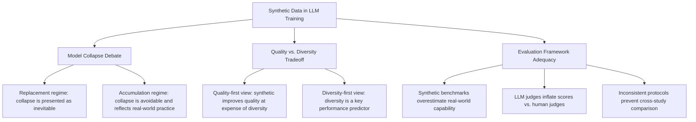

<!--
Original prompt: What are the real-world risks and benefits of using synthetic data to train or fine-tune large language models? Focus on data quality, bias, and evaluation.
Detected format: Narrative summary in markdown with section headers, covering data quality, bias, evaluation, benefits, risks, and methodological disagreements — defaulting to clear structured markdown since the prompt did not specify a format.
-->

> **Original prompt:** What are the real-world risks and benefits of using synthetic data to train or fine-tune large language models? Focus on data quality, bias, and evaluation.
> **Detected format:** Narrative summary in markdown with section headers, covering data quality, bias, evaluation, benefits, risks, and methodological disagreements — defaulting to clear structured markdown since the prompt did not specify a format.

---

# Real-World Risks and Benefits of Using Synthetic Data to Train or Fine-Tune LLMs

> **Scope note:** This report synthesises empirical findings and theoretical analyses from the current literature. Three significant gaps are explicitly flagged throughout: (1) direct distributional comparisons between synthetic and real training data were not recoverable from the evidence base; (2) detailed bias-mechanism studies for synthetic data are absent; (3) empirical comparisons of filtering and mixing mitigation strategies were not retrieved. These gaps are noted where they are most relevant.

---

## 1. Overview

The net value of synthetic data for LLM training is genuinely contested. There is concrete evidence of benefits in specific domains such as low-resource machine translation, long-context reasoning, and privacy-preserving fine-tuning, alongside well-documented risks of distributional degradation, evaluation inflation, and self-reinforcing bias. Critically, the severity of most risks depends heavily on how synthetic data is used (replacement vs. accumulation) and how quality is measured. Major methodological inconsistencies across the literature make it difficult to draw clean generalisable conclusions.

---

## 2. Data Quality

### 2.1 Model Collapse: When Synthetic Data Degrades Distributions

The most extensively studied quality risk is **model collapse** — a degenerative process in which iterative training on synthetic data causes progressive loss of tail information in the true distribution, eventually converging toward a low-variance point estimate.

Research published in *Nature* identifies three compounding error sources that drive this process:

1. **Statistical approximation error** (primary): arises from finite sampling;
2. **Functional expressivity error** (secondary): limited network capacity;
3. **Functional approximation error** (secondary): limitations of the training procedure itself (e.g., structural bias of SGD or choice of objective).

Importantly, the literature uses the term "model collapse" inconsistently. A 2025 analysis reveals that the term encompasses **at least eight distinct definitions** of performance degradation, used inconsistently between papers and sometimes within the same paper, causing researchers to talk past one another and limiting practical guidance.

### 2.2 The Replacement vs. Accumulation Distinction

The most consequential methodological variable is whether synthetic data *replaces* or *accumulates alongside* real data across training iterations.

- **Replacement regime:** Model collapse is mathematically demonstrable and, under data-replacement assumptions, can appear inevitable. Several prominent papers conclude collapse cannot be avoided when training solely on synthetic data.
- **Accumulation regime:** When synthetic data is accumulated alongside real data, model collapse is avoided and test error is bounded by a finite upper bound independent of the number of iterations — a result that holds across model sizes, architectures, and hyperparameters.

Critically, a 2025 review argues that the data-replacement assumption does not reflect real-world practices at leading AI labs, which accumulate and mix real and synthetic data. This means several widely-cited model collapse findings may overstate the risk for practitioners who follow standard curation practices.

### 2.3 Verifier-Based Filtering and Long-Term Dynamics

Even when a verifier filters synthetic data to produce short-term performance gains, the long-term retraining trajectory converges toward the **verifier's knowledge center**. Unless the verifier is unbiased, early gains plateau and may eventually reverse. This has practical implications for any pipeline that uses a judge or reward model to screen synthetic outputs before training.

### 2.4 Pre-Training Speed and the Quality-Diversity Tradeoff

The relationship between synthetic data and pre-training efficiency is disputed:

- Mixing **1/3 rephrased synthetic data with 2/3 natural web text** can yield a **5-10x speedup** to reach the same validation loss at larger data budgets.
- Rephrased synthetic data *alone* shows **no speedup** over natural text.
- Textbook-style synthetic data *alone* produces **notably higher loss**, particularly on downstream domains at small data budgets.

Underlying this is an unresolved factual disagreement: some researchers argue synthetic data improves training data quality at the expense of diversity, while others show that diversity is itself a key predictor of model performance. Both faithfulness (logical and grammatical coherence) and diversity (variation in length, topic, and style) are recognised as challenging requirements for synthetic data generation, and the literature has not converged on which matters more.

> **Gap:** Direct empirical comparisons of how synthetic vs. real training data affect full distributional quality and diversity were not recoverable from the available evidence.

---

## 3. Bias

> **Gap:** The specific mechanisms by which synthetic data introduces, amplifies, or reduces demographic and representational biases in LLMs, and empirical studies measuring these dynamics, were not recovered from the available evidence. This is a major gap for fairness-focused practitioners.

What the evidence does establish is that **evaluator bias** is a real and measurable problem:

- **LLM judges overestimate performance:** Bland-Altman analysis shows LLM judges assign higher relevance scores than human judges, and system performance is consistently higher on synthetic queries than on real queries, meaning synthetic test collections overestimate system effectiveness.
- **LLM review focus is systematically skewed:** When LLMs evaluate research papers, they over-focus on technical validity while neglecting novelty assessment, a pattern that existing evaluation metrics fail to surface.
- **Domain-expert agreement is limited:** LLM judges agree with dietetics subject-matter experts only **68% of the time** and with mental health experts only **64% of the time** on overall preference, indicating that LLM-as-judge evaluation has meaningful blind spots in knowledge-intensive domains.

These evaluator biases compound the question of whether a model trained on synthetic data has absorbed distributional biases, because the tools used to measure bias may themselves be unreliable.

---

## 4. Documented Benefits

Despite the risks, several concrete, empirically measured benefits have been demonstrated:

### 4.1 Long-Context Reasoning

Fine-tuning on synthetic multi-document QA data significantly improves LLM performance in long-context settings. One study reported a **10.5% improvement** for GPT-3.5 Turbo on a 20-document multi-document QA task at position 10.

### 4.2 Low-Resource Machine Translation

LLM-generated synthetic data, even when noisy, can substantially improve machine translation performance for low-resource languages. This is one of the clearest use cases where synthetic data addresses a real-data scarcity problem.

### 4.3 Privacy-Preserving Fine-Tuning

Synthetic data can enable fine-tuning of small language models on sensitive domains without memorising user data. One study (from a Google Research blog post) reported a **22.8% relative improvement** in mobile next-word prediction accuracy compared to web-crawled baseline data.

> **Caveat:** This figure comes from a company blog post rather than a peer-reviewed venue and should be interpreted with corresponding caution.

### 4.4 Alignment and Instruction Tuning (gap)

The alignment-tuning benefits of synthetic data (e.g., RLHF, DPO, Constitutional AI) are a widely discussed application but are not covered by the recovered evidence and cannot be assessed here.

---

## 5. Evaluation: Frameworks and Blind Spots

Current evaluation infrastructure has several documented weaknesses for synthetic-data-trained models:

| Weakness | Evidence |
|---|---|
| Synthetic benchmarks overestimate real-world performance | Code generation accuracy reported as ~87% on HumanEval but ~30% on real codebases with cross-file dependencies |
| LLM judges inflate scores relative to humans | Systematic tendency to assign higher relevance; performance higher on synthetic than real queries |
| Low expert agreement in specialist domains | 68% agreement in dietetics, 64% in mental health |
| Review metrics miss coverage of critical dimensions | LLMs over-focus on technical validity, neglect novelty |
| Inconsistent evaluation protocols across labs | Bespoke setups prevent direct comparability and generalisation |

> **Caveat:** The HumanEval vs. real-codebase figures (87% vs. 30%) come from a company blog (CodeAnt) and are not independently verified in peer-reviewed sources.

The deeper structural problem is that **methodological heterogeneity** pervades the field. Proposed approaches rely on bespoke experimental setups, results are often non-replicable across labs, and even open-sourced methods show early saturation without consistent performance gain, making it difficult to draw generalisable conclusions from the current body of work.

---

## 6. Researcher Disagreements and Conflicting Findings

The key axes of disagreement are summarised below:

The conflicts are not purely empirical. They often reflect different experimental assumptions (data replacement vs. accumulation), different evaluation choices (benchmark vs. real-world tasks), and different scales (small controlled experiments vs. large-scale pre-training). Until these methodological variables are standardised, the literature will continue to produce apparently contradictory results.

---

## 7. Practical Implications

Based on the available evidence, practitioners can draw the following actionable conclusions:

1. **Accumulate, do not replace.** The strongest mitigation against model collapse is retaining real data and mixing it with synthetic data rather than replacing it. Theoretical and empirical results agree on this point.
2. **Be cautious with verifier-filtered pipelines.** Verifier-based filtering can yield short-term gains but will converge to the verifier's knowledge center in the long run; biased verifiers will embed their biases into the model.
3. **Mix strategically.** Rephrased synthetic data mixed at roughly 1/3 of the training corpus can accelerate pre-training 5-10x; synthetic data alone does not provide this benefit.
4. **Distrust synthetic-only evaluations.** Benchmarks composed of synthetic queries and judged by LLMs will systematically overestimate capability. Human expert evaluation remains necessary, especially in specialist domains.
5. **Prioritise low-resource applications.** The evidence for benefit is strongest where real data is genuinely scarce (low-resource MT, privacy-constrained domains).

> **Gap:** No empirical comparisons of filtering strategies, mixing ratio optimisation, or red-teaming of synthetic pipelines were recovered from the evidence base. The mitigation guidance above is derived from theoretical results and indirect evidence only.

---

## 8. Summary of Evidence Quality and Caveats

- All model collapse findings derive from theoretical frameworks and controlled experiments; generalisability to frontier models and proprietary pipelines is unvalidated.
- Key findings on the replacement vs. accumulation debate are flagged in the source literature as having divergent self-reported confidence and cross-source agreement; claims derived from these should be treated with caution.
- Two quantitative figures cited in this report (22.8% NWP improvement; 87% vs. 30% code accuracy) come from non-peer-reviewed blog posts.
- The bias section is materially incomplete due to absence of recoverable empirical studies on synthetic-data-specific bias mechanisms.
- Alignment-tuning applications of synthetic data (RLHF, DPO, Constitutional AI) are not covered.
