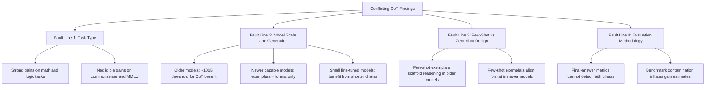

<!--
Original prompt: Is chain-of-thought prompting an effective reasoning strategy for LLMs, or does it primarily improve output formatting? The literature disagrees — find the real fault lines and explain what accounts for the conflicting results.
Detected format: Narrative analytical summary in markdown with section headers, synthesizing conflicting evidence into thematic fault lines, with caveats surfaced explicitly — inferred from the open-ended analytical prompt asking to find the real fault lines and explain what accounts for the conflicting results.
-->

> **Original prompt:** Is chain-of-thought prompting an effective reasoning strategy for LLMs, or does it primarily improve output formatting? The literature disagrees — find the real fault lines and explain what accounts for the conflicting results.
> **Detected format:** Narrative analytical summary in markdown with section headers, synthesizing conflicting evidence into thematic fault lines, with caveats surfaced explicitly — inferred from the open-ended analytical prompt asking to find the real fault lines and explain what accounts for the conflicting results.

---

# Chain-of-Thought Prompting: Genuine Reasoning or Better Formatting?
## A Critical Review of the Fault Lines in the Literature

> **Bottom line up front:** The literature is genuinely divided. A 2025 ICLR meta-analysis across 100+ papers finds strong CoT benefits narrowly confined to mathematical and logical tasks, with little gain elsewhere. Earlier foundational work reported dramatic cross-benchmark improvements that have since been complicated by benchmark contamination, scale-dependence debates, and evidence that for modern strong models, few-shot CoT exemplars mainly align output format rather than improve reasoning. The fault lines run along task type, model scale, few-shot vs. zero-shot design, and whether final-answer accuracy can validly proxy for genuine reasoning.

---

## 1. What the Foundational Studies Claimed

The original empirical case for CoT was striking. In Wei et al.'s foundational study, GPT-3 175B jumped from **17.9% to 58.8%** accuracy on GSM8K — a 40.9 percentage point improvement. Zero-shot CoT (simply appending "Let's think step by step") produced similarly dramatic results: on MultiArith, InstructGPT leapt from **17.7% to 78.7%** (a 61 percentage point gain). PaLM 540B showed a **17.4 percentage point** gain on GSM8K and a **12.1 percentage point** gain on SVAMP.

These figures established CoT as a transformative technique, but they come with a caveat: several of these numbers derive from secondary summaries rather than direct verification of primary papers, and benchmark data contamination — where evaluation datasets overlap with model training data — may inflate reported metrics in ways that are difficult to quantify.

---

## 2. The Evidence That CoT Improves Genuine Reasoning

The strongest positive case for CoT as genuine reasoning support rests on the **task-specificity of its gains**. The 2025 ICLR meta-analysis, covering over 100 papers and evaluating 20 datasets across 14 models, found that CoT provides strong performance benefits primarily on tasks involving math or logic — exactly the tasks where multi-step intermediate computation is mechanistically necessary. This pattern is consistent with the hypothesis that CoT externalizes genuinely useful intermediate computation rather than merely reformatting outputs.

Further support comes from the **symbolic execution analysis** within the same meta-analysis: much of CoT's gain on mathematical tasks comes specifically from improving symbolic execution steps, suggesting CoT is doing real computational work in those steps, even if it underperforms relative to a dedicated symbolic solver. The fact that CoT gains track the structure of task demands — rising where step-by-step execution matters, falling where it does not — is hard to explain as pure formatting.

> **Critical gap:** The most direct evidence that would confirm or deny genuine reasoning — faithfulness studies using counterfactual interventions on intermediate steps, probing experiments on internal representations, and mechanistic interpretability work (activation patching, attention analysis) — was not recoverable in the available literature. The absence of this evidence means the core question of whether CoT traces correspond to actual internal computation remains empirically open.

---

## 3. The Evidence That CoT Primarily Improves Formatting

The case for CoT as primarily a formatting mechanism has grown substantially with newer, more capable models:

- **On MMLU**, the 2025 ICLR meta-analysis found that generating answers without CoT leads to nearly identical accuracy as CoT, unless the question involves symbolic operations (detectable by the presence of an equals sign). For the vast majority of knowledge-based questions, CoT adds nothing to accuracy.

- **For modern strong models** such as the Qwen2.5 series, adding traditional few-shot CoT exemplars does not improve reasoning performance compared to zero-shot CoT. Their primary function is to align the output format with human expectations, and this formatting effect persists regardless of the model's underlying reasoning ability.

- The **blind spot in evaluation methodology** reinforces this concern: current benchmarks measure only final-answer accuracy, which structurally cannot distinguish genuine multi-step reasoning from memorization, pattern matching, or well-formatted post-hoc rationalization. A model can get the right answer for entirely wrong reasons and be credited with CoT-enhanced reasoning.

---

## 4. The Fault Lines Explained

Four structural fault lines account for most of the conflicting findings:

### Fault Line 1: Task Type
CoT is not uniformly beneficial. The evidence consistently shows strong gains on **symbolic and mathematical tasks** and negligible gains on **commonsense or broad knowledge tasks**. Studies that sample heavily from math benchmarks will find CoT effective; studies using broader benchmarks like MMLU will find it near-neutral. This sampling difference alone explains much of the apparent contradiction in the literature.

### Fault Line 2: Model Scale and Generation
The original Google Research framing positioned CoT benefits as **emergent at approximately 100B parameters** — a threshold below which CoT was described as ineffective. More recent work complicates this picture in two directions: first, small models under 7B parameters can benefit from CoT when fine-tuned on shorter, simpler reasoning chains aligned with their capacity; and second, for the most capable modern models, the few-shot CoT advantage has largely collapsed — exemplars now function mainly as format signals. This is not a factual contradiction but a **temporal shift**: the importance of exemplars described in foundational work has diminished as models have grown more capable. Studies from 2022 and studies from 2024-2025 are describing different points on the capability curve.

> Note: The approximately 100B parameter threshold itself carries low cross-source agreement in the literature and should be treated as a rough heuristic rather than a sharp boundary.

### Fault Line 3: Few-Shot vs. Zero-Shot CoT Design
Few-shot CoT (providing worked examples) and zero-shot CoT are often conflated in the literature but behave differently. For older or smaller models, few-shot exemplars provide genuine scaffolding. For newer capable models, they function as format templates. Studies that do not distinguish between these variants, or that treat the literature as a uniform whole, will find inconsistent results.

### Fault Line 4: Evaluation Methodology and Contamination
Two methodological problems systematically bias findings in opposite directions:

1. **Final-answer-only metrics** cannot detect reasoning faithfulness. This creates a measurement gap that allows both genuine-reasoning and formatting-only hypotheses to survive on the same data.

2. **Benchmark contamination** inflates performance figures, particularly for widely-used benchmarks like GSM8K that have been in circulation long enough to appear in training corpora. The large gains reported in foundational CoT studies may be partially attributable to contamination, though the magnitude of this inflation is not quantified in the available evidence.

---

## 5. The Expanding Scope Problem

The CoT research landscape has expanded far beyond grade-school math to encompass logic reasoning, planning, combinatorial games, robotics, and reinforcement-learning-based fine-tuning paradigms. Results from narrow arithmetic benchmarks, even if internally valid, are increasingly difficult to generalize to this broader landscape. The 2025 ICLR meta-analysis explicitly calls for moving beyond prompt-based CoT to new paradigms that better leverage intermediate computation across the full range of LLM applications.

---

## 6. What the Evidence Cannot Resolve

The most important open question — whether CoT reasoning traces are **faithful** to the model's actual internal computation or are post-hoc rationalizations — remains unanswered by the available literature. Mechanistic interpretability studies (activation patching, attention analysis, internal representation probes) that would directly address this question were not available in the evidence retrieved. Until that evidence exists at scale, the formatting-vs.-reasoning debate cannot be definitively adjudicated.

---

## Summary: Fault Line Map

---

## Key Caveats

- **The faithfulness question is unresolved.** No retrieved evidence directly tests whether CoT intermediate steps causally drive correct answers or are post-hoc rationalizations.
- **Mechanistic interpretability evidence is absent.** This is the most direct path to resolution and remains a gap.
- **Foundational benchmark figures** from Wei et al. and Kojima et al. are reproduced here from secondary sources and should be treated as plausible summaries rather than directly verified primary evidence.
- **Contamination magnitude is unquantified.** The direction of bias is clear (upward), but how much foundational gains are inflated is unknown.
- **Language and cultural scope:** All findings are from English-language, largely Western academic and industry sources. Whether CoT effectiveness varies across languages or cultural contexts is unknown.
