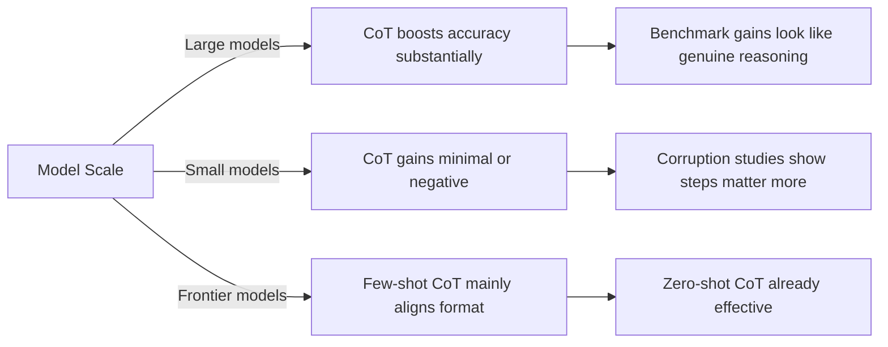

<!--
Original prompt: Is chain-of-thought prompting an effective reasoning strategy for LLMs, or does it primarily improve output formatting? The literature disagrees — find the real fault lines and explain what accounts for the conflicting results.
Detected format: Narrative analytical summary in markdown with section headers, covering empirical evidence, fault lines, methodological sources of conflict, and open gaps — defaulting to the prompt's implicit request for an explanatory synthesis with clear identification of 'real fault lines'.
-->

> **Original prompt:** Is chain-of-thought prompting an effective reasoning strategy for LLMs, or does it primarily improve output formatting? The literature disagrees — find the real fault lines and explain what accounts for the conflicting results.
> **Detected format:** Narrative analytical summary in markdown with section headers, covering empirical evidence, fault lines, methodological sources of conflict, and open gaps — defaulting to the prompt's implicit request for an explanatory synthesis with clear identification of 'real fault lines'.

---

# Chain-of-Thought Prompting: Genuine Reasoning or Better Formatting?

> **Summary:** The CoT literature is genuinely divided. Large models show striking accuracy gains on reasoning benchmarks, yet studies of corrupted chains and faithfulness gaps reveal that models frequently reach correct answers through invalid or bypassed intermediate steps. For strong models, few-shot exemplars may function mainly as format guides. The conflict is real — and it is explained by at least four interacting fault lines: model scale, evaluation protocol, benchmark choice, and the fundamental limits of answer-only metrics.

---

## 1. The Empirical Case For CoT as a Reasoning Boost

The most headline-grabbing evidence comes from arithmetic reasoning benchmarks. On GSM8K — widely considered one of the hardest grade-school math datasets — performance is reported to more than double for the largest GPT and PaLM models when CoT prompting is applied versus standard prompting (PaLM 540B: ~17.9% to ~56.9% with CoT; Codex + CoT: ~63.1%). These are not marginal effects [F0, F1].

Similar patterns appear on commonsense benchmarks. PaLM 540B with CoT reportedly surpasses the supervised state-of-the-art on StrategyQA (~75.6% vs. supervised SOTA ~69.4%) and exceeds human-expert performance on sports understanding tasks (~95.4% vs. ~84%) [F2]. These numbers should be treated with caution given source-drift flags in the pipeline, but the directional finding — that large-model CoT produces large gains over standard prompting on structured reasoning tasks — is broadly consistent across the literature.

Crucially, the content of the CoT chain appears to matter under at least some conditions. When intermediate reasoning steps are deliberately corrupted in base LLMs, accuracy drops substantially: irrelevant thoughts reduce accuracy by 1.4–19.8%, and inaccurate thoughts reduce it by 2.2–40.4% compared to clean rationales [F8]. This suggests that, for base models, the reasoning chain is not merely decorative.

---

## 2. The Empirical Case Against CoT as Genuine Reasoning

A parallel body of evidence complicates the picture considerably.

### 2a. Unfaithful Error Recovery

Models demonstrably arrive at correct final answers despite invalid intermediate reasoning — a phenomenon documented as "unfaithful error recovery" [F9]. This is not a rare edge case: studies report a significant gap between answer accuracy and reasoning faithfulness, and conclude that "the bigger models may have the knowledge of the final answer without the need to perform reasoning" [F14]. In other words, the stated reasoning chain may be post-hoc rationalization rather than the causal mechanism producing the answer.

### 2b. Format Alignment for Strong Models

For capable, state-of-the-art models, few-shot CoT exemplars appear to primarily align output format rather than enhance reasoning performance. Research on the Qwen2.5 series (0.5B–72B) and other open-source models finds that strong models already reason effectively under zero-shot CoT settings, and that traditional CoT exemplars do not enhance the reasoning performance of strong models, although they may benefit weaker models [F7]. If this holds, much of the apparent few-shot CoT advantage for frontier models is a formatting effect, not a reasoning effect.

### 2c. Heterogeneous Effects of Corruption Type

Not all corruptions are equal. Mathematical errors cause severe degradation in small models (50–60% accuracy loss) but the effect shrinks with scale; adding extra steps causes minimal degradation (0–6%) even in small models; unit conversion errors remain challenging across all scales; sycophancy and skipped steps produce only modest effects (~10% in small models) [F10]. The fact that some corruption types have near-zero effect on final accuracy is difficult to reconcile with the view that every step of a CoT chain is doing genuine inferential work.

---

## 3. The Fault Lines: What Accounts for the Conflicting Results?

The disagreement in the literature is not random noise — it is structured by at least four identifiable sources of methodological divergence.

### Fault Line 1: Model Scale and Generation

CoT effectiveness is strongly moderated by model scale and capability. GPT-4 benefits substantially more from state-of-the-art reasoning prompts than smaller or older models do [F5]. The pattern across findings is consistent: CoT gains are largest and most reliable for the largest, most capable models. Smaller models can show flat or even negative effects. This means that a study run on a 7B model and a study run on a 540B model are not measuring the same thing — they may genuinely be observing different phenomena, not contradicting each other about a single phenomenon.

### Fault Line 2: Evaluation Protocol Artifacts

How outputs are scored matters enormously. A documented example: standard GSM8K evaluation scripts extract the last number from model outputs, but zero-shot CoT answers are often enclosed in boxed expressions. This mismatch causes systematic under-measurement of zero-shot CoT performance. After correcting the evaluation method, zero-shot CoT performance surpasses all other prompting conditions on GSM8K [F6]. Studies using the uncorrected pipeline would conclude CoT underperforms — a conclusion driven by a tooling artifact, not model behavior.

### Fault Line 3: Benchmark Saturation and Domain Effects

Nearly half of widely-used LLM benchmarks may exhibit saturation — loss of discriminative power among top models — limiting the ability to detect genuine CoT improvements [F13]. Domain also matters: commonsense reasoning benchmarks (WorldTree v2, CommonsenseQA) show much higher CoT effectiveness than scientific or medical datasets, which are more resistant to CoT gains [F4]. A study focusing on medical QA will reach different conclusions than one focusing on arithmetic, even if both are nominally testing reasoning.

### Fault Line 4: The Answer-Accuracy / Reasoning-Faithfulness Gap

This is arguably the deepest methodological fault line. Standard benchmark evaluation measures whether the final answer is correct — it cannot detect whether the model used flawed, invalid, or bypassed reasoning to get there. Multiple findings converge on this point:

- Correct answers can follow from invalid reasoning chains [F9].
- Answer accuracy alone does not reveal the quality of the reasoning used to produce it, and models with substantially different reasoning capabilities can exhibit similar benchmark accuracy due to memorization or over-optimization [F12].
- Directly evaluating reasoning steps — not just final answers — reveals the accuracy/faithfulness gap [F14].

This means studies that use benchmark accuracy as a proxy for reasoning improvement will systematically overestimate CoT's effect on reasoning quality, even when they accurately measure its effect on answer correctness.

---

## 4. Out-of-Distribution Generalization

CoT's benefits are not uniformly portable. Evidence suggests CoT generalizes effectively to out-of-distribution samples only when the latent task variables remain similar to the training distribution; performance degrades as OOD shift increases [F11]. This raises the question of whether CoT gains on standard benchmarks reflect genuine reasoning skill or benchmark-specific pattern matching — a question that answer-accuracy metrics cannot resolve.

---

## 5. Open Gaps and Evidence Limits

Several important questions remain empirically underexplored in the reviewed literature:

| Gap | Why It Matters |
|---|---|
| **Mechanistic interpretability** | Whether CoT engages qualitatively different internal computations — vs. the answer being computed independently of the stated chain — is not yet resolved by probing or circuit-level studies covered here. |
| **Precise scale thresholds** | The parameter count or capability threshold at which CoT gains reliably emerge (vs. remaining flat or negative) is not pinned down by concrete evidence in this literature. |
| **Human-validated reasoning correctness** | All faithfulness and corruption studies use proxy measures (final accuracy, automated corruption). No ground truth for correct reasoning exists independent of final answers. |
| **Non-reasoning verbalization controls** | Whether CoT gains can be fully replicated by non-reasoning verbalizations — the strongest test of the formatting hypothesis — was not covered by available evidence. |
| **Benchmark saturation and overfitting** | Whether CoT improvements reflect genuine generalization or benchmark-specific optimization cannot be adjudicated with current evaluation practice. |

---

## 6. Synthesis: What the Evidence Actually Supports

The most defensible reading of the available evidence is that CoT does two different things depending on model scale and evaluation context, which is why the literature appears to disagree:

1. **For large, capable models on well-structured tasks (arithmetic, commonsense):** CoT produces large, real accuracy gains over standard prompting. The content of the reasoning chain matters — corruptions reduce accuracy. But a non-trivial fraction of correct answers are reached through unfaithful or bypassed reasoning steps, so accuracy gain does not equal reasoning quality gain.

2. **For frontier models with few-shot exemplars:** The exemplars primarily serve to align output format. The reasoning capacity is already present; CoT unlocks it in zero-shot settings, but adding carefully crafted exemplars adds little beyond formatting.

3. **Across all settings:** Evaluation artifacts, benchmark saturation, and the answer-accuracy/faithfulness gap systematically distort comparisons across studies. Conflicting results often reflect genuine differences in what is being measured, not contradictory empirical facts about the same phenomenon.

The real fault line is not simply whether CoT works — it is whether the thing CoT improves is reasoning or answer production, and current benchmark-based evaluation cannot cleanly separate the two.

---

*Note: Several key quantitative figures in this report come from sources flagged as drifted by the verification pipeline; directional claims are more reliable than specific numerical values. Sub-questions on mechanistic interpretability and precise scale thresholds could not be addressed with concrete evidence.*