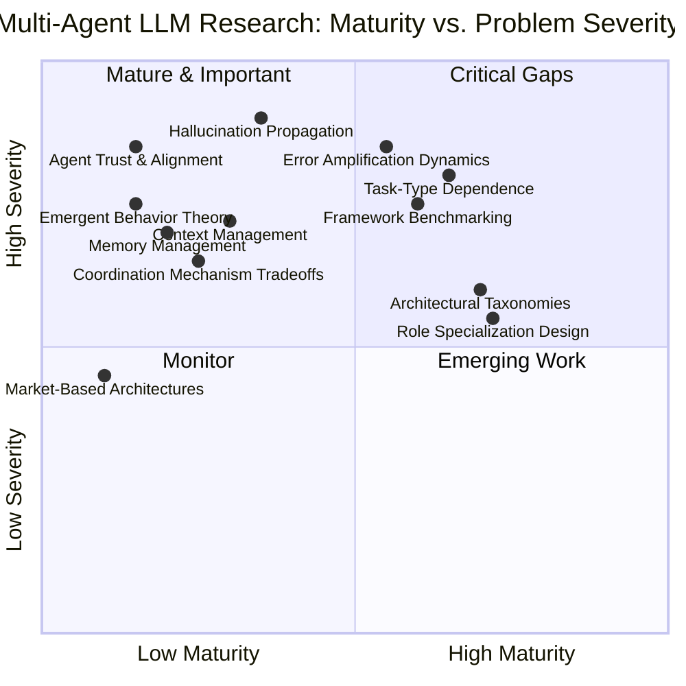

<!--
Original prompt: Map the research landscape of multi-agent LLM systems. Produce a structured report that includes a visual taxonomy or design graph showing the major architectural patterns, how they relate, and where the open problems are.
Detected format: Structured narrative report in GitHub-flavored markdown with a Mermaid visual taxonomy/design graph, section headers, tables, and explicit open-problems coverage — as requested by the user's 'structured report' with 'visual taxonomy or design graph'.
-->

> **Original prompt:** Map the research landscape of multi-agent LLM systems. Produce a structured report that includes a visual taxonomy or design graph showing the major architectural patterns, how they relate, and where the open problems are.
> **Detected format:** Structured narrative report in GitHub-flavored markdown with a Mermaid visual taxonomy/design graph, section headers, tables, and explicit open-problems coverage — as requested by the user's 'structured report' with 'visual taxonomy or design graph'.

---

# Research Landscape of Multi-Agent LLM Systems

> **Note on coverage gaps:** Two sub-questions could not be fully addressed due to evidence retrieval failures: (1) coordination/communication mechanism trade-offs (shared memory, message passing, blackboard systems, structured debate), and (2) a systematic audit of which field claims outpace empirical support. These gaps are flagged inline. Additionally, market-based/auction-style architectures and agent trust/alignment mechanisms are referenced in the literature but absent from available evidence. All numerical findings reflect the literature at the time of research in a rapidly evolving field.

---

## 1. Architectural Taxonomy — Visual Design Graph

The graph below maps the major architectural patterns, their relationships, and where the open problems cluster.

```mermaid
flowchart TD
    ROOT(["Multi-Agent LLM Systems"])

    %% ── Dimension 1: Control Hierarchy ──
    ROOT --> DIM1["Dimension 1\nControl Hierarchy"]
    DIM1 --> CENT["Centralized\n(Orchestrator / Supervisor)"]
    DIM1 --> DECENT["Decentralized\n(Peer-to-Peer / Mesh)"]
    DIM1 --> HYBRID["Hybrid\n(Blended Control)"]

    %% ── Canonical Topologies ──
    CENT --> HUB["Hub-Spoke\n(Star Topology)"]
    CENT --> HIER["Hierarchical\n(Tree Topology)"]
    DECENT --> MESH["Mesh\n(Peer-to-Peer)"]
    HYBRID --> HYBRID2["Layered Supervisor-Worker\n+ Local P2P"]

    %% ── Dimension 2: Information Flow ──
    ROOT --> DIM2["Dimension 2\nInformation Flow"]
    DIM2 --> PIPELINE["Sequential Pipeline\n(output feeds next agent)"]
    DIM2 --> PUBLISH["Publish-Subscribe\n(global message pool)"]
    DIM2 --> SHARED["Shared State / Blackboard"]
    DIM2 --> CONVO["Conversation History\n(group chat)"]

    %% ── Dimension 3: Role & Task Delegation ──
    ROOT --> DIM3["Dimension 3\nRole & Task Delegation"]
    DIM3 --> STATIC["Static Role Assignment\n(SOP-driven)"]
    DIM3 --> DYNAMIC["Dynamic Role Assignment"]
    DIM3 --> SPECIALIZED["Specialized Agents\n(Judge, Critic, Refiner,\nCurator, Planner, Executor)"]
    DIM3 --> NURTURE["Nurture-First Development\n(progressive agent growth)"]

    %% ── Dimension 4: Temporal Layering ──
    ROOT --> DIM4["Dimension 4\nTemporal Layering"]
    DIM4 --> SYNC["Synchronous / Turn-Based"]
    DIM4 --> ASYNC["Asynchronous / Parallel"]
    DIM4 --> REFLEXIVE["Reflexive / Self-Correcting\n(iterative loops)"]

    %% ── Dimension 5: Communication Structure ──
    ROOT --> DIM5["Dimension 5\nCommunication Structure"]
    DIM5 --> NATL["Unstructured Natural Language"]
    DIM5 --> STRUCT["Structured Documents\n(diagrams, code, tables)"]
    DIM5 --> TOOL["Tool-Use Protocols"]

    %% ── Framework Implementations ──
    ROOT --> FWKS["Framework Implementations"]
    FWKS --> CREWAI["CrewAI\nRole-based crew,\nsequential or hierarchical"]
    FWKS --> LANGGRAPH["LangGraph\nDirected-graph state machine,\nconditional routing"]
    FWKS --> AUTOGEN["AutoGen\nConversation-based group chat"]
    FWKS --> METAGPT["MetaGPT\nSOP-driven, publish-subscribe\nmessage pool, structured docs"]

    CREWAI -.-> STATIC
    CREWAI -.-> PIPELINE
    LANGGRAPH -.-> SHARED
    LANGGRAPH -.-> DYNAMIC
    AUTOGEN -.-> CONVO
    AUTOGEN -.-> DECENT
    METAGPT -.-> PUBLISH
    METAGPT -.-> STRUCT

    %% ── Open Problems ──
    ROOT --> OPEN["⚠️ Open Problems"]
    OPEN --> OP1["Task Allocation &\nWorkflow Optimization"]
    OPEN --> OP2["Context Management\n(multi-level layering)"]
    OPEN --> OP3["Memory Management\n(underexplored)"]
    OPEN --> OP4["Emergent Collective Behavior\n(no principled theory)"]
    OPEN --> OP5["Hallucination Propagation\n& Error Amplification"]
    OPEN --> OP6["Malicious Error Injection\n& Trust/Safety"]
    OPEN --> OP7["Coordination/Communication\nTrade-offs (evidence gap)"]
    OPEN --> OP8["Market-Based / Incentive\nArchitectures (evidence gap)"]

    style OPEN fill:#ff6b6b,color:#fff
    style OP1 fill:#ffa07a
    style OP2 fill:#ffa07a
    style OP3 fill:#ffa07a
    style OP4 fill:#ffa07a
    style OP5 fill:#ffa07a
    style OP6 fill:#ffa07a
    style OP7 fill:#c0c0c0
    style OP8 fill:#c0c0c0
    style ROOT fill:#4a90d9,color:#fff
```

*Grey open-problem nodes (OP7, OP8) denote areas flagged by the research decomposition where evidence retrieval failed or returned no usable findings.*

---

## 2. Architectural Patterns — Five Taxonomic Dimensions

The literature proposes organizing multi-agent LLM (HMAS) architectures along **five axes**:

| Dimension | What It Captures | Key Variants |
|---|---|---|
| **Control Hierarchy** | Who makes decisions; centralization vs. autonomy | Centralized, Decentralized, Hybrid |
| **Information Flow** | How data and results move between agents | Sequential pipeline, Publish-subscribe, Shared state, Conversation history |
| **Role & Task Delegation** | How work is assigned; specialization depth | Static SOP, Dynamic, Specialized roles, Nurture-First Development |
| **Temporal Layering** | Synchrony and iteration structure | Synchronous, Asynchronous/Parallel, Reflexive/Self-correcting |
| **Communication Structure** | Format and medium of inter-agent messages | Natural language, Structured documents, Tool-use protocols |

The intent of this taxonomy is **comparative**, not prescriptive — no single design is universally best.

### 2.1 Control Hierarchy: The Centralization Spectrum

At one extreme, a **fully centralized** system places a single top-level orchestrator in charge of all decisions and instructions to lower-level agents. At the other, a **fully decentralized** mesh has no single leader. **Hybrid** designs blend both, often with centralized coordination at the top level and local peer-to-peer interactions within subgroups.

### 2.2 Three Canonical Topologies

| Topology | Communication Pattern | State Ownership | Failure Domain |
|---|---|---|---|
| **Hub-Spoke** (Star) | All agents route through a central hub | Hub-centric | Hub is single point of failure |
| **Hierarchical** (Tree) | Upper layers decompose and delegate; lower layers execute | Distributed by layer | Subtree failures are contained |
| **Mesh** (Peer-to-Peer) | Any agent can communicate with any other | Distributed / shared | Failure propagation can be broad |

Upper layers in hierarchical designs decompose tasks and assign them to lower-layer agents; meta-prompts can be learned and shared within each layer, enabling scalable prompt optimization.

---

## 3. Role Specialization and Task Decomposition

Role-based decomposition is a dominant pattern in the literature. Concrete exemplars include:

- **Judge** — identifies errors in outputs
- **Critic** — provides comprehensive critiques
- **Refiner** — corrects and improves prior work
- **Curator** — distills recurring patterns into reusable knowledge assets

This four-role pipeline (from the Table-Critic framework) illustrates how a single task can be decomposed into complementary agent functions that iterate toward higher-quality outputs.

### 3.1 Nurture-First Development (NFD)

Domain-expert agents need not be fully specified at initialization. The **Nurture-First Development** paradigm starts agents with minimal scaffolding and grows their expertise through structured conversational interaction with domain practitioners. The core mechanism — the *Knowledge Crystallization Cycle* — periodically consolidates fragmented operational knowledge into structured, reusable assets.

### 3.2 Task Allocation Challenges

Effective partitioning of work across agents is an open challenge with three simultaneous requirements:
1. **Capability maximization** — each subtask should match an agent's unique strengths.
2. **Goal alignment** — every agent's tasks must directly contribute to the overall objective.
3. **Context awareness** — the design must account for both global task context and each agent's local context.

---

## 4. Communication and Coordination Mechanisms

> ⚠️ **Coverage gap (sq2):** Despite 10 search attempts, no concrete evidence was retrieved on the comparative trade-offs among coordination mechanisms (shared memory, message passing, blackboard systems, tool-use protocols, structured debate). The following reflects what can be inferred from framework-level and empirical findings.

The frameworks described in Section 6 implicitly encode different communication models:

- **Sequential pipeline** (CrewAI sequential mode): each agent's output becomes the next agent's input context; simple but creates bottlenecks and limits parallelism.
- **Directed-graph routing** (LangGraph): conditional edges allow branching and looping; state is explicitly tracked via a schema.
- **Conversation history** (AutoGen): agents share a rolling transcript; flexible but context windows become a constraint at scale.
- **Publish-subscribe message pool** (MetaGPT): agents publish structured documents; any agent can subscribe to relevant outputs, enabling asynchronous parallel consumption.

---

## 5. Empirical Evidence and Benchmarks

### 5.1 Framework-Level Design Has Outsized Effects

MAFBench — a unified evaluation suite running multiple frameworks under a standardized execution pipeline — found that **framework-level design choices alone** can:
- Increase **latency by over 100×**
- Reduce **planning accuracy by up to 30%**
- Drop **coordination success from >90% to <30%**

This is among the strongest empirical signals in the field: the choice of architectural framework matters as much as (or more than) the choice of underlying model.

### 5.2 Task Type Determines Whether Multi-Agent Helps

A Google Research empirical study found that the benefit of multi-agent coordination is **strongly task-type-dependent**:

| Task Type | Result |
|---|---|
| Parallelizable financial reasoning | Centralized coordination improved performance **+80.9%** over single agent |
| Sequential reasoning (PlanCraft) | All multi-agent variants **degraded** performance by **39–70%** |

### 5.3 Architectural Choice Controls Error Propagation

The same study quantified **error amplification** by architecture:

| Architecture | Error Amplification Factor |
|---|---|
| Independent (parallel, non-communicating) agents | **17.2×** |
| Centralized (orchestrator-based) | **4.4×** |

Centralized orchestrators act as *validation bottlenecks* that catch errors before they cascade. By contrast, parallel agents without communication let errors propagate unchecked.

> ⚠️ **Source quality note:** The 80.9%, 17.2×, and 4.4× figures come from a Google Research blog post (not a peer-reviewed venue) and lack independent replication as captured in these findings.

### 5.4 Cost-Accuracy Trade-offs by Topology

On financial document extraction (F1 scoring), a controlled study found:

| Architecture | Field-Level F1 | Relative Cost |
|---|---|---|
| Reflexive (self-correcting) | **0.943** | 2.3× baseline |
| Hierarchical (supervisor-worker) | **0.921** | 1.4× baseline |
| Hybrid (semantic caching + adaptive retries) | ~0.936 (89% of reflexive gain) | 1.15× baseline |
| Sequential baseline | ~0.89 (implied) | 1.0× |

Hierarchical architectures occupy the **best cost-accuracy Pareto position**; hybrid configurations can recover most of reflexive accuracy gains at near-baseline cost.

---

## 6. Software Frameworks and Their Architectural Assumptions

| Framework | Primary Abstraction | Control Model | Communication Model | Best Suited For |
|---|---|---|---|---|
| **CrewAI** | Role-based "crew" of agents | Sequential or hierarchical; manager delegates to workers | Task output chained as context | Structured multi-step workflows with clear role divisions |
| **LangGraph** | Directed-graph state machine | Conditional routing via graph edges | Explicit state schema; nodes transform state | Complex workflows with loops, branches, dynamic routing |
| **AutoGen** | Conversational group chat | Decentralized peer conversation | Conversation history (transcript) | Research, exploratory multi-agent chat, flexible multi-turn |
| **MetaGPT** | SOP-driven agent team | Structured roles per standard operating procedures | Publish-subscribe global message pool; structured documents | Software engineering pipelines; document-centric workflows |

> ⚠️ **Source quality note:** The AutoGen description is based on a comparative practitioner guide and reflects a specific version; AutoGen's architecture has evolved across releases.

---

## 7. Open Problems

The following table summarizes the primary unsolved challenges, their nature, and current evidence status.

| Open Problem | Description | Evidence Status |
|---|---|---|
| **Task Allocation & Workflow Optimization** | Simultaneously maximizing capability utilization, goal alignment, and context awareness when partitioning work across agents | Identified in literature; no principled solution |
| **Multi-Level Context Management** | Coordinating overall task context, individual agent context, and shared inter-agent knowledge without loss of alignment | Identified; current systems inadequate |
| **Memory Management** | Enabling agents to store, share, and learn from prior workflows; existing literature devotes limited attention to this | Underexplored; flagged as critical gap |
| **Emergent Collective Behavior** | No theoretical consensus on when/how synergy emerges, what role agent differentiation plays, or how to steer it | No principled theory; nascent understanding |
| **Hallucination Propagation** | Non-factual outputs from one agent amplify through the network | Identified; mitigation strategies nascent |
| **Malicious Error Injection** | Adversarially introduced errors corrupt previously reliable agents across the pipeline | Identified; active safety research area |
| **Agent Trust & Alignment** | Mechanisms for agents to verify each other's outputs, establish trust, and remain aligned with global objectives | ⚠️ Evidence gap — flagged in decomposition, no findings retrieved |
| **Coordination Mechanism Trade-offs** | Comparative empirical analysis of shared memory vs. message passing vs. blackboard vs. structured debate | ⚠️ Evidence gap — 10 search attempts failed |
| **Market-Based / Incentive Architectures** | Auction- and incentive-based multi-agent designs referenced in taxonomy but absent from empirical literature | ⚠️ Evidence gap — no findings retrieved |
| **Weak Empirical Grounding of Field Claims** | Proportion of field claims that outpace rigorous evaluation; contested findings | ⚠️ Evidence gap — 11 search attempts failed |

### 7.1 Emergent Behavior — Deeper Note

Despite impressive performance of many multi-agent systems, there is no principled understanding of:
- *When and how* collective synergy emerges
- *What role* agent differentiation (diversity of capabilities or prompts) plays
- *How* emergence can be systematically steered toward desired outcomes

This gap points to a need for a theory of collective intelligence specific to LLM-based agent populations.

### 7.2 Safety: Hallucination and Error Propagation

Two distinct but related safety failure modes have been identified:
1. **Hallucination propagation** — non-factual outputs from one agent amplify as they pass through downstream agents.
2. **Malicious error injection** — adversarial actors introduce errors that cause otherwise reliable agents to perpetuate them across the pipeline.

The empirical finding that independent (non-communicating) parallel agents amplify errors 17.2× versus 4.4× for orchestrator-mediated systems suggests architectural choices can partially mitigate these risks, but dedicated safety mechanisms remain an open research area.

---

## 8. Summary: Where the Field Stands

### Key Takeaways

1. **Architecture matters enormously** — framework-level design choices alone can produce 100× latency differences and 30-percentage-point accuracy swings (MAFBench).
2. **Fit architecture to task type** — parallelizable tasks benefit from centralized multi-agent coordination (+80.9%); sequential tasks can be *harmed* by it (-39 to -70%).
3. **Centralization reduces error propagation** — orchestrator-based systems contain error amplification to 4.4× vs. 17.2× for independent parallel agents.
4. **The five-dimension taxonomy** (control hierarchy, information flow, role delegation, temporal layering, communication structure) provides a principled lens for comparing designs.
5. **Major open problems** — emergent behavior, memory management, context management, hallucination propagation, and trust/alignment — lack both principled theory and strong empirical solutions.
6. **Critical evidence gaps** — coordination mechanism trade-offs, market-based architectures, and a systematic audit of contested claims remain unaddressed in available literature.

---

*Report generated from structured findings. All numerical claims reflect sources available at time of research. For rapidly evolving benchmarks, consult current literature.*
