<!--
Original prompt: Map the research landscape of multi-agent LLM systems. Produce a structured report that includes a visual taxonomy or design graph showing the major architectural patterns, how they relate, and where the open problems are.
Detected format: Structured narrative report in GitHub-flavored markdown with a mermaid diagram for the visual taxonomy/design graph, section headers, and explicit coverage of open problems and caveats.
-->

> **Original prompt:** Map the research landscape of multi-agent LLM systems. Produce a structured report that includes a visual taxonomy or design graph showing the major architectural patterns, how they relate, and where the open problems are.
> **Detected format:** Structured narrative report in GitHub-flavored markdown with a mermaid diagram for the visual taxonomy/design graph, section headers, and explicit coverage of open problems and caveats.

---

# Research Landscape of Multi-Agent LLM Systems

> **Coverage note:** This report is based on a deep-research pipeline that executed 70+ tool calls across seven sub-questions. Significant evidence gaps exist for named frameworks, architectural taxonomies, safety challenges, open problems, and missing-evidence surveys. These gaps are explicitly flagged throughout. What follows represents the best-grounded picture available from extractable findings.

---

## 1. Visual Taxonomy: Architectural Patterns and Design Graph

The pipeline could not extract a grounded, source-backed taxonomy of all major architectural patterns (orchestration topology, agent roles, tool use, memory sharing) despite extensive search. The diagram below synthesizes the **coordination and communication paradigms** for which concrete evidence was found, and marks other commonly cited dimensions as **[EVIDENCE GAP]**.

```mermaid
flowchart TD
    MAS[Multi-Agent LLM Systems]

    MAS --> COMM[Communication and Coordination Paradigms]
    MAS --> ARCH[Orchestration Topology - EVIDENCE GAP]
    MAS --> ROLES[Agent Roles and Specialization - EVIDENCE GAP]
    MAS --> MEM[Memory and State Sharing]
    MAS --> TOOLS[Tool Use and Grounding - EVIDENCE GAP]
    MAS --> EVAL[Evaluation and Benchmarks]
    MAS --> OPEN[Open Problems - EVIDENCE GAP]

    COMM --> MP[Message-Passing]
    COMM --> BB[Blackboard Architecture]
    COMM --> SCS[Shared Cognitive Substrates]
    COMM --> EC[Emergent and Steered Coordination]

    MP --> MP1[Two-level framework: System-level vs System-internal communication]
    BB --> BB1[Central shared board plus control unit selects agents plus iterate until consensus]
    SCS --> SCS1[Shared World Model: typed state with invariants]
    SCS --> SCS2[Shared Causal Graph: dependencies and attribution]
    SCS --> SCS3[Shared Energy Pool: resource-aware arbitration]
    EC --> EC1[Persona assignment leads to stable identity differentiation]
    EC --> EC2[Theory-of-mind prompting leads to goal-directed complementarity]
    EC --> EC3[Info-theoretic measurement of synergy and redundancy]

    MEM --> BB
    MEM --> SCS

    ARCH --> ARCH1[Hierarchical - EVIDENCE GAP]
    ARCH --> ARCH2[Flat or Peer-to-Peer - EVIDENCE GAP]
    ARCH --> ARCH3[Pipeline or Sequential - EVIDENCE GAP]
    ARCH --> ARCH4[Dynamic or Adaptive - EVIDENCE GAP]

    EVAL --> EVAL1[Coding and SE: SWE-bench, AppWorld]
    EVAL --> EVAL2[Web Navigation: WebArena, VisualWebArena]
    EVAL --> EVAL3[Research Reproduction: CORE-Bench, PaperBench]
    EVAL --> EVAL4[Multi-hop Reasoning: 7 benchmarks]
    EVAL --> CONTROVERSY[CONTROVERSY: Single-agent parity when compute is held constant]

    OPEN --> OPEN1[Cascading errors - EVIDENCE GAP]
    OPEN --> OPEN2[Communication overhead - EVIDENCE GAP]
    OPEN --> OPEN3[Safety and adversarial robustness - EVIDENCE GAP]
    OPEN --> OPEN4[Standardized benchmarks - EVIDENCE GAP]
    OPEN --> OPEN5[Theoretical foundations - EVIDENCE GAP]
```

**Legend:**
- Plain nodes = grounded in extracted evidence
- Nodes marked EVIDENCE GAP = commonly cited in the field but no grounded claims could be extracted by this pipeline
- CONTROVERSY node = empirically contested finding

---

## 2. Communication and Coordination Paradigms (Grounded)

### 2.1 Two-Level Communication Framework

A structured framework for characterizing multi-agent LLM interactions distinguishes two levels of communication:

- **System-level communication**: covers architecture, goals, and protocols — the macro-structure of how the system is organized.
- **System-internal communication**: covers strategies, paradigms, objects, and content — the micro-structure of how individual agents interact, negotiate, and collectively produce outputs.

This two-level decomposition provides a vocabulary for comparing different multi-agent designs and understanding how collective intelligence emerges from local interactions. *(Source: arxiv.org/html/2502.14321v2)*

### 2.2 Blackboard Architecture

The classical blackboard pattern from AI has been adapted for LLM multi-agent systems with three defining properties:

1. Agents with various roles **share all information and messages** on a central board throughout the problem-solving process.
2. Agents selected to act next are **chosen based on the current board content** (not a fixed schedule), enabling dynamic, state-driven orchestration.
3. The selection-execution cycle **repeats until consensus** is reached on the blackboard.

This contrasts with pipeline or sequential designs by making agent activation reactive to collective state. *(Source: arxiv.org/html/2507.01701v1)*

### 2.3 Shared Cognitive Substrates (Paradigm Shift Proposal)

A proposed alternative to message-passing architectures argues that agents should coordinate through **three explicit shared primitives** rather than exchanging messages:

| Primitive | Description |
|---|---|
| **Shared World Model** | Typed state with invariants: a canonical, structured representation of the world all agents read and write |
| **Shared Causal Graph** | Explicit dependency and attribution paths: allows agents to reason about why the world is in a given state |
| **Shared Energy Pool** | Resource-aware arbitration: enables prioritization and budget management under constraints |

This paradigm shift is motivated by the observation that message-passing creates coordination brittleness and attribution ambiguity. *(Source: openreview.net/forum?id=RRIw2L4Z1g)*

### 2.4 Emergent and Steered Coordination

Coordination can be **measured** with information-theoretic tools (capturing synergy, redundancy, and complementarity across agents) and **steered** via prompt design:

- **Control condition**: agents exhibit strong temporal synergy but little coordinated alignment across agents — essentially independent parallel processing.
- **Persona assignment**: introduces stable, identity-linked differentiation between agents — agents begin to specialize.
- **Personas plus theory-of-mind instructions** ("think about what other agents might do"): produces identity-linked differentiation and goal-directed complementarity — the system shifts from an aggregate of agents to a higher-order collective.

This finding is practically significant: it suggests that the degree of multi-agent coordination is a design variable controllable through prompting, not only through architecture. *(Source: arxiv.org/abs/2510.05174)*

---

## 3. Named Frameworks: Evidence Gap

> **The pipeline executed 10 tool calls targeting AutoGen, CrewAI, LangGraph, MetaGPT, ChatDev, CAMEL, and OpenAgents and could not extract grounded, citable comparative claims about any of them.** The table below lists these systems as commonly cited in the community but cannot be populated with verified architectural characterizations from this pipeline's evidence.

| Framework | Architectural Pattern | Communication Model | Evidence Status |
|---|---|---|---|
| AutoGen | — | — | EVIDENCE GAP |
| CrewAI | — | — | EVIDENCE GAP |
| LangGraph | — | — | EVIDENCE GAP |
| MetaGPT | — | — | EVIDENCE GAP |
| ChatDev | — | — | EVIDENCE GAP |
| CAMEL | — | — | EVIDENCE GAP |
| OpenAgents | — | — | EVIDENCE GAP |

---

## 4. Evaluation Benchmarks and Empirical Landscape

### 4.1 Benchmark Domains

Multi-agent LLM systems have been evaluated across a broad range of domains:

**Software Engineering and Coding**
- SWE-bench (GitHub issue resolution)
- ScienceAgentBench (scientific data analysis programming)
- AppWorld (interactive coding in apps)

**Research Reproduction**
- CORE-Bench
- PaperBench

**Web Navigation and Interaction**
- BrowserGym, WebArena, WebCanvas (general navigation)
- VisualWebArena, MMInA (multimodal web tasks)
- ASSISTANTBENCH (realistic, time-consuming web tasks)

**Reasoning and Planning**
- Seven benchmarks spanning coding, mathematics, general QA, domain-specific reasoning, and real-world planning and tool use

*(Sources: arxiv.org/html/2507.21504v1; openreview.net/forum?id=i95lcR2GN5)*

### 4.2 Central Empirical Controversy

A significant methodological dispute divides the field:

> **Do multi-agent architectures genuinely outperform single-agent baselines, or are reported gains an artifact of uncontrolled computation?**

- **Multi-agent-positive view**: Multiple benchmark evaluations treat multi-agent systems as legitimate high-performance solutions across the domains listed above, and leading benchmark leaderboards (SWE-bench, WebArena) are dominated by multi-agent pipelines.
- **Compute-controlled critique**: A recent study finds that **single-agent systems (SAS) consistently match or outperform multi-agent systems (MAS) on multi-hop reasoning tasks when reasoning tokens are held constant**. A detailed diagnostic analysis suggests that many reported multi-agent advantages are better explained by unaccounted computation and context effects rather than inherent architectural benefits.

**Caveat**: The compute-controlled critique comes from a preprint (arxiv.org/abs/2604.02460) that has not yet been independently replicated. It should be treated as a hypothesis requiring further validation, not a settled finding.

This controversy is a load-bearing open problem: if confirmed, it would require the field to revise how multi-agent evaluation is conducted, controlling for total inference budget rather than just number of agents or steps.

---

## 5. Open Research Problems

> **The pipeline executed 12 tool calls targeting open problems and 11 targeting safety and adversarial robustness but could not extract grounded primary-source evidence for any specific open problem or failure mode.** The list below represents the structure of the known open-problem space as identified by the sub-question framing, but cannot be populated with cited evidence from this report.

### 5.1 Coordination and Architecture
- **Cascading errors**: how local agent errors propagate and amplify through multi-agent pipelines — *EVIDENCE GAP*
- **Communication overhead**: latency and cost tradeoffs of different communication topologies at scale — *EVIDENCE GAP*
- **Role specialization**: how to assign and maintain differentiated agent roles without collapse to homogeneity — *EVIDENCE GAP*
- **Scalability**: whether coordination mechanisms degrade gracefully as agent count grows — *EVIDENCE GAP*

### 5.2 Alignment and Safety
- **Agent alignment**: ensuring individual agents pursue system-level goals — *EVIDENCE GAP*
- **Prompt injection propagation**: how adversarial inputs injected at one agent can compromise downstream agents — *EVIDENCE GAP*
- **Deceptive agent behavior**: whether LLM agents can behave deceptively toward other agents or the orchestrator — *EVIDENCE GAP*
- **Principal-agent misalignment across hierarchies**: when orchestrator goals and sub-agent goals diverge — *EVIDENCE GAP*

### 5.3 Evaluation and Foundations
- **Standardized benchmarks**: the field lacks agreed-upon, compute-controlled evaluation protocols — *EVIDENCE GAP, partially surfaced by compute controversy in Section 4.2*
- **Theoretical foundations**: formal models for multi-agent LLM coordination remain nascent — *EVIDENCE GAP*
- **Long-horizon real-world deployments**: few studies document sustained multi-agent deployment outside benchmark settings — *EVIDENCE GAP*
- **Cross-framework comparisons**: no standardized head-to-head comparisons of AutoGen, CrewAI, LangGraph, etc. were found — *EVIDENCE GAP*

---

## 6. Summary Assessment

### What the evidence supports

| Area | Coverage | Key Finding |
|---|---|---|
| Communication framework vocabulary | Grounded | Two-level (system-level vs. system-internal) decomposition |
| Blackboard architecture | Grounded | Central board plus reactive agent selection plus consensus iteration |
| Shared cognitive substrates | Grounded proposal | World model plus causal graph plus energy pool as coordination primitives |
| Emergent coordination steering | Grounded | Personas plus ToM prompting shifts aggregates to collectives |
| Benchmark landscape | Partially grounded | SWE-bench, WebArena, CORE-Bench, and others documented |
| Single-agent parity debate | Contested preprint | Compute-controlled comparisons may eliminate multi-agent gains |

### What the evidence does not yet support

| Area | Status |
|---|---|
| Full architectural taxonomy (topology, roles, tool use) | Evidence gap |
| Named framework characterizations (AutoGen, MetaGPT, etc.) | Evidence gap |
| Open problems with primary-source citations | Evidence gap |
| Safety and adversarial robustness findings | Evidence gap |
| State of missing evidence and theoretical foundations | Evidence gap |

---

## References (Extracted Sources)

1. Multi-agent LLM communication framework: https://arxiv.org/html/2502.14321v2
2. Blackboard architecture for LLM MAS: https://arxiv.org/html/2507.01701v1
3. Shared cognitive substrates paradigm: https://openreview.net/forum?id=RRIw2L4Z1g
4. Information-theoretic coordination steering: https://arxiv.org/abs/2510.05174
5. Multi-agent benchmark landscape: https://arxiv.org/html/2507.21504v1
6. Seven-benchmark MAS evaluation: https://openreview.net/forum?id=i95lcR2GN5
7. Single-agent parity under compute control (preprint): https://arxiv.org/abs/2604.02460
