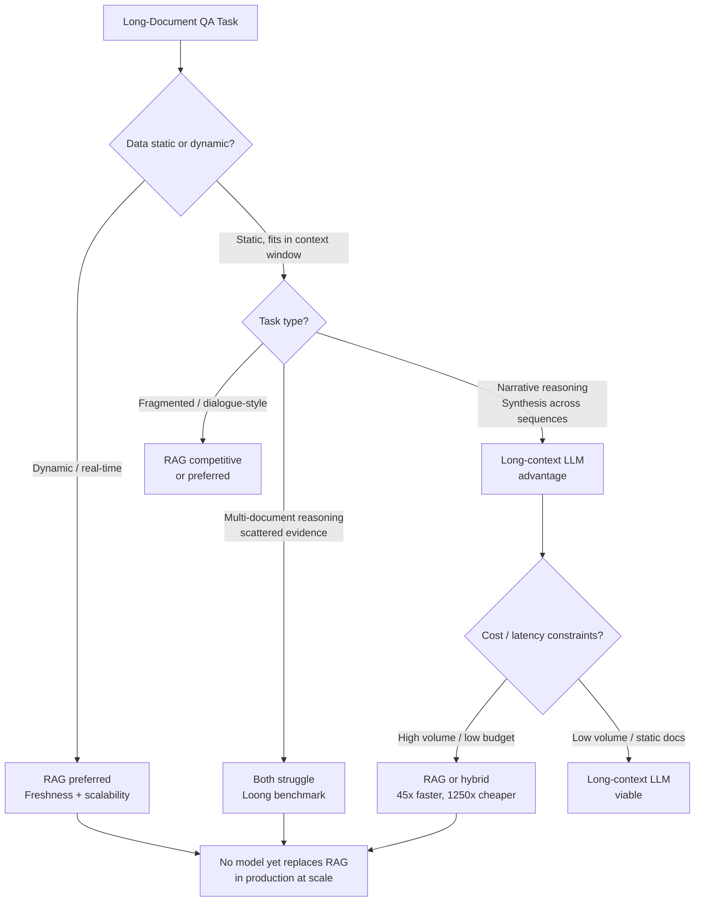

<!--
Original prompt: What's the current consensus on long-context models vs. retrieval for long-document QA—are 1M+ token context windows making RAG obsolete, and under what conditions?
Detected format: Narrative summary in markdown with structured sections, covering all seven sub-questions, including a comparative analysis, caveats, and inline citations.
-->

> **Original prompt:** What's the current consensus on long-context models vs. retrieval for long-document QA—are 1M+ token context windows making RAG obsolete, and under what conditions?
> **Detected format:** Narrative summary in markdown with structured sections, covering all seven sub-questions, including a comparative analysis, caveats, and inline citations.

---

# Long-Context LLMs vs. RAG for Long-Document QA: Current Consensus (2023–2025)

> **TL;DR:** There is no consensus that 1M+ token context windows make RAG obsolete. The research is actively contested across accuracy, cost, and deployment dimensions. Long-context LLMs hold advantages in self-contained reasoning tasks; RAG retains strong advantages in cost, latency, and dynamic-data scenarios. The 'RAG is dead' narrative lacks direct empirical grounding in production settings.

---

## 1. Benchmark Performance: Who Wins Where?

The headline finding from a 2025 evaluation ([arxiv.org/2501.01880](https://arxiv.org/html/2501.01880v1)) is that **long-context (LC) LLMs generally outperform RAG on self-contained, narrative-style QA** (e.g., story comprehension), while **RAG excels at handling fragmented information—particularly in dialogue-based contexts**.

However, this finding does not generalize cleanly:

- On the **Loong multi-document benchmark**, RAG achieves *poor* performance when evidence is scattered across many documents, suggesting its advantage for fragmented information is limited to dialogue-style tasks, not multi-document reasoning broadly ([arxiv.org/2406.17419](https://arxiv.org/html/2406.17419v2)).
- An industry blog claims newer models "easily handle complex cross-document reasoning" ([meilisearch.com](https://www.meilisearch.com/blog/rag-vs-long-context-llms)), but the same Loong benchmark finds current long-context models still have "considerable potential for enhancement" on exactly this task type. **These claims are in direct conflict** (confidence: 0.72).

### Context Length and Model Tier

Not all long-context models perform equally. A large-scale evaluation ([arxiv.org/2411.03538](https://arxiv.org/html/2411.03538v1)) found:

- **Most open-source LLMs** show a "first increase then decrease" accuracy curve in RAG workflows, with effective context capped around **16–32K tokens**.
- Only a handful of state-of-the-art commercial models—**o1-mini/preview, GPT-4o, Claude 3.5 Sonnet**—maintain consistent accuracy above 64K tokens (confidence: 0.90).

This means claims about 1M-token capability apply to a small subset of frontier commercial models, not the field broadly.

---

## 2. Failure Modes of Long-Context LLMs

### "Lost in the Middle"

The most robustly documented failure mode is positional degradation. A foundational study ([arxiv.org/2307.03172](https://arxiv.org/abs/2307.03172)) found:

> *"Performance is often highest when relevant information occurs at the beginning or end of the input context, and significantly degrades when models must access relevant information in the middle of long contexts, even for explicitly long-context models."* (confidence: 0.95)

Empirical audits describe a **U-shaped attention curve**, with high recall at document boundaries but substantial hallucination for content in the middle 30–70% of the token sequence.

### Context Rot: Length Degrades Performance Intrinsically

A more troubling finding ([aclanthology.org/2025.findings-emnlp.1264](https://aclanthology.org/2025.findings-emnlp.1264/)) demonstrates that:

> *"Even when models can perfectly retrieve all relevant information, their performance still degrades substantially (13.9%–85%) as input length increases but remains well within their claimed context windows. This failure occurs even when irrelevant tokens are replaced with minimally distracting whitespace, and even when they are all masked and models are forced to attend only to the relevant tokens."* (confidence: 0.85)

This "context rot" effect suggests that **length itself—not just distracting content—is a source of degradation**, independent of retrieval quality. A study from Chroma ([trychroma.com](https://www.trychroma.com/research/context-rot)) corroborates: performance consistently degrades with increasing input length, with lower-similarity needle-question pairs accelerating the decline.

### Benchmark Gaming: NIAH Overestimates Production Performance

Single-needle retrieval benchmarks (Needle-in-a-Haystack) likely **overstate real production capability by 15–40 points** compared to multi-needle tasks. A blog post ([digitalapplied.com](https://www.digitalapplied.com/blog/long-context-retrieval-needle-in-haystack-2026)) reports multi-needle failure as the silent production failure mode. ⚠️ *Caution: This source cites model names (GPT-5.5, Gemini 3, Claude Opus 4.7, DeepSeek V4-Pro) that cannot be independently verified and may not correspond to publicly released models as of this writing. Treat specific figures with skepticism.* (confidence: 0.52)

---

## 3. When Does RAG Outperform or Remain Competitive?

| Condition | Favors RAG | Favors Long-Context LLM |
|---|---|---|
| **Data freshness** | ✅ Dynamic/real-time datasets | ❌ Static knowledge bases only |
| **Scale** | ✅ Large corpora (>context window) | ❌ Limited by window size |
| **Latency** | ✅ ~1s per query | ❌ ~45s at 1M tokens |
| **Cost** | ✅ Orders of magnitude lower | ❌ Expensive at scale |
| **Question type** | ✅ Fragmented/dialogue-style QA | ✅ Narrative reasoning, synthesis |
| **Infrastructure** | ✅ Standard hardware | ❌ High GPU/memory requirements |

A concrete benchmark (Elastic, [elastic.co](https://www.elastic.co/search-labs/blog/rag-vs-long-context-model-llm)) testing Gemini 2.0 Flash at 1M tokens found RAG was **45× faster** (1s vs. 45s) and **1,250× cheaper** ($0.00008 vs. $0.10 per query) (confidence: 0.80).

> ⚠️ **Cost figures are highly model- and provider-specific.** Other sources cite costs of "up to $20 per call" for 200K–1M token requests ([meilisearch.com](https://www.meilisearch.com/blog/rag-vs-long-context-llms); [dailydoseofds.com](https://blog.dailydoseofds.com/p/will-long-context-llms-make-rag-obsolete))—a three-orders-of-magnitude discrepancy versus the Gemini 2.0 Flash figure. Cost conclusions require current, model-specific pricing to be actionable (confidence: 0.70).

---

## 4. Does 1M+ Context Replace RAG in Production?

**No direct empirical evidence was found** supporting the claim that 1M+ token context windows (Gemini 1.5, Claude 3, GPT-4o) effectively replace RAG in production settings. This is a significant gap: the strongest version of the "RAG is obsolete" argument lacks empirical grounding in the literature surveyed.

What *is* supported:
- Long-context LLMs are well-suited for **static knowledge bases** where documents fit within the window and data changes infrequently.
- For **dynamic or real-time data**, RAG "remains undefeated" in terms of freshness and scalability ([meilisearch.com](https://www.meilisearch.com/blog/rag-vs-long-context-llms)) (confidence: 0.78).
- Hidden infrastructure costs—GPU usage, memory capacity, slower response times—constrain long-context LLM deployments at scale.

---

## 5. Challenges to the "Long-Context Replaces RAG" Narrative

1. **Context rot** degrades performance intrinsically with length, independent of retrieval quality (13.9%–85% degradation across tested models and tasks).
2. **Lost-in-the-middle** effect persists even in models explicitly designed for long context.
3. **Most open-source models** cap effective context well below 1M tokens (16–32K in practice).
4. **Computational cost and latency** at 1M+ token scale remain prohibitive for high-volume production workloads without significant infrastructure investment.
5. **Benchmark overoptimism**: marketing claims of 1M-token windows are often validated against single-needle retrieval tasks that overstate multi-needle (real-world) performance by 15–40 points.
6. **Hallucination in long contexts**: the U-shaped attention curve creates predictable hallucination zones for content in the middle of long sequences.

---

## 6. Hybrid Architectures

> ⚠️ **Evidence gap:** No quantitative comparisons of hybrid RAG + long-context architectures were surfaced by this research pipeline. Hybrid approaches (e.g., using RAG to retrieve relevant chunks, then passing them to a long-context LLM for synthesis) are widely discussed as a practical middle ground in industry, but rigorous benchmarking of such architectures against pure approaches was not found in the reviewed literature.

---

## 7. Methodological Caveats and Why Studies Conflict

Conflicting findings across studies are substantially explained by **methodological heterogeneity**:

### Chunking Strategy Variability
RAG system performance is highly sensitive to chunking configuration ([NVIDIA developer blog](https://developer.nvidia.com/blog/finding-the-best-chunking-strategy-for-accurate-ai-responses/)):
- **Page-level chunking** achieved the highest average accuracy (0.648) across datasets, but the optimal strategy varied by content type.
- Even within a single document category (financial documents), three different optimal chunking strategies were observed.
- Factoid queries favor smaller chunks (256–512 tokens); complex analytical queries favor larger chunks (1,024 tokens) or page-level chunking.
- Chunk overlap of **10–20%** meaningfully affects retrieval quality (confidence: 0.80).

This variability means a RAG system with suboptimal chunking is not a fair representative of RAG's ceiling performance.

### Structural Chunking
One study on SEC filings ([glukhov.org](https://www.glukhov.org/rag/retrieval/chunking-strategies-in-rag/)) found element-type-based chunking improved RAG results while reducing vector count by ~50%. This finding is domain-specific and requires broader replication (confidence: 0.62).

### Benchmark Heterogeneity
Studies use fundamentally different evaluation paradigms:
- **Needle-in-a-haystack (NIAH)**: Tests isolated fact retrieval; overestimates production capability.
- **Wikipedia/dialogue QA**: Favors RAG for fragmented information.
- **Loong multi-document**: Tests inter-document reasoning; both RAG and LC models struggle.
- **Math/coding tasks**: Tests structured reasoning; not representative of document QA.

Comparisons across these paradigms are not directly meaningful.

---

## Summary: Current Consensus

**The field has not converged on long-context LLMs replacing RAG.** The most defensible current position is:

- **Use long-context LLMs** when: documents are static, fit within the context window, tasks require holistic narrative reasoning or synthesis, and volume is low enough that latency/cost are acceptable.
- **Use RAG** when: data is dynamic or large-scale, latency and cost are constrained, or questions involve fragmented/dialogue-style information retrieval.
- **Hybrid approaches** are the emerging practical middle ground, but rigorous public benchmarking of these architectures is lacking.
- **The 'RAG is obsolete' claim is not empirically supported** in production settings as of 2025.

---

## Key Caveats

- This is a **rapidly evolving field (2023–2025)**. Model capabilities, pricing, and context window sizes are changing quickly; findings from 12 months ago may already be outdated for specific frontier models.
- Several quantitative claims derive from **vendor or commercial blogs** (Meilisearch, Daily Dose of DS, Chroma, WebsiteAIScore) with potential commercial incentives—treat specific figures with appropriate skepticism.
- **Hybrid architecture evidence is absent**: this is the most significant gap for practitioners seeking real-world deployment guidance.
- Cost comparisons are only meaningful with **current, model-specific pricing** from the relevant provider.

---

*Sources: [arxiv.org/2501.01880](https://arxiv.org/html/2501.01880v1) · [arxiv.org/2406.17419](https://arxiv.org/html/2406.17419v2) · [arxiv.org/2307.03172](https://arxiv.org/abs/2307.03172) · [arxiv.org/2411.03538](https://arxiv.org/html/2411.03538v1) · [aclanthology.org/2025.findings-emnlp.1264](https://aclanthology.org/2025.findings-emnlp.1264/) · [elastic.co](https://www.elastic.co/search-labs/blog/rag-vs-long-context-model-llm) · [meilisearch.com](https://www.meilisearch.com/blog/rag-vs-long-context-llms) · [NVIDIA developer blog](https://developer.nvidia.com/blog/finding-the-best-chunking-strategy-for-accurate-ai-responses/) · [trychroma.com](https://www.trychroma.com/research/context-rot) · [dailydoseofds.com](https://blog.dailydoseofds.com/p/will-long-context-llms-make-rag-obsolete) · [glukhov.org](https://www.glukhov.org/rag/retrieval/chunking-strategies-in-rag/)*
