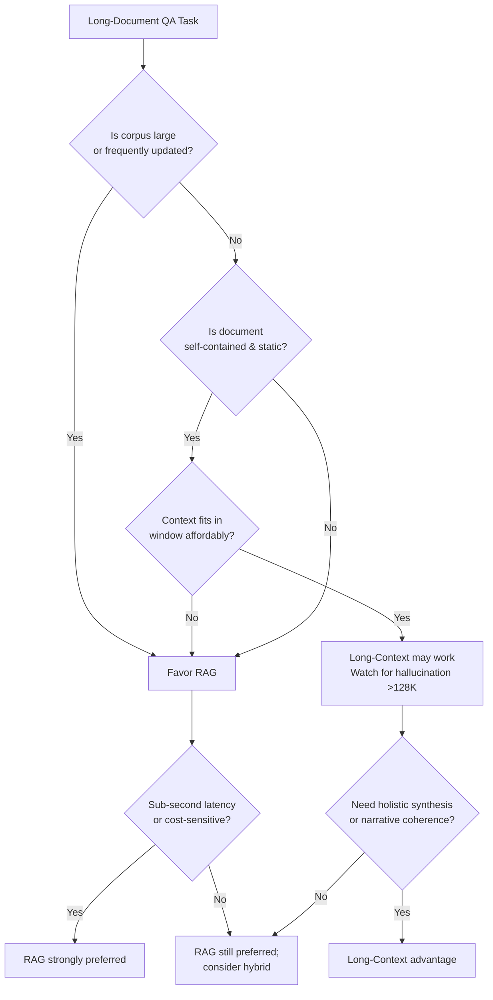

<!--
Original prompt: What's the current consensus on long-context models vs. retrieval for long-document QA—are 1M+ token context windows making RAG obsolete, and under what conditions?
Detected format: Narrative summary in markdown with sections, covering all sub-questions and surfacing caveats/limitations explicitly.
-->

> **Original prompt:** What's the current consensus on long-context models vs. retrieval for long-document QA—are 1M+ token context windows making RAG obsolete, and under what conditions?
> **Detected format:** Narrative summary in markdown with sections, covering all sub-questions and surfacing caveats/limitations explicitly.

---

# Long-Context Models vs. RAG for Long-Document QA: Current Consensus

> **TL;DR:** 1M+ token context windows are **not making RAG obsolete**. The two architectures have complementary strengths, and the better choice depends heavily on corpus characteristics, query type, and production constraints. No clear empirical consensus exists on which architecture wins on accuracy—methodological fragmentation in the research makes direct comparison difficult.

---

## 1. The Core Question: Is RAG Being Replaced?

The short answer is **no, not yet, and probably not categorically**. The evidence suggests long-context models and RAG are complementary rather than substitutes. Long-context models have expanded dramatically in capability, but they introduce new failure modes at scale that RAG does not share—and RAG retains durable advantages in cost, latency, and dynamic-data scenarios.

A notable caveat upfront: **no concrete head-to-head benchmark comparisons** between long-context LLMs (128K–1M+ tokens) and RAG systems on long-document QA accuracy tasks (F1/EM scores) were found in this research. Existing evaluation paradigms suffer from the lack of unified metrics for cross-paradigm comparison and insufficient diversity of test cases, which hinders rigorous comparisons and obscures the complementary strengths of these architectures. [F11, drifted source—treat with caution]

---

## 2. Performance: What We Know (and Don't)

### What benchmarks do show

One evaluation found that **long-context (LC) models generally outperform RAG on self-contained document types** (e.g., stories), while **RAG excels at handling fragmented information**, particularly in dialogue-based contexts. [F8] This is the most direct comparative finding available, but it is limited in scope.

### The "needle-in-a-haystack" (NIAH) problem

Much of the positive press around long-context models comes from NIAH benchmarks, which measure only the simplest retrieval task: finding a single, distinct fact. Real-world QA involves data synthesis, multi-hop reasoning, conflicting information, and reasoning chains—tasks where NIAH's "green square" results are **unreliable indicators of practical performance**. [F12] Positive NIAH scores should not be extrapolated to general long-document QA capability.

### Benchmark contamination risk

When models have seen evaluation questions during training, performance reflects memorization rather than generalization. This benchmark data contamination can inflate reported scores and further complicates interpreting the literature. [F13, drifted source—treat with caution]

---

## 3. Known Failure Modes of Long-Context Models

### Hallucination scales with context length

Hallucination rates rise dramatically with context length in long-document QA: fabrication nearly triples between 32K and 128K tokens and **exceeds 10% for all tested models at 200K tokens**. [F0] This is a critical reliability concern for high-stakes applications.

### "Lost in the middle" positional bias

LLMs exhibit a U-shaped positional memory pattern: performance is better when relevant information appears at the **beginning or end** of the context window, while information in the **middle performs significantly worse**. [F1, from a drifted source—treat with some caution] More broadly, longer contexts alone do not guarantee better performance and can be detrimental when relevant evidence is diluted or widely dispersed across the document—with some models showing **severe degradation under realistic conditions**. [F2]

### Are these problems solved in recent models?

**The evidence does not confirm they are solved.** No concrete evidence was retrieved on whether lost-in-the-middle and related reliability problems have been resolved in specific recent models (Gemini 1.5/2.0, GPT-4o, Claude 3.x). The claims about persistent positional bias are based on general survey findings rather than model-specific evaluations. This remains an open question.

---

## 4. Computational Cost, Latency, and Infrastructure Trade-offs

This is where the gap between long-context and RAG is most stark at production scale.

| Dimension | RAG | Long-Context (128K–1M tokens) |
|---|---|---|
| **Latency (typical)** | ~1 second end-to-end [F3] | ~20s at 160K tokens; ~60s at 890K tokens; ~45s production average [F3] |
| **Cost per query** | ~$0.00008 [F4] | ~$0.20 at 100K tokens; ~$2.00 at 1M tokens (GPT-4.1 pricing) [F4] |
| **Cost ratio** | 1× | ~1,250× per query at scale [F4] |
| **Memory (GPU)** | Low (retrieval index) | ~100GB GPU memory per session for 1M token KV cache [F5] |
| **Compute scaling** | Sub-linear (vector search) | O(n²) attention—doubling context ~quadruples compute [F5, F6] |

For applications requiring **interactive response times under 2 seconds**, well-optimized RAG pipelines can often meet that target, while naive long-context prompting on very large inputs typically cannot. [F6]

Note: Cost and latency figures come from blog posts rather than peer-reviewed sources and may not generalize across all providers, model versions, or deployment configurations.

---

## 5. When RAG Retains Clear Advantages

RAG is the more suitable architecture when:

- **Corpus is large relative to per-query needs** — you're querying a small slice of a vast document set [F10]
- **Queries access a small portion of data per request** [F10]
- **Sub-second or interactive response times are required** [F10]
- **Data updates frequently** — RAG grounds responses in current information; long-context models are limited to their context window and training data [F9, F10]
- **Cost per query is a constraint** — the ~1,250× cost difference is decisive at scale [F4]
- **Information is fragmented** — e.g., dialogue-heavy or multi-source corpora where RAG's precision retrieval outperforms broad-context dilution [F8]

RAG cost scales with only the few thousand retrieved tokens per query regardless of corpus size, while long-context costs scale with the full corpus size multiplied by query count. [F7, from an unreachable source—treat as illustrative]

---

## 6. When Long-Context Models Have Advantages

Long-context models are better suited when:

- **Documents are self-contained and coherent** (e.g., a single long novel, contract, or report) where chunking would destroy narrative structure [F8]
- **Holistic synthesis is required** across a single long document rather than pinpoint retrieval
- **Corpus is small and static** — the full context fits in the window and doesn't change frequently
- **Chunking artifacts would harm retrieval quality** — when information is densely interdependent

---

## 7. Hybrid Approaches

**The evidence on hybrid approaches is a gap in this report.** No concrete evidence was retrieved on retrieval-augmented long-context systems (e.g., retrieving fewer but longer passages, or using long-context models as re-rankers). Whether hybrid architectures outperform pure RAG or pure long-context methods is not addressed by the available evidence. This is an active area of development and likely where the field is heading, but empirical comparisons were not surfaced.

---

## 8. Methodological Disagreements in the Research

Interpreting the literature requires awareness of several confounds:

1. **NIAH benchmark inadequacy**: Measuring single-fact retrieval and generalizing to complex QA is misleading. [F12]
2. **Benchmark contamination**: Models trained on or near evaluation sets may show inflated scores. [F13, drifted source]
3. **Lack of unified cross-paradigm metrics**: There are no standardized metrics for comparing RAG and long-context approaches directly. [F11, drifted source]
4. **Insufficient test diversity**: Most benchmarks don't adequately cover multi-hop synthesis, conflicting evidence, or domain-specific reasoning. [F11]
5. **Rapidly evolving baselines**: Model capabilities, pricing, and context window sizes change quickly; findings dated even 6–12 months ago may not reflect current systems.

---

## 9. Summary Decision Framework

---

## 10. Key Caveats and Open Questions

- **No verified head-to-head accuracy benchmarks** (F1/EM) between long-context and RAG on long-document QA were found. Claim 8 (stories vs. dialogue) is the most direct comparison available but limited in scope.
- **Lost-in-the-middle may persist** in current frontier models, but this report cannot confirm or deny resolution in Gemini 1.5/2.0, GPT-4o, or Claude 3.x.
- **Hybrid approaches** (retrieval + long-context) are not covered by the available evidence.
- **Domain-specific differences** (legal, medical, scientific) were not surfaced in the research.
- Several findings come from **blog posts** (cost/latency figures) or **drifted sources** (positional bias, methodological fragmentation, contamination); these are flagged throughout and should be weighted accordingly.
- This is a **rapidly evolving field**; all findings may become outdated quickly as models and pricing change.

---

*Research conducted via automated pipeline; see caveats above for source reliability notes. Findings reflect the state of evidence as of mid-2025.*
