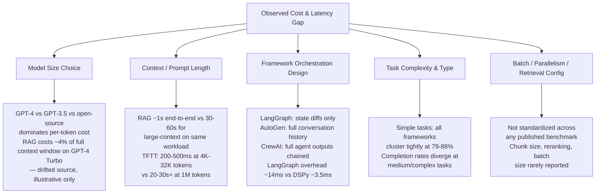

<!--
Original prompt: Compare reported costs and latencies for production agentic-RAG built on LangGraph, CrewAI, and AutoGen. Where do public numbers disagree, and what's driving the gap—different model sizes, prompt lengths, batch settings, or actual framework overhead?
Detected format: Narrative summary with structured sections in GitHub-flavored markdown, including comparison tables and a contradictions section — inferred from the analytical compare/contrast prompt with multiple sub-questions requiring synthesis.
-->

> **Original prompt:** Compare reported costs and latencies for production agentic-RAG built on LangGraph, CrewAI, and AutoGen. Where do public numbers disagree, and what's driving the gap—different model sizes, prompt lengths, batch settings, or actual framework overhead?
> **Detected format:** Narrative summary with structured sections in GitHub-flavored markdown, including comparison tables and a contradictions section — inferred from the analytical compare/contrast prompt with multiple sub-questions requiring synthesis.

---

# Comparing Costs & Latencies: Agentic-RAG on LangGraph, CrewAI, and AutoGen

> **Important caveats up front:** Public benchmarks for agentic-RAG are sparse, methodologically heterogeneous, and in some cases directly contradictory. Several source figures cited below are flagged as *drifted* (could not be re-verified at time of writing) or come from low-quality sources; confidence levels are noted throughout. No dedicated controlled study comparing all three frameworks on identical tasks, models, hardware, and retrieval configurations exists as of this writing.

---

## 1. Baseline: What Does Agentic RAG Cost and How Fast Is It?

Across agentic-RAG systems generally (not framework-specific), production cost per query reportedly ranges from **~$0.02** for simple lookups to **~$0.31** for complex multi-source reasoning, with averages of **$0.06–$0.09** for standard retrievals and **$0.18–$0.31** for multi-hop queries. These figures come from a single production guide and carry moderate confidence (0.75).

Latency tolerance for agentic RAG has been cited as **2–8 seconds** (versus sub-second for traditional RAG), though this specific figure comes from an unreachable source and should be treated as approximate.

---

## 2. Framework-by-Framework Numbers

### 2.1 LangGraph

| Metric | Value | Notes / Confidence |
|--------|-------|--------------------|
| Avg. tokens per query (standardized benchmark) | ~2,030 | Moderate-high confidence (0.83); lower than LangChain ~2,400 but higher than Haystack ~1,570 |
| Framework orchestration overhead | ~14 ms/query | Moderate-high (0.83); highest among frameworks tested (DSPy ~3.5 ms, Haystack ~5.9 ms, LlamaIndex ~6 ms) |
| Managed platform p50 latency | ~280 ms | Low confidence (0.55); source drifted — treat as approximate |
| Managed platform p95 latency | ~950 ms | Low confidence (0.55); source drifted |
| Managed platform p99 latency | ~1,450 ms | Low confidence (0.55); source drifted |
| Cost per node execution (LangGraph Cloud) | $0.001 | Applies to managed platform only; not representative of self-hosted |
| Company Research Agent task latency | ~506 s/run | Moderate confidence; from a single benchmark (see contradictions section) |

**Token efficiency design note:** LangGraph passes only *necessary state changes* between agents rather than full conversation histories, which contributes to lower token consumption relative to AutoGen in tests where this was measured (confidence 0.65).

### 2.2 CrewAI

> ⚠️ No CrewAI-specific production cost-per-query or $/1K-token figures were found in public sources. All CrewAI data below comes from cross-framework comparison benchmarks.

| Metric | Value | Notes / Confidence |
|--------|-------|--------------------|
| Company Research Agent task latency | ~246 s/run | Moderate confidence; from the same benchmark as LangGraph 506 s figure |
| Relative speed vs. LangGraph (5-agent workflow) | **Slower by >2×** | Conflicts with above — see Section 3 |
| Medium-task completion rate | ~71% | Single benchmark, Qwen3 32B, Apple M4 Max; may not generalize |

**Token compounding issue:** CrewAI's sequential multi-agent pipeline passes each agent's full output as context to the next agent. One benchmark observed latency roughly doubling and token consumption growing even faster across a three-task range (Tasks 1–3). This finding is from a drifted source; treat as directional rather than precise (confidence 0.55).

**Orchestration bottleneck:** In the benchmark where LangGraph outperformed CrewAI on speed, most of CrewAI's latency (~5 of ~9 seconds in one segment) was attributable to **agent-tool interaction time**, not LLM inference cost (confidence 0.72).

### 2.3 AutoGen

> ⚠️ No AutoGen-specific cost-per-query ($/1K tokens or $/query) figures for agentic-RAG were found. Latency figures come from general agent-framework benchmarks, not RAG-specific deployments.

| Metric | Value | Notes / Confidence |
|--------|-------|--------------------|
| Company Research Agent task latency | ~572 s/run | Slowest framework tested in this benchmark (confidence 0.65) |
| Total tokens per run | ~10,793 | vs. ~7,006 for most efficient framework (~54% more); low confidence (0.48), drifted source |
| Output quality std. deviation | ~0.45 (range 8.6–10.0) | Highest variance of frameworks tested; very low confidence (0.42), drifted source |
| Medium-task completion rate | ~68% | Single benchmark, Qwen3 32B; lowest of four frameworks tested |

**Architecture note:** AutoGen's 'Group Chat' architecture requires agents to negotiate turn-taking, adding overhead that is believed to drive its slower performance relative to other frameworks (confidence 0.65).

**Token inefficiency:** AutoGen passes full conversation histories between agents rather than state diffs, contributing to higher token consumption (confidence 0.65).

---

## 3. Where Public Numbers Directly Contradict Each Other

This is the most critical section. At least one major factual conflict exists in the published record:

### 3.1 LangGraph vs. CrewAI Relative Speed — Direct Contradiction

| Source | LangGraph | CrewAI | Winner |
|--------|-----------|--------|--------|
| Aerospike benchmark (5-agent generic workflow, 100 runs) | Faster | >2× slower | **LangGraph** |
| dev.to / explore.n1n.ai benchmark (Company Research Agent) | ~506 s | ~246 s | **CrewAI** |

These two findings directly contradict each other on which framework is faster. The **task type** is the most likely explanatory variable — a generic five-agent workflow versus a Company Research Agent task with different tool calls and context requirements. No controlled study has tested both frameworks on the same task with the same model.

### 3.2 AutoGen Latency — Consistent Direction, Uncertain Magnitude

Multiple sources agree AutoGen is among the slowest frameworks, but the Company Research Agent figure of ~572 s (dev.to) comes from a source flagged as low quality (axis-disagree) and drifted. The directional finding (AutoGen slowest) is more reliable than the specific number.

### 3.3 Token Counts — Framework Overhead vs. Task-Specific Context

The standardized 5-framework benchmark (aimultiple.com) measures LangGraph at ~2,030 tokens/query in a controlled setting. The Company Research Agent benchmark (dev.to) measures AutoGen at ~10,793 tokens/run total. These are not comparable numbers — different tasks, different scopes, different counting methodologies.

---

## 4. What's Driving the Gaps?

The cost and latency differences observed across benchmarks are attributable to a mixture of factors. The table below summarizes what the evidence supports:

### 4.1 Model Size
Model choice is a dominant cost driver: RAG with GPT-4 has been reported at approximately $0.0004/1K tokens for a 128K context window, representing ~4% of the cost of stuffing the full context window. LlamaIndex's agentic loop on the same task came in at ~$0.00028/1K tokens. Note: the GPT-4 figure is from a drifted source; treat as illustrative (confidence 0.60).

### 4.2 Context / Prompt Length
Context length is a **major latency driver independent of framework**: RAG pipelines typically achieve sub-1-second end-to-end latency while large-context approaches on the same workload require 30–60 seconds. Time-to-first-token scales from 200–500 ms at 4K–32K tokens to over 20–30 seconds at 1M tokens. Vector search retrieval adds ~tens of ms overhead; production systems see 50–200 ms for the complete retrieval step (confidence 0.83).

### 4.3 Framework Orchestration Design
In a standardized benchmark, framework overhead ranged from ~3.5 ms (DSPy) to ~14 ms (LangGraph) per query — small in absolute terms but representative of architectural choices:
- **LangGraph**: graph-based state machine passing state diffs → lower token compounding
- **AutoGen**: full conversation history passed → higher token consumption per exchange
- **CrewAI**: sequential pipeline with full agent-output chaining → compounding growth with task count; tool-interaction latency is the primary bottleneck

### 4.4 Task Complexity
All four frameworks tested in one benchmark completed 79–88% of *simple* tasks (tight clustering). Divergence emerges at medium complexity: LangGraph 76%, CrewAI 71%, AutoGen 68%. Complex tasks showed further differentiation. This suggests framework choice matters most at higher complexity tiers.

### 4.5 Batch Size, Parallelism, and Retrieval Configuration
This is where the data is most absent. Batch size, parallelism settings, chunk size, and reranking configurations are **not reported consistently—or at all—in most benchmarks cited**. The RAGPerf framework offers a path toward standardized RAG benchmarking (covering embedding dimensions, indexing methods, retrieval strategies, reranking, batch sizes), but it does not currently cover agentic orchestration frameworks specifically (confidence 0.82).

---

## 5. Why Cross-Framework Comparisons Are Unreliable

Published benchmarks use heterogeneous methodologies across virtually every dimension (confidence 0.82, though both supporting sources are drifted):

| Dimension | Variation observed |
|-----------|--------------------|
| LLM backbone | Qwen3 32B (Ollama) vs. GPT-4 vs. unspecified |
| Hardware | Apple M4 Max 64GB vs. cloud API vs. unspecified |
| Task type | Generic 5-agent workflow vs. Company Research Agent vs. RAG Q&A |
| Evaluation | LLM-as-judge vs. human eval vs. completion rate |
| Data source | Web-only vs. internal enterprise corpus |
| Sample size | N=99 questions to N=200 tasks per tier |
| Batch/parallelism | Rarely reported |

Onyx's agentic-RAG benchmark team explicitly noted that *no public benchmarks they found adequately represent enterprise customer needs*, prompting them to build their own internal benchmark — itself acknowledged to have statistical uncertainty (N=99, smaller than typical customer datasets).

---

## 6. Summary Comparison

| Metric | LangGraph | CrewAI | AutoGen |
|--------|-----------|--------|--------|
| Tokens/query (controlled benchmark) | ~2,030 | Not reported | Not reported |
| Framework overhead | ~14 ms | Not isolated | Not isolated |
| Company Research Agent latency | ~506 s | ~246 s | ~572 s |
| 5-agent workflow relative speed | Fastest (>2× faster than CrewAI in this test) | Slowest (in this test) | Not in this test |
| Token architecture | State diffs only | Full output chaining | Full conversation history |
| Medium-task completion rate | ~76% | ~71% | ~68% |
| Cost per query (framework-specific) | $0.001/node (managed platform only) | No public figures | No public figures |
| Output consistency | Not measured | Not measured | Highest variance (std dev ~0.45) — low confidence |

---

## 7. Bottom Line

1. **No reliable head-to-head comparison exists.** Every benchmark cited varies LLM, hardware, task, and evaluation methodology simultaneously.
2. **The LangGraph vs. CrewAI speed question has contradictory answers** in published literature — task type likely explains the reversal, but no controlled test has confirmed this.
3. **AutoGen is consistently slowest** in multi-agent benchmarks, with Group Chat architecture and full-history token passing as the main structural causes.
4. **Context length and model choice dominate cost**; framework overhead is real (~3–14 ms/query) but small relative to LLM inference latency.
5. **CrewAI's sequential pipeline compounds tokens and latency** with task count; LangGraph's state-diff design partially mitigates this.
6. **Batch size, chunk size, reranking, and parallelism are essentially unmeasured** in published cross-framework comparisons — a major gap that prevents clean attribution of observed differences.

---

*All figures should be treated as directional estimates. Sources marked as drifted or low-quality are noted inline. A controlled benchmark on common infrastructure, models, and tasks remains absent from the public literature.*
