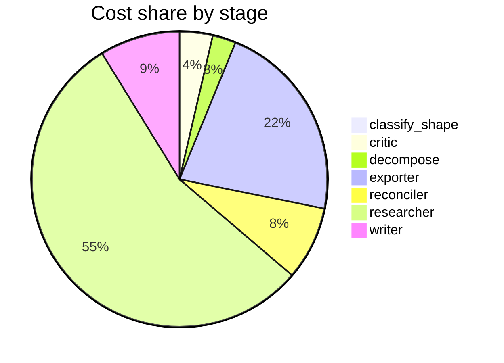

# Run metrics — What are the real-world risks and benefits of using synthetic data to train or …

> **Prompt:** What are the real-world risks and benefits of using synthetic data to train or fine-tune large language models? Focus on data quality, bias, and evaluation.
> **Started:** 2026-05-05T14:10:11.573602+00:00
> **Duration:** 325.8s
> **Final output:** [final_20260505T071011_9a67a44c_what_are_the_real_world_risks_and_benefi__off.md](./final_20260505T071011_9a67a44c_what_are_the_real_world_risks_and_benefi__off.md)

## Tier 1 — Headline evaluation metrics

### Grounding

**Rate:** 100%  (17/17 claims grounded)

| claim | grounded | reason |
|---:|:---:|---|
| 0 | ✅ | Evidence directly describes model collapse as a degenerative process where tails disappear and outputs converge to a low-variance point estimate. |
| 1 | ✅ | Evidence explicitly lists the three error sources matching the claim. |
| 2 | ✅ | Evidence directly supports both that collapse is presented as inevitable under synthetic-only training and that the data-replacement assumption is criticized as unrealistic. |
| 3 | ✅ | Evidence directly states accumulating data avoids collapse, bounds test error, and holds across sizes, architectures, and hyperparameters. |
| 4 | ✅ | The evidence directly states convergence to verifier's knowledge center and that without an unbiased verifier, early gains plateau and may reverse. |
| 5 | ✅ | Evidence explicitly states eight definitions used inconsistently between and within papers, causing literature to talk past itself. |
| 6 | ✅ | Evidence directly states the assumption of data replacement is unrealistic and that accumulation is more realistic, supporting the claim. |
| 7 | ✅ | The evidence directly states the 10.5% improvement for GPT-3.5 Turbo on 20-document MDQA from finetuning. |
| 8 | ✅ | The evidence directly states the claim verbatim. |
| 9 | ✅ | Evidence directly supports the 22.8% relative improvement in NWP accuracy and the privacy/memorization avoidance claim. |
| 10 | ✅ | The evidence directly states the 87% to 30% drop and describes synthetic benchmarks missing cross-file dependencies and context. |
| 11 | ✅ | Evidence directly states LLM judges score higher than humans and systems perform better on synthetic queries, overestimating effectiveness. |
| 12 | ✅ | Evidence directly states the 68% and 64% agreement figures and supports the limitation conclusion. |
| 13 | ✅ | The evidence directly supports both parts of the claim about evaluation gaps and LLM bias toward technical validity over novelty. |
| 14 | ✅ | The evidence directly states all three findings: 5-10x speedup with mixed data, no speedup with rephrased alone, and higher loss with textbook-style alone. |
| 15 | ✅ | The evidence directly states the contradiction between the two cited views matching the claim. |
| 16 | ✅ | Evidence directly supports inconsistent findings, bespoke setups, and obscured comparability/generalizability. |

### Fabrication rate

**Rate:** 0%  (0/17 approved claims cite a fabricated finding)

- Drift rate: 18%  (3/17 approved claims cite a drifted finding)
- Verifier source: post-hoc re-run (no native verify_history)

### Contradictions surfaced

**N surfaced:** 4

- By severity: minor=0, moderate=3, major=1
- By type: factual=2, methodological=1, framing=1, temporal=0, other=0

### Honesty signals

- Uncertainty notes: **3**  |  caveats: **8**
- Sub-questions with ≥1 uncertainty note: **43%**
- Caveats reference uncertainty: **no**

### Source quality

- Cited findings: **19** of 19 harvested  |  mean quality: **0.97** (cited) vs. 0.97 (all)
- Cited quality — median: 1.00, min: 0.70

| tier | cited | all |
|---|---:|---:|
| gov_edu | 0 | 0 |
| peer_reviewed | 17 | 17 |
| news | 0 | 0 |
| curated_tertiary | 0 | 0 |
| unknown | 2 | 2 |
| blog_qa | 0 | 0 |

### Calibration

**Total claims:** 17

| confidence range | n | grounded rate | mean stated confidence |
|---|---:|---:|---:|
| [0.00, 0.30) | 0 | — | — |
| [0.30, 0.60) | 0 | — | — |
| [0.60, 0.80) | 2 | 100% | 0.76 |
| [0.80, 1.01) | 15 | 100% | 0.91 |

### Coverage

**Rate:** 57%  (4 covered, 3 missed)

- **Covered:** `sq3`, `sq4`, `sq5`, `sq6`
- **Missed:** `sq1`, `sq2`, `sq7`

### LLM judge rubric

| dimension | score |
|---|---:|
| correctness | 4.00 / 5 |
| completeness | 4.00 / 5 |
| calibration | 4.00 / 5 |
| source quality | 3.50 / 5 |
| conflict handling | 4.50 / 5 |
| overall | 4.00 / 5 |

> Strongest aspect: excellent surfacing of methodological disagreements (replacement vs accumulation, definition fragmentation, quality vs diversity tradeoff), which reflects genuine tensions in the literature like Shumailov et al. vs Gerstgrasser et al. Weakest aspect: source base is heavily arXiv preprints with limited peer-reviewed material (only one Nature paper, no major venues like NeurIPS/ICML proceedings explicitly), and some specific numerical claims (22.8% mobile improvement, 87%→30% code drop) rely on single-source blog/industry citations without triangulation. Confidence calibration is generally reasonable, though the 0.95 on the eight-definitions claim seems high for a single-paper finding.

## Tier 2 — Experimental rigor / depth of understanding

### Researcher signals

- Sub-questions: **7** total, **3** without findings
- Researchers with findings: **4**  |  with uncertainty: **3**  |  with both: **0**
- Findings: 19 total  |  uncertainty notes: 3
- Per active researcher: mean **4.8** findings, max **6**

### Citation density

- Load-bearing fraction: **100%**  (19 cited / 19 harvested)
- Per-claim citations: avg **1.41**  |  median **1.00**  |  uncited claims: 0
- Source concentration (Herfindahl): **0.375**  |  max single-source share: **54%**
- Distinct domains per claim (mean): **1.12**

### Plan judge

- Surface coverage: **1.00**  |  intent alignment: **1.00**

> The decomposition thoroughly covers the three focal areas the prompt names: data quality (sq1, sq6), bias (sq2), and evaluation (sq5), while also addressing risks (sq2, sq3) and benefits (sq4) explicitly requested. Sq6 and sq7 add useful context on disagreement and mitigation, which remain on-topic extensions of the risk/benefit framing rather than drift. Every sub-question is squarely about synthetic data for LLM training/fine-tuning.

### ACE — Adaptive Checklist Evaluation

**Overall:** 0.54 / 1.00

| item | met | score | reason |
|---|:---:|---:|---|
| Identifies concrete benefits of synthetic data for LLM training/fine-tuning | ✅ | 0.80 | Report cites concrete benefits including long-context QA improvement, low-resource MT, privacy-preserving fine-tuning with specific gains, and pretraining speedups, though alignment data generation is explicitly not covered. |
| Discusses real-world risks to data quality such as model collapse, distributional narrowing, hallucinated/factually incorrect content, and loss of diversity, citing or referencing specific findings or studies (e.g., Shumailov et al. on model collapse) | ✅ | 0.80 | Extensively discusses model collapse mechanisms, tail loss, and diversity concerns with multiple findings, though does not explicitly cite Shumailov et al. or named studies and gives less attention to hallucinated/factually incorrect content. |
| Analyzes how synthetic data can amplify, propagate, or alternatively mitigate biases, including the risk of inheriting biases from generator models and feedback loops that entrench them | ❌ | 0.15 | The report explicitly acknowledges in caveats that bias dynamics could not be answered and are 'entirely absent'; only a brief mention of verifier bias convergence touches on the topic. |
| Addresses evaluation challenges specific to synthetic data, including contamination of benchmarks, difficulty distinguishing genuine capability gains from overfitting to synthetic distributions, and the need for held-out or human-curated evaluations | ✅ | 0.70 | Discusses LLM-as-judge disagreement with experts, synthetic benchmark overestimation, and code benchmark gaps showing overfitting, but does not explicitly address benchmark contamination or strongly advocate for held-out/human-curated evaluations. |
| Provides concrete real-world examples or case studies (e.g., Phi models, Alpaca/self-instruct, Llama post-training, RLAIF/Constitutional AI) illustrating successes or failures of synthetic data use | ❌ | 0.30 | The report provides some concrete examples (GPT-3.5 Turbo long-context, mobile next-word prediction, HumanEval/MBPP, textbook-style synthetic data) but does not discuss the canonical case studies like Phi, Alpaca/self-instruct, Llama post-training, or RLAIF/Constitutional AI, and explicitly acknowledges this gap. |
| Discusses mitigation strategies or best practices such as filtering, human-in-the-loop curation, mixing with real data, provenance tracking, diversity sampling, or verifier models | ✅ | 0.50 | Mentions mixing/accumulating real with synthetic data and discusses verifier models with caveats, but explicitly acknowledges it could not retrieve evidence on filtering, mixing ratios, quality scoring, or red-teaming, leaving mitigation coverage shallow. |
| Distinguishes between different types/uses of synthetic data (e.g., pretraining vs. instruction tuning vs. RLHF/RLAIF preference data; fully synthetic vs. augmented vs. distilled) and how risks/benefits vary across them | ❌ | 0.20 | The report mentions distinct uses (pretraining, fine-tuning, machine translation, privacy-preserving) and notes mixing rephrased vs textbook synthetic, but does not systematically distinguish categories like RLHF/RLAIF, distilled vs augmented, or analyze how risks/benefits vary across them; explicitly notes alignment-tuning is absent. |
| Acknowledges trade-offs and open questions rather than presenting a one-sided view, with balanced treatment of when synthetic data helps versus harms | ✅ | 1.00 | Report explicitly frames synthetic data value as contested, presents both benefits and risks, and highlights multiple unresolved disagreements and open questions. |
| Cites credible sources, papers, or empirical evidence to support key claims about quality, bias, or evaluation outcomes | ❌ | 0.40 | The report references empirical findings with specific numbers and acknowledges some sources (Google Research blog, CodeAnt blog) but does not cite specific papers or authors (e.g., Shumailov et al.) by name, weakening source credibility. |

> 5/9 criteria fully met

## Final output audit

- **Format detected:** Narrative summary in markdown with section headers, covering data quality, bias, evaluation, benefits, risks, and methodological disagreements — defaulting to clear structured markdown since the prompt did not specify a format.
- **Notes:** Format inferred as structured narrative markdown with section headers, since the prompt did not specify a format. A Mermaid flowchart was added to visualise the key researcher disagreement axes. Three substantive gaps (distributional quality comparisons, bias mechanisms, mitigation strategies) were carried forward from the pipeline caveats and are surfaced explicitly in the rendered output.
- **Conditions:** 3 satisfied / 3 partial / 0 not satisfied / 0 n/a
- **Unmet:**
  - Focus on data quality (partial: direct distributional comparisons between synthetic and real training data absent)
  - Focus on bias (partial: synthetic-data-specific bias mechanisms and empirical demographic-bias measurements absent)
  - Cover real-world benefits of using synthetic data (partial: alignment-tuning benefits absent)

Tier 3 — Operational details

### Cost & latency
- Total cost: **$0.7586**  |  input tokens: 411114  |  output tokens: 23671  |  elapsed: 325.8s  |  revision rounds: 0
- Researcher latency: max 39.9s, avg 28.1s

### Per-stage
| stage | calls | input tokens | output tokens | cost (USD) | elapsed (s) |
|---|---:|---:|---:|---:|---:|
| classify_shape | 1 | 983 | 65 | $0.0039 | 2.5 |
| confidence | 0 | 0 | 0 | $0.0000 | 0.0 |
| critic | 1 | 9052 | 12 | $0.0273 | 1.2 |
| decompose | 1 | 1479 | 989 | $0.0193 | 17.3 |
| exporter | 2 | 17918 | 7490 | $0.1661 | 119.6 |
| reconciler | 2 | 10604 | 1938 | $0.0609 | 32.6 |
| researcher | 44 | 363333 | 10310 | $0.4149 | 107.1 |
| writer | 1 | 7745 | 2867 | $0.0662 | 45.4 |

### Tool mix
| tool | calls |
|---|---:|
| web_search | 26 |
| search_papers | 15 |
| fetch_url | 36 |
| save_finding | 19 |
| note_uncertainty | 0 |

### Run metadata
- commit: `de5b7d0f40e6584303761befb270bda2f44c2f27`  branch: `main`
- captured_at: 2026-05-05T14:04:45.782205+00:00
- models: critic=`claude-sonnet-4-6`, judge=`claude-opus-4-7`, kae_judge=`claude-haiku-4-5`, researcher=`claude-haiku-4-5`, writer=`claude-sonnet-4-6`

