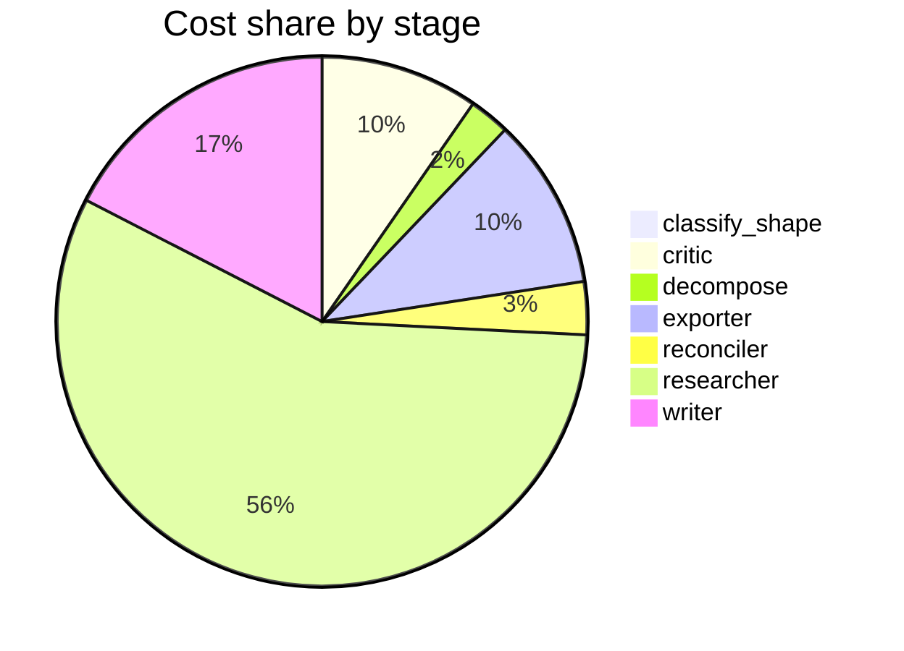

# Run metrics — What are the real-world risks and benefits of using synthetic data to train or …

> **Prompt:** What are the real-world risks and benefits of using synthetic data to train or fine-tune large language models? Focus on data quality, bias, and evaluation.
> **Started:** 2026-05-05T14:17:28.405996+00:00
> **Duration:** 323.5s
> **Final output:** [final_20260505T071728_eec15ef0_what_are_the_real_world_risks_and_benefi__on.md](./final_20260505T071728_eec15ef0_what_are_the_real_world_risks_and_benefi__on.md)

## Tier 1 — Headline evaluation metrics

### Grounding

**Rate:** 94%  (17/18 claims grounded)

| claim | grounded | reason |
|---:|:---:|---|
| 0 | ✅ | Evidence explicitly describes the two paradigms and contrasts them on quality, external dependency, and bias amplification. |
| 1 | ✅ | Evidence directly states GPT-3 distilled on InstructGPT outperformed Self-Instructed GPT-3 by 10%, supporting distillation's superiority. |
| 2 | ✅ | The evidence directly supports all parts of the claim including the 54% figure and reasoning about usefulness. |
| 3 | ✅ | Evidence directly states CoT-Self-Instruct uses reasoning, employs Answer-Consistency and RIP (reward model) filtering, and outperforms Self-Instruct and WildChat on reasoning and instruction-following benchmarks. |
| 4 | ✅ | The evidence directly states that training with the negative-data scheme achieves performance similar to 8× amplification of synthetic data. |
| 5 | ✅ | Evidence explicitly states the hybrid fine-tuned model outperformed the real-data model across all metrics in vertical applications. |
| 6 | ✅ | The evidence directly states the 1/3 synthetic to 2/3 natural mix yields a 5-10x speedup to reach the same validation loss at larger data budgets. |
| 7 | ✅ | The evidence directly describes model collapse as a degenerative process where iterative training on generated data causes loss of information about the true distribution, beginning with tails and converging to a point estimate with small variance. |
| 8 | ✅ | Both parts of the claim are directly supported by the two evidence quotes. |
| 9 | ✅ | The evidence directly states the 84-89% vs 25-34% performance disparity between synthetic benchmarks and real-world class tasks. |
| 10 | ✅ | The evidence directly supports that real-world scenarios highlight type/attribute mismatches while synthetic tests overemphasize assertions. |
| 11 | ✅ | Evidence explicitly describes both intrinsic human-defined correctness criteria and ICE as measuring helpfulness for in-context learning to predict training utility. |
| 12 | ❌ | Evidence defines PGR as improvement relative to a reference model, not specifically the gap between a weak and strong model. |
| 13 | ✅ | Evidence directly states diverse-source synthetic data mitigates distribution collapse and preserves output breadth. |
| 14 | ✅ | Evidence directly states the cluster-based LLM diversity metric correlates positively with both pre-training and SFT performance. |
| 15 | ✅ | Evidence directly supports the 36-61% retention figure and the hybrid pipeline approach described in the claim. |
| 16 | ✅ | Evidence directly states focus on generation methods over quality and single-modality limitations. |
| 17 | ✅ | The evidence directly supports the claim about a gap where most AI models in synthetic research haven't been tested against academic benchmarks examinable by industry. |

### Fabrication rate

**Rate:** 0%  (0/18 approved claims cite a fabricated finding)

- Drift rate: 0%  (0/18 approved claims cite a drifted finding)
- Verifier source: native verify_history

### Contradictions surfaced

**N surfaced:** 2

- By severity: minor=1, moderate=1, major=0
- By type: factual=1, methodological=0, framing=1, temporal=0, other=0

### Honesty signals

- Uncertainty notes: **1**  |  caveats: **8**
- Sub-questions with ≥1 uncertainty note: **14%**
- Caveats reference uncertainty: **no**

### Source quality

- Cited findings: **25** of 26 harvested  |  mean quality: **0.92** (cited) vs. 0.92 (all)
- Cited quality — median: 1.00, min: 0.70

| tier | cited | all |
|---|---:|---:|
| gov_edu | 1 | 1 |
| peer_reviewed | 17 | 18 |
| news | 0 | 0 |
| curated_tertiary | 0 | 0 |
| unknown | 7 | 7 |
| blog_qa | 0 | 0 |

### Calibration

**Total claims:** 18

| confidence range | n | grounded rate | mean stated confidence |
|---|---:|---:|---:|
| [0.00, 0.30) | 0 | — | — |
| [0.30, 0.60) | 0 | — | — |
| [0.60, 0.80) | 0 | — | — |
| [0.80, 1.01) | 18 | 94% | 0.93 |

### Coverage

**Rate:** 86%  (6 covered, 1 missed)

- **Covered:** `sq1`, `sq2`, `sq4`, `sq5`, `sq6`, `sq7`
- **Missed:** `sq3`

### LLM judge rubric

| dimension | score |
|---|---:|
| correctness | 3.50 / 5 |
| completeness | 3.50 / 5 |
| calibration | 2.50 / 5 |
| source quality | 4.00 / 5 |
| conflict handling | 4.00 / 5 |
| overall | 3.50 / 5 |

> Strongest aspects: surfaces the model-collapse debate (Shumailov Nature 2024 vs. accumulation-based counterarguments) explicitly, cites credible primary sources including Nature and NeurIPS, and addresses evaluation pitfalls with concrete numbers. Weakest aspects: confidence calibration is inflated—several claims at 0.94–0.98 cite single arXiv preprints with specific numerical claims (e.g., 5–10× pretraining speedup, 8× equivalence for negative examples, 36-61% clinical retention) that warrant more uncertainty; the GPT-3 vs InstructGPT '10% gain' claim is oversimplified and potentially miscited. Bias coverage, despite being in the prompt, is notably thin—only briefly mentioned via diversity mitigation, with little engagement on demographic/representational bias amplification.

## Tier 2 — Experimental rigor / depth of understanding

### Researcher signals

- Sub-questions: **7** total, **1** without findings
- Researchers with findings: **6**  |  with uncertainty: **1**  |  with both: **0**
- Findings: 26 total  |  uncertainty notes: 1
- Per active researcher: mean **4.3** findings, max **8**

### Citation density

- Load-bearing fraction: **96%**  (25 cited / 26 harvested)
- Per-claim citations: avg **1.44**  |  median **1.00**  |  uncited claims: 0
- Source concentration (Herfindahl): **0.263**  |  max single-source share: **42%**
- Distinct domains per claim (mean): **1.06**

### Plan judge

- Surface coverage: **1.00**  |  intent alignment: **1.00**

> The decomposition covers all three explicitly named focus areas: data quality (sq1, sq6), bias (sq3), and evaluation (sq5), while also addressing benefits (sq2) and risks (sq3, sq4) per the main question. Sq6 (mitigations) and sq7 (evidence gaps) are peripheral but reasonably scoped to inform a risk-benefit analysis. All sub-questions stay tightly on the prompt's topic of synthetic data for LLM training/fine-tuning with no drift to adjacent problems.

### ACE — Adaptive Checklist Evaluation

**Overall:** 0.57 / 1.00

| item | met | score | reason |
|---|:---:|---:|---|
| Identifies concrete benefits of synthetic data for LLM training/fine-tuning, such as scalability, cost reduction, privacy preservation, coverage of rare cases, controllability, and alignment/instruction-tuning use cases | ✅ | 0.70 | Mentions instruction-tuning gains, hybrid training benefits, pretraining speedups, and privacy-preserving clinical use, but does not explicitly discuss cost reduction, controllability, or rare-case coverage. |
| Discusses specific data quality risks including model collapse, mode collapse, distributional narrowing, factual errors/hallucinations propagating, and loss of long-tail diversity, ideally citing relevant research (e.g., Shumailov et al., 'curse of recursion') | ✅ | 0.80 | Covers model collapse with Nature 2024 citation, tail disappearance, distributional narrowing, and noisy/invalid synthetic data, though doesn't explicitly discuss hallucination propagation in depth. |
| Analyzes how synthetic data can amplify, mask, or potentially mitigate biases, including feedback loops where generator-model biases get baked into trainees and demographic/representation issues | ❌ | 0.10 | The report explicitly acknowledges in its caveats that bias amplification was a coverage gap and provides no substantive analysis of bias feedback loops or demographic representation issues. |
| Addresses evaluation-specific challenges such as benchmark contamination, evaluator-generator correlation (when an LLM both generates and judges data), and the difficulty of detecting quality degradation with standard metrics | ❌ | 0.40 | Report discusses synthetic benchmarks overestimating real-world performance and differing failure modes, but does not address benchmark contamination or evaluator-generator correlation/LLM-as-judge issues. |
| Describes concrete mitigation strategies such as mixing real and synthetic data, filtering/verification pipelines, human-in-the-loop review, provenance tracking, diversity sampling, or rejection sampling with verifiers | ✅ | 0.80 | Report explicitly mentions hybrid real+synthetic mixing, Answer-Consistency/reward-model filtering, multi-source diversity, and clustering-based diversity metrics, though human-in-the-loop and provenance tracking are not addressed. |
| Provides real-world examples or case studies (e.g., Phi models, Llama post-training, Alpaca/Self-Instruct, constitutional AI, math/code synthetic data) rather than only abstract claims | ✅ | 0.70 | Mentions Self-Instruct, CoT-Self-Instruct, code generation tasks, and clinical note generation, but lacks discussion of Phi, Llama post-training, Alpaca, or constitutional AI as case studies. |
| Distinguishes between different use cases (pretraining vs. fine-tuning vs. RLHF/preference data vs. evaluation set creation) and how risks/benefits differ across them | ❌ | 0.40 | The report touches on pretraining (rephrased web text mixing), fine-tuning (hybrid data, Self-Instruct), RL on negative responses, and evaluation set creation, but does not systematically compare how risks and benefits differ across these use cases. |
| Balances risks and benefits with nuance rather than presenting a one-sided view, and acknowledges open research questions or trade-offs | ✅ | 0.90 | The report presents both benefits (performance gains, hybrid mixing speedups) and risks (collapse, benchmark overestimation), explicitly notes contradictions, and lists multiple open questions and caveats. |
| Mentions evaluation methodology concerns such as the need for held-out human-curated benchmarks, contamination checks, and the limits of LLM-as-judge approaches when judging synthetic-trained models | ❌ | 0.30 | The report discusses synthetic benchmarks overestimating performance and proposes evaluation methodologies (ICE, AgoraBench), but does not explicitly address contamination checks, held-out human-curated benchmarks, or LLM-as-judge limitations. |

> 5/9 criteria fully met

## Final output audit

- **Format detected:** Narrative summary in markdown with structured sections covering data quality, bias, evaluation, mitigation, and evidence gaps — as requested by the prompt's thematic focus areas.
- **Notes:** Format inferred as a structured narrative markdown summary with section headers, tables, and callout blocks, matching the thematic focus areas (data quality, bias, evaluation) specified in the prompt. The bias section is marked 'partial' because the source literature itself lacks concrete empirical findings on bias amplification — this gap is surfaced explicitly in the rendered content per the pipeline's own caveats.
- **Conditions:** 5 satisfied / 1 partial / 0 not satisfied / 0 n/a
- **Unmet:**
  - Focus on bias

Tier 3 — Operational details

### Cost & latency
- Total cost: **$0.7500**  |  input tokens: 416229  |  output tokens: 23225  |  elapsed: 323.5s  |  revision rounds: 1
- Researcher latency: max 41.0s, avg 29.3s

### Per-stage
| stage | calls | input tokens | output tokens | cost (USD) | elapsed (s) |
|---|---:|---:|---:|---:|---:|
| classify_shape | 1 | 983 | 66 | $0.0039 | 3.3 |
| confidence | 0 | 0 | 0 | $0.0000 | 0.0 |
| critic | 2 | 20887 | 618 | $0.0719 | 13.5 |
| decompose | 1 | 1486 | 935 | $0.0185 | 15.3 |
| exporter | 1 | 6848 | 3831 | $0.0780 | 70.6 |
| reconciler | 1 | 5443 | 517 | $0.0241 | 9.7 |
| researcher | 48 | 363823 | 11945 | $0.4235 | 111.6 |
| verifier | 0 | 0 | 0 | $0.0000 | 8.3 |
| writer | 2 | 16759 | 5313 | $0.1300 | 91.3 |

### Tool mix
| tool | calls |
|---|---:|
| web_search | 24 |
| search_papers | 15 |
| fetch_url | 35 |
| save_finding | 26 |
| note_uncertainty | 0 |

### Run metadata
- commit: `de5b7d0f40e6584303761befb270bda2f44c2f27`  branch: `main`
- captured_at: 2026-05-05T14:12:04.924084+00:00
- models: critic=`claude-sonnet-4-6`, judge=`claude-opus-4-7`, kae_judge=`claude-haiku-4-5`, researcher=`claude-haiku-4-5`, writer=`claude-sonnet-4-6`

