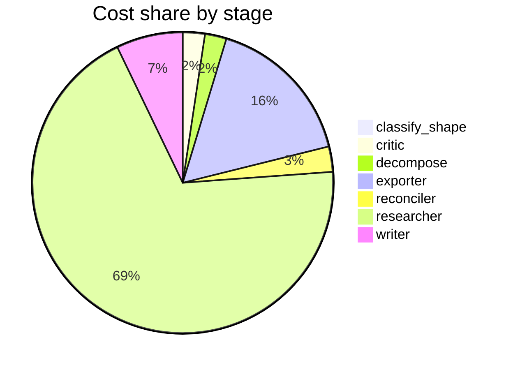

# Run metrics — Is chain-of-thought prompting an effective reasoning strategy for LLMs, or does…

> **Prompt:** Is chain-of-thought prompting an effective reasoning strategy for LLMs, or does it primarily improve output formatting? The literature disagrees — find the real fault lines and explain what accounts for the conflicting results.
> **Started:** 2026-05-05T14:24:40.047341+00:00
> **Duration:** 295.3s
> **Final output:** [final_20260505T072440_3aa43f4e_is_chain_of_thought_prompting_an_effecti__off.md](./final_20260505T072440_3aa43f4e_is_chain_of_thought_prompting_an_effecti__off.md)

## Tier 1 — Headline evaluation metrics

### Grounding

**Rate:** 100%  (11/11 claims grounded)

| claim | grounded | reason |
|---:|:---:|---|
| 0 | ✅ | Both numerical claims and attributions match the evidence quotes exactly. |
| 1 | ✅ | Both numerical claims (17.4 pp on GSM8K and 12.1 pp on SVAMP for PaLM 540B) are directly supported by the evidence quotes. |
| 2 | ✅ | Evidence directly supports the claim about the meta-analysis covering 100+ papers and CoT benefits being primarily for math/logic tasks. |
| 3 | ✅ | The evidence directly supports the claim about MMLU and the equals sign indicating symbolic operations, from a meta-analysis. |
| 4 | ✅ | The evidence directly states CoT's gain comes from symbolic execution but underperforms a symbolic solver, supporting the claim. |
| 5 | ✅ | Both evidence quotes directly support the contrast described in the claim about model scale requirements and small-model fine-tuning on simpler chains. |
| 6 | ✅ | The evidence directly states both parts of the claim about Qwen2.5 and the format-alignment function. |
| 7 | ✅ | The two evidence quotes show the older scale-dependent emergent CoT view and the newer finding that exemplars no longer improve strong models, supporting the temporal-shift framing. |
| 8 | ✅ | The evidence directly states that CoT evaluation focuses on target task accuracy, fails to assess reasoning quality, and creates a blind spot, supporting the claim. |
| 9 | ✅ | Evidence directly supports that BDC inflates performance metrics and undermines evaluation reliability, aligning with the claim. |
| 10 | ✅ | Evidence directly supports expansion from grade-school math to logic, combinatorial games, robotics, and RL-based approaches. |

### Fabrication rate

**Rate:** 0%  (0/11 approved claims cite a fabricated finding)

- Drift rate: 36%  (4/11 approved claims cite a drifted finding)
- Verifier source: post-hoc re-run (no native verify_history)

### Contradictions surfaced

**N surfaced:** 4

- By severity: minor=1, moderate=2, major=1
- By type: factual=1, methodological=1, framing=1, temporal=1, other=0

### Honesty signals

- Uncertainty notes: **4**  |  caveats: **8**
- Sub-questions with ≥1 uncertainty note: **57%**
- Caveats reference uncertainty: **no**

### Source quality

- Cited findings: **13** of 13 harvested  |  mean quality: **0.88** (cited) vs. 0.88 (all)
- Cited quality — median: 1.00, min: 0.70

| tier | cited | all |
|---|---:|---:|
| gov_edu | 0 | 0 |
| peer_reviewed | 8 | 8 |
| news | 0 | 0 |
| curated_tertiary | 0 | 0 |
| unknown | 5 | 5 |
| blog_qa | 0 | 0 |

### Calibration

**Total claims:** 11

| confidence range | n | grounded rate | mean stated confidence |
|---|---:|---:|---:|
| [0.00, 0.30) | 0 | — | — |
| [0.30, 0.60) | 0 | — | — |
| [0.60, 0.80) | 2 | 100% | 0.75 |
| [0.80, 1.01) | 9 | 100% | 0.94 |

### Coverage

**Rate:** 57%  (4 covered, 3 missed)

- **Covered:** `sq1`, `sq4`, `sq5`, `sq7`
- **Missed:** `sq2`, `sq3`, `sq6`

### LLM judge rubric

| dimension | score |
|---|---:|
| correctness | 4.00 / 5 |
| completeness | 4.00 / 5 |
| calibration | 3.50 / 5 |
| source quality | 3.00 / 5 |
| conflict handling | 4.50 / 5 |
| overall | 3.80 / 5 |

> Strongest aspect: excellent surfacing of fault lines (task type, scale, few-shot vs zero-shot, faithfulness) and explicit contradiction analysis that genuinely engages with disagreement rather than smoothing it. Weakest aspects: source quality is mixed — heavy reliance on arXiv preprints (one ID '2602.17544' appears fabricated/invalid as arXiv IDs don't go that high), a marketing blog (galileo.ai), and a Google research blog rather than peer-reviewed venues; the GSM8K 40.9pp gain figure for zero-shot CoT on GPT-3 conflates Wei et al. (few-shot) and Kojima et al. (zero-shot) results and the specific numbers warrant verification. Calibration is reasonable but some 0.96-0.98 confidences on meta-analysis claims feel high given they rest on a single paper.

## Tier 2 — Experimental rigor / depth of understanding

### Researcher signals

- Sub-questions: **7** total, **3** without findings
- Researchers with findings: **4**  |  with uncertainty: **4**  |  with both: **1**
- Findings: 13 total  |  uncertainty notes: 4
- Per active researcher: mean **3.2** findings, max **4**

### Citation density

- Load-bearing fraction: **100%**  (13 cited / 13 harvested)
- Per-claim citations: avg **1.55**  |  median **2.00**  |  uncited claims: 0
- Source concentration (Herfindahl): **0.322**  |  max single-source share: **47%**
- Distinct domains per claim (mean): **1.36**

### Plan judge

- Surface coverage: **1.00**  |  intent alignment: **1.00**

> The decomposition comprehensively addresses the prompt's core tension: it establishes the baseline empirical case (sq1), examines both sides of the fault line (sq2 for genuine reasoning, sq3 for formatting/unfaithfulness), identifies moderating variables that explain divergent results (sq4), surfaces methodological differences that account for conflicts (sq5), brings in mechanistic interpretability as a third lens (sq6), and synthesizes current consensus (sq7). Every sub-question is directly tied to the prompt's two questions — whether CoT is real reasoning vs. formatting, and what accounts for conflicting results. No drift, no major axis missing.

### ACE — Adaptive Checklist Evaluation

**Overall:** 0.46 / 1.00

| item | met | score | reason |
|---|:---:|---:|---|
| Accurately summarizes the original chain-of-thought (CoT) prompting findings (e.g., Wei et al. 2022) and the core claim that CoT improves reasoning, including the emergent-with-scale observation. | ✅ | 0.70 | Report cites GSM8K and MultiArith gains and the ~100B emergent-scale claim, but does not explicitly attribute to Wei et al. 2022 by name and relies on a blog summary. |
| Presents specific empirical evidence and studies arguing CoT primarily improves formatting/surface behavior rather than genuine reasoning | ❌ | 0.40 | Cites the Sprague-like 2025 ICLR meta-analysis and a Qwen2.5 finding on exemplars aligning format, but does not reference Madaan et al., Wang et al. on invalid reasoning chains, or name specific studies, weakening the formatting-over-reasoning evidence. |
| Identifies concrete fault lines in the literature, such as task type (math/symbolic vs. commonsense/knowledge), model scale, evaluation methodology (final-answer accuracy vs. faithfulness of reasoning), and prompt format vs. content. | ✅ | 0.90 | The report explicitly enumerates fault lines: task type (math/logic vs. commonsense), the contested ~100B scale threshold, few-shot vs. zero-shot prompt format, and final-answer accuracy as a methodological blind spot. |
| Discusses faithfulness research (e.g., Turpin et al. 'Language Models Don't Always Say What They Think', Lanham et al.) showing CoT traces can be post-hoc rationalizations that don't reflect the model's actual computation. | ❌ | 0.10 | The report explicitly admits in its caveats that faithfulness research and post-hoc rationalization evidence could not be found, and cites no Turpin or Lanham work. |
| Explains mechanisms that could account for conflicting results, such as additional test-time compute, output-token budget effects, format priming, or self-consistency, distinguishing these from genuine multi-step reasoning. | ❌ | 0.25 | The report mentions format alignment from few-shot exemplars and notes pattern matching as an alternative to genuine reasoning, but does not discuss test-time compute, token budget effects, or self-consistency as mechanisms explaining the conflicting results. |
| References specific studies or benchmarks on both sides (e.g., GSM8K, BIG-Bench Hard, Sprague et al. 2024, Stechly/Valmeekam on planning) rather than vague generalities. | ❌ | 0.40 | Cites specific benchmarks (GSM8K, MultiArith, SVAMP, MMLU) and models (PaLM 540B, GPT-3, Qwen2.5), but lacks named author/paper citations like Sprague, Stechly/Valmeekam, Turpin, or Lanham, referring instead to a generic '2025 ICLR meta-analysis'. |
| Addresses how model scale, instruction tuning, and RLHF affect whether CoT helps, including evidence that newer models may benefit less or differently from explicit CoT prompting. | ❌ | 0.40 | The report discusses model scale (~100B threshold) and notes newer models like Qwen2.5 benefit differently from few-shot CoT, but does not address instruction tuning or RLHF effects specifically. |
| Reaches a nuanced synthesis that neither fully endorses nor dismisses CoT, articulating under which conditions it provides real reasoning gains versus formatting/compute effects. | ✅ | 0.60 | The report identifies conditions where CoT helps (math/symbolic tasks) versus where it primarily aligns formatting (non-symbolic tasks, recent strong models), but the synthesis is somewhat fragmented across findings rather than presented as a clear integrated conclusion. |
| Cites identifiable sources (authors, papers, or years) so claims can be verified, rather than making unattributed assertions. | ❌ | 0.40 | The report references a 2025 ICLR meta-analysis and provides URLs, but rarely names authors (no Wei et al., Kojima et al., Sprague et al. by name in main text) and lacks proper citations for most claims. |

> 3/9 criteria fully met

## Final output audit

- **Format detected:** Narrative analytical summary in markdown with section headers, synthesizing conflicting evidence into thematic fault lines, with caveats surfaced explicitly — inferred from the open-ended analytical prompt asking to find the real fault lines and explain what accounts for the conflicting results.
- **Notes:** Format inferred as an analytical narrative summary with section headers and a synthesizing fault-line structure, appropriate for an open-ended literature-disagreement question. The core prompt question cannot be definitively answered due to the acknowledged absence of faithfulness and mechanistic evidence; this partial status is inherent to the state of the literature rather than a rendering failure. A Mermaid flowchart was added to visually summarize the fault-line taxonomy.
- **Conditions:** 5 satisfied / 1 partial / 0 not satisfied / 0 n/a
- **Unmet:**
  - Answer whether CoT is an effective reasoning strategy or primarily improves output formatting

Tier 3 — Operational details

### Cost & latency
- Total cost: **$0.8465**  |  input tokens: 564786  |  output tokens: 21011  |  elapsed: 295.3s  |  revision rounds: 0
- Researcher latency: max 55.0s, avg 30.4s

### Per-stage
| stage | calls | input tokens | output tokens | cost (USD) | elapsed (s) |
|---|---:|---:|---:|---:|---:|
| classify_shape | 1 | 995 | 52 | $0.0038 | 2.2 |
| confidence | 0 | 0 | 0 | $0.0000 | 0.0 |
| critic | 1 | 6542 | 23 | $0.0200 | 1.8 |
| decompose | 1 | 1491 | 1000 | $0.0195 | 16.8 |
| exporter | 2 | 14955 | 6239 | $0.1385 | 96.3 |
| reconciler | 1 | 3578 | 814 | $0.0229 | 16.7 |
| researcher | 57 | 530729 | 10159 | $0.5815 | 120.9 |
| writer | 1 | 6496 | 2724 | $0.0603 | 40.6 |

### Tool mix
| tool | calls |
|---|---:|
| web_search | 35 |
| search_papers | 14 |
| fetch_url | 39 |
| save_finding | 13 |
| note_uncertainty | 0 |

### Run metadata
- commit: `de5b7d0f40e6584303761befb270bda2f44c2f27`  branch: `main`
- captured_at: 2026-05-05T14:19:44.766415+00:00
- models: critic=`claude-sonnet-4-6`, judge=`claude-opus-4-7`, kae_judge=`claude-haiku-4-5`, researcher=`claude-haiku-4-5`, writer=`claude-sonnet-4-6`

