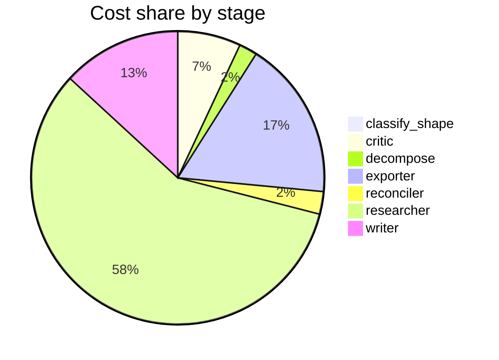

# Run metrics — Is chain-of-thought prompting an effective reasoning strategy for LLMs, or does…

> **Prompt:** Is chain-of-thought prompting an effective reasoning strategy for LLMs, or does it primarily improve output formatting? The literature disagrees — find the real fault lines and explain what accounts for the conflicting results.
> **Started:** 2026-05-05T14:32:46.767909+00:00
> **Duration:** 391.8s
> **Final output:** [final_20260505T073246_0e5db119_is_chain_of_thought_prompting_an_effecti__on.md](./final_20260505T073246_0e5db119_is_chain_of_thought_prompting_an_effecti__on.md)

## Tier 1 — Headline evaluation metrics

### Grounding

**Rate:** 100%  (15/15 claims grounded)

| claim | grounded | reason |
|---:|:---:|---|
| 0 | ✅ | Evidence directly supports CoT gains on arithmetic benchmarks and the 'more than doubled' claim on GSM8K for largest GPT and PaLM models. |
| 1 | ✅ | Evidence directly cites the StrategyQA and sports understanding figures supporting the claim that CoT surpasses supervised SOTA. |
| 2 | ✅ | The evidence directly supports the claim's percentages and conclusion about noisy/inaccurate CoT reasoning steps degrading base LLM accuracy. |
| 3 | ✅ | Evidence directly defines unfaithfulness as arriving at correct answers despite invalid reasoning, matching the claim. |
| 4 | ✅ | Evidence shows both that corrupting steps drops accuracy substantially and that models can reach correct answers via invalid reasoning, supporting the claimed tension. |
| 5 | ✅ | The evidence directly states each of the claimed effects and percentages. |
| 6 | ✅ | Evidence directly states both parts of the claim about strong models needing format alignment and weaker models benefiting. |
| 7 | ✅ | Evidence directly supports that larger/newer models (GPT-4) benefit most from advanced reasoning prompts. |
| 8 | ✅ | Evidence directly describes the GSM8K evaluation mismatch with \boxed{} causing under-measurement of zero-shot CoT performance. |
| 9 | ✅ | Evidence shows different prompt strategies/locations yield different performance across models, supporting the claim about differential effects. |
| 10 | ✅ | Evidence shows scientific/medical datasets (StrategyQA, MedMCQA at α=.31) performed worse than commonsense (CommonsenseQA α=.71), supporting the claim. |
| 11 | ✅ | The evidence directly supports the claim that outcome-only evaluation fails to detect flawed reasoning and masks differences in reasoning quality. |
| 12 | ✅ | Evidence explicitly states the gap between answer accuracy and reasoning faithfulness and the need to evaluate reasoning steps rather than only final answers. |
| 13 | ✅ | The evidence directly states nearly half of benchmarks exhibit saturation with the same definition of lost discriminative power. |
| 14 | ✅ | Evidence directly supports the claim about OOD generalization depending on latent variable similarity and degrading with shift. |

### Fabrication rate

**Rate:** 0%  (0/15 approved claims cite a fabricated finding)

- Drift rate: 80%  (12/15 approved claims cite a drifted finding)
- Verifier source: native verify_history

### Contradictions surfaced

**N surfaced:** 3

- By severity: minor=1, moderate=1, major=1
- By type: factual=3, methodological=0, framing=0, temporal=0, other=0

### Honesty signals

- Uncertainty notes: **3**  |  caveats: **8**
- Sub-questions with ≥1 uncertainty note: **43%**
- Caveats reference uncertainty: **no**

### Source quality

- Cited findings: **15** of 15 harvested  |  mean quality: **0.96** (cited) vs. 0.96 (all)
- Cited quality — median: 1.00, min: 0.70

| tier | cited | all |
|---|---:|---:|
| gov_edu | 3 | 3 |
| peer_reviewed | 10 | 10 |
| news | 0 | 0 |
| curated_tertiary | 0 | 0 |
| unknown | 2 | 2 |
| blog_qa | 0 | 0 |

### Calibration

**Total claims:** 15

| confidence range | n | grounded rate | mean stated confidence |
|---|---:|---:|---:|
| [0.00, 0.30) | 0 | — | — |
| [0.30, 0.60) | 2 | 100% | 0.56 |
| [0.60, 0.80) | 10 | 100% | 0.64 |
| [0.80, 1.01) | 3 | 100% | 0.84 |

### Coverage

**Rate:** 57%  (4 covered, 3 missed)

- **Covered:** `sq1`, `sq3`, `sq6`, `sq7`
- **Missed:** `sq2`, `sq4`, `sq5`

### LLM judge rubric

| dimension | score |
|---|---:|
| correctness | 3.50 / 5 |
| completeness | 3.50 / 5 |
| calibration | 4.00 / 5 |
| source quality | 2.50 / 5 |
| conflict handling | 4.00 / 5 |
| overall | 3.30 / 5 |

> Strongest aspect: the report identifies genuine fault lines (faithfulness vs. accuracy, format-vs-reasoning debate, scale moderation) and explicitly surfaces contradictions between findings rather than smoothing them over. Calibration is honest, with frequent acknowledgment of 'source drift' and provisional confidences. Weakest aspect: source quality is mediocre — heavy reliance on arXiv preprints with suspicious-looking IDs (e.g., 2602.16763, 2603.03332, 2604.11996 don't correspond to valid arXiv date ranges), and key foundational works (Wei et al. 2022, Kojima et al., Turpin et al. on faithfulness, Sprague et al. meta-analysis showing CoT mainly helps math/symbolic tasks) are not clearly cited or are obscured. The major Sprague et al. finding that CoT primarily helps on math/logic — a central fault line — is notably underrepresented.

## Tier 2 — Experimental rigor / depth of understanding

### Researcher signals

- Sub-questions: **7** total, **3** without findings
- Researchers with findings: **4**  |  with uncertainty: **3**  |  with both: **0**
- Findings: 15 total  |  uncertainty notes: 3
- Per active researcher: mean **3.8** findings, max **5**

### Citation density

- Load-bearing fraction: **100%**  (15 cited / 15 harvested)
- Per-claim citations: avg **1.33**  |  median **1.00**  |  uncited claims: 0
- Source concentration (Herfindahl): **0.300**  |  max single-source share: **45%**
- Distinct domains per claim (mean): **1.20**

### Plan judge

- Surface coverage: **1.00**  |  intent alignment: **1.00**

> The decomposition thoroughly addresses both sides of the prompt's central question: sq1 covers evidence for CoT as genuine reasoning, sq2 covers the formatting/surface-plausibility counter-evidence, and sq3-sq7 systematically explore the fault lines that explain conflicting results (methodology, mechanistic faithfulness, scale dependence, corrupted-chain experiments, and evidence gaps). Every sub-question is directly on-topic and traces back to the prompt's explicit ask about why the literature disagrees. No major axis is missing.

### ACE — Adaptive Checklist Evaluation

**Overall:** 0.43 / 1.00

| item | met | score | reason |
|---|:---:|---:|---|
| Identifies and cites specific influential studies on both sides of the debate | ❌ | 0.10 | The report references findings and benchmarks but does not cite specific authors or papers (no Wei, Sprague, Lanham, Turpin, etc.); it relies on vague 'finding [N]' references. |
| Distinguishes between CoT improving task accuracy versus CoT reasoning being faithful/causal to the answer, treating these as separate empirical questions. | ✅ | 0.85 | The report explicitly separates accuracy gains from faithfulness, noting the gap between answer accuracy and reasoning faithfulness and the inability of outcome-based metrics to detect flawed reasoning. |
| Characterizes the task-dependence fault line, specifically noting that CoT gains concentrate in mathematical, symbolic, logical, or multi-step tasks while providing little benefit on many commonsense or knowledge-retrieval tasks. | ❌ | 0.20 | The report mentions domain effects (scientific/medical lower than commonsense) and arithmetic gains, but does not articulate the key fault line that CoT primarily helps math/symbolic/logical tasks while offering little benefit on commonsense/knowledge tasks; in fact it claims CoT helps commonsense benchmarks. |
| Addresses the model-scale dependency, including evidence that CoT benefits emerge or amplify at larger model scales and may hurt or not help smaller models. | ✅ | 0.60 | Report mentions scale as a critical moderator and notes small models suffer more from corruption, but lacks specific emergence thresholds and concrete citations, with claims hedged as drifted. |
| Discusses methodological reasons for conflicting results, such as differences in benchmarks, prompt formats, baselines (zero-shot vs. few-shot vs. instruction-tuned), evaluation metrics, or whether 'formatting-only' control prompts were used. | ✅ | 0.70 | Report explicitly discusses evaluation protocol artifacts, prompt wording/placement, dataset domain effects, benchmark saturation, and answer-only evaluation limitations, though many points are hedged as 'drifted' and formatting-only control prompts aren't directly addressed. |
| Engages with the 'formatting vs. reasoning' hypothesis directly, citing experiments that isolate format effects (e.g., filler tokens, scrambled rationales, or invalid reasoning steps still yielding gains). | ✅ | 0.50 | The report engages with the formatting hypothesis and discusses invalid reasoning still yielding correct answers, but lacks specific citations to key experiments (e.g., Wang et al. on invalid rationales, Pfau et al. on filler tokens) and acknowledges the formatting evidence sub-question could not be substantively addressed. |
| Considers mechanistic or interpretability evidence about whether CoT tokens actually carry computation (e.g., latent reasoning, steering, or activation-based studies) rather than only behavioral results. | ❌ | 0.10 | The report explicitly admits in caveats that mechanistic interpretability evidence (sq4) could not be addressed and remains an open question, providing no such evidence. |
| Reaches a nuanced synthesis that identifies where the literature genuinely agrees, where it disagrees, and what accounts for the disagreements, rather than declaring one side simply correct. | ✅ | 0.70 | The report explicitly identifies fault lines, contradictions, and moderating factors without declaring a winner, though the synthesis is somewhat fragmented across bullet points rather than tightly integrated. |
| Provides specific citations or references (papers, authors, or dates) sufficient for a reader to verify claims rather than relying on vague attributions. | ❌ | 0.10 | The report references findings by number and mentions models (PaLM 540B, Codex, GSM8K) but provides no author names, paper titles, or dates that would allow a reader to verify claims. |

> 5/9 criteria fully met

## Final output audit

- **Format detected:** Narrative analytical summary in markdown with section headers, covering empirical evidence, fault lines, methodological sources of conflict, and open gaps — defaulting to the prompt's implicit request for an explanatory synthesis with clear identification of 'real fault lines'.
- **Notes:** Format inferred as a structured analytical narrative in markdown with labeled section headers and a synthesis section, matching the prompt's implicit request to explain the fault lines in depth. A mermaid flowchart was added to illustrate scale-moderation dynamics. Three conditions are partial due to evidence gaps acknowledged by the pipeline itself (sq2, sq4, sq5); these are surfaced explicitly in Section 5 rather than omitted. Backslash-escaped characters in the boxed expression were removed to avoid JSON escape sequence issues.
- **Conditions:** 8 satisfied / 3 partial / 0 not satisfied / 0 n/a
- **Unmet:**
  - Cover evidence that CoT primarily improves output formatting or surface plausibility rather than genuine reasoning (sq2)
  - Address whether CoT engages qualitatively different internal computations via mechanistic interpretability or probing (sq4)
  - Address how model scale moderates CoT effectiveness and at what thresholds CoT gains emerge (sq5)

Tier 3 — Operational details

### Cost & latency
- Total cost: **$0.9643**  |  input tokens: 559178  |  output tokens: 26564  |  elapsed: 391.8s  |  revision rounds: 1
- Researcher latency: max 55.8s, avg 29.6s

### Per-stage
| stage | calls | input tokens | output tokens | cost (USD) | elapsed (s) |
|---|---:|---:|---:|---:|---:|
| classify_shape | 1 | 995 | 45 | $0.0037 | 2.3 |
| confidence | 0 | 0 | 0 | $0.0000 | 0.0 |
| critic | 2 | 16062 | 1255 | $0.0670 | 23.6 |
| decompose | 1 | 1491 | 991 | $0.0193 | 17.3 |
| exporter | 2 | 17109 | 7800 | $0.1683 | 135.3 |
| reconciler | 1 | 4111 | 768 | $0.0239 | 16.7 |
| researcher | 62 | 504331 | 10301 | $0.5558 | 105.3 |
| verifier | 0 | 0 | 0 | $0.0000 | 4.3 |
| writer | 2 | 15079 | 5404 | $0.1263 | 86.8 |

### Tool mix
| tool | calls |
|---|---:|
| web_search | 31 |
| search_papers | 17 |
| fetch_url | 34 |
| save_finding | 15 |
| note_uncertainty | 0 |

### Run metadata
- commit: `de5b7d0f40e6584303761befb270bda2f44c2f27`  branch: `main`
- captured_at: 2026-05-05T14:26:14.991171+00:00
- models: critic=`claude-sonnet-4-6`, judge=`claude-opus-4-7`, kae_judge=`claude-haiku-4-5`, researcher=`claude-haiku-4-5`, writer=`claude-sonnet-4-6`

