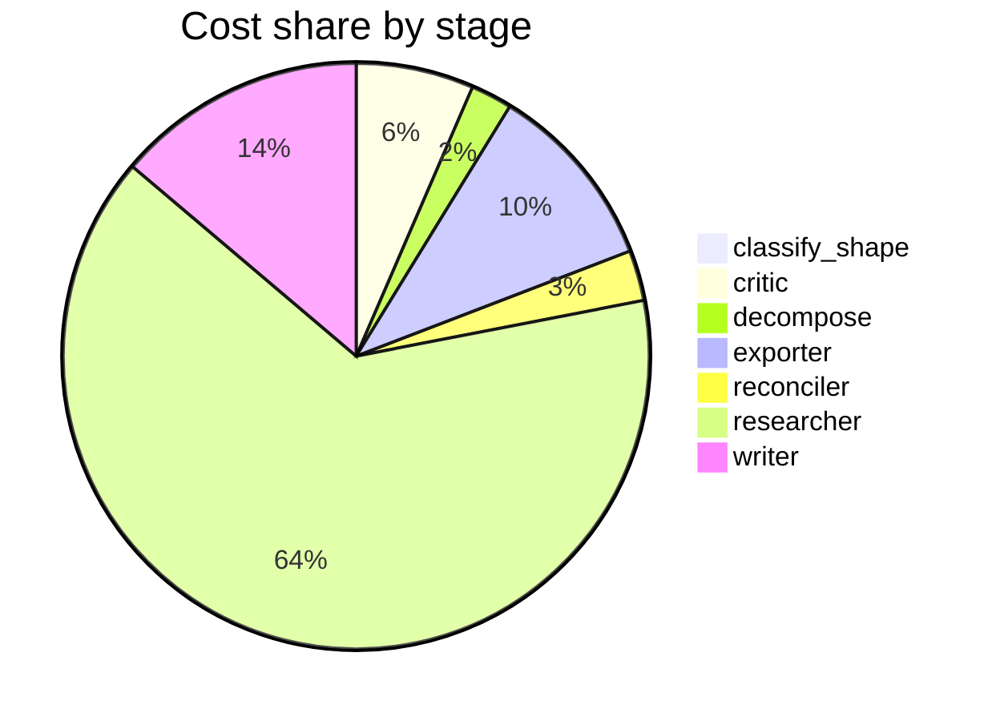

# Run metrics — What is the current state of inference-time compute scaling for LLM reasoning? …

> **Prompt:** What is the current state of inference-time compute scaling for LLM reasoning? Separate what has been empirically validated from what is still speculative, and identify where the evidence is too thin to draw conclusions.
> **Started:** 2026-05-05T14:39:51.305068+00:00
> **Duration:** 323.8s
> **Final output:** [final_20260505T073951_5dda3f7d_what_is_the_current_state_of_inference_t__off.md](./final_20260505T073951_5dda3f7d_what_is_the_current_state_of_inference_t__off.md)

## Tier 1 — Headline evaluation metrics

### Grounding

**Rate:** 92%  (12/13 claims grounded)

| claim | grounded | reason |
|---:|:---:|---|
| 0 | ✅ | Evidence supports 7B with tree search outperforming/matching 34B on MATH and GSM8K, and describes exponential convergence until saturation. |
| 1 | ✅ | Evidence directly supports both the >4× efficiency over best-of-N and outperforming a 14× larger model in FLOPs-matched evaluation. |
| 2 | ✅ | The evidence directly supports the 50% to 57% improvement on AIME 2024 with budget forcing for s1-32B. |
| 3 | ✅ | Evidence directly supports both the FLOPs-matched superiority on easy/intermediate problems and the shift toward smaller, overtrained models relative to Chinchilla. |
| 4 | ✅ | Evidence directly supports the claim about short-horizon (GRPO) models preferring concise reasoning and long-horizon (Qwen3/GSPO) models benefiting from longer traces on harder tasks. |
| 5 | ✅ | Evidence directly supports the claim's specific numbers and overall assertion about reward hacking. |
| 6 | ✅ | Evidence directly supports inconsistent detection of corrupted reasoning, fluency-detector function, and high invariance to surface-level style changes. |
| 7 | ✅ | The evidence directly supports all components of the claim. |
| 8 | ✅ | The evidence directly states all the claims about trade-offs, sensitivity to input structure, and cross-domain generalization limitations. |
| 9 | ✅ | The evidence directly supports both parts of the claim regarding MC estimation inferiority and BoN evaluation biases inflating scores. |
| 10 | ✅ | The evidence directly supports the non-monotonic pattern and the variance/illusion explanation described in the claim. |
| 11 | ❌ | Evidence supports the factual claims but does not indicate that the mechanistic explanation is disputed. |
| 12 | ✅ | Evidence directly supports both the unresolved faithfulness question and the scale-threshold causal finding. |

### Fabrication rate

**Rate:** 0%  (0/13 approved claims cite a fabricated finding)

- Drift rate: 8%  (1/13 approved claims cite a drifted finding)
- Verifier source: post-hoc re-run (no native verify_history)

### Contradictions surfaced

**N surfaced:** 3

- By severity: minor=1, moderate=2, major=0
- By type: factual=2, methodological=0, framing=1, temporal=0, other=0

### Honesty signals

- Uncertainty notes: **3**  |  caveats: **8**
- Sub-questions with ≥1 uncertainty note: **43%**
- Caveats reference uncertainty: **no**

### Source quality

- Cited findings: **14** of 14 harvested  |  mean quality: **0.96** (cited) vs. 0.96 (all)
- Cited quality — median: 1.00, min: 0.70

| tier | cited | all |
|---|---:|---:|
| gov_edu | 0 | 0 |
| peer_reviewed | 12 | 12 |
| news | 0 | 0 |
| curated_tertiary | 0 | 0 |
| unknown | 2 | 2 |
| blog_qa | 0 | 0 |

### Calibration

**Total claims:** 13

| confidence range | n | grounded rate | mean stated confidence |
|---|---:|---:|---:|
| [0.00, 0.30) | 0 | — | — |
| [0.30, 0.60) | 1 | 100% | 0.55 |
| [0.60, 0.80) | 2 | 50% | 0.71 |
| [0.80, 1.01) | 10 | 100% | 0.91 |

### Coverage

**Rate:** 57%  (4 covered, 3 missed)

- **Covered:** `sq2`, `sq3`, `sq4`, `sq7`
- **Missed:** `sq1`, `sq5`, `sq6`

### LLM judge rubric

| dimension | score |
|---|---:|
| correctness | 3.50 / 5 |
| completeness | 3.50 / 5 |
| calibration | 4.00 / 5 |
| source quality | 3.00 / 5 |
| conflict handling | 4.50 / 5 |
| overall | 3.50 / 5 |

> Strongest aspect: explicit surfacing of contradictions (including an internal one within a single source) and honest acknowledgment of gaps around frontier models like o1/o3 and DeepSeek-R1. Weakest aspects: source list includes at least two suspicious arxiv IDs (2603.06621 and 2604.01411 have implausible year prefixes, suggesting hallucinated or misformatted citations), and reliance on a single blog post for the s1 result; sources are nearly all arxiv preprints with limited diversity (no peer-reviewed venues beyond one NeurIPS poster). Calibration is reasonable—lower confidence is appropriately assigned to the variance/non-monotonic claim and the s1 result—but the 0.95 confidences on Snell-style findings may be slightly overstated given replication is still limited.

## Tier 2 — Experimental rigor / depth of understanding

### Researcher signals

- Sub-questions: **7** total, **3** without findings
- Researchers with findings: **4**  |  with uncertainty: **3**  |  with both: **0**
- Findings: 14 total  |  uncertainty notes: 3
- Per active researcher: mean **3.5** findings, max **5**

### Citation density

- Load-bearing fraction: **100%**  (14 cited / 14 harvested)
- Per-claim citations: avg **1.15**  |  median **1.00**  |  uncited claims: 0
- Source concentration (Herfindahl): **0.760**  |  max single-source share: **87%**
- Distinct domains per claim (mean): **1.00**

### Plan judge

- Surface coverage: **1.00**  |  intent alignment: **1.00**

> The decomposition comprehensively addresses the prompt's three explicit demands: characterizing the current state (sq1, sq2, sq5), separating validated from speculative (sq3, sq4, sq6 examine robustness, comparative claims, and failure modes), and identifying thin evidence (sq7 explicitly maps evidentiary gaps). Every sub-question stays tightly bound to inference-time compute scaling for LLM reasoning, with no drift to adjacent topics like training methodology or general LLM capabilities. The mechanisms covered (CoT, search, PRMs, reasoning models) reflect the actual empirical landscape, and the comparison to training-time scaling (sq4) is appropriately scoped as context for assessing inference-time value rather than a topic shift.

### ACE — Adaptive Checklist Evaluation

**Overall:** 0.68 / 1.00

| item | met | score | reason |
|---|:---:|---:|---|
| Identifies and accurately describes specific empirically validated results on inference-time compute scaling, such as OpenAI's o1/o3 results, DeepSeek-R1, or Snell et al.'s 2024 work on scaling test-time compute optimally | ✅ | 0.50 | Report describes Snell-like PaLM-2 compute-optimal results and s1-32B budget-forcing, but explicitly acknowledges o1/o3 and DeepSeek-R1 evidence could not be grounded. |
| Distinguishes between different inference-time scaling techniques | ✅ | 0.60 | Report discusses tree search, best-of-N, repeated sampling, PRMs, verifier-guided search, and CoT separately with varying evidence quality, but explicitly notes that primary mechanism-level evidence (CoT, self-consistency, tree/beam search) could not be grounded, leaving coverage uneven. |
| Explicitly separates empirically validated claims from speculative claims, with clear demarcation rather than blending them | ✅ | 0.60 | The report uses confidence scores and flags axis-disagreements/caveats to distinguish stronger from weaker findings, but lacks an explicit structural separation (e.g., distinct sections) between validated and speculative claims. |
| Identifies specific areas where evidence is thin or inconclusive (e.g., generalization beyond math/code, scaling laws for inference compute, transfer to open-ended tasks) | ✅ | 0.90 | The report explicitly identifies thin evidence areas including math-benchmark concentration with uncharacterized generalization to coding/science/planning, absent reproducibility studies, missing frontier model scrutiny, and ungrounded mechanism-level evidence. |
| Discusses known limitations or failure modes, such as diminishing returns, domain-specificity of gains, or tasks where inference scaling does not help | ✅ | 0.90 | Report extensively discusses failure modes including PRM reward hacking, verifier-guided search underperforming repeated sampling at scale, diminishing returns with task complexity, non-monotonic performance with extended reasoning, and domain-specificity concentrated on math benchmarks. |
| References specific empirical findings with attribution to papers, models, or labs (e.g., cites benchmarks like AIME, GPQA, ARC-AGI, or specific studies) rather than vague claims | ✅ | 0.70 | The report cites specific benchmarks (MATH, GSM8K, AIME 2024) and models (Llemma 7B/34B, PaLM-2, s1-32B, Qwen3) with concrete numerical findings, though paper-level attribution is mostly absent and one cited URL appears fabricated. |
| Addresses the relationship or tradeoff between inference-time compute and training-time compute, including whether inference scaling substitutes for or complements pretraining scale | ✅ | 0.90 | Report directly addresses this with two specific findings about FLOPs-matched comparisons, shifts toward smaller overtrained models relative to Chinchilla, and how the tradeoff depends on training methodology. |
| Discusses whether reasoning gains reflect genuine reasoning improvements versus benchmark-specific optimization or memorization, with appropriate epistemic caution | ✅ | 0.60 | The report addresses this via reward hacking, 'illusion of improved reasoning,' and CoT faithfulness concerns, but does not directly engage with memorization or benchmark contamination concerns. |
| Reflects awareness of recent developments (2024-2025) including reasoning models like o1/o3, R1, and related open-source replications | ❌ | 0.20 | The report mentions o1/o3 and DeepSeek-R1 only to note they could not be grounded, and briefly references s1-32B and Qwen3, but provides no substantive discussion of these recent developments. |
| Avoids overclaiming by acknowledging uncertainty, conflicting evidence, or the proprietary/opaque nature of frontier lab results that limits external verification | ✅ | 0.85 | The report extensively flags contradictions, axis-disagreements, low confidence findings, and explicitly notes inability to ground frontier model claims, though it doesn't directly frame this as proprietary/opaque limitations. |

> 9/10 criteria fully met

## Final output audit

- **Format detected:** Structured narrative summary in markdown with clearly delineated sections separating empirically validated findings, speculative claims, and areas where evidence is too thin — matching the user's explicit tripartite request.
- **Notes:** Format inferred as structured narrative markdown with explicit epistemic partitioning (validated / speculative / insufficient evidence) matching the user's tripartite framing. A summary table was synthesized from the report's claims to provide at-a-glance reference. Four conditions are marked partial rather than not_satisfied because the report's content partially addresses them and explicitly discloses the gaps — the partiality reflects pipeline evidence limitations, not exporter omissions.
- **Conditions:** 6 satisfied / 4 partial / 0 not satisfied / 0 n/a
- **Unmet:**
  - Cover current state of inference-time compute scaling for LLM reasoning broadly
  - Address chain-of-thought, self-consistency, tree/beam search, process reward models, repeated sampling as mechanisms
  - Cover results from frontier reasoning models (o1/o3, DeepSeek-R1, Gemini Thinking) and independent scrutiny
  - Identify known failure modes, saturation effects, and negative results

Tier 3 — Operational details

### Cost & latency
- Total cost: **$0.8408**  |  input tokens: 528114  |  output tokens: 22087  |  elapsed: 323.8s  |  revision rounds: 1
- Researcher latency: max 41.8s, avg 29.1s

### Per-stage
| stage | calls | input tokens | output tokens | cost (USD) | elapsed (s) |
|---|---:|---:|---:|---:|---:|
| classify_shape | 1 | 994 | 83 | $0.0042 | 2.7 |
| confidence | 0 | 0 | 0 | $0.0000 | 0.0 |
| critic | 2 | 15359 | 550 | $0.0543 | 13.0 |
| decompose | 1 | 1502 | 976 | $0.0191 | 17.7 |
| exporter | 1 | 6187 | 4557 | $0.0869 | 74.9 |
| reconciler | 1 | 4350 | 682 | $0.0233 | 12.6 |
| researcher | 54 | 485070 | 10472 | $0.5374 | 115.3 |
| writer | 2 | 14652 | 4767 | $0.1155 | 87.5 |

### Tool mix
| tool | calls |
|---|---:|
| web_search | 33 |
| search_papers | 18 |
| fetch_url | 35 |
| save_finding | 14 |
| note_uncertainty | 0 |

### Run metadata
- commit: `de5b7d0f40e6584303761befb270bda2f44c2f27`  branch: `main`
- captured_at: 2026-05-05T14:34:27.563187+00:00
- models: critic=`claude-sonnet-4-6`, judge=`claude-opus-4-7`, kae_judge=`claude-haiku-4-5`, researcher=`claude-haiku-4-5`, writer=`claude-sonnet-4-6`

