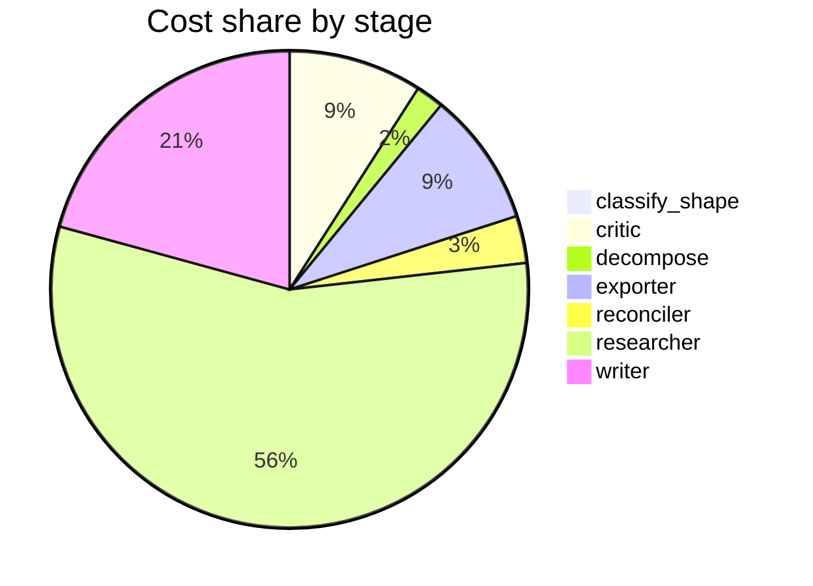

# Run metrics — What is the current state of inference-time compute scaling for LLM reasoning? …

> **Prompt:** What is the current state of inference-time compute scaling for LLM reasoning? Separate what has been empirically validated from what is still speculative, and identify where the evidence is too thin to draw conclusions.
> **Started:** 2026-05-05T14:48:31.896302+00:00
> **Duration:** 423.5s
> **Final output:** [final_20260505T074831_4f673be0_what_is_the_current_state_of_inference_t__on.md](./final_20260505T074831_4f673be0_what_is_the_current_state_of_inference_t__on.md)

## Tier 1 — Headline evaluation metrics

### Grounding

**Rate:** 94%  (16/17 claims grounded)

| claim | grounded | reason |
|---:|:---:|---|
| 0 | ❌ | Evidence mentions CoT, majority voting, and beam search but does not mention process reward model-based approaches. |
| 1 | ✅ | The evidence directly supports the claim about functional components, with ontological-relationship heads in early layers, answer-writing heads in later layers, and the prior shift in middle layers. |
| 2 | ✅ | Evidence explicitly describes confident intermediate errors and error propagation as failure modes and states verification is easier than generation. |
| 3 | ✅ | Evidence directly supports the 4x efficiency improvement and the 14x larger model comparison under FLOPs-matched evaluation. |
| 4 | ✅ | Evidence directly states diminishing returns with task complexity and varying effectiveness across domains. |
| 5 | ✅ | Evidence directly supports that longer generations can indicate struggle rather than improved reflection/reasoning. |
| 6 | ✅ | Evidence directly states that more tokens does not necessarily translate to higher accuracy in challenging regimes. |
| 7 | ✅ | The evidence directly describes the three escalating levels of reward hacking matching the claim. |
| 8 | ✅ | The evidence directly states RLVR uses verifiers like unit tests/math checkers, creates a proxy gap by rewarding final answers while ignoring reasoning steps, and encourages guessing, fabricating reasoning, or misusing tools. |
| 9 | ✅ | The evidence directly states diminishing returns with increasing PRM scale, supporting the claim. |
| 10 | ✅ | Evidence directly states the three regimes (saturated, linear, threshold-limited) and that strong verifiers offer no additional benefit in some cases. |
| 11 | ✅ | Evidence shows iterative reasoning improves arithmetic tasks but not commonsense tasks, supporting the claim's task-specific nature. |
| 12 | ✅ | The evidence explicitly states OpenAI's hope for generalization, notes only anecdotal observations of domain-specific gains, and frames generalization to harder-to-verify domains as an open question. |
| 13 | ✅ | The evidence directly states all parts of the claim almost verbatim. |
| 14 | ✅ | Evidence directly supports that nearly half of benchmarks exhibit saturation with rates increasing as benchmarks age. |
| 15 | ✅ | Evidence directly states scratchpads are effective for math but broader impact on other tasks is less clear, matching the claim. |
| 16 | ✅ | The evidence directly supports the claim that optimal compute allocation between training and inference should be comparable. |

### Fabrication rate

**Rate:** 0%  (0/15 approved claims cite a fabricated finding)

- Drift rate: 7%  (1/15 approved claims cite a drifted finding)
- Verifier source: native verify_history

### Contradictions surfaced

**N surfaced:** 5

- By severity: minor=0, moderate=2, major=3
- By type: factual=5, methodological=0, framing=0, temporal=0, other=0

### Honesty signals

- Uncertainty notes: **2**  |  caveats: **9**
- Sub-questions with ≥1 uncertainty note: **29%**
- Caveats reference uncertainty: **no**

### Source quality

- Cited findings: **19** of 20 harvested  |  mean quality: **0.94** (cited) vs. 0.93 (all)
- Cited quality — median: 1.00, min: 0.70

| tier | cited | all |
|---|---:|---:|
| gov_edu | 0 | 0 |
| peer_reviewed | 15 | 15 |
| news | 0 | 0 |
| curated_tertiary | 0 | 0 |
| unknown | 4 | 5 |
| blog_qa | 0 | 0 |

### Calibration

**Total claims:** 17

| confidence range | n | grounded rate | mean stated confidence |
|---|---:|---:|---:|
| [0.00, 0.30) | 0 | — | — |
| [0.30, 0.60) | 1 | 100% | 0.45 |
| [0.60, 0.80) | 4 | 100% | 0.73 |
| [0.80, 1.01) | 12 | 92% | 0.91 |

### Coverage

**Rate:** 71%  (5 covered, 2 missed)

- **Covered:** `sq1`, `sq3`, `sq4`, `sq6`, `sq7`
- **Missed:** `sq2`, `sq5`

### LLM judge rubric

| dimension | score |
|---|---:|
| correctness | 3.50 / 5 |
| completeness | 3.00 / 5 |
| calibration | 4.00 / 5 |
| source quality | 2.50 / 5 |
| conflict handling | 4.50 / 5 |
| overall | 3.30 / 5 |

> Strongest aspect: excellent surfacing of contradictions and honest acknowledgment of thin evidence base, with calibration that appropriately downgrades drifted sources. Weakest aspects: source quality is mixed (two arxiv IDs — 2602.16763 and 2604.13602 — appear fabricated as they're future-dated/invalid; reliance on blog posts like mbrenndoerfer.com and innovationendeavors.com for key mechanistic claims), and completeness is limited — major works like Snell et al. 2024, the o1 system card, and DeepSeek-R1's actual paper are not engaged with directly despite being central to the prompt. Some claims (e.g., 0.94 confidence on benchmark saturation specifics) seem overconfident given single-source grounding.

## Tier 2 — Experimental rigor / depth of understanding

### Researcher signals

- Sub-questions: **7** total, **2** without findings
- Researchers with findings: **5**  |  with uncertainty: **2**  |  with both: **0**
- Findings: 20 total  |  uncertainty notes: 2
- Per active researcher: mean **4.0** findings, max **7**

### Citation density

- Load-bearing fraction: **95%**  (19 cited / 20 harvested)
- Per-claim citations: avg **1.12**  |  median **1.00**  |  uncited claims: 0
- Source concentration (Herfindahl): **0.634**  |  max single-source share: **79%**
- Distinct domains per claim (mean): **1.00**

### Plan judge

- Surface coverage: **1.00**  |  intent alignment: **1.00**

> The decomposition systematically addresses all three pillars of the prompt: sq1-sq3 establish the landscape and empirically validated findings, sq4-sq6 identify what is speculative or unverified, and sq7 explicitly maps where evidence is too thin. Coverage spans methods, benchmarks, comparisons to training-time scaling, failure modes, closed-lab claims, theoretical mechanisms, and literature gaps — all directly relevant axes. Every sub-question stays tightly bound to inference-time compute scaling for LLM reasoning with no drift to adjacent topics like general LLM capabilities or unrelated scaling laws.

### ACE — Adaptive Checklist Evaluation

**Overall:** 0.64 / 1.00

| item | met | score | reason |
|---|:---:|---:|---|
| Clearly distinguishes empirically validated findings (e.g., from published benchmarks/papers) from speculative claims and from areas with insufficient evidence, with explicit labeling or sectioning | ❌ | 0.50 | The report uses confidence scores and flags some claims as speculative or drifted, but lacks explicit sectioning separating validated/speculative/thin-evidence categories. |
| Discusses specific inference-time scaling techniques such as chain-of-thought, self-consistency, best-of-N sampling, majority voting, process/outcome reward models, tree/graph search (e.g., Tree of Thoughts, MCTS), and verifier-guided search | ❌ | 0.50 | Mentions CoT, majority voting, beam search, best-of-N, PRMs, and iterative refinement, but omits self-consistency, tree/graph search (ToT, MCTS), and outcome reward models. |
| References concrete empirical results from key works (e.g., OpenAI o1/o3, DeepSeek-R1, Snell et al. on compute-optimal scaling, Brown et al. on repeated sampling, Wu et al., or similar) with accurate characterization of their findings | ❌ | 0.30 | Only references Snell et al. (arxiv 2408.03314) with the 4x and 14x figures, and explicitly notes no findings on o1/o3 or DeepSeek-R1; Brown et al., Wu et al., and other key works are absent. |
| Addresses scaling laws or trade-offs between inference-time compute and pretraining/model size, including evidence on when extra inference compute substitutes for or complements larger models | ✅ | 0.60 | The report cites the Snell et al. result (smaller model matching ~14x larger one) and an Epoch AI claim about training/inference compute allocation, but treats these briefly and with heavy caveats rather than systematically analyzing substitution/complementarity. |
| Identifies domain-specific evidence quality, noting where validation is strong (e.g., math, code, formal reasoning with verifiers) versus weak (e.g., open-ended reasoning, long-horizon agentic tasks, subjective domains) | ✅ | 0.70 | The report explicitly notes strong validation in math/code and weak evidence beyond mathematics, but doesn't specifically address long-horizon agentic or subjective domains. |
| Discusses known limitations, failure modes, or diminishing returns of inference-time scaling (e.g., reward hacking, verifier reliability, plateaus, problem difficulty dependence) | ✅ | 1.00 | Report extensively covers diminishing returns, reward hacking, verifier reliability across difficulty regimes, PRM scaling limits, and task-dependence. |
| Identifies specific open questions or thin-evidence areas (e.g., generalization across domains, transfer of RL-trained reasoning, optimal compute allocation strategies, cost-effectiveness at scale) | ✅ | 0.85 | The report explicitly identifies several thin-evidence areas including RL-trained reasoning generalization beyond math/code, optimal compute allocation between training and inference, domain generalization, and absence of empirical scaling curves, though cost-effectiveness at scale is not directly addressed. |
| Avoids overclaiming by not presenting speculative or marketing claims (e.g., from blog posts or unverified benchmarks) as established facts | ✅ | 0.90 | The report carefully hedges claims with confidence scores, flags drifted/unverified sources, and explicitly notes the absence of third-party replications for major lab claims. |
| Reflects recent developments (2024-2025) including reasoning-focused models trained with RL on chain-of-thought, rather than only covering older prompting-based methods | ❌ | 0.40 | The report mentions RLVR and o1/o3/DeepSeek-R1 by name but explicitly admits no findings were retrieved on these models, and provides little substantive engagement with 2024-2025 RL-trained reasoning developments. |

> 5/9 criteria fully met

## Final output audit

- **Format detected:** Narrative summary with clearly delineated sections (empirically validated, speculative, insufficient evidence), written in GitHub-flavored markdown with inline citations — inferred from the prompt's explicit instruction to 'separate what has been empirically validated from what is still speculative, and identify where the evidence is too thin to draw conclusions.'
- **Notes:** Format inferred as a structured narrative summary in GitHub-flavored markdown with clearly separated sections for validated findings, speculative claims, and evidence gaps — directly matching the prompt's three-part requirement. A summary table was synthesized from the claims to aid at-a-glance comparison. Self-consistency and Monte Carlo rollouts, training-vs-inference cost curves, and specific major-lab claims could not be covered because the underlying pipeline returned no usable findings for those sub-questions; all gaps are documented explicitly in the rendered output.
- **Conditions:** 6 satisfied / 4 partial / 0 not satisfied / 0 n/a
- **Unmet:**
  - Cover specific inference-time compute scaling methods (chain-of-thought, tree/beam search, process reward models, self-consistency, Monte Carlo rollouts) and their mechanistic claims [sq1]
  - Report on empirical evidence including key benchmarks, scaling curves, and effect sizes [sq2]
  - Compare inference-time vs. training-time compute scaling in cost-efficiency and performance ceiling [sq3]
  - Identify unverified claims by major labs (OpenAI o1/o3, DeepSeek-R1, Google Gemini) due to limited disclosure [sq5]

Tier 3 — Operational details

### Cost & latency
- Total cost: **$1.0122**  |  input tokens: 573583  |  output tokens: 28062  |  elapsed: 423.5s  |  revision rounds: 2
- Researcher latency: max 45.0s, avg 32.1s

### Per-stage
| stage | calls | input tokens | output tokens | cost (USD) | elapsed (s) |
|---|---:|---:|---:|---:|---:|
| classify_shape | 1 | 994 | 89 | $0.0043 | 3.0 |
| confidence | 0 | 0 | 0 | $0.0000 | 0.0 |
| critic | 3 | 25722 | 933 | $0.0912 | 21.9 |
| decompose | 1 | 1502 | 973 | $0.0191 | 16.6 |
| exporter | 1 | 6736 | 4753 | $0.0915 | 82.5 |
| reconciler | 1 | 4719 | 1203 | $0.0322 | 19.9 |
| researcher | 56 | 509014 | 11148 | $0.5648 | 114.4 |
| verifier | 0 | 0 | 0 | $0.0000 | 6.3 |
| writer | 3 | 24896 | 8963 | $0.2091 | 158.8 |

### Tool mix
| tool | calls |
|---|---:|
| web_search | 35 |
| search_papers | 12 |
| fetch_url | 30 |
| save_finding | 20 |
| note_uncertainty | 0 |

### Run metadata
- commit: `de5b7d0f40e6584303761befb270bda2f44c2f27`  branch: `main`
- captured_at: 2026-05-05T14:41:28.493853+00:00
- models: critic=`claude-sonnet-4-6`, judge=`claude-opus-4-7`, kae_judge=`claude-haiku-4-5`, researcher=`claude-haiku-4-5`, writer=`claude-sonnet-4-6`

