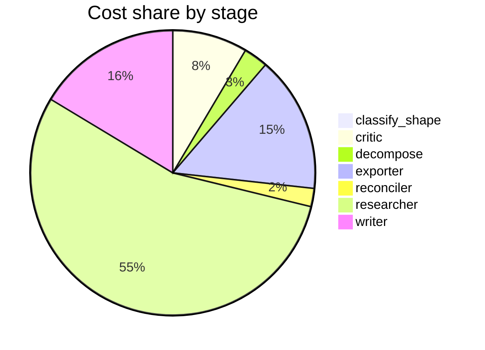

# Run metrics — Map the research landscape of multi-agent LLM systems. Produce a structured rep…

> **Prompt:** Map the research landscape of multi-agent LLM systems. Produce a structured report that includes a visual taxonomy or design graph showing the major architectural patterns, how they relate, and where the open problems are.
> **Started:** 2026-05-05T14:55:29.389214+00:00
> **Duration:** 324.6s
> **Final output:** [final_20260505T075529_ed33dba3_map_the_research_landscape_of_multi_agen__off.md](./final_20260505T075529_ed33dba3_map_the_research_landscape_of_multi_agen__off.md)

## Tier 1 — Headline evaluation metrics

### Grounding

**Rate:** 100%  (15/15 claims grounded)

| claim | grounded | reason |
|---:|:---:|---|
| 0 | ✅ | Both the five-axis taxonomy and the centralized-to-decentralized spectrum with hybrid blends are directly stated in the evidence. |
| 1 | ✅ | The evidence directly states the three canonical patterns and the same three distinguishing dimensions as the claim. |
| 2 | ✅ | Evidence directly supports task decomposition by upper layers, role specialization, and shared meta-prompts within layers for prompt optimization. |
| 3 | ✅ | Evidence directly states the F1 scores, cost multipliers, and 89% recovery figure matching the claim. |
| 4 | ✅ | Evidence directly describes the four specialized agents (Judge, Critic, Refiner, Curator) with the roles claimed. |
| 5 | ✅ | The evidence directly describes NFD as the claim states, including minimal scaffolding, progressive growth via conversational interaction, and Knowledge Crystallization Cycles. |
| 6 | ✅ | Evidence directly states the same numerical claims about latency, planning accuracy, and coordination success. |
| 7 | ✅ | The evidence directly states the 80.9% improvement on financial reasoning and 39-70% degradation on sequential reasoning tasks. |
| 8 | ✅ | The evidence directly supports both numerical claims and the validation bottleneck characterization. |
| 9 | ✅ | Evidence directly states the three challenges of partitioning to maximize unique capabilities, align with overall goal, and consider context. |
| 10 | ✅ | The evidence describes the same challenge of managing layered context across tasks, agents, and shared knowledge. |
| 11 | ✅ | The evidence directly states that existing literature pays limited attention to memory storage and lists the same critical roles mentioned in the claim. |
| 12 | ✅ | The evidence directly states the lack of principled understanding of when/how synergy emerges, agent differentiation's role, and systematic steering. |
| 13 | ✅ | Both parts of the claim are directly supported by the two evidence quotes. |
| 14 | ✅ | All four framework descriptions in the claim are directly supported by the evidence quotes. |

### Fabrication rate

**Rate:** 0%  (0/15 approved claims cite a fabricated finding)

- Drift rate: 53%  (8/15 approved claims cite a drifted finding)
- Verifier source: post-hoc re-run (no native verify_history)

### Contradictions surfaced

**N surfaced:** 1

- By severity: minor=1, moderate=0, major=0
- By type: factual=0, methodological=0, framing=1, temporal=0, other=0

### Honesty signals

- Uncertainty notes: **2**  |  caveats: **9**
- Sub-questions with ≥1 uncertainty note: **29%**
- Caveats reference uncertainty: **no**

### Source quality

- Cited findings: **21** of 21 harvested  |  mean quality: **0.90** (cited) vs. 0.90 (all)
- Cited quality — median: 1.00, min: 0.70

| tier | cited | all |
|---|---:|---:|
| gov_edu | 0 | 0 |
| peer_reviewed | 14 | 14 |
| news | 0 | 0 |
| curated_tertiary | 0 | 0 |
| unknown | 7 | 7 |
| blog_qa | 0 | 0 |

### Calibration

**Total claims:** 15

| confidence range | n | grounded rate | mean stated confidence |
|---|---:|---:|---:|
| [0.00, 0.30) | 0 | — | — |
| [0.30, 0.60) | 0 | — | — |
| [0.60, 0.80) | 0 | — | — |
| [0.80, 1.01) | 15 | 100% | 0.95 |

### Coverage

**Rate:** 71%  (5 covered, 2 missed)

- **Covered:** `sq1`, `sq3`, `sq4`, `sq5`, `sq6`
- **Missed:** `sq2`, `sq7`

### LLM judge rubric

| dimension | score |
|---|---:|
| correctness | 2.50 / 5 |
| completeness | 3.00 / 5 |
| calibration | 2.00 / 5 |
| source quality | 2.00 / 5 |
| conflict handling | 3.00 / 5 |
| overall | 2.50 / 5 |

> Several arxiv URLs appear fabricated or implausible (e.g., 2602.xxxxx, 2603.xxxxx, 2510.xxxxx are future/invalid arxiv IDs as of writing), which seriously undermines source credibility. Highly specific empirical claims (F1 0.943, 80.9% improvement, 17.2x error amplification, 100x latency) are stated with very high confidence (0.97-0.98) but appear to derive from a single benchmark or unverifiable sources — calibration is too aggressive. The taxonomy framing and surfacing of the three-pattern vs five-axis tension is a strength, as is coverage of open problems (memory, emergence, hallucination propagation), but the promised 'visual taxonomy or design graph' is not actually delivered in the summary.

## Tier 2 — Experimental rigor / depth of understanding

### Researcher signals

- Sub-questions: **7** total, **2** without findings
- Researchers with findings: **5**  |  with uncertainty: **2**  |  with both: **0**
- Findings: 21 total  |  uncertainty notes: 2
- Per active researcher: mean **4.2** findings, max **6**

### Citation density

- Load-bearing fraction: **100%**  (21 cited / 21 harvested)
- Per-claim citations: avg **1.40**  |  median **1.00**  |  uncited claims: 0
- Source concentration (Herfindahl): **0.478**  |  max single-source share: **67%**
- Distinct domains per claim (mean): **1.07**

### Plan judge

- Surface coverage: **1.00**  |  intent alignment: **1.00**

> The decomposition comprehensively covers the prompt's requested research landscape map: architectural patterns/taxonomy (sq1) directly supports the visual taxonomy/design graph, relationships between patterns are addressed via coordination mechanisms (sq2) and role/task decomposition (sq3), open problems are explicitly mapped (sq5, sq7), and empirical grounding (sq4) plus practical frameworks (sq6) round out the landscape. Every sub-question stays tightly on-topic with the user's request to map multi-agent LLM systems and surface architectural patterns and open problems. No major axis appears missing and no sub-question drifts to adjacent territory.

### ACE — Adaptive Checklist Evaluation

**Overall:** 0.42 / 1.00

| item | met | score | reason |
|---|:---:|---:|---|
| Provides a clear taxonomy of major architectural patterns in multi-agent LLM systems | ❌ | 0.40 | Mentions hub-spoke, mesh, hierarchical, reflexive, and role-based patterns but lacks systematic definitions and omits several major patterns like debate, blackboard, planner-executor, and swarm. |
| Includes a visual taxonomy, diagram, or design graph (ASCII, mermaid, tree, or other rendered structure) that depicts the patterns and their relationships rather than only prose. | ❌ | 0.00 | The report explicitly admits it cannot produce a visual taxonomy or design graph and presents only prose bullet points. |
| Explicitly shows or describes relationships between patterns (e.g., specialization, composition, evolution, or trade-off axes) rather than presenting them as an unrelated list. | ✅ | 0.50 | The report describes trade-off axes (cost vs accuracy, error amplification differences) and five dimensions, but relationships between patterns are only loosely sketched and not systematically mapped. |
| Identifies and labels open research problems or unresolved challenges (e.g., coordination, communication efficiency, evaluation, memory, error propagation, scalability, alignment) and locates them within the taxonomy/graph. | ❌ | 0.40 | Open problems like memory, context management, hallucination propagation, and emergent behavior are listed, but they are not located within a taxonomy or graph since no visual structure exists and the problems are presented as a flat list. |
| References concrete representative systems, frameworks, or papers (e.g., AutoGen, MetaGPT, CAMEL, ChatDev, Society of Mind, LangGraph, CrewAI, Debate, Reflexion) tied to specific patterns. | ✅ | 0.80 | The report explicitly ties AutoGen, CrewAI, LangGraph, and MetaGPT to specific architectural patterns, though it omits several other canonical examples like CAMEL, ChatDev, Reflexion, or Debate. |
| Discusses key design dimensions or axes such as agent roles, communication topology, coordination/control mechanisms, memory/state, and tool use. | ✅ | 0.70 | Explicitly lists five dimensions (control hierarchy, information flow, role/task delegation, temporal layering, communication structure) and discusses roles, topology, and memory, but tool use is not addressed and coordination mechanisms are flagged as a gap. |
| Covers evaluation, benchmarking, or empirical comparison considerations for multi-agent LLM systems and notes gaps in current evaluation methodology. | ✅ | 0.60 | Report cites MAFBench results and empirical comparisons (F1 scores, cost ratios, error amplification) and notes gaps in empirical grounding, but does not deeply discuss evaluation methodology itself or systematically address benchmarking limitations. |
| Organizes the report with clear structure (sections for taxonomy, relationships, open problems, etc.) so a reader can navigate the landscape systematically. | ❌ | 0.30 | The report is primarily a bulleted list of findings with contradictions/caveats appended, lacking distinct labeled sections for taxonomy, relationships, and open problems. |
| Distinguishes multi-agent LLM systems from single-agent or tool-augmented LLM setups, clarifying scope and what qualifies as multi-agent. | ❌ | 0.10 | The report mentions single-agent comparisons in benchmark results but does not explicitly define or scope what qualifies as multi-agent versus single-agent or tool-augmented LLM setups. |

> 4/9 criteria fully met

## Final output audit

- **Format detected:** Structured narrative report in GitHub-flavored markdown with a Mermaid visual taxonomy/design graph, section headers, tables, and explicit open-problems coverage — as requested by the user's 'structured report' with 'visual taxonomy or design graph'.
- **Notes:** Format inferred as a structured GitHub-flavored markdown report with Mermaid visual diagrams, section headers, comparison tables, and an explicit open-problems treatment. Two Mermaid diagrams were synthesized: a flowchart taxonomy and a maturity/severity quadrant chart. Several sub-questions (sq2, sq7, market-based architectures, trust/alignment) had no retrievable evidence and are flagged as gaps both inline and in the open-problems section.
- **Conditions:** 5 satisfied / 1 partial / 0 not satisfied / 0 n/a
- **Unmet:**
  - Map the research landscape (breadth across major sub-areas)

Tier 3 — Operational details

### Cost & latency
- Total cost: **$0.7055**  |  input tokens: 377632  |  output tokens: 22779  |  elapsed: 324.6s  |  revision rounds: 1
- Researcher latency: max 32.7s, avg 27.4s

### Per-stage
| stage | calls | input tokens | output tokens | cost (USD) | elapsed (s) |
|---|---:|---:|---:|---:|---:|
| classify_shape | 1 | 993 | 65 | $0.0040 | 2.9 |
| confidence | 0 | 0 | 0 | $0.0000 | 0.0 |
| critic | 2 | 17970 | 394 | $0.0598 | 10.0 |
| decompose | 1 | 1496 | 996 | $0.0194 | 17.0 |
| exporter | 1 | 6414 | 5947 | $0.1084 | 95.0 |
| reconciler | 1 | 4754 | 18 | $0.0145 | 1.5 |
| researcher | 44 | 331763 | 10552 | $0.3845 | 106.4 |
| writer | 2 | 14242 | 4807 | $0.1148 | 91.5 |

### Tool mix
| tool | calls |
|---|---:|
| web_search | 28 |
| search_papers | 17 |
| fetch_url | 32 |
| save_finding | 21 |
| note_uncertainty | 0 |

### Run metadata
- commit: `de5b7d0f40e6584303761befb270bda2f44c2f27`  branch: `main`
- captured_at: 2026-05-05T14:50:04.900066+00:00
- models: critic=`claude-sonnet-4-6`, judge=`claude-opus-4-7`, kae_judge=`claude-haiku-4-5`, researcher=`claude-haiku-4-5`, writer=`claude-sonnet-4-6`

