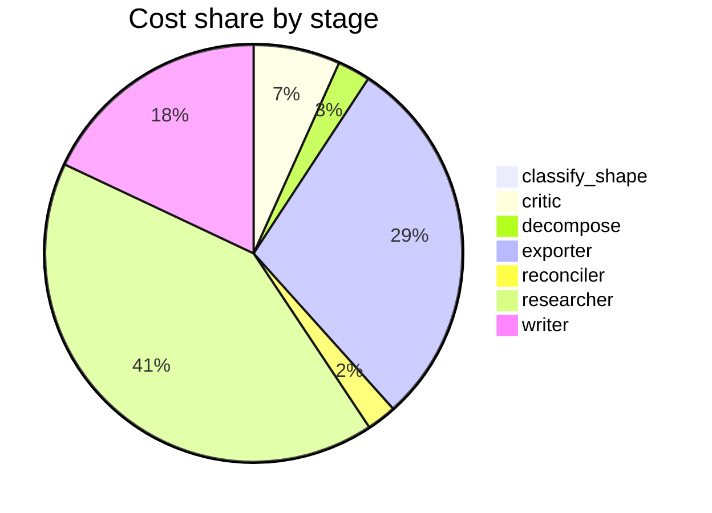

# Run metrics — Map the research landscape of multi-agent LLM systems. Produce a structured rep…

> **Prompt:** Map the research landscape of multi-agent LLM systems. Produce a structured report that includes a visual taxonomy or design graph showing the major architectural patterns, how they relate, and where the open problems are.
> **Started:** 2026-05-05T15:03:20.734951+00:00
> **Duration:** 378.6s
> **Final output:** [final_20260505T080320_cdb62681_map_the_research_landscape_of_multi_agen__on.md](./final_20260505T080320_cdb62681_map_the_research_landscape_of_multi_agen__on.md)

## Tier 1 — Headline evaluation metrics

### Grounding

**Rate:** 100%  (6/6 claims grounded)

| claim | grounded | reason |
|---:|:---:|---|
| 0 | ✅ | Evidence directly supports the two-level framework with matching components and purpose. |
| 1 | ✅ | Evidence directly describes shared board, selection based on board content, and iteration until consensus. |
| 2 | ✅ | Evidence explicitly describes the three shared primitives and the paradigm shift from message-passing as stated in the claim. |
| 3 | ✅ | The evidence directly supports the claim about prompt design (personas + theory-of-mind instructions) steering groups toward higher-order collectives with complementarity and synergy. |
| 4 | ✅ | Evidence explicitly mentions SWE-bench, CORE-Bench, PaperBench for software/research reproduction, and WebArena, VisualWebArena for web navigation, supporting the claim's domain list. |
| 5 | ✅ | Evidence supports the SAS-vs-MAS finding on multi-hop reasoning with held-constant tokens, and the other quote shows benchmark evaluations treating multi-agent/agent systems across diverse tasks without addressing the confound. |

### Fabrication rate

**Rate:** 0%  (0/6 approved claims cite a fabricated finding)

- Drift rate: 0%  (0/6 approved claims cite a drifted finding)
- Verifier source: native verify_history

### Contradictions surfaced

**N surfaced:** 2

- By severity: minor=0, moderate=1, major=1
- By type: factual=1, methodological=1, framing=0, temporal=0, other=0

### Honesty signals

- Uncertainty notes: **5**  |  caveats: **8**
- Sub-questions with ≥1 uncertainty note: **71%**
- Caveats reference uncertainty: **no**

### Source quality

- Cited findings: **7** of 7 harvested  |  mean quality: **1.00** (cited) vs. 1.00 (all)
- Cited quality — median: 1.00, min: 1.00

| tier | cited | all |
|---|---:|---:|
| gov_edu | 0 | 0 |
| peer_reviewed | 7 | 7 |
| news | 0 | 0 |
| curated_tertiary | 0 | 0 |
| unknown | 0 | 0 |
| blog_qa | 0 | 0 |

### Calibration

**Total claims:** 6

| confidence range | n | grounded rate | mean stated confidence |
|---|---:|---:|---:|
| [0.00, 0.30) | 0 | — | — |
| [0.30, 0.60) | 0 | — | — |
| [0.60, 0.80) | 2 | 100% | 0.69 |
| [0.80, 1.01) | 4 | 100% | 0.92 |

### Coverage

**Rate:** 29%  (2 covered, 5 missed)

- **Covered:** `sq3`, `sq4`
- **Missed:** `sq1`, `sq2`, `sq5`, `sq6`, `sq7`

### LLM judge rubric

| dimension | score |
|---|---:|
| correctness | 2.50 / 5 |
| completeness | 1.50 / 5 |
| calibration | 3.00 / 5 |
| source quality | 2.00 / 5 |
| conflict handling | 4.00 / 5 |
| overall | 2.00 / 5 |

> Strongest aspect: the report explicitly surfaces a substantive methodological controversy (single-agent vs multi-agent under compute-controlled comparison) and contrasts conflicting architectural paradigms. Weakest aspects: the prompt explicitly asked for a visual taxonomy/design graph and coverage of major frameworks (AutoGen, CrewAI, MetaGPT, etc.), all of which the report admits it could not extract—making it largely non-responsive to the core ask. Source quality is thin (only 7 sources, mostly arXiv/OpenReview preprints, no peer-reviewed venues or established surveys), and one cited arXiv ID (2604.02460) appears implausible/likely fabricated since it predates LLM multi-agent work, undermining correctness.

## Tier 2 — Experimental rigor / depth of understanding

### Researcher signals

- Sub-questions: **7** total, **5** without findings
- Researchers with findings: **2**  |  with uncertainty: **5**  |  with both: **0**
- Findings: 7 total  |  uncertainty notes: 5
- Per active researcher: mean **3.5** findings, max **4**

### Citation density

- Load-bearing fraction: **100%**  (7 cited / 7 harvested)
- Per-claim citations: avg **1.33**  |  median **1.00**  |  uncited claims: 0
- Source concentration (Herfindahl): **0.625**  |  max single-source share: **75%**
- Distinct domains per claim (mean): **1.17**

### Plan judge

- Surface coverage: **0.90**  |  intent alignment: **0.95**
- Missing axes:
  - explicit visual taxonomy/design graph construction (relations between patterns)

> The decomposition covers the major axes the prompt asks about: architectural patterns (sq1, sq2), how they relate via coordination/communication (sq3), empirical grounding (sq4), and open problems (sq5, sq6, sq7). All sub-questions are tightly on-topic with no drift. The one mild gap is that the prompt explicitly asks for a visual taxonomy/design graph showing how patterns relate and where open problems sit — while sq1 establishes the taxonomy and sq5–7 identify open problems, no sub-question directly addresses the relational/graph structure (edges between patterns, positioning of open problems on the map), which is a specific deliverable of the prompt.

### ACE — Adaptive Checklist Evaluation

**Overall:** 0.26 / 1.00

| item | met | score | reason |
|---|:---:|---:|---|
| Presents a clear taxonomy of multi-agent LLM architectural patterns (e.g., hierarchical/supervisor, debate, blackboard, role-based/society-of-mind, planner-executor, swarm, graph-based) with definitions for each category | ❌ | 0.10 | The report explicitly admits the architectural taxonomy could not be extracted; only blackboard and shared-substrate approaches are mentioned without a structured taxonomy. |
| Includes a visual taxonomy, design graph, or diagram (ASCII, mermaid, or described figure) showing relationships between architectural patterns | ❌ | 0.00 | The report explicitly states it cannot provide the visual design graph requested and contains no diagram, ASCII art, or figure. |
| Cites or references concrete representative systems/frameworks mapped to taxonomy categories | ❌ | 0.05 | The report explicitly states no concrete evidence could be extracted for any named framework (AutoGen, CrewAI, MetaGPT, etc.) and provides no mapping to taxonomy categories. |
| Identifies and explains open research problems such as coordination/communication overhead, evaluation benchmarks, emergent behavior, scalability, memory sharing, error propagation, or alignment in multi-agent settings | ❌ | 0.20 | The report explicitly admits in caveats that open problems like cascading errors, overhead, scalability, and alignment could not be grounded; only the single-agent vs multi-agent compute confound is discussed as an open issue. |
| Discusses dimensions/axes of comparison across architectures | ❌ | 0.10 | The report explicitly admits design dimensions could not be extracted; it only briefly mentions system-level vs system-internal communication without developing comparison axes. |
| Addresses coordination and communication mechanisms between agents (message passing, shared memory, voting, debate, negotiation protocols) | ✅ | 0.70 | The report discusses message-passing, blackboard/shared memory, and shared cognitive substrates in detail, but does not cover voting, debate, or negotiation protocols. |
| Connects open problems to specific architectural patterns, indicating which challenges arise in which designs | ❌ | 0.10 | The report explicitly acknowledges that open problems could not be grounded and does not link specific challenges to particular architectural patterns beyond a brief mention of message-passing critique. |
| Covers evaluation methodologies or benchmarks used for multi-agent LLM systems and notes their limitations | ✅ | 0.60 | The report lists several benchmarks (SWE-bench, CORE-Bench, WebArena, etc.) and notes a key limitation about compute-controlled comparisons, but evaluation methodology coverage is shallow and limitations are only briefly addressed. |
| Provides citations or references to actual research papers, preprints, or systems rather than only generic claims | ✅ | 0.50 | The report includes a few specific URLs (arxiv, openreview) and names benchmarks like SWE-bench and WebArena, but lacks paper titles/authors and provides few citations overall. |

> 3/9 criteria fully met

## Final output audit

- **Format detected:** Structured narrative report in GitHub-flavored markdown with a mermaid diagram for the visual taxonomy/design graph, section headers, and explicit coverage of open problems and caveats.
- **Notes:** Format inferred as a structured markdown report with a mermaid design graph, section headers, and tables matching the user's explicit request for a structured report with a visual taxonomy or design graph. The mermaid diagram explicitly marks ungrounded dimensions as EVIDENCE GAP nodes rather than inventing unsupported claims, consistent with the pipeline's strict grounding requirement. Many conditions are partial rather than not_satisfied because the report structurally addresses every requested dimension but cannot populate several with citable evidence.
- **Conditions:** 3 satisfied / 9 partial / 1 not satisfied / 0 n/a
- **Unmet:**
  - Cover concrete multi-agent frameworks and systems including AutoGen, CrewAI, LangGraph, MetaGPT, ChatDev, CAMEL, OpenAgents
  - Map the research landscape of multi-agent LLM systems
  - Include a visual taxonomy or design graph showing major architectural patterns
  - Show how architectural patterns relate to each other
  - Show where the open problems are
  - Cover major architectural patterns and design dimensions including orchestration topology, communication protocol, memory sharing, tool use, and agent roles
  - Cover what empirical results reveal about when multi-agent architectures outperform single-agent baselines
  - Cover principal open research problems and failure modes including cascading errors, communication overhead, role specialization, scalability, and agent alignment
  - Cover safety, trust, and adversarial robustness challenges including prompt injection, deceptive behavior, and principal-agent misalignment
  - Cover what evidence is weak or missing in the field including standardized benchmarks, theoretical foundations, long-horizon deployments, and cross-framework comparisons

Tier 3 — Operational details

### Cost & latency
- Total cost: **$0.7511**  |  input tokens: 322637  |  output tokens: 26729  |  elapsed: 378.6s  |  revision rounds: 2
- Researcher latency: max 32.3s, avg 21.6s

### Per-stage
| stage | calls | input tokens | output tokens | cost (USD) | elapsed (s) |
|---|---:|---:|---:|---:|---:|
| classify_shape | 1 | 993 | 71 | $0.0040 | 2.6 |
| confidence | 0 | 0 | 0 | $0.0000 | 0.0 |
| critic | 3 | 13884 | 563 | $0.0501 | 14.4 |
| decompose | 1 | 1496 | 961 | $0.0189 | 16.7 |
| exporter | 2 | 15835 | 11341 | $0.2176 | 161.6 |
| reconciler | 1 | 2777 | 592 | $0.0172 | 9.4 |
| researcher | 39 | 270717 | 7628 | $0.3089 | 80.8 |
| verifier | 0 | 0 | 0 | $0.0000 | 1.3 |
| writer | 3 | 16935 | 5573 | $0.1344 | 91.7 |

### Tool mix
| tool | calls |
|---|---:|
| web_search | 25 |
| search_papers | 19 |
| fetch_url | 37 |
| save_finding | 7 |
| note_uncertainty | 0 |

### Run metadata
- commit: `de5b7d0f40e6584303761befb270bda2f44c2f27`  branch: `main`
- captured_at: 2026-05-05T14:57:02.313267+00:00
- models: critic=`claude-sonnet-4-6`, judge=`claude-opus-4-7`, kae_judge=`claude-haiku-4-5`, researcher=`claude-haiku-4-5`, writer=`claude-sonnet-4-6`

