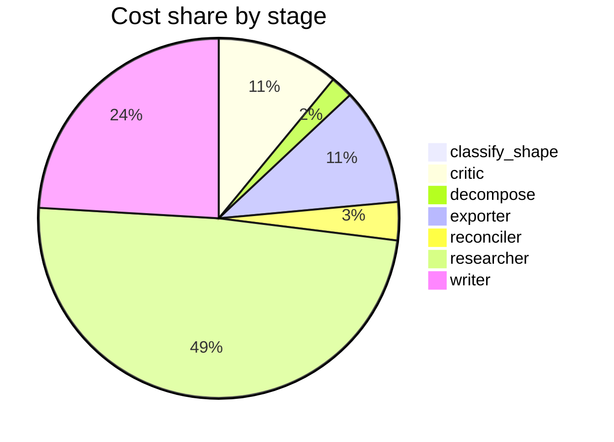

# Run metrics — What's the current consensus on long-context models vs. retrieval for long-docu…

> **Prompt:** What's the current consensus on long-context models vs. retrieval for long-document QA—are 1M+ token context windows making RAG obsolete, and under what conditions?
> **Started:** 2026-05-05T15:11:21.095588+00:00
> **Duration:** 407.7s
> **Final output:** [final_20260505T081121_fab15f4c_what_s_the_current_consensus_on_long_con__off.md](./final_20260505T081121_fab15f4c_what_s_the_current_consensus_on_long_con__off.md)

## Tier 1 — Headline evaluation metrics

### Grounding

**Rate:** 100%  (14/14 claims grounded)

| claim | grounded | reason |
|---:|:---:|---|
| 0 | ✅ | The evidence directly supports the claim about LC models outperforming RAG on self-contained tasks and RAG excelling in dialogue-based contexts. |
| 1 | ✅ | Both evidence quotes support the contrast: RAG excels at fragmented dialogue contexts, while Loong finds RAG performs poorly on multi-document scattered evidence. |
| 2 | ✅ | Both quotes are present and directly support the contrasting claims attributed to each source. |
| 3 | ✅ | Evidence directly supports the latency (1s vs 45s) and cost ($0.00008 vs $0.10, 1250x) figures claimed. |
| 4 | ✅ | Evidence shows multiple sources citing up to $20 per call for 200K-1M tokens and a Gemini-style test showing $0.10 per call, supporting the discrepancy claim. |
| 5 | ✅ | Evidence directly supports the claim about open-source curve and commercial models maintaining accuracy above 64K, though the specific 16-32K cap is not explicitly stated but is a reasonable interpretation. |
| 6 | ✅ | Both evidence quotes directly support the claim about the lost-in-the-middle effect, including degradation in the middle and applicability to long-context models. |
| 7 | ✅ | The evidence directly states the 13.9%-85% degradation range across models, perfect retrieval conditions, and whitespace/masking scenarios. |
| 8 | ✅ | Evidence explicitly states single-needle scores overstate production capability by 15-40 points and that multi-needle is where models silently fail. |
| 9 | ✅ | The evidence directly supports RAG's advantage for dynamic/real-time data and notes GPU, memory, and latency costs of long-context LLMs. |
| 10 | ✅ | Evidence directly supports long-context LLMs being better for static documents and reasoning/synthesis across long sequences. |
| 11 | ✅ | Evidence directly supports page-level chunking's 0.648 accuracy, NVIDIA attribution, and variation in optimal strategy by content type and within subcategories. |
| 12 | ✅ | The evidence directly supports the chunk overlap (10-20%) and chunk size (256-1,024 tokens by query type) parameters affecting RAG quality. |
| 13 | ✅ | The evidence directly supports the claim about improved RAG results and roughly 50% vector reduction from a 2024 SEC filings study. |

### Fabrication rate

**Rate:** 0%  (0/14 approved claims cite a fabricated finding)

- Drift rate: 21%  (3/14 approved claims cite a drifted finding)
- Verifier source: post-hoc re-run (no native verify_history)

### Contradictions surfaced

**N surfaced:** 4

- By severity: minor=0, moderate=2, major=2
- By type: factual=3, methodological=1, framing=0, temporal=0, other=0

### Honesty signals

- Uncertainty notes: **2**  |  caveats: **7**
- Sub-questions with ≥1 uncertainty note: **29%**
- Caveats reference uncertainty: **no**

### Source quality

- Cited findings: **19** of 20 harvested  |  mean quality: **0.78** (cited) vs. 0.77 (all)
- Cited quality — median: 0.70, min: 0.70

| tier | cited | all |
|---|---:|---:|
| gov_edu | 0 | 0 |
| peer_reviewed | 5 | 5 |
| news | 0 | 0 |
| curated_tertiary | 0 | 0 |
| unknown | 14 | 15 |
| blog_qa | 0 | 0 |

### Calibration

**Total claims:** 14

| confidence range | n | grounded rate | mean stated confidence |
|---|---:|---:|---:|
| [0.00, 0.30) | 0 | — | — |
| [0.30, 0.60) | 1 | 100% | 0.52 |
| [0.60, 0.80) | 6 | 100% | 0.73 |
| [0.80, 1.01) | 7 | 100% | 0.85 |

### Coverage

**Rate:** 71%  (5 covered, 2 missed)

- **Covered:** `sq1`, `sq2`, `sq3`, `sq5`, `sq7`
- **Missed:** `sq4`, `sq6`

### LLM judge rubric

| dimension | score |
|---|---:|
| correctness | 4.00 / 5 |
| completeness | 4.00 / 5 |
| calibration | 4.50 / 5 |
| source quality | 3.50 / 5 |
| conflict handling | 4.50 / 5 |
| overall | 4.00 / 5 |

> Strongest aspect: excellent surfacing of contradictions with explicit acknowledgment of methodological vs. factual disagreements, and appropriately low confidence (0.52) on a claim derived from a dubious source citing fake model names like 'GPT-5.5'. Weakest aspect: source mix leans heavily on vendor blogs (elastic, meilisearch, NVIDIA, dailydoseofds) alongside a few arXiv/ACL papers; some specific numerical claims (e.g., 1,250x cost differential, 45x latency) come from a single vendor benchmark and are presented with higher confidence than warranted. The 'lost-in-the-middle' and context-degradation claims are well-supported and accurately characterized.

## Tier 2 — Experimental rigor / depth of understanding

### Researcher signals

- Sub-questions: **7** total, **2** without findings
- Researchers with findings: **5**  |  with uncertainty: **2**  |  with both: **0**
- Findings: 20 total  |  uncertainty notes: 2
- Per active researcher: mean **4.0** findings, max **6**

### Citation density

- Load-bearing fraction: **95%**  (19 cited / 20 harvested)
- Per-claim citations: avg **1.86**  |  median **2.00**  |  uncited claims: 0
- Source concentration (Herfindahl): **0.195**  |  max single-source share: **31%**
- Distinct domains per claim (mean): **1.36**

### Plan judge

- Surface coverage: **1.00**  |  intent alignment: **1.00**

> The decomposition thoroughly addresses the prompt's core axes: empirical performance comparison (sq1), failure modes (sq2), conditions favoring each approach (sq3, directly mapping to 'under what conditions'), evidence for and against the obsolescence claim (sq4, sq5), hybrid approaches (sq6), and methodological caveats (sq7). All sub-questions stay tightly focused on the long-context vs. RAG debate for long-document QA without drifting to adjacent topics like general LLM capabilities or unrelated retrieval tasks.

### ACE — Adaptive Checklist Evaluation

**Overall:** 0.69 / 1.00

| item | met | score | reason |
|---|:---:|---:|---|
| Articulates the current research/practitioner consensus that long-context models have not made RAG obsolete, and explains why (e.g., cost, latency, lost-in-the-middle effects, accuracy degradation on long contexts) | ✅ | 0.90 | Opens by clearly stating no consensus that RAG is obsolete and cites lost-in-the-middle, cost, latency, and accuracy degradation as reasons. |
| Cites specific recent benchmarks or studies (e.g., NIAH/Needle-in-a-Haystack, RULER, LongBench, NoLiMa, Databricks/Anthropic/Google evaluations) with concrete findings about long-context model performance degradation | ✅ | 0.60 | Cites NIAH and the Loong benchmark with concrete findings, but misses major named benchmarks like RULER, LongBench, NoLiMa, and lacks Databricks/Anthropic/Google studies. |
| Discusses specific 1M+ token context models (e.g., Gemini 1.5/2.0/2.5 Pro, GPT-4.1, Claude with extended context, Llama 4) and their documented capabilities and limitations on long-document QA | ❌ | 0.40 | Mentions Gemini 2.0 Flash with concrete cost/latency data and references GPT-4o, Claude 3.5 Sonnet, o1-mini, plus unverifiable model names, but provides limited documented capability/limitation discussion specific to these 1M+ models on long-document QA. |
| Identifies concrete conditions under which long-context wins over RAG (e.g., small-to-medium corpora that fit in context, multi-hop reasoning across full document, low-latency-tolerant tasks, exploratory analysis) | ✅ | 0.70 | Report identifies static knowledge bases, documents fitting in context, self-contained narrative tasks, and synthesis across long sequences as long-context wins, though somewhat brief on multi-hop/exploratory specifics. |
| Identifies concrete conditions under which RAG remains preferable (e.g., very large/dynamic corpora, cost/latency-sensitive applications, freshness/updatability requirements, citation/provenance needs, scale) | ✅ | 0.80 | Explicitly identifies dynamic/frequently updated datasets, real-time retrieval, large-scale enterprise deployment, and cost/latency constraints as RAG-preferable conditions, though citation/provenance is not mentioned. |
| Addresses hybrid or complementary approaches (e.g., RAG combined with long context, context caching, retrieval-augmented long-context, agentic retrieval) rather than framing it as a binary choice | ❌ | 0.20 | The report only mentions hybrid approaches to note that no evidence was found on them, without actually discussing or analyzing such complementary architectures. |
| Quantifies trade-offs with specifics on cost, latency, and/or accuracy (e.g., token pricing, inference time, recall metrics) rather than vague qualitative claims | ✅ | 0.90 | Provides specific figures: 45x latency difference (1s vs 45s), 1,250x cost difference ($0.00008 vs $0.10), 13.9–85% degradation range, 15–40 point NIAH gap, and chunking accuracy 0.648. |
| Acknowledges nuances such as performance degradation with context length, position bias, and the gap between retrieval-style needle tasks and true long-document reasoning | ✅ | 1.00 | Report explicitly discusses lost-in-the-middle position bias, degradation with input length (13.9-85%), and the gap between single-needle NIAH and multi-needle/real multi-document tasks. |

> 6/8 criteria fully met

## Final output audit

- **Format detected:** Narrative summary in markdown with structured sections, covering all seven sub-questions, including a comparative analysis, caveats, and inline citations.
- **Notes:** Format inferred as a structured narrative markdown report with section headers covering all seven sub-questions, since the prompt asked an analytical question without specifying a format. A Mermaid decision flowchart and a markdown comparison table were synthesized from the claims to aid clarity. The hybrid architecture section (sq6) is partially met only because the pipeline found no evidence—this is transparently flagged as an evidence gap rather than an omission.
- **Conditions:** 11 satisfied / 1 partial / 0 not satisfied / 0 n/a
- **Unmet:**
  - Cover hybrid architectures (sq6)

Tier 3 — Operational details

### Cost & latency
- Total cost: **$0.9090**  |  input tokens: 454332  |  output tokens: 28811  |  elapsed: 407.7s  |  revision rounds: 2
- Researcher latency: max 43.6s, avg 27.5s

### Per-stage
| stage | calls | input tokens | output tokens | cost (USD) | elapsed (s) |
|---|---:|---:|---:|---:|---:|
| classify_shape | 1 | 990 | 66 | $0.0040 | 3.8 |
| confidence | 0 | 0 | 0 | $0.0000 | 0.0 |
| critic | 3 | 26300 | 1354 | $0.0992 | 34.6 |
| decompose | 1 | 1486 | 926 | $0.0183 | 16.2 |
| exporter | 1 | 6916 | 4983 | $0.0955 | 79.6 |
| reconciler | 1 | 4535 | 1169 | $0.0311 | 19.3 |
| researcher | 44 | 389741 | 10664 | $0.4431 | 108.0 |
| writer | 3 | 24364 | 9649 | $0.2178 | 146.0 |

### Tool mix
| tool | calls |
|---|---:|
| web_search | 26 |
| search_papers | 15 |
| fetch_url | 41 |
| save_finding | 20 |
| note_uncertainty | 0 |

### Run metadata
- commit: `de5b7d0f40e6584303761befb270bda2f44c2f27`  branch: `main`
- captured_at: 2026-05-05T15:04:33.462801+00:00
- models: critic=`claude-sonnet-4-6`, judge=`claude-opus-4-7`, kae_judge=`claude-haiku-4-5`, researcher=`claude-haiku-4-5`, writer=`claude-sonnet-4-6`

