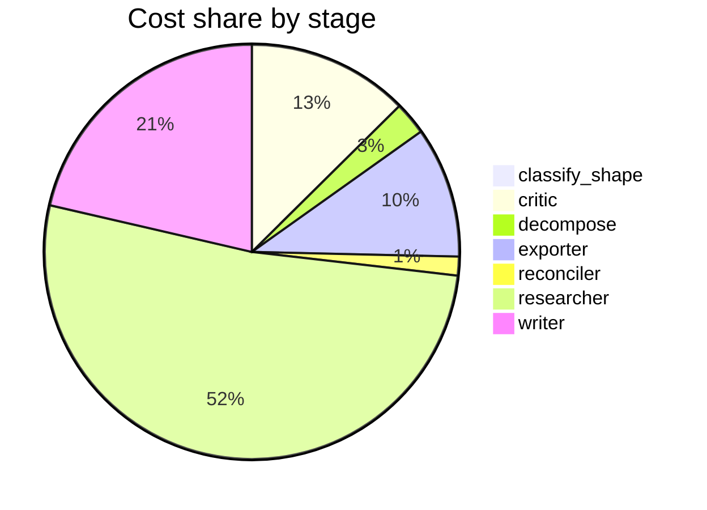

# Run metrics — What's the current consensus on long-context models vs. retrieval for long-docu…

> **Prompt:** What's the current consensus on long-context models vs. retrieval for long-document QA—are 1M+ token context windows making RAG obsolete, and under what conditions?
> **Started:** 2026-05-05T15:18:32.013332+00:00
> **Duration:** 341.7s
> **Final output:** [final_20260505T081832_20921f6d_what_s_the_current_consensus_on_long_con__on.md](./final_20260505T081832_20921f6d_what_s_the_current_consensus_on_long_con__on.md)

## Tier 1 — Headline evaluation metrics

### Grounding

**Rate:** 100%  (15/15 claims grounded)

| claim | grounded | reason |
|---:|:---:|---|
| 0 | ✅ | Evidence directly supports the claim about tripling at 128K and exceeding 10% at 200K. |
| 1 | ✅ | The evidence directly describes the U-shaped memory phenomenon as claimed. |
| 2 | ✅ | Evidence directly supports all parts of the claim. |
| 3 | ✅ | Evidence directly states all the latency figures cited in the claim. |
| 4 | ✅ | The evidence directly states the GPT-4.1 1M-token cost of $2, RAG cost of $0.00008, and the ~1,250x factor. |
| 5 | ✅ | Evidence directly states quadratic scaling and the 100GB per session figure for 1M tokens. |
| 6 | ✅ | Evidence directly supports both the sub-2-second RAG capability and the O(n²) attention scaling limitation for long-context prompting. |
| 7 | ✅ | The evidence directly states RAG sends a few thousand retrieved tokens per query while long-context scales with corpus size times query count; the caveat about source reachability is a meta-comment that doesn't undermine grounding. |
| 8 | ✅ | Evidence directly states LC outperforms RAG on self-contained stories while RAG excels at fragmented/dialogue contexts. |
| 9 | ✅ | Evidence directly supports that RAG is effective when data is constantly changing and updated by incorporating real-time data. |
| 10 | ✅ | Evidence directly lists the same conditions favoring RAG. |
| 11 | ✅ | The evidence directly states the two critical limitations and methodological fragmentation described in the claim. |
| 12 | ✅ | Evidence directly states NIAH measures the easiest single-fact retrieval and fails with multi-needle synthesis, conflicting information, and reasoning chains. |
| 13 | ✅ | Evidence directly supports the claim that contamination inflates scores by reflecting memorization rather than generalization. |
| 14 | ✅ | The evidence notes a lack of unified metrics for cross-paradigm comparison between RAG and LLMs, supporting the claim that no concrete head-to-head benchmarks were retrieved. |

### Fabrication rate

**Rate:** 0%  (0/11 approved claims cite a fabricated finding)

- Drift rate: 0%  (0/11 approved claims cite a drifted finding)
- Verifier source: native verify_history

### Contradictions surfaced

**N surfaced:** 2

- By severity: minor=1, moderate=1, major=0
- By type: factual=0, methodological=1, framing=1, temporal=0, other=0

### Honesty signals

- Uncertainty notes: **3**  |  caveats: **9**
- Sub-questions with ≥1 uncertainty note: **43%**
- Caveats reference uncertainty: **no**

### Source quality

- Cited findings: **14** of 14 harvested  |  mean quality: **0.83** (cited) vs. 0.83 (all)
- Cited quality — median: 0.70, min: 0.70

| tier | cited | all |
|---|---:|---:|
| gov_edu | 0 | 0 |
| peer_reviewed | 6 | 6 |
| news | 0 | 0 |
| curated_tertiary | 0 | 0 |
| unknown | 8 | 8 |
| blog_qa | 0 | 0 |

### Calibration

**Total claims:** 15

| confidence range | n | grounded rate | mean stated confidence |
|---|---:|---:|---:|
| [0.00, 0.30) | 0 | — | — |
| [0.30, 0.60) | 0 | — | — |
| [0.60, 0.80) | 4 | 100% | 0.72 |
| [0.80, 1.01) | 11 | 100% | 0.86 |

### Coverage

**Rate:** 57%  (4 covered, 3 missed)

- **Covered:** `sq2`, `sq3`, `sq4`, `sq6`
- **Missed:** `sq1`, `sq5`, `sq7`

### LLM judge rubric

| dimension | score |
|---|---:|
| correctness | 3.50 / 5 |
| completeness | 4.00 / 5 |
| calibration | 4.00 / 5 |
| source quality | 3.00 / 5 |
| conflict handling | 4.00 / 5 |
| overall | 3.50 / 5 |

> Strongest aspects: the report correctly identifies the core tension (no clear consensus, complementary approaches), surfaces real methodological issues like NIAH limitations and contamination, and provides honest calibration including flagging drifted/unreachable sources. Weakest aspects: some specific quantitative claims look suspect or overly precise (e.g., 1,250x cost ratio, ~100GB for 1M token cache, exact latency figures) and rest on a single blog source; sources skew toward vendor blogs (Redis, Microsoft, SitePoint) and arXiv preprints with no peer-reviewed venues, and the report admits no head-to-head benchmarks were retrieved—a significant gap given existing literature like NVIDIA's RAG vs long-context studies and Databricks evaluations that should have been findable.

## Tier 2 — Experimental rigor / depth of understanding

### Researcher signals

- Sub-questions: **7** total, **3** without findings
- Researchers with findings: **4**  |  with uncertainty: **3**  |  with both: **0**
- Findings: 14 total  |  uncertainty notes: 3
- Per active researcher: mean **3.5** findings, max **5**

### Citation density

- Load-bearing fraction: **100%**  (14 cited / 14 harvested)
- Per-claim citations: avg **1.07**  |  median **1.00**  |  uncited claims: 0
- Source concentration (Herfindahl): **0.266**  |  max single-source share: **44%**
- Distinct domains per claim (mean): **1.07**

### Plan judge

- Surface coverage: **1.00**  |  intent alignment: **1.00**

> The decomposition comprehensively addresses the prompt's core question. It covers empirical benchmarks (sq1), failure modes of long-context (sq2), cost/latency tradeoffs (sq3), conditions favoring RAG (sq4), hybrid approaches (sq5), methodological critiques (sq6), and verification of vendor claims about long-context reliability (sq7). All sub-questions are squarely on-topic, directly engaging the 'consensus,' 'obsolescence,' and 'under what conditions' framing of the prompt. No major axis appears missing.

### ACE — Adaptive Checklist Evaluation

**Overall:** 0.54 / 1.00

| item | met | score | reason |
|---|:---:|---:|---|
| Articulates the current research/practitioner consensus on whether 1M+ token context windows are making RAG obsolete, rather than just listing pros and cons | ✅ | 0.70 | The report opens with a clear consensus statement that the two approaches are complementary rather than substitutes and that RAG is not being made obsolete, though it hedges by noting the question is 'actively contested' with 'no clear consensus.' |
| Cites specific long-context models with 1M+ token windows and references concrete benchmarks | ❌ | 0.30 | Mentions GPT-4.1 once in cost context and references NIAH benchmark, but does not cite Gemini, Claude, Llama 4, or other named benchmarks like RULER, LongBench, HELMET. |
| Discusses known limitations of long-context models such as lost-in-the-middle effects, performance degradation with increasing context length, and difficulty with multi-hop or aggregation queries | ✅ | 0.90 | Report explicitly covers lost-in-the-middle/U-shaped positional bias, hallucination increases with context length, dilution degradation, and NIAH inadequacy for multi-hop reasoning. |
| Compares cost, latency, and computational/economic trade-offs between feeding large contexts versus retrieval-based approaches, including KV-cache and prefill considerations | ✅ | 0.80 | Report provides detailed cost ($2 vs $0.00008), latency (45s vs 1s), and memory (100GB KV cache) comparisons, though prefill is not explicitly discussed. |
| Specifies concrete conditions or document/query characteristics under which long-context wins, RAG wins, or hybrid approaches are preferred (e.g., corpus size, freshness/updates, multi-document reasoning, precision needs, access control) | ✅ | 0.70 | Report specifies concrete conditions favoring RAG (large corpus, frequent updates, sub-second latency, cost constraints, fragmented info) and long-context (self-contained documents), but omits hybrid conditions and access control. |
| Addresses hybrid architectures (e.g., RAG with long-context generators, retrieval over chunks then long-context synthesis, cache-augmented generation) rather than treating long-context vs. RAG as strictly binary | ❌ | 0.10 | The report explicitly notes that no concrete evidence on hybrid approaches was retrieved and does not discuss hybrid architectures substantively beyond saying the approaches are 'complementary.' |
| References empirical comparison studies or papers that directly evaluate RAG against long-context models on long-document QA tasks | ✅ | 0.40 | The report references finding [8] from an arxiv source comparing LC vs RAG on stories vs dialogue, but doesn't name the study, authors, or methodology, and explicitly states no head-to-head comparisons were retrieved. |
| Discusses practical engineering considerations beyond accuracy, such as auditability/citations, data freshness, security/permissions, and updateability that favor retrieval | ❌ | 0.40 | The report mentions data freshness/updateability and cost/latency as RAG advantages, but does not address auditability/citations or security/permissions/access control. |
| Provides a clear, defensible bottom-line answer to whether RAG is becoming obsolete, avoiding hedging without commitment | ✅ | 0.60 | The report does commit to a position—that the approaches are complementary rather than substitutes and RAG is not becoming obsolete—but the opening framing ('actively contested, with no clear consensus') and frequent caveats soften the bottom line. |

> 6/9 criteria fully met

## Final output audit

- **Format detected:** Narrative summary in markdown with sections, covering all sub-questions and surfacing caveats/limitations explicitly.
- **Notes:** Format inferred as a structured narrative summary in GitHub-flavored markdown, organized by sub-question themes with a comparison table and a mermaid decision flowchart. Three sub-questions (sq1, sq5, sq7) could only be partially addressed due to absence of retrieved evidence, which is explicitly disclosed in the rendered content.
- **Conditions:** 8 satisfied / 3 partial / 0 not satisfied / 0 n/a
- **Unmet:**
  - Cover performance benchmarks comparing long-context LLMs vs. RAG (sq1)
  - Cover hybrid approaches combining retrieval with long-context models (sq5)
  - Cover whether lost-in-the-middle problems are solved in Gemini 1.5/2.0, GPT-4o, Claude 3.x (sq7)

Tier 3 — Operational details

### Cost & latency
- Total cost: **$0.7460**  |  input tokens: 389093  |  output tokens: 23149  |  elapsed: 341.7s  |  revision rounds: 2
- Researcher latency: max 35.9s, avg 26.8s

### Per-stage
| stage | calls | input tokens | output tokens | cost (USD) | elapsed (s) |
|---|---:|---:|---:|---:|---:|
| classify_shape | 1 | 990 | 68 | $0.0040 | 2.4 |
| confidence | 0 | 0 | 0 | $0.0000 | 0.0 |
| critic | 3 | 20710 | 2083 | $0.0934 | 38.8 |
| decompose | 1 | 1486 | 975 | $0.0191 | 17.3 |
| exporter | 1 | 6391 | 3767 | $0.0757 | 63.1 |
| reconciler | 1 | 3542 | 18 | $0.0109 | 1.1 |
| researcher | 42 | 337222 | 9407 | $0.3843 | 97.2 |
| verifier | 0 | 0 | 0 | $0.0000 | 3.5 |
| writer | 3 | 18752 | 6831 | $0.1587 | 118.2 |

### Tool mix
| tool | calls |
|---|---:|
| web_search | 29 |
| search_papers | 16 |
| fetch_url | 35 |
| save_finding | 14 |
| note_uncertainty | 0 |

### Run metadata
- commit: `de5b7d0f40e6584303761befb270bda2f44c2f27`  branch: `main`
- captured_at: 2026-05-05T15:12:50.328644+00:00
- models: critic=`claude-sonnet-4-6`, judge=`claude-opus-4-7`, kae_judge=`claude-haiku-4-5`, researcher=`claude-haiku-4-5`, writer=`claude-sonnet-4-6`

