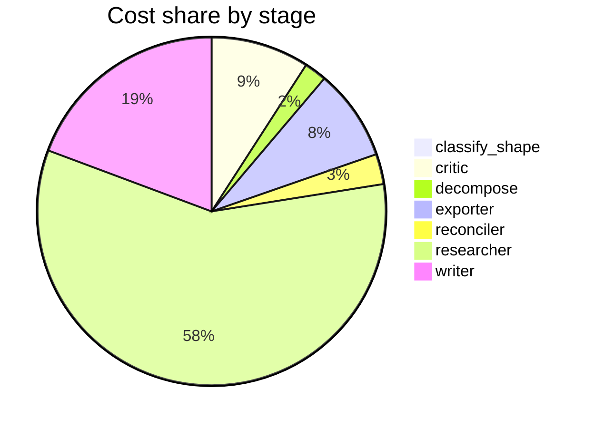

# Run metrics — Compare reported costs and latencies for production agentic-RAG built on LangGr…

> **Prompt:** Compare reported costs and latencies for production agentic-RAG built on LangGraph, CrewAI, and AutoGen. Where do public numbers disagree, and what's driving the gap—different model sizes, prompt lengths, batch settings, or actual framework overhead?
> **Started:** 2026-05-05T15:26:28.752471+00:00
> **Duration:** 381.4s
> **Final output:** [final_20260505T082628_b80fda64_compare_reported_costs_and_latencies_for__off.md](./final_20260505T082628_b80fda64_compare_reported_costs_and_latencies_for__off.md)

## Tier 1 — Headline evaluation metrics

### Grounding

**Rate:** 87%  (13/15 claims grounded)

| claim | grounded | reason |
|---:|:---:|---|
| 0 | ✅ | Evidence lists the exact token counts for all frameworks matching the claim and confirms the ~4x range. |
| 1 | ✅ | Evidence explicitly states CrewAI's role-playing approach with verbose system prompts and inter-agent communication inflates token counts. |
| 2 | ✅ | The evidence directly states LangGraph finished more than twice as fast as CrewAI in a five-agent workflow benchmark. |
| 3 | ✅ | Evidence directly states latency doubled per task, the 5-of-9 second tool gap, and exponential scaling behavior. |
| 4 | ✅ | The evidence directly states 337ms end-to-end latency and sub-200ms retrieval speed, matching the claim. |
| 5 | ✅ | Evidence confirms both sets of figures from the two sources as stated in the claim. |
| 6 | ✅ | Evidence directly supports the latency numbers, 6x gap, and the attribution to round-robin exchange and LLM-based handoff decisions. |
| 7 | ✅ | The evidence directly supports the call counts and the conversational vs. state-management framing, matching the claim's 5.4x difference. |
| 8 | ✅ | Both parts of the claim—the overhead description and the specific P95 latency numbers—are directly supported by the evidence quotes. |
| 9 | ✅ | Evidence directly states the $675/5min figure, $0.001 per node execution, $5,000 per 1M complex-workflow requests for LangGraph Cloud, and $312 total for self-hosted with Gemini Flash. |
| 10 | ❌ | Evidence supports the first part about the study testing the three frameworks with three models and noting model choice matters, but does not support the claim that 'no public study has isolated framework overhead from model-induced variance in a controlled design.' |
| 11 | ✅ | Evidence confirms both frameworks' parallelism features as described; the claim's added note about benchmarks is a reasonable hedge not contradicted by evidence. |
| 12 | ❌ | Evidence does not establish that NO benchmark isolates orchestration overhead; it only warns against trusting public benchmarks and mentions cost/time analyses, which is insufficient to support the universal claim. |
| 13 | ✅ | The evidence directly describes the three trade-offs attributed to CrewAI, Swarm (speed-focused), and LangGraph as stated in the claim. |
| 14 | ✅ | Evidence confirms the paper includes a detailed analysis of costs and computational time across scenarios, matching the claim's hedged framing. |

### Fabrication rate

**Rate:** 0%  (0/13 approved claims cite a fabricated finding)

- Drift rate: 62%  (8/13 approved claims cite a drifted finding)
- Verifier source: post-hoc re-run (no native verify_history)

### Contradictions surfaced

**N surfaced:** 3

- By severity: minor=0, moderate=2, major=1
- By type: factual=3, methodological=0, framing=0, temporal=0, other=0

### Honesty signals

- Uncertainty notes: **2**  |  caveats: **8**
- Sub-questions with ≥1 uncertainty note: **29%**
- Caveats reference uncertainty: **no**

### Source quality

- Cited findings: **19** of 19 harvested  |  mean quality: **0.67** (cited) vs. 0.67 (all)
- Cited quality — median: 0.70, min: 0.50

| tier | cited | all |
|---|---:|---:|
| gov_edu | 0 | 0 |
| peer_reviewed | 1 | 1 |
| news | 0 | 0 |
| curated_tertiary | 0 | 0 |
| unknown | 14 | 14 |
| blog_qa | 4 | 4 |

### Calibration

**Total claims:** 15

| confidence range | n | grounded rate | mean stated confidence |
|---|---:|---:|---:|
| [0.00, 0.30) | 0 | — | — |
| [0.30, 0.60) | 1 | 100% | 0.55 |
| [0.60, 0.80) | 8 | 100% | 0.71 |
| [0.80, 1.01) | 6 | 67% | 0.83 |

### Coverage

**Rate:** 86%  (6 covered, 1 missed)

- **Covered:** `sq1`, `sq2`, `sq3`, `sq5`, `sq6`, `sq7`
- **Missed:** `sq4`

### LLM judge rubric

| dimension | score |
|---|---:|
| correctness | 3.00 / 5 |
| completeness | 3.50 / 5 |
| calibration | 4.00 / 5 |
| source quality | 2.00 / 5 |
| conflict handling | 4.50 / 5 |
| overall | 3.00 / 5 |

> Strongest aspect: the report appropriately surfaces the irreconcilability of public numbers and explicitly flags contradictions between sources, with reasonable confidence calibration (lower confidence on single-source or vendor-affiliated claims). Weakest aspect: source quality is poor—heavy reliance on blogs, Substack, dev.to, vendor pages, and a suspicious arxiv ID (2601.07711 is not a valid arxiv identifier as of knowledge cutoff), with minimal peer-reviewed material. Some specific numeric claims (e.g., 4.2 vs 22.7 LLM calls, $0.001/node pricing) are difficult to verify and may originate from non-authoritative blog posts rather than rigorous benchmarks; the report would benefit from more skepticism about whether these numbers reflect real measurements at all.

## Tier 2 — Experimental rigor / depth of understanding

### Researcher signals

- Sub-questions: **7** total, **1** without findings
- Researchers with findings: **6**  |  with uncertainty: **2**  |  with both: **1**
- Findings: 19 total  |  uncertainty notes: 2
- Per active researcher: mean **3.2** findings, max **6**

### Citation density

- Load-bearing fraction: **100%**  (19 cited / 19 harvested)
- Per-claim citations: avg **1.67**  |  median **2.00**  |  uncited claims: 0
- Source concentration (Herfindahl): **0.139**  |  max single-source share: **24%**
- Distinct domains per claim (mean): **1.47**

### Plan judge

- Surface coverage: **1.00**  |  intent alignment: **1.00**

> The decomposition cleanly maps to the prompt's two core metrics (cost in sq1, latency in sq2) and all four hypothesized drivers of disagreement explicitly named in the prompt: model sizes (sq3), prompt lengths (sq4), framework overhead (sq5), and batch settings (sq6). Sq7 directly addresses the 'where do public numbers disagree' meta-question. All sub-questions stay tightly focused on the three named frameworks (LangGraph, CrewAI, AutoGen) in the agentic-RAG production context with no drift to adjacent topics.

### ACE — Adaptive Checklist Evaluation

**Overall:** 0.67 / 1.00

| item | met | score | reason |
|---|:---:|---:|---|
| Reports specific, quantitative cost figures (e.g., $/query, $/1k requests, or token costs) for production agentic-RAG implementations using LangGraph, CrewAI, and AutoGen, with citations to public sources. | ✅ | 0.60 | Provides token consumption figures for all three frameworks and some $ figures for LangGraph Cloud, but lacks comparable $/query or $/1k request costs for CrewAI and AutoGen specifically. |
| Reports specific latency numbers (e.g., p50/p95 latency, time-to-first-token, end-to-end response time) for each of the three frameworks with sources. | ✅ | 0.80 | Specific latency numbers are reported for all three frameworks (LangGraph 506s/17s P95/337ms, AutoGen 572s, CrewAI doubling per task) with named sources (dev.to, explore.n1n.ai, aerospike.com), though CrewAI's absolute latency is less precisely quantified. |
| Identifies concrete instances where public benchmarks or reported numbers disagree across sources for the same framework, naming the conflicting sources or studies. | ✅ | 0.90 | Report explicitly names conflicting sources (explore.n1n.ai vs dev.to/lukaszgrochal, aerospike.com, mcp-server-langgraph.mintlify.app) with specific divergent figures for LangGraph and AutoGen latencies and LangGraph Cloud costs. |
| Analyzes the drivers of cost/latency disagreement, distinguishing between model size differences (e.g., GPT-4 vs GPT-3.5 vs Claude), prompt/context length variation, batch or concurrency settings, and intrinsic framework orchestration overhead. | ✅ | 0.60 | The report addresses model choice as a confounder, mentions concurrency settings (max_concurrency, async_execution), and discusses framework overhead drivers (graph traversal, role-playing prompts, group chat coordination), but explicitly admits prompt/context length could not be analyzed and does not quantitatively distinguish these drivers. |
| Provides a side-by-side comparison (table or structured comparison) of the three frameworks on cost and latency under comparable conditions where possible. | ❌ | 0.30 | The report presents findings as a bulleted list with some comparative numbers (e.g., token counts for the three-agent workflow) but lacks a structured side-by-side table organizing cost and latency across the three frameworks under comparable conditions. |
| Quantifies or characterizes framework-specific overhead (e.g., LangGraph's state management, CrewAI's role delegation, AutoGen's multi-agent message passing) separate from LLM inference costs. | ✅ | 0.60 | Report characterizes overhead sources (CrewAI role-playing verbosity, LangGraph graph traversal/checkpointing, AutoGen group chat round-robin) and quantifies LLM call counts (4.2 vs 22.7), but explicitly admits no benchmark isolates framework overhead from inference time. |
| Acknowledges methodological limitations of public numbers, such as lack of standardized benchmarks, vendor-published vs independent measurements, or non-reproducible setups. | ✅ | 1.00 | The report extensively discusses methodological limitations, including vendor bias, lack of standardized workloads, non-reproducibility, and confounding variables across benchmarks. |
| Cites identifiable, traceable sources (blog posts, papers, benchmarks, GitHub issues, vendor documentation) rather than making unsupported claims about production numbers. | ✅ | 0.60 | Sources are named (aerospike.com, dev.to/lukaszgrochal, explore.n1n.ai, AIMultiple, mcp-server-langgraph.mintlify.app, arxiv) but lack full URLs, titles, or dates, making traceability partial. |

> 7/8 criteria fully met

## Final output audit

- **Format detected:** Narrative comparison report in markdown with structured sections, covering costs, latencies, sources of disagreement, and driving factors — inferred from a multi-part analytical question with no explicit format constraint.
- **Notes:** Format inferred as a structured narrative markdown report with tables and section headers, since the prompt is a multi-part analytical comparison question with no explicit format constraint. The three 'partial' conditions reflect genuine data gaps in the underlying research pipeline — public benchmarks do not quantitatively isolate model-size, prompt-length, or batch-setting effects — and are surfaced transparently rather than obscured.
- **Conditions:** 4 satisfied / 3 partial / 0 not satisfied / 0 n/a
- **Unmet:**
  - Explain what is driving the gap — different model sizes
  - Explain what is driving the gap — prompt lengths
  - Explain what is driving the gap — batch settings

Tier 3 — Operational details

### Cost & latency
- Total cost: **$1.0121**  |  input tokens: 594823  |  output tokens: 26753  |  elapsed: 381.4s  |  revision rounds: 2
- Researcher latency: max 46.5s, avg 30.7s

### Per-stage
| stage | calls | input tokens | output tokens | cost (USD) | elapsed (s) |
|---|---:|---:|---:|---:|---:|
| classify_shape | 1 | 1008 | 68 | $0.0040 | 2.3 |
| confidence | 0 | 0 | 0 | $0.0000 | 0.0 |
| critic | 3 | 26512 | 822 | $0.0919 | 17.8 |
| decompose | 1 | 1510 | 1088 | $0.0209 | 20.5 |
| exporter | 1 | 7309 | 4242 | $0.0856 | 69.7 |
| reconciler | 1 | 4544 | 981 | $0.0283 | 18.2 |
| researcher | 46 | 530170 | 11328 | $0.5868 | 112.5 |
| writer | 3 | 23770 | 8224 | $0.1947 | 140.2 |

### Tool mix
| tool | calls |
|---|---:|
| web_search | 41 |
| search_papers | 4 |
| fetch_url | 43 |
| save_finding | 19 |
| note_uncertainty | 0 |

### Run metadata
- commit: `de5b7d0f40e6584303761befb270bda2f44c2f27`  branch: `main`
- captured_at: 2026-05-05T15:20:07.455954+00:00
- models: critic=`claude-sonnet-4-6`, judge=`claude-opus-4-7`, kae_judge=`claude-haiku-4-5`, researcher=`claude-haiku-4-5`, writer=`claude-sonnet-4-6`

