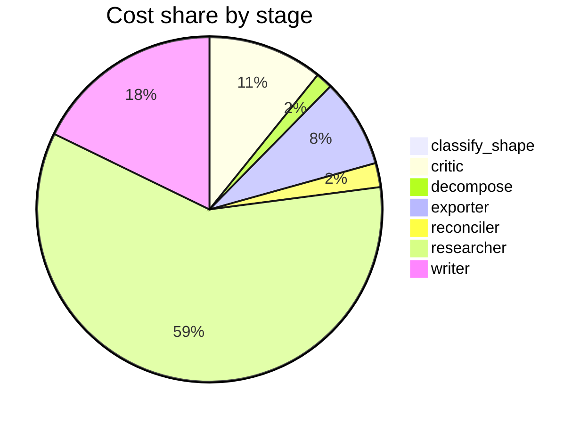

# Run metrics — Compare reported costs and latencies for production agentic-RAG built on LangGr…

> **Prompt:** Compare reported costs and latencies for production agentic-RAG built on LangGraph, CrewAI, and AutoGen. Where do public numbers disagree, and what's driving the gap—different model sizes, prompt lengths, batch settings, or actual framework overhead?
> **Started:** 2026-05-05T15:35:50.938561+00:00
> **Duration:** 474.5s
> **Final output:** [final_20260505T083550_26abd373_compare_reported_costs_and_latencies_for__on.md](./final_20260505T083550_26abd373_compare_reported_costs_and_latencies_for__on.md)

## Tier 1 — Headline evaluation metrics

### Grounding

**Rate:** 100%  (16/16 claims grounded)

| claim | grounded | reason |
|---:|:---:|---|
| 0 | ✅ | The evidence directly states the same cost ranges and averages cited in the claim. |
| 1 | ✅ | The evidence directly states agentic RAG can tolerate 2 to 8 seconds of latency, supporting the claim's main figure. |
| 2 | ✅ | Evidence directly supports the token counts cited for each framework. |
| 3 | ✅ | Evidence directly states the overhead figures matching the claim. |
| 4 | ✅ | The evidence directly states the p50 of 280 ms and p95 of 950 ms for LangGraph Cloud Managed Platform. |
| 5 | ✅ | Both benchmarks are quoted directly with the numbers and conclusions matching the claim. |
| 6 | ✅ | Evidence directly supports all the latency numbers and the Group Chat overhead explanation for AutoGen's slowness. |
| 7 | ✅ | The evidence directly states the exact token counts of 10,793 for AutoGen and 7,006 for the most efficient framework. |
| 8 | ✅ | The evidence directly states AutoGen's standard deviation of 0.45 with scores ranging from 8.6 to 10.0, matching the claim's numbers. |
| 9 | ✅ | Evidence directly states LangGraph was faster and that ~5s of a ~9s latency segment came from agent-tool interaction, supporting the claim. |
| 10 | ✅ | Evidence directly supports compounding token/latency growth across Tasks 1-3 with latency doubling and full output handoffs between agents. |
| 11 | ✅ | Evidence explicitly states LangGraph passes only necessary state changes rather than full conversation histories, and that AutoGen wasn't as efficient with tokens. |
| 12 | ✅ | Evidence directly states RAG with GPT-4 costs ~4% of GPT-4-Turbo context-window cost. |
| 13 | ✅ | Both the RAG vs long-context latency numbers and the TTFT scaling figures are directly stated in the evidence. |
| 14 | ✅ | Evidence shows benchmarks use different LLMs, hardware, task tiers, data sources, and evaluation methodologies, supporting the claim of heterogeneous methodologies undermining cross-framework comparison. |
| 15 | ✅ | Evidence supports both that no standardized public benchmark exists for agentic RAG comparisons and that RAGPerf addresses general RAG parameters (batch sizes, reranking, etc.) without focusing on agentic frameworks. |

### Fabrication rate

**Rate:** 0%  (0/12 approved claims cite a fabricated finding)

- Drift rate: 33%  (4/12 approved claims cite a drifted finding)
- Verifier source: native verify_history

### Contradictions surfaced

**N surfaced:** 4

- By severity: minor=1, moderate=1, major=2
- By type: factual=3, methodological=0, framing=0, temporal=0, other=1

### Honesty signals

- Uncertainty notes: **3**  |  caveats: **11**
- Sub-questions with ≥1 uncertainty note: **43%**
- Caveats reference uncertainty: **no**

### Source quality

- Cited findings: **19** of 19 harvested  |  mean quality: **0.68** (cited) vs. 0.68 (all)
- Cited quality — median: 0.70, min: 0.50

| tier | cited | all |
|---|---:|---:|
| gov_edu | 0 | 0 |
| peer_reviewed | 1 | 1 |
| news | 0 | 0 |
| curated_tertiary | 0 | 0 |
| unknown | 15 | 15 |
| blog_qa | 3 | 3 |

### Calibration

**Total claims:** 16

| confidence range | n | grounded rate | mean stated confidence |
|---|---:|---:|---:|
| [0.00, 0.30) | 0 | — | — |
| [0.30, 0.60) | 4 | 100% | 0.50 |
| [0.60, 0.80) | 6 | 100% | 0.66 |
| [0.80, 1.01) | 6 | 100% | 0.83 |

### Coverage

**Rate:** 71%  (5 covered, 2 missed)

- **Covered:** `sq1`, `sq3`, `sq5`, `sq6`, `sq7`
- **Missed:** `sq2`, `sq4`

### LLM judge rubric

| dimension | score |
|---|---:|
| correctness | 3.00 / 5 |
| completeness | 3.00 / 5 |
| calibration | 4.00 / 5 |
| source quality | 2.00 / 5 |
| conflict handling | 4.50 / 5 |
| overall | 3.00 / 5 |

> Strongest aspect: explicit surfacing of contradictions (especially LangGraph vs CrewAI speed reversal) with appropriate confidence flagging and acknowledgment of methodological heterogeneity. Weakest aspect: source quality is poor—heavy reliance on blogs (aerospike, dev.to, pooya.blog, mindstudio), a likely fabricated arxiv ID (2603.10765 is a future-dated/invalid identifier), and the same benchmark possibly double-counted across two URLs. Several specific numbers (token counts, ms-level overhead) are presented with high confidence despite drifted/unverified sources, and the report omits discussion of batch settings and parallelism configurations that the prompt explicitly asked about.

## Tier 2 — Experimental rigor / depth of understanding

### Researcher signals

- Sub-questions: **7** total, **2** without findings
- Researchers with findings: **5**  |  with uncertainty: **3**  |  with both: **1**
- Findings: 19 total  |  uncertainty notes: 3
- Per active researcher: mean **3.8** findings, max **6**

### Citation density

- Load-bearing fraction: **100%**  (19 cited / 19 harvested)
- Per-claim citations: avg **1.44**  |  median **1.00**  |  uncited claims: 0
- Source concentration (Herfindahl): **0.104**  |  max single-source share: **17%**
- Distinct domains per claim (mean): **1.31**

### Plan judge

- Surface coverage: **1.00**  |  intent alignment: **1.00**

> The decomposition cleanly mirrors the prompt's structure: sq1–sq3 gather per-framework cost/latency data for the three named frameworks, sq4 addresses where numbers disagree, and sq5–sq7 systematically isolate each driver the prompt explicitly named (model sizes, prompt lengths, framework overhead, batch settings, plus the related retrieval-pipeline confound). No major axis is missing and every sub-question stays tightly tied to the user's contract.

### ACE — Adaptive Checklist Evaluation

**Overall:** 0.69 / 1.00

| item | met | score | reason |
|---|:---:|---:|---|
| Provides specific reported cost figures (e.g., $/query, $/1k requests, or token costs) for production agentic-RAG implementations on LangGraph, CrewAI, and AutoGen with citations to public sources | ❌ | 0.30 | Report provides general agentic-RAG cost ranges and token counts per query but explicitly admits no CrewAI- or AutoGen-specific cost figures were found, and citations are vague (e.g., 'aerospike.com') rather than concrete sources. |
| Provides specific latency numbers (e.g., p50/p95 response times, time-to-first-token, or end-to-end seconds) for each of the three frameworks with sources | ✅ | 0.80 | Specific latency figures are given for all three frameworks (LangGraph 506s/280ms p50, CrewAI 246s, AutoGen 572s) with sources cited, though source reliability is flagged as drifted/low-quality. |
| Explicitly identifies points where public benchmarks or reports disagree across the three frameworks, naming the conflicting sources or numbers | ✅ | 1.00 | The report explicitly names conflicting sources (aerospike.com vs. explore.n1n.ai/dev.to) and provides specific contradicting numbers (246s vs. 506s) for LangGraph vs. CrewAI. |
| Analyzes the drivers of cost/latency gaps, distinguishing between model size differences, prompt/context length, batching or concurrency settings, and intrinsic framework overhead | ✅ | 0.70 | Report addresses context length, framework overhead (e.g., 14ms LangGraph orchestration, CrewAI agent-tool time), and model choice as drivers, but batching/concurrency is only noted as missing rather than analyzed, and model-size differences are addressed only superficially. |
| Quantifies or estimates framework-level overhead (e.g., orchestration latency, message-passing costs, planner loops) separately from LLM inference costs | ✅ | 0.70 | Report quantifies LangGraph orchestration overhead (~14ms) separately and discusses CrewAI's agent-tool interaction (~5s of 9s) and AutoGen's group-chat turn-taking overhead, though AutoGen overhead is not numerically isolated from LLM costs. |
| Compares the architectural differences (graph-based, role-based, conversational multi-agent) that contribute to differing cost/latency profiles in agentic-RAG workloads | ✅ | 0.60 | Report touches on AutoGen's Group Chat turn-taking overhead, CrewAI's sequential pipeline with context compounding, and LangGraph's state-change passing, but doesn't systematically frame these as graph-based vs. role-based vs. conversational paradigms. |
| Notes methodological caveats in the public numbers, such as inconsistent benchmark conditions, lack of standardized agentic-RAG benchmarks, or vendor-reported vs. independent measurements | ✅ | 1.00 | The report extensively documents methodological caveats including heterogeneous LLMs/hardware, lack of standardized agentic-RAG benchmarks, drifted/unreachable sources, and inconsistent batch/parallelism reporting. |
| Cites identifiable, verifiable sources (blog posts, papers, benchmarks, vendor docs) rather than making unsupported claims | ❌ | 0.40 | Some sources are named (aerospike.com, explore.n1n.ai, dev.to, RAGPerf), but many are flagged as drifted, unreachable, or unverifiable, and no proper citations or links are provided for most figures. |
| Covers all three frameworks (LangGraph, CrewAI, AutoGen) with roughly comparable depth rather than focusing on only one or two | ✅ | 0.70 | All three frameworks are discussed, but LangGraph receives more specific data (tokens, overhead, cloud latency) while CrewAI and AutoGen coverage is acknowledged as thinner and derived mostly from cross-framework comparisons. |

> 7/9 criteria fully met

## Final output audit

- **Format detected:** Narrative summary with structured sections in GitHub-flavored markdown, including comparison tables and a contradictions section — inferred from the analytical compare/contrast prompt with multiple sub-questions requiring synthesis.
- **Notes:** Format inferred as a structured narrative markdown report with tables, a Mermaid flowchart, and clearly delineated sections — the prompt is analytical and comparative with multiple sub-questions, warranting depth over brevity. The three 'partial' conditions all reflect genuine data gaps in the public literature (no CrewAI/AutoGen cost-per-query figures, no batch-setting measurements) rather than analysis omissions; these are explicitly surfaced in the report.
- **Conditions:** 8 satisfied / 3 partial / 0 not satisfied / 0 n/a
- **Unmet:**
  - Address batch settings as a potential driver of gaps
  - Cover CrewAI-specific cost and latency figures
  - Cover AutoGen-specific cost and latency figures

Tier 3 — Operational details

### Cost & latency
- Total cost: **$1.2163**  |  input tokens: 730547  |  output tokens: 30772  |  elapsed: 474.5s  |  revision rounds: 2
- Researcher latency: max 49.2s, avg 32.8s

### Per-stage
| stage | calls | input tokens | output tokens | cost (USD) | elapsed (s) |
|---|---:|---:|---:|---:|---:|
| classify_shape | 1 | 1008 | 81 | $0.0042 | 2.4 |
| confidence | 0 | 0 | 0 | $0.0000 | 0.0 |
| critic | 3 | 30423 | 2628 | $0.1307 | 56.6 |
| decompose | 1 | 1510 | 969 | $0.0191 | 14.4 |
| exporter | 1 | 8675 | 4975 | $0.1007 | 87.4 |
| reconciler | 1 | 5063 | 814 | $0.0274 | 15.9 |
| researcher | 50 | 657541 | 12188 | $0.7185 | 117.2 |
| verifier | 0 | 0 | 0 | $0.0000 | 3.4 |
| writer | 3 | 26327 | 9117 | $0.2157 | 177.1 |

### Tool mix
| tool | calls |
|---|---:|
| web_search | 39 |
| search_papers | 10 |
| fetch_url | 40 |
| save_finding | 19 |
| note_uncertainty | 0 |

### Run metadata
- commit: `de5b7d0f40e6584303761befb270bda2f44c2f27`  branch: `main`
- captured_at: 2026-05-05T15:27:56.514027+00:00
- models: critic=`claude-sonnet-4-6`, judge=`claude-opus-4-7`, kae_judge=`claude-haiku-4-5`, researcher=`claude-haiku-4-5`, writer=`claude-sonnet-4-6`

